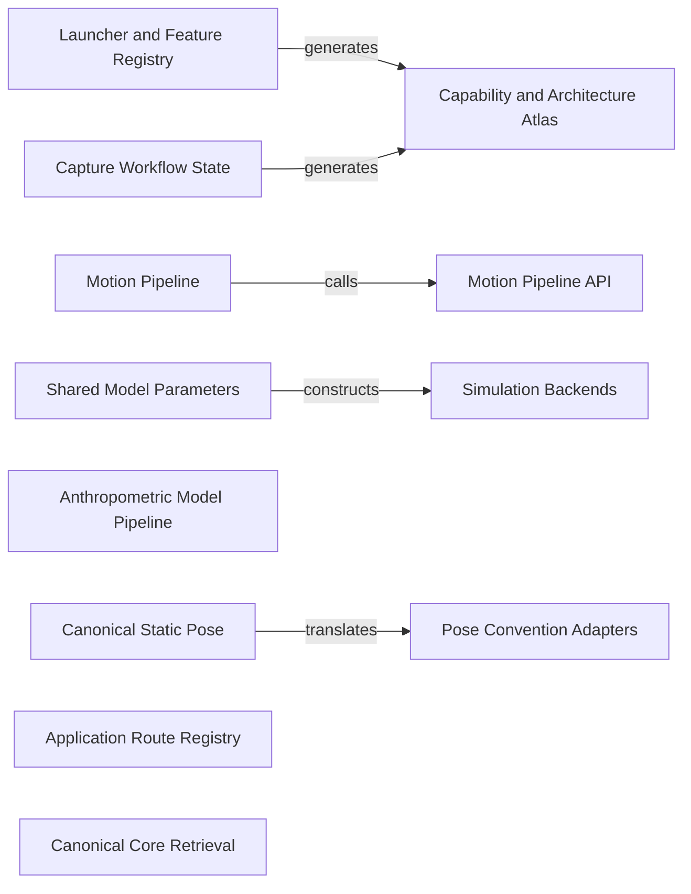

# UpstreamDrift Agent Context

Generated from catalog.json and current source evidence. Edit the sources and regenerate.

Source fingerprint: `2ffc44d634abf7b9fb7d6bb7a6f813bf73779be700afb3fbc5a130a04e8a0d62`.

This map covers registered components. A source match is not scientific approval or proof that tests passed.

[Searchable Offline Browser](index.html) · [Catalog](catalog.json) · [Boundary Reviews](reviews.json)

## Components

### Launcher and Feature Registry

ID: `launcher` · Owner: UpstreamDrift: src/config · Status: implemented

Resolve desktop and web tiles from existing model, launcher and parity registries. Declaration does not prove runtime availability.

- **Sources:** [launcher_manifest_loader.py](../../src/config/launcher_manifest_loader.py), [models.yaml](../../src/config/models.yaml), [launcher_manifest.json](../../src/config/launcher_manifest.json), [feature_parity.json](../../src/config/feature_parity.json)
- **Documentation:** [CAPABILITY_ATLAS.md](../../docs/architecture/CAPABILITY_ATLAS.md)
- **Tests:** [test_launcher_manifest.py](../../tests/config/test_launcher_manifest.py)
- **Public Interfaces:** `LauncherManifest` in [src/config/launcher_manifest_loader.py](../../src/config/launcher_manifest_loader.py)
- **Consumers:** capability-atlas
- **Providers:** None registered

### Capability and Architecture Atlas

ID: `capability-atlas` · Owner: UpstreamDrift: scripts/capability_atlas · Status: implemented

Generate the existing product map from launcher, parity and capture workflow authorities. Keep gaps and file exchanges explicit.

- **Sources:** [model.py](../../scripts/capability_atlas/model.py), [render.py](../../scripts/capability_atlas/render.py), [capability_connections.json](../../src/config/capability_connections.json), [goals.py](../../scripts/capability_atlas/goals.py), [goal_catalog.py](../../src/tools/capture_rig/goal_catalog.py), [goal_planner.py](../../src/tools/capture_rig/goal_planner.py)
- **Documentation:** [CAPABILITY_ATLAS.md](../../docs/architecture/CAPABILITY_ATLAS.md)
- **Tests:** [test_capability_atlas.py](../../tests/scripts/test_capability_atlas.py)
- **Public Interfaces:** `build` in [scripts/capability_atlas/model.py](../../scripts/capability_atlas/model.py)
- **Consumers:** None registered
- **Providers:** launcher, capture-workflow

### Motion Pipeline

ID: `motion-pipeline` · Owner: UpstreamDrift: src/shared/python/motion_pipeline · Status: implemented

Orchestrate source adapters, preprocessing, scaling, inverse kinematics and matching through canonical stage contracts. Production matching requires a real engine model.

- **Sources:** [orchestrator.py](../../src/shared/python/motion_pipeline/orchestrator.py), [contracts.py](../../src/shared/python/motion_pipeline/contracts.py)
- **Documentation:** [README.md](../../docs/motion_pipeline/README.md)
- **Tests:** [test_orchestrator.py](../../tests/unit/motion_pipeline/orchestrator/test_orchestrator.py)
- **Public Interfaces:** `MotionPipeline` in [src/shared/python/motion_pipeline/orchestrator.py](../../src/shared/python/motion_pipeline/orchestrator.py)
- **Consumers:** motion-api
- **Providers:** None registered

### Motion Pipeline API

ID: `motion-api` · Owner: UpstreamDrift: src/shared/python/motion_pipeline · Status: implemented

Translate REST requests into PipelineConfig; preserve invalid-input versus internal-fault responses.

- **Sources:** [api.py](../../src/shared/python/motion_pipeline/api.py)
- **Documentation:** [README.md](../../docs/motion_pipeline/README.md)
- **Tests:** [test_api.py](../../tests/unit/motion_pipeline/orchestrator/test_api.py)
- **Public Interfaces:** `create_app` in [src/shared/python/motion_pipeline/api.py](../../src/shared/python/motion_pipeline/api.py)
- **Consumers:** None registered
- **Providers:** motion-pipeline

### Shared Model Parameters

ID: `model-parameters` · Owner: UpstreamDrift: src/shared/python/simulation_backends · Status: implemented

GolfModelParams is the source of truth for model parameters used by analytical dynamics and MuJoCo renderers.

- **Sources:** [model_params.py](../../src/shared/python/simulation_backends/model_params.py)
- **Documentation:** [README.md](../../docs/simulation_backends/README.md)
- **Tests:** [test_foundation.py](../../tests/unit/simulation_backends/test_foundation.py)
- **Public Interfaces:** `GolfModelParams` in [src/shared/python/simulation_backends/model_params.py](../../src/shared/python/simulation_backends/model_params.py)
- **Consumers:** simulation-backends
- **Providers:** None registered

### Simulation Backends

ID: `simulation-backends` · Owner: UpstreamDrift: src/shared/python/simulation_backends · Status: implemented

Construct lazy ODE, MuJoCo, MJWarp and MJX backends through make_backend. Registered names do not establish installed dependencies or GPU readiness.

- **Sources:** [factory.py](../../src/shared/python/simulation_backends/factory.py), [protocol.py](../../src/shared/python/simulation_backends/protocol.py)
- **Documentation:** [USER_GUIDE.md](../../docs/simulation_backends/USER_GUIDE.md)
- **Tests:** [test_factory.py](../../tests/unit/simulation_backends/test_factory.py)
- **Public Interfaces:** `make_backend` in [src/shared/python/simulation_backends/factory.py](../../src/shared/python/simulation_backends/factory.py)
- **Consumers:** None registered
- **Providers:** model-parameters

### Canonical Static Pose

ID: `canonical-pose` · Owner: UpstreamDrift: src/shared/python/pose_interchange · Status: implemented

Frozen static pose with pelvis translation in metres and intrinsic XYZ Euler and joint angles in degrees. Dynamic canonical-v2 has separate quaternion and velocity contracts.

- **Sources:** [canonical.py](../../src/shared/python/pose_interchange/canonical.py)
- **Documentation:** [cross_engine_conventions.md](../../docs/user_guide/pose_studio/cross_engine_conventions.md)
- **Tests:** [test_canonical_pose.py](../../tests/unit/pose_interchange/test_canonical_pose.py)
- **Public Interfaces:** `CanonicalPose` in [src/shared/python/pose_interchange/canonical.py](../../src/shared/python/pose_interchange/canonical.py)
- **Consumers:** pose-adapters
- **Providers:** None registered

### Pose Convention Adapters

ID: `pose-adapters` · Owner: UpstreamDrift: src/shared/python/pose_interchange · Status: implemented

Translate the canonical pose to native engine coordinates with explicit joint index, sign and angular units.

- **Sources:** [protocol.py](../../src/shared/python/pose_interchange/protocol.py), [mujoco.py](../../src/shared/python/pose_interchange/adapters/mujoco.py)
- **Documentation:** [cross_engine_conventions.md](../../docs/user_guide/pose_studio/cross_engine_conventions.md)
- **Tests:** [test_mujoco_protocol.py](../../tests/unit/pose_interchange/adapters/test_mujoco_protocol.py)
- **Public Interfaces:** `PoseConventionAdapter` in [src/shared/python/pose_interchange/protocol.py](../../src/shared/python/pose_interchange/protocol.py)
- **Consumers:** None registered
- **Providers:** canonical-pose

### Anthropometric Model Pipeline

ID: `anthropometrics` · Owner: UpstreamDrift: src/shared/python/anthropometrics · Status: implemented

Estimate a canonical subject record and render engine model artifacts and reports from SI height and mass inputs.

- **Sources:** [pipeline.py](../../src/shared/python/anthropometrics/pipeline.py)
- **Documentation:** [quickstart.md](../../docs/user_guide/anthropometrics/quickstart.md)
- **Tests:** [test_pipeline.py](../../tests/unit/anthropometrics/test_pipeline.py)
- **Public Interfaces:** `run_pipeline` in [src/shared/python/anthropometrics/pipeline.py](../../src/shared/python/anthropometrics/pipeline.py)
- **Consumers:** None registered
- **Providers:** None registered

### Capture Workflow State

ID: `capture-workflow` · Owner: UpstreamDrift: src/tools/capture_rig · Status: implemented

Declarative capture steps, statuses and enabled actions used by the capture UI and existing capability atlas.

- **Sources:** [workflow.py](../../src/tools/capture_rig/workflow.py)
- **Documentation:** [capture_rig.md](../../docs/motion_capture/capture_rig.md)
- **Tests:** [test_workflow.py](../../tests/tools/capture_rig/test_workflow.py)
- **Public Interfaces:** `StepState` in [src/tools/capture_rig/workflow.py](../../src/tools/capture_rig/workflow.py)
- **Consumers:** capability-atlas
- **Providers:** None registered

### Application Route Registry

ID: `application-api` · Owner: UpstreamDrift: src/api · Status: implemented

Discover and register application routes through the shared route registry.

- **Sources:** [route_registry.py](../../src/api/route_registry.py)
- **Documentation:** [CAPABILITY_ATLAS.md](../../docs/architecture/CAPABILITY_ATLAS.md)
- **Tests:** [test_route_registry.py](../../tests/api/test_route_registry.py)
- **Public Interfaces:** `register_routes` in [src/api/route_registry.py](../../src/api/route_registry.py)
- **Consumers:** None registered
- **Providers:** None registered

### Canonical Core Retrieval

ID: `canonical-qa` · Owner: UpstreamDrift: src/shared/python/canonical_core · Status: implemented

Existing bounded local retrieval for canonical-core reference questions, separate from development context retrieval.

- **Sources:** [sidekick_retrieval_qa.py](../../src/shared/python/canonical_core/sidekick_retrieval_qa.py)
- **Documentation:** [canonical-v2.md](../../docs/conventions/canonical-v2.md)
- **Tests:** [test_sidekick_retrieval_qa.py](../../tests/unit/canonical_core/test_sidekick_retrieval_qa.py)
- **Public Interfaces:** `CanonicalCoreRetrievalQA` in [src/shared/python/canonical_core/sidekick_retrieval_qa.py](../../src/shared/python/canonical_core/sidekick_retrieval_qa.py)
- **Consumers:** None registered
- **Providers:** None registered

## Integration Contracts

| Provider | Consumer | Interaction | Contract |
| --- | --- | --- | --- |
| motion-pipeline | motion-api | calls | [pipeline-api](../../docs/agent_context/contracts/pipeline-api.md) |
| model-parameters | simulation-backends | constructs | [model-backends](../../docs/agent_context/contracts/model-backends.md) |
| canonical-pose | pose-adapters | translates | [pose-conventions](../../docs/agent_context/contracts/pose-conventions.md) |
| launcher | capability-atlas | generates | [launcher-atlas](../../docs/agent_context/contracts/launcher-atlas.md) |
| capture-workflow | capability-atlas | generates | [capture-atlas](../../docs/agent_context/contracts/capture-atlas.md) |

## Existing Inventories

- [Launcher Metadata](../../src/config/launcher_manifest.json): 50 records at `tiles`; registry remains authoritative.
- [Feature Parity](../../src/config/feature_parity.json): 43 records at `features`; registry remains authoritative.
- [Capability Architecture Nodes](../../src/config/capability_connections.json): 26 records at `nodes`; registry remains authoritative.

## Provenance and Limits

- 52 source files hashed with SHA-256; UTF-8 line endings normalized.
- Generated documents omit absolute paths and commit IDs to remain reproducible across worktrees.
- Live CLI/MCP results include checkout identity and current revision.
- Read integration contracts and their tests before modifying a boundary.
- Review declarations never substitute for executing validation or scientific approval.
