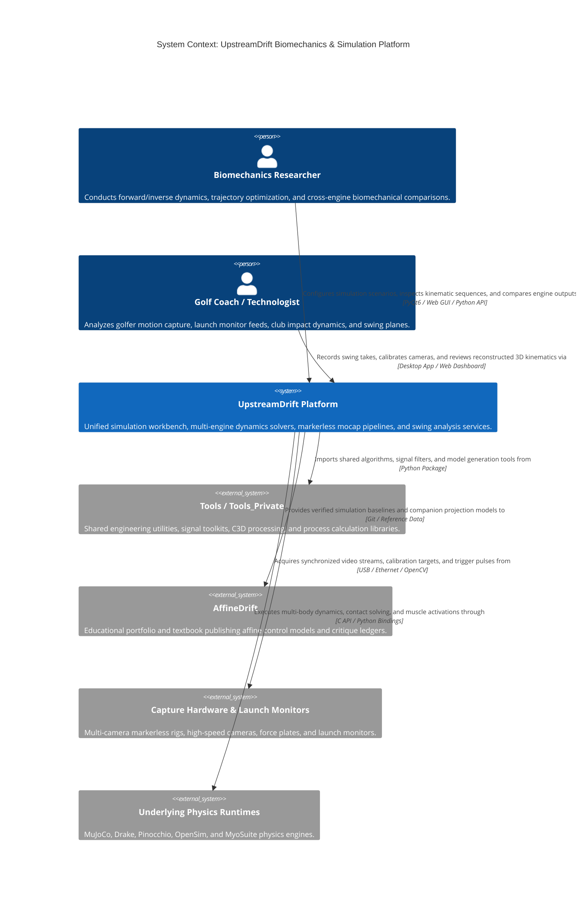
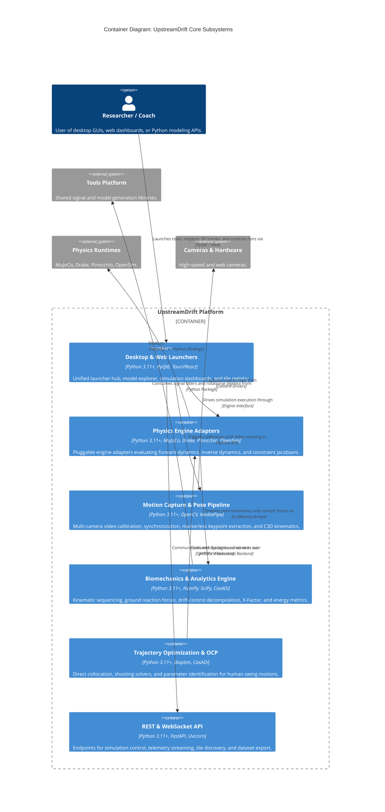

# UpstreamDrift Architecture Map

## 1. System Context View (C4Context)

## 2. Container View (C4Container)

## Feature Map

| Capability                                 | Component                                                                                 | Interface                       | Evidence                                                             |
| ------------------------------------------ | ----------------------------------------------------------------------------------------- | ------------------------------- | -------------------------------------------------------------------- |
| Multi-Engine Physics Simulation & Parity   | Physics Engine Adapters (`src/engines/physics_engines/`)                                  | Python Engine Protocol          | `tests/engines/`, `tests/test_cross_engine_parity.py`                |
| Markerless Motion Capture & Reconstruction | Motion Pipeline (`src/motion_capture/`, `src/tools/capture_rig/`)                         | Python Pipeline API / CLI       | `tests/motion_capture/reconstruct/`, `tests/tools/capture_rig/`      |
| Biomechanics & Kinematic Metrics           | Biomechanics Analytics (`src/shared/python/biomechanics/`, `src/shared/python/analysis/`) | Python API / Analysis Functions | `tests/shared/python/biomechanics/`, `tests/shared/python/analysis/` |
| Trajectory Optimization & Optimal Control  | Trajectory Optimization (`src/shared/python/optimization/ocp/`)                           | CasADi / Bioptim OCP API        | `tests/shared/python/optimization/`                                  |
| Desktop & Web Tile Launchers               | Launchers & Web UI (`src/launchers/`, `ui/`)                                              | PyQt6 GUI / React Tauri App     | `tests/launchers/`, `tests/tools/`                                   |
| Simulation Telemetry & Service API         | REST & WebSocket API (`src/api/`)                                                         | FastAPI / WebSocket Endpoints   | `tests/api/`                                                         |

## Architecture Change Log

| Date       | PR / Issue | Description                                                                                                      |
| ---------- | ---------- | ---------------------------------------------------------------------------------------------------------------- |
| 2026-09-10 | #1616      | Baseline adoption of maintainable Mermaid C4 architecture maps (C4Context, C4Container, Feature Map, Change Log) |
