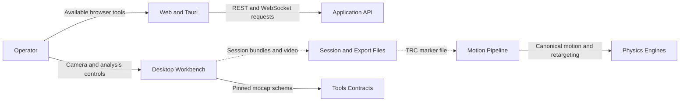

# Generated Capability and Architecture Map

<!-- Generated: python3 -m scripts.generate_capability_atlas -->

[Open the Interactive Reference](../../ui/public/capability-atlas/index.html)

**57 launcher tiles · 43 feature contracts.**
This catalog follows the existing launcher and parity registries. A registry
status is not a runtime health check or scientific validation.

## System Context and Containers

## Capture Workflow

```mermaid
flowchart LR
  accTitle: Capture Workflow
  accDescr: Source-backed connections. File arrows require explicit artifact exchange.
  n0["Motion Pipeline"]
  n1["Session and Export Files"]
  n2["Capture Library"]
  n3["Swing Selection"]
  n4["Coaching References"]
  n5["Set up Cameras and Plan"]
  n6["Calibrate Each Camera Once"]
  n7["Record or Import the Swing Take"]
  n8["Detect the Pose in Every View"]
  n9["Annotate or Correct Points by Hand"]
  n10["Review Joint Reliability"]
  n11["Reconstruct in 3-D"]
  n12["Analyse the Single View"]
  n13["Fit the Articulated Golfer"]
  n14["Kinetics and Model Comparison"]
  n15["Export to the Motion Pipeline"]
  n5 -->|"Resolved plan / imported views"| n7
  n7 -.->|"Separate chessboard take"| n6
  n7 -.->|"Recorded swing videos"| n8
  n7 -.->|"Video frames"| n9
  n8 -.->|"2-D observations"| n10
  n9 -.->|"Converted observation set"| n10
  n8 -.->|"Single-view observations"| n12
  n6 -.->|"intrinsics.json"| n11
  n10 -.->|"Reviewed multi-view observations"| n11
  n11 -.->|"joints_3d_m.npy"| n13
  n13 -.->|"joint_angles.json"| n14
  n11 -.->|"Reconstruction artifacts"| n15
  n15 -.->|"TRC / canonical JSON"| n0
  n12 -.->|"Annotated clips and metrics"| n1
  n2 -->|"Existing session / imported videos"| n7
  n7 -.->|"Original camera recordings"| n3
  n3 -.->|"swing_edits.json"| n8
  n3 -.->|"Swing video + provenance"| n1
  n2 -->|"Original camera view + saved drawing layer"| n4
  n3 -->|"Original camera view + saved drawing layer"| n4
  n4 -.->|"Annotated PNG / swing video + portable drawing sidecar"| n1
```

Dashed connections exchange files explicitly. Single-view analysis is
2-D; calibrated reconstruction requires multiple views and geometric observability.

## Feature Surfaces

| Feature | Registry Status | Source Surfaces |
| --- | --- | --- |
| Analysis Tools REST endpoints (swing metrics, biomechanics) | gap | [api](https://github.com/D-sorganization/UpstreamDrift/blob/main/src/api/routes/analysis_tools.py) · [web](https://github.com/D-sorganization/UpstreamDrift/blob/main/ui/src/pages/AnalysisTools.tsx) |
| ZTCF/ZVCF + induced-acceleration counterfactuals | gap | [pyqt](https://github.com/D-sorganization/UpstreamDrift/blob/main/src/shared/python/biomechanics/ztcf.py) |
| Cross-engine robustness dashboard (perturbation/CV) | parity | [pyqt](https://github.com/D-sorganization/UpstreamDrift/blob/main/src/launchers/cross_engine_dashboard.py) · [api](https://github.com/D-sorganization/UpstreamDrift/blob/main/src/api/routes/cross_engine.py) · [web](https://github.com/D-sorganization/UpstreamDrift/blob/main/ui/src/pages/CrossEngineDashboard.tsx) |
| Static analysis plots (20+ plot types) | parity | [pyqt](https://github.com/D-sorganization/Tools/blob/main/src/shared/python/plot_engine/pyqt6_widget.py) · [api](https://github.com/D-sorganization/UpstreamDrift/blob/main/src/api/routes/analysis_plots.py) · [web](https://github.com/D-sorganization/UpstreamDrift/blob/main/ui/src/components/analysis/PlotsSection.tsx) |
| Exercise + injury-risk biomechanics dashboards | exempt | [pyqt](https://github.com/D-sorganization/UpstreamDrift/blob/main/src/launchers/exercise_dashboard.py) |
| Canonical-core estimation/comparison workspaces | parity | [pyqt](https://github.com/D-sorganization/UpstreamDrift/blob/main/src/tools/canonical_core/estimation.py) · [web](https://github.com/D-sorganization/UpstreamDrift/blob/main/ui/src/pages/CanonicalCoreShell.tsx) |
| Live app/engine context in chat | parity | [pyqt](https://github.com/D-sorganization/UpstreamDrift/blob/main/src/launchers/launcher_sidekick_sidebar.py) · [api](https://github.com/D-sorganization/UpstreamDrift/blob/main/src/api/services/chat_app_context.py) · [web](https://github.com/D-sorganization/UpstreamDrift/blob/main/ui/src/components/ui/ChatContextChip.tsx) |
| AI chat transport (message send/stream) | parity | [pyqt](https://github.com/D-sorganization/UpstreamDrift/blob/main/src/launchers/launcher_sidekick_sidebar.py) · [api](https://github.com/D-sorganization/UpstreamDrift/blob/main/src/api/routes/chat_ws.py) · [web](https://github.com/D-sorganization/UpstreamDrift/blob/main/ui/src/pages/Chat.tsx) |
| Diagnostics + integrations-health panel | parity | [pyqt](https://github.com/D-sorganization/UpstreamDrift/blob/main/src/launchers/integrations_health_panel.py) · [api](https://github.com/D-sorganization/UpstreamDrift/blob/main/src/api/routes/diagnostics.py) · [web](https://github.com/D-sorganization/UpstreamDrift/blob/main/ui/src/components/ui/DiagnosticsPanel.tsx) |
| Document library / project map viewer | exempt | [pyqt](https://github.com/D-sorganization/UpstreamDrift/blob/main/src/launchers/library_widget.py) |
| Per-engine interactive dashboards (Drake/MuJoCo/Pinocchio) | exempt | [pyqt](https://github.com/D-sorganization/UpstreamDrift/blob/main/src/launchers/drake_dashboard.py) |
| Engine load/probe + basic simulation loop | parity | [pyqt](https://github.com/D-sorganization/UpstreamDrift/blob/main/src/launchers/launcher_simulation.py) · [api](https://github.com/D-sorganization/UpstreamDrift/blob/main/src/api/routes/engines.py) · [web](https://github.com/D-sorganization/UpstreamDrift/blob/main/ui/src/pages/Simulation.tsx) |
| Export/recording parity (HDF5/MAT/C3D/CSV/video, persisted recordings) | gap | [pyqt](https://github.com/D-sorganization/UpstreamDrift/blob/main/src/shared/python/data_io/export.py) · [api](https://github.com/D-sorganization/UpstreamDrift/blob/main/src/api/routes/export.py) |
| Docker engine management dialog | exempt | [pyqt](https://github.com/D-sorganization/UpstreamDrift/blob/main/src/launchers/docker_manager.py) |
| Embedded tool host (tabs + docks) | exempt | [pyqt](https://github.com/D-sorganization/UpstreamDrift/blob/main/src/launchers/embedded_host.py) |
| MCP server configuration writer/preferences | exempt | [pyqt](https://github.com/D-sorganization/UpstreamDrift/blob/main/src/launchers/mcp_config_writer.py) |
| Launcher tile grid from shared manifest | parity | [pyqt](https://github.com/D-sorganization/UpstreamDrift/blob/main/src/launchers/embedded_tool_bootstrap.py) · [api](https://github.com/D-sorganization/UpstreamDrift/blob/main/src/api/routes/launcher.py) · [web](https://github.com/D-sorganization/UpstreamDrift/blob/main/ui/src/pages/Dashboard.tsx) |
| Manifest tile web-reachability contract (route / native-window / unavailable) | gap | [pyqt](https://github.com/D-sorganization/UpstreamDrift/blob/main/src/launchers/embedded_tool_bootstrap.py) · [web](https://github.com/D-sorganization/UpstreamDrift/blob/main/ui/src/pages/Dashboard.tsx) |
| Motion-capture breadth (C3D upload/playback, OpenPose source) | parity | [pyqt](https://github.com/D-sorganization/UpstreamDrift/blob/main/src/tools/freemocap_sidecar/run_freemocap.py) · [api](https://github.com/D-sorganization/UpstreamDrift/blob/main/src/api/routes/motion_capture.py) · [web](https://github.com/D-sorganization/UpstreamDrift/blob/main/ui/src/pages/MotionCapture.tsx) |
| About/version info + onboarding | gap | [pyqt](https://github.com/D-sorganization/UpstreamDrift/blob/main/src/launchers/about_dialog.py) |
| Swing Optimizer (trajectory optimization GUI) | exempt | [pyqt](https://github.com/D-sorganization/UpstreamDrift/blob/main/src/shared/python/optimization/swing_optimizer.py) |
| AI Protocol (AIP) structured method dispatch | parity | [api](https://github.com/D-sorganization/UpstreamDrift/blob/main/src/api/routes/aip.py) |
| Desktop-only settings tabs (MCP Servers, Processes, Startup/Docker, Layout, Performance) | exempt | [pyqt](https://github.com/D-sorganization/UpstreamDrift/blob/main/src/launchers/settings_dialog.py) |
| Settings/preferences surface + persistence | parity | [pyqt](https://github.com/D-sorganization/UpstreamDrift/blob/main/src/launchers/settings_dialog.py) · [api](https://github.com/D-sorganization/UpstreamDrift/blob/main/src/api/routes/settings.py) · [web](https://github.com/D-sorganization/UpstreamDrift/blob/main/ui/src/pages/Settings.tsx) |
| Sidekick OS terminal / REPL / Jupyter / skills | exempt | [pyqt](https://github.com/D-sorganization/UpstreamDrift/blob/main/src/launchers/launcher_sidekick_sidebar.py) |
| Web SimulationControls wiring (camera presets, recording toggle, trajectory export, force overlays, actuator controls) | gap | [pyqt](https://github.com/D-sorganization/UpstreamDrift/blob/main/src/launchers/launcher_simulation.py) · [web](https://github.com/D-sorganization/UpstreamDrift/blob/main/ui/src/components/simulation/SimulationControls.tsx) |
| Golf Simulation Suite (parameter sweeps, batch runs) | exempt | [pyqt](https://github.com/D-sorganization/UpstreamDrift/blob/main/src/tools/golf_simulation_suite/__main__.py) |
| Live simulation data over WebSocket pub-sub | parity | [pyqt](https://github.com/D-sorganization/UpstreamDrift/blob/main/src/launchers/launcher_simulation.py) · [api](https://github.com/D-sorganization/UpstreamDrift/blob/main/src/api/routes/simulation_ws.py) · [web](https://github.com/D-sorganization/UpstreamDrift/blob/main/ui/src/pages/Simulation.tsx) |
| Shot Tracer / ball-flight visualization | parity | [pyqt](https://github.com/D-sorganization/UpstreamDrift/blob/main/src/launchers/_shot_tracer_gui.py) · [api](https://github.com/D-sorganization/UpstreamDrift/blob/main/src/api/routes/ball_flight.py) · [web](https://github.com/D-sorganization/UpstreamDrift/blob/main/ui/src/pages/BallFlight.tsx) |
| Swing Objective Lab — mechanism-vs-outcome downswing comparison | parity | [pyqt](https://github.com/D-sorganization/UpstreamDrift/blob/main/src/launchers/adapters/swing_objective_lab_embed.py) · [api](https://github.com/D-sorganization/UpstreamDrift/blob/main/src/api/routes/swing_objectives.py) · [web](https://github.com/D-sorganization/UpstreamDrift/blob/main/ui/src/pages/SwingObjectiveLab.tsx) |
| BunkerShot3D designer workbench (W2 sole parameters, W3 sand condition, F0 dynamic-RFT shot, W7 metrics, playability window, bounce utilisation, animated sole load field, 3-D shot animation through the ADR-0027 viewport, linked scalar traces with a validity band, F1 sand-field cross-sections, A/B comparison, validity verdict) | gap | [pyqt](https://github.com/D-sorganization/UpstreamDrift/blob/main/src/tools/bunker_shot_gui/gui.py) |
| Capture Rig camera controller with the live view as the central pane and every control in a movable dock (step rail with the next action, settings tabs, action grid, log drawer) with saved layouts, themed header with status strip and workflow-grouped actions that reflow to fit a narrow pane, transport-style recorder (countdown, presets, REC readout, live view during the take), overlay player, camera-subset matching (variants), model-on-video overlays, provenance viewer and manual point annotation/editing; layout model with named layout presets, an interactive layout editor, live preview and playback composited through the chosen multiview layout, and composite multiview video export; non-destructive swing trim/crop and separate video export, visible capture library with durable swing notes, import/open/edit, archive/restore and storage management; saved coaching lines/arrows/circles/ellipses/rectangles with selection, resize, undo/redo, frame visibility and annotated still/video exports | exempt | [pyqt](https://github.com/D-sorganization/UpstreamDrift/blob/main/src/tools/capture_rig/__main__.py) |
| Character Builder (humanoid URDF generation) | gap | [pyqt](https://github.com/D-sorganization/UpstreamDrift/blob/main/src/shared/python/model_generation/cli/main.py) · [api](https://github.com/D-sorganization/UpstreamDrift/blob/main/src/api/routes/character_builder.py) · [web](https://github.com/D-sorganization/UpstreamDrift/blob/main/ui/src/pages/CharacterBuilder.tsx) |
| Data Explorer (import/filter/visualize datasets) | gap | [api](https://github.com/D-sorganization/UpstreamDrift/blob/main/src/api/routes/data_explorer.py) · [web](https://github.com/D-sorganization/UpstreamDrift/blob/main/ui/src/pages/DataExplorer.tsx) |
| Swing dataset generation and import | parity | [api](https://github.com/D-sorganization/UpstreamDrift/blob/main/src/api/routes/dataset.py) · [web](https://github.com/D-sorganization/UpstreamDrift/blob/main/ui/src/pages/DatasetGenerator.tsx) |
| Launch-monitor import, interdependency analysis, monitor comparison, dispersion, and longitudinal trends | gap | [pyqt](https://github.com/D-sorganization/UpstreamDrift/blob/main/src/tools/launch_monitor_analytics/gui.py) · [api](https://github.com/D-sorganization/UpstreamDrift/blob/main/src/api/routes/launch_monitor_analytics.py) |
| MATLAB/Simscape model suite | exempt | [pyqt](https://github.com/D-sorganization/UpstreamDrift/blob/main/src/launchers/matlab_suite_dialog.py) |
| Model Explorer (browse/select/build URDF-MJCF) | gap | [pyqt](https://github.com/D-sorganization/UpstreamDrift/blob/main/src/tools/model_explorer/launch_model_explorer.py) · [api](https://github.com/D-sorganization/UpstreamDrift/blob/main/src/api/routes/model_explorer.py) · [web](https://github.com/D-sorganization/UpstreamDrift/blob/main/ui/src/pages/ModelExplorer.tsx) |
| Pose Studio interactive pose editing | exempt | [pyqt](https://github.com/D-sorganization/UpstreamDrift/blob/main/src/tools/pose_studio/__main__.py) |
| Putting green simulation | parity | [pyqt](https://github.com/D-sorganization/UpstreamDrift/blob/main/src/engines/physics_engines/putting_green/python/simulator.py) · [api](https://github.com/D-sorganization/UpstreamDrift/blob/main/src/api/routes/putting_green.py) · [web](https://github.com/D-sorganization/UpstreamDrift/blob/main/ui/src/pages/PuttingGreen.tsx) |
| Rate of Closure Impact Explorer (swing-impact-flight-putting simulation suite) | parity | [pyqt](https://github.com/D-sorganization/Tools/blob/main/src/rate_of_closure/launch_pyqt6.py) · [api](https://github.com/D-sorganization/UpstreamDrift/blob/main/src/api/local_server.py) · [web](https://github.com/D-sorganization/UpstreamDrift/blob/main/ui/src/pages/ImpactExplorer.tsx) |
| Terrain and topography configuration | parity | [api](https://github.com/D-sorganization/UpstreamDrift/blob/main/src/api/routes/terrain.py) · [web](https://github.com/D-sorganization/UpstreamDrift/blob/main/ui/src/pages/Terrain.tsx) |
| Shared Segment Force Color Controls | parity | [pyqt](https://github.com/D-sorganization/UpstreamDrift/blob/main/src/shared/python/body_part_viz/force_color_controls.py) · [web](https://github.com/D-sorganization/UpstreamDrift/blob/main/ui/src/components/visualization/ForceColorControls.tsx) |

## Regeneration and Evidence

Semantic connections are declared in `src/config/capability_connections.json`
with artifact names, constraints and source evidence. Workflow labels and
instructions come from `capture_rig.workflow`; feature/launcher inventories
are consumed rather than copied. Initialize the pinned Tools submodule first.

Run `python3 -m scripts.generate_capability_atlas --check` to check freshness.
`tests/scripts/test_capability_atlas.py` gates deterministic outputs and invalid graphs.

Standards: [C4](https://c4model.com/introduction),
[Mermaid](https://mermaid.js.org/syntax/flowchart.html).
