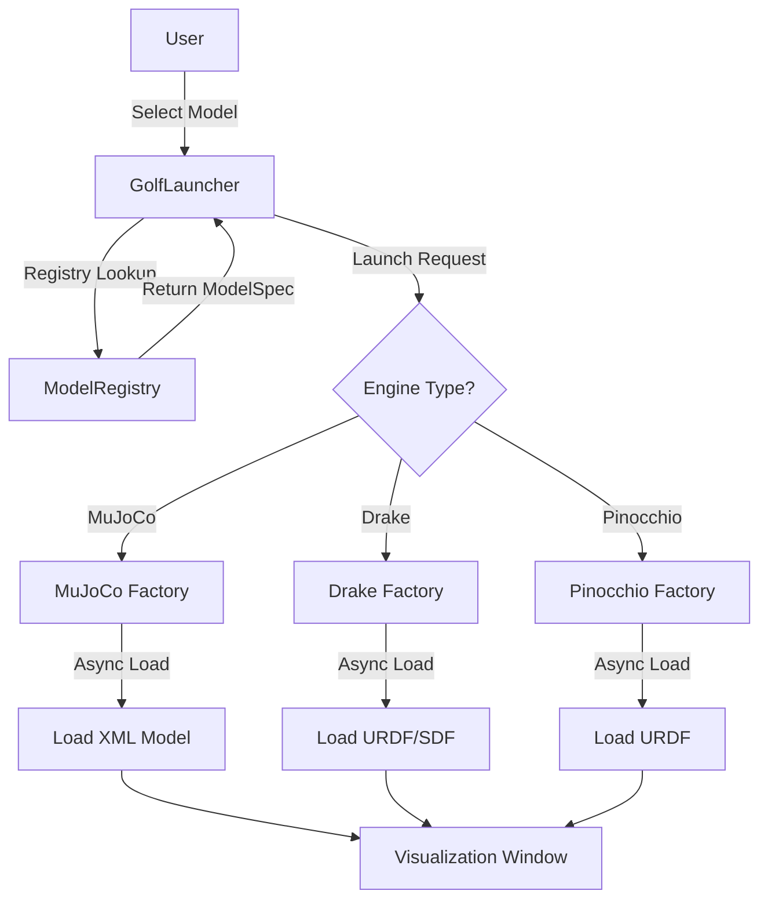

# Engine Loading Flow

This diagram illustrates how the `Launcher` initializes and loads physics engines based on user selection.

```mermaid
graph TD
    User[User] -->|Select Model| Launcher[GolfLauncher]
    Launcher -->|Registry Lookup| Reg[ModelRegistry]
    Reg -->|Return ModelSpec| Launcher
    
    Launcher -->|Launch Request| Config{Engine Type?}
    
    Config -- MuJoCo --> MJFactory[MuJoCo Factory]
    Config -- Drake --> DrFactory[Drake Factory]
    Config -- Pinocchio --> PinFactory[Pinocchio Factory]
    
    MJFactory -->|Async Load| MJLoad[Load XML Model]
    DrFactory -->|Async Load| DrLoad[Load URDF/SDF]
    PinFactory -->|Async Load| PinLoad[Load URDF]
    
    MJLoad --> Viz[Visualization Window]
    DrLoad --> Viz
    PinLoad --> Viz
```
