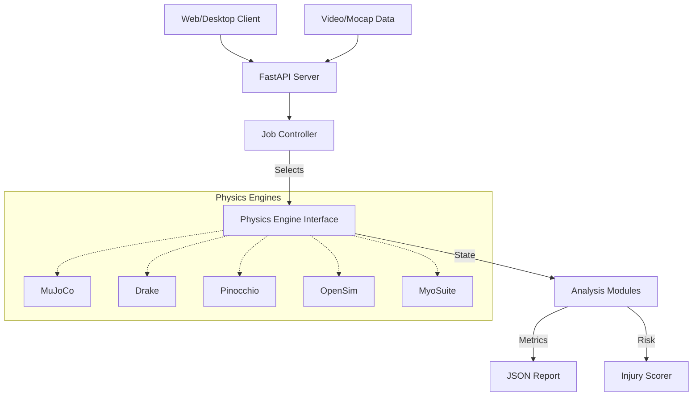

# UpstreamDrift - System Architecture

This document provides a high-level overview of UpstreamDrift's architecture, covering the physics engines, data flows, and interface layers.

## 1. Core Architecture

UpstreamDrift follows a modular architecture designed to support multiple physics engines interchangeably while providing a unified API for the frontend and analysis tools.

### 1.1 Key Components

```
UpstreamDrift/
├── api/                    # FastAPI REST API (authentication, file uploads, jobs)
├── shared/                 # Shared utilities and interfaces
│   ├── python/            # Common Python code
│   │   ├── physics_constants.py    # Physical constants
│   │   ├── interfaces.py           # Engine ABCs
│   │   └── injury/                 # Biomechanics analysis
│   └── data/              # Shared models and data
├── engines/               # Pluggable physics implementations
│   ├── physics_engines/
│   │   ├── mujoco/       # MuJoCo (Recommended)
│   │   ├── drake/        # Drake
│   │   ├── pinocchio/    # Pinocchio (RBDL)
│   │   ├── opensim/      # OpenSim
│   │   └── myosuite/     # MyoSuite
│   ├── Simscape_Multibody_Models/  # MATLAB/Simulink
│   └── pendulum_models/  # Simplified educational models
├── launchers/            # Unified launch applications
├── tools/                # Analysis utilities
└── assets/               # Branding and static resources
    └── branding/         # Logo and icon assets
```

### 1.2 Physics Engines

| Engine        | Strengths                            | Best For                 |
| ------------- | ------------------------------------ | ------------------------ |
| **MuJoCo**    | Fast contact dynamics, muscle models | Biomechanics, control    |
| **Drake**     | Model-based design, optimization     | Trajectory planning      |
| **Pinocchio** | High-performance RBDL                | Real-time control        |
| **OpenSim**   | Validated biomechanical models       | Research validation      |
| **MyoSuite**  | 290-muscle full body model           | Detailed muscle analysis |

### 1.3 Data Flow



## 2. Shared Libraries

### 2.1 Physics Constants

All engines must use constants from `shared.python.physics_constants` to ensure consistency across simulations.

### 2.2 Interfaces

Abstract base classes in `shared.python.interfaces` define the contract that all physics engines must implement:

```python
class PhysicsEngine(ABC):
    @abstractmethod
    def simulate(self, duration: float) -> SimulationResult: ...

    @abstractmethod
    def get_state(self) -> State: ...

    @abstractmethod
    def apply_control(self, control: Control) -> None: ...
```

### 2.3 Injury Analysis

The `injury` module aggregates data from any engine to produce risk scores. It is engine-agnostic, relying only on standard kinematic outputs (forces, angles, velocities).

## 3. Testing Strategy

| Level                 | Description                             | Location             |
| --------------------- | --------------------------------------- | -------------------- |
| **Unit Tests**        | Test individual components in isolation | `tests/unit/`        |
| **Integration Tests** | Test engine interfaces with mocks       | `tests/integration/` |
| **E2E Tests**         | Full pipeline with real simulations     | `tests/e2e/`         |

## 4. Deployment

The system supports multiple deployment modes:

- **Desktop**: PyQt6 GUI with local physics computation
- **Server**: Docker containers with FastAPI + compute workers
- **Hybrid**: Local GUI connecting to remote compute cluster

## 5. Related Documentation

- [Engine Selection Guide](../engine_selection_guide.md)
- [Engine Capabilities](../engine_capabilities.md)
- [Fleet Architecture](../../../Linux_Tools/Tools/docs/architecture/FLEET_ARCHITECTURE.md)
- [Contributing Guide](../development/contributing.md)
