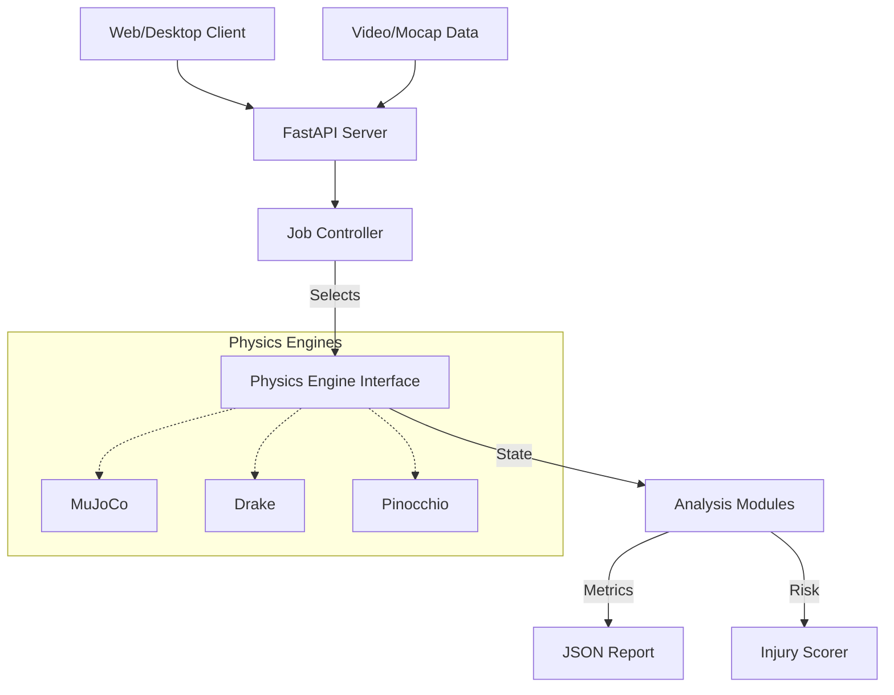

# Golf Modeling Suite - System Architecture

This document provides a high-level overview of the Golf Modeling Suite's architecture, tying together the various engines, data flows, and interface layers.

## 1. Core Architecture

The suite follows a modular architecture designed to support multiple physics engines interchangably while providing a unified API for the frontend and analysis tools.

### 1.1 Key Components

*   **API Layer (`api/`)**: FastAPI-based REST API that creates a standard interface for clients. Handles authentication, file uploads, and job management.
*   **Shared Utilities (`shared/`)**: The "glue" logic. Contains:
    *   `physics_constants.py`: Single source of truth for physical values.
    *   `injury/`: Biomechanics and injury risk assessment logic.
    *   `interfaces.py`: Abstract Base Classes (ABCs) that all engines must implement.
*   **Engines (`engines/`)**: Pluggable physics implementations.
    *   **MuJoCo**: High-performance contact dynamics (Recommended).
    *   **Drake**: Rigorous multibody dynamics and control.
    *   **Pinocchio**: Fast rigid body algorithms (RBDL).
    *   **OpenSim**: Biomechanics-focused simulation.

### 1.2 Data Flow

## 2. Shared Libraries

### 2.1 Physics Constants
All engines must use constants from `shared.python.physics_constants` to ensure consistency.

### 2.2 Injury Analysis
The `injury` module aggregates data from any engine to produce risk scores. It is engine-agnostic, relying only on standard kinematic outputs (forces, angles).

## 3. Testing Strategy

*   **Unit Tests**: Test individual components (e.g., `injury_risk.py`) in isolation.
*   **Integration Tests**: Test the engine interfaces (`test_physics_engines_strict.py`) using mocks to ensure protocol compliance without heavy dependencies.
*   **E2E Tests**: Full pipeline tests (`test_end_to_end.py`) running real simulations.

## 4. Deployment

The system is deployed via Docker, with separate containers for the API server and the heavy compute workers (if distributed).
