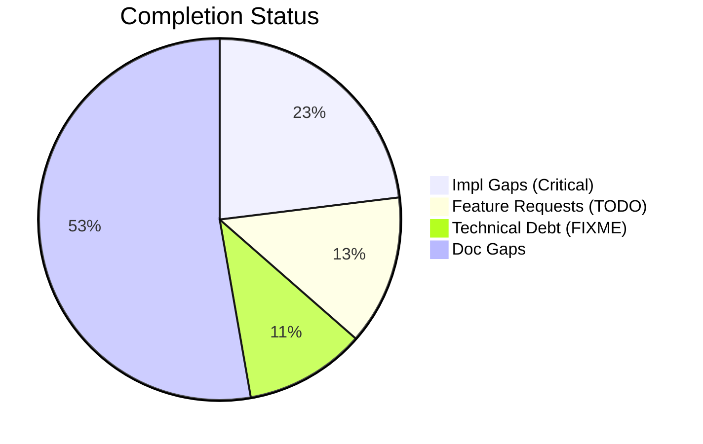
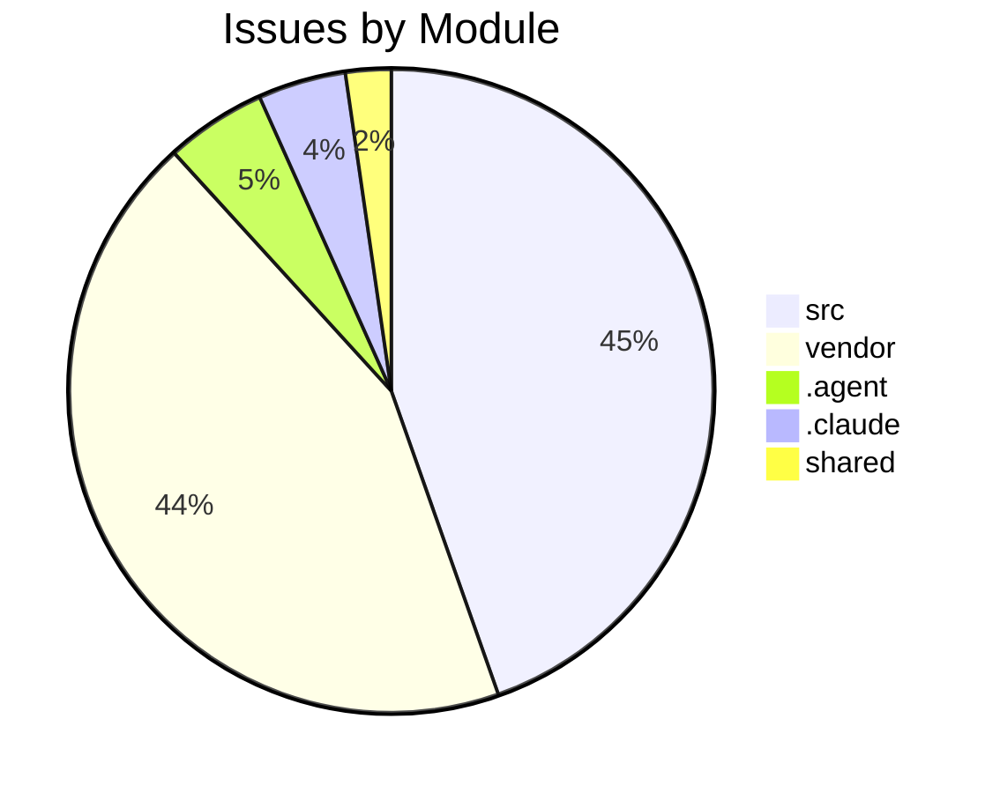

# Completist Report: 2026-02-06

## Executive Summary
- **Critical Gaps**: 301
- **Feature Gaps (TODO)**: 175
- **Technical Debt**: 141
- **Documentation Gaps**: 689

## Visualization
### Status Overview

### Top Impacted Modules

## Critical Incomplete (Top 50)
| File | Line | Type | Impact | Coverage | Complexity |
|---|---|---|---|---|---|
| `./vendor/ud-tools/src/shared/python/model_generation/library/repository.py` | 40 | Stub | 5 | 3 | 4 |
| `./vendor/ud-tools/src/shared/python/model_generation/library/repository.py` | 46 | Stub | 5 | 3 | 4 |
| `./vendor/ud-tools/src/shared/python/model_generation/library/repository.py` | 51 | Stub | 5 | 3 | 4 |
| `./vendor/ud-tools/src/shared/python/model_generation/library/repository.py` | 56 | Stub | 5 | 3 | 4 |
| `./vendor/ud-tools/src/shared/python/model_generation/builders/base_builder.py` | 183 | Stub | 5 | 3 | 4 |
| `./vendor/ud-tools/src/shared/python/model_generation/builders/base_builder.py` | 193 | Stub | 5 | 3 | 4 |
| `./vendor/ud-tools/src/shared/python/model_generation/plugins/__init__.py` | 21 | Stub | 5 | 3 | 4 |
| `./vendor/ud-tools/src/shared/python/model_generation/plugins/__init__.py` | 27 | Stub | 5 | 3 | 4 |
| `./vendor/ud-tools/src/shared/python/model_generation/plugins/__init__.py` | 32 | Stub | 5 | 3 | 4 |
| `./vendor/ud-tools/src/shared/python/model_generation/plugins/__init__.py` | 36 | Stub | 5 | 3 | 4 |
| `./vendor/ud-tools/src/shared/python/upstream_drift_tools/process_calculators/acid_gas_dewpoint_calculator.py` | 713 | Stub | 5 | 3 | 4 |
| `./vendor/ud-tools/src/shared/python/upstream_drift_tools/process_calculators/acid_gas_dewpoint_calculator.py` | 716 | Stub | 5 | 3 | 4 |
| `./vendor/ud-tools/src/shared/python/upstream_drift_tools/process_calculators/acid_gas_dewpoint_calculator.py` | 863 | Stub | 5 | 3 | 4 |
| `./vendor/ud-tools/src/shared/python/upstream_drift_tools/process_calculators/acid_gas_dewpoint_calculator.py` | 866 | Stub | 5 | 3 | 4 |
| `./vendor/ud-tools/src/shared/python/upstream_drift_tools/process_calculators/pressure_drop_calculator/__init__.py` | 221 | Stub | 5 | 3 | 4 |
| `./vendor/ud-tools/src/shared/python/upstream_drift_tools/process_calculators/psa_package/psa_gui.py` | 156 | Stub | 5 | 3 | 4 |
| `./vendor/ud-tools/src/shared/python/upstream_drift_tools/ui/mixins/calculator_state_mixin.py` | 428 | Stub | 5 | 3 | 4 |
| `./vendor/ud-tools/src/shared/python/humanoid_character_builder/generators/mesh_generator.py` | 68 | Stub | 5 | 3 | 4 |
| `./vendor/ud-tools/src/shared/python/humanoid_character_builder/generators/mesh_generator.py` | 74 | Stub | 5 | 3 | 4 |
| `./vendor/ud-tools/src/shared/python/humanoid_character_builder/generators/mesh_generator.py` | 79 | Stub | 5 | 3 | 4 |
| `./vendor/ud-tools/src/shared/python/humanoid_character_builder/generators/mesh_generator.py` | 99 | Stub | 5 | 3 | 4 |
| `./src/engines/common/physics.py` | 443 | Stub | 5 | 2 | 4 |
| `./src/engines/common/physics.py` | 447 | Stub | 5 | 2 | 4 |
| `./src/engines/common/physics.py` | 451 | Stub | 5 | 2 | 4 |
| `./src/engines/Simscape_Multibody_Models/3D_Golf_Model/matlab/src/apps/golf_gui/Simscape Multibody Data Plotters/Python Version/golf_gui_r0/golf_visualizer_implementation.py` | 138 | Stub | 5 | 2 | 4 |
| `./src/engines/Simscape_Multibody_Models/3D_Golf_Model/matlab/src/apps/golf_gui/Simscape Multibody Data Plotters/Python Version/golf_gui_r0/golf_visualizer_implementation.py` | 358 | Stub | 5 | 2 | 4 |
| `./src/engines/Simscape_Multibody_Models/3D_Golf_Model/matlab/src/apps/golf_gui/Simscape Multibody Data Plotters/Python Version/golf_gui_r0/golf_visualizer_implementation.py` | 415 | Stub | 5 | 2 | 4 |
| `./src/engines/Simscape_Multibody_Models/3D_Golf_Model/matlab/src/apps/golf_gui/Simscape Multibody Data Plotters/Python Version/golf_gui_r0/golf_visualizer_implementation.py` | 419 | Stub | 5 | 2 | 4 |
| `./src/engines/Simscape_Multibody_Models/3D_Golf_Model/matlab/src/apps/golf_gui/Simscape Multibody Data Plotters/Python Version/golf_gui_r0/golf_visualizer_implementation.py` | 424 | Stub | 5 | 2 | 4 |
| `./src/engines/Simscape_Multibody_Models/3D_Golf_Model/matlab/src/apps/golf_gui/Simscape Multibody Data Plotters/Python Version/golf_gui_r0/golf_visualizer_implementation.py` | 428 | Stub | 5 | 2 | 4 |
| `./src/engines/Simscape_Multibody_Models/3D_Golf_Model/matlab/src/apps/golf_gui/Simscape Multibody Data Plotters/Python Version/integrated_golf_gui_r0/golf_gui_application.py` | 279 | Stub | 5 | 2 | 4 |
| `./src/engines/physics_engines/putting_green/python/simulator.py` | 367 | Stub | 5 | 2 | 4 |
| `./src/engines/physics_engines/pendulum/python/pendulum_physics_engine.py` | 100 | Stub | 5 | 2 | 4 |
| `./src/engines/physics_engines/mujoco/python/humanoid_launcher.py` | 828 | Stub | 5 | 2 | 4 |
| `./src/engines/physics_engines/mujoco/python/mujoco_humanoid_golf/pinocchio_interface.py` | 154 | Stub | 5 | 2 | 4 |
| `./src/engines/physics_engines/mujoco/python/mujoco_humanoid_golf/examples_chaotic_pendulum.py` | 71 | Stub | 5 | 2 | 4 |
| `./src/engines/physics_engines/mujoco/python/mujoco_humanoid_golf/examples_chaotic_pendulum.py` | 75 | Stub | 5 | 2 | 4 |
| `./src/engines/physics_engines/mujoco/python/mujoco_humanoid_golf/urdf_io.py` | 514 | Stub | 5 | 2 | 4 |
| `./src/api/auth/security.py` | 282 | Stub | 5 | 2 | 4 |
| `./src/shared/python/flight_models.py` | 157 | Stub | 5 | 3 | 4 |
| `./src/shared/python/flight_models.py` | 162 | Stub | 5 | 3 | 4 |
| `./src/shared/python/flight_models.py` | 167 | Stub | 5 | 3 | 4 |
| `./src/shared/python/flight_models.py` | 171 | Stub | 5 | 3 | 4 |
| `./src/shared/python/topography.py` | 92 | Stub | 5 | 3 | 4 |
| `./src/shared/python/topography.py` | 103 | Stub | 5 | 3 | 4 |
| `./src/shared/python/topography.py` | 115 | Stub | 5 | 3 | 4 |
| `./src/shared/python/impact_model.py` | 133 | Stub | 5 | 3 | 4 |
| `./src/shared/python/base_physics_engine.py` | 242 | Stub | 5 | 3 | 4 |
| `./src/shared/python/base_physics_engine.py` | 250 | Stub | 5 | 3 | 4 |
| `./src/shared/python/terrain_engine.py` | 42 | Stub | 5 | 3 | 4 |

## Feature Gap Matrix
| Module | Feature Gap | Type |
|---|---|---|
| `./.claude/skills/lint/SKILL.md` | description: Run linting tools (ruff, black, mypy) and fix placeholder/TODO statements | TODO |
| `./.claude/skills/lint/SKILL.md` | - Search for `TODO`, `FIXME`, `XXX`, `HACK` comments | TODO |
| `./.claude/skills/lint/SKILL.md` | grep -rn "TODO\\|FIXME\\|XXX\\|HACK\\|NotImplementedError\\|pass$" --include="*.py" . | TODO |
| `./scripts/pragmatic_programmer_review.py` | if "TODO" in content: | TODO |
| `./scripts/pragmatic_programmer_review.py` | "title": f"High TODO count ({len(todos)})", | TODO |
| `./.agent/skills/lint/SKILL.md` | description: Run linting tools (ruff, black, mypy) and fix placeholder/TODO statements | TODO |
| `./.agent/skills/lint/SKILL.md` | - Search for `TODO`, `FIXME`, `XXX`, `HACK` comments | TODO |
| `./.agent/skills/lint/SKILL.md` | grep -rn "TODO\\|FIXME\\|XXX\\|HACK\\|NotImplementedError\\|pass$" --include="*.py" . | TODO |
| `./.agent/workflows/lint.md` | description: Run linting tools (ruff, black, mypy) and fix placeholder/TODO statements | TODO |
| `./.agent/workflows/lint.md` | grep -rn "TODO\\|FIXME\\|XXX\\|HACK\\|NotImplementedError\\|pass$" --include="*.py" . | TODO |
| `./vendor/ud-tools/drafts/Jules-Code-Quality-Reviewer.yml` | 5. **Placeholders**: Identify placeholder code (TODO, FIXME, NotImplemented, pass statements) | TODO |
| `./vendor/ud-tools/.claude/skills/lint/SKILL.md` | description: Run linting tools (ruff, black, mypy) and fix placeholder/TODO statements | TODO |
| `./vendor/ud-tools/.claude/skills/lint/SKILL.md` | - Search for `TODO`, `FIXME`, `XXX`, `HACK` comments | TODO |
| `./vendor/ud-tools/.claude/skills/lint/SKILL.md` | grep -rn "TODO\\|FIXME\\|XXX\\|HACK\\|NotImplementedError\\|pass$" --include="*.py" . | TODO |
| `./vendor/ud-tools/scripts/generate_assessments.py` | - **Markers**: 445 `TODO` and 140 `FIXME` markers indicate significant unfinished work. | TODO |
| `./vendor/ud-tools/scripts/generate_assessments.py` | -   445 `TODO` markers. | TODO |
| `./vendor/ud-tools/scripts/generate_assessments.py` | -   Convert valid `TODO` items into GitHub Issues. | TODO |
| `./vendor/ud-tools/scripts/generate_assessments.py` | f.write("    - **Issue**: 445 `TODO` markers.\n") | TODO |
| `./vendor/ud-tools/scripts/pragmatic_programmer_review.py` | if "TODO" in content: | TODO |
| `./vendor/ud-tools/scripts/pragmatic_programmer_review.py` | "title": f"High TODO count ({len(todos)})", | TODO |
| `./vendor/ud-tools/scripts/tools/code_quality_check.py` | (re.compile(r"\bTODO\b"), "TODO placeholder found"), | TODO |
| `./vendor/ud-tools/.Jules/review_data/diffs.txt` | +- **NEVER USE PLACEHOLDERS** → No `TODO`, `FIXME`, `...`, `pass`, `NotImplementedError`, `<your-val | TODO |
| `./vendor/ud-tools/.Jules/review_data/diffs.txt` | +- [X] Zero TODO/FIXME/pass in diff | TODO |
| `./vendor/ud-tools/.Jules/review_data/diffs.txt` | +    # TODO: implement this properly | TODO |
| `./vendor/ud-tools/.Jules/review_data/diffs.txt` | +- BANNED: `TODO`, `FIXME`, `...`, `pass`, `NotImplementedError`, `<placeholder>`, "approximately" | TODO |
| `./vendor/ud-tools/.Jules/review_data/diffs.txt` | +    # TODO: implement processing | TODO |
| `./vendor/ud-tools/.Jules/review_data/diffs.txt` | +          grep -rn "TODO\\|FIXME\\|XXX" --include="*.py" --include="*.md" . \ | TODO |
| `./vendor/ud-tools/.Jules/review_data/diffs.txt` | +    (re.compile(r"\bTODO\b"), "TODO placeholder found"), | TODO |
| `./vendor/ud-tools/.Jules/review_data/diffs.txt` | +    (re.compile(r"\bTODO\b"), "TODO placeholder found"), | TODO |
| `./vendor/ud-tools/.Jules/review_data/diffs.txt` | +          if grep -r "TODO\\|FIXME" --include="*.py" src/; then | TODO |
| `./vendor/ud-tools/.Jules/review_data/diffs.txt` | ++    'style-src': ["'self'", "'unsafe-inline'"],  # TODO: Remove unsafe-inline | TODO |
| `./vendor/ud-tools/.Jules/review_data/diffs.txt` | ++disallow_untyped_defs = False  # TODO: Change to True after fixing errors | TODO |
| `./vendor/ud-tools/.Jules/review_data/diffs.txt` | ++disallow_any_generics = False  # TODO: Enable | TODO |
| `./vendor/ud-tools/.Jules/review_data/diffs.txt` | +7.  **TODOs**: `TODO` patterns found in config files and hooks, though not in core logic. (Severity | TODO |
| `./vendor/ud-tools/.Jules/review_data/diffs.txt` | ++ # - development_tools/folder_tools/: Legacy code, typing TODO tracked in issue #XXX | TODO |
| `./vendor/ud-tools/.Jules/review_data/diffs.txt` | +    *   Found `TODO` and `FIXME` in `tools/matlab_utilities` and regex patterns in `code_quality_ch | TODO |
| `./vendor/ud-tools/.Jules/review_data/diffs.txt` | +*   TODO: Freeze dependencies. | TODO |
| `./vendor/ud-tools/.Jules/review_data/diffs.txt` | +3. ❌ Add placeholder content (e.g., "TODO: document this") | TODO |
| `./vendor/ud-tools/.Jules/review_data/diffs.txt` | +6. ✅ No "TODO" or placeholder text remains | TODO |
| `./vendor/ud-tools/.Jules/review_data/diffs.txt` | +          5. **Placeholders**: Identify placeholder code (TODO, FIXME, NotImplemented, pass stateme | TODO |
| `./vendor/ud-tools/.Jules/review_data/diffs.txt` | +          if grep -r "TODO\\|FIXME" --include="*.py" src/; then | TODO |
| `./vendor/ud-tools/.Jules/review_data/diffs.txt` | +  // TODO: Move fps to client-side config or use from video metadata | TODO |
| `./vendor/ud-tools/.Jules/review_data/diffs.txt` | +      // TODO: Save to database when backend is ready | TODO |
| `./vendor/ud-tools/.Jules/review_data/diffs.txt` | +      // TODO: Save pose data to state or database when ready | TODO |
| `./vendor/ud-tools/.Jules/review_data/diffs.txt` | + * TODO: Add pino when ready for production. | TODO |
| `./vendor/ud-tools/.Jules/review_data/diffs.txt` | + * TODO: Add DOMPurify when ready for production. | TODO |
| `./vendor/ud-tools/.Jules/review_data/diffs.txt` | +  // TODO: Use DOMPurify to allow safe HTML tags | TODO |
| `./vendor/ud-tools/.Jules/review_data/diffs.txt` | +    // TODO: Parse and validate RGB values | TODO |
| `./vendor/ud-tools/.Jules/review_data/diffs.txt` | +    - Highlights TODO, FIXME, etc. | TODO |
| `./vendor/ud-tools/.Jules/review_data/diffs.txt` | +    // TODO: Save to database when backend is ready | TODO |

## Technical Debt Register
| File | Line | Issue | Type |
|---|---|---|---|
| `./.claude/skills/issues-10-sequential/SKILL.md` | 105 | \| 1   \| #XXX - Title \| #YYY \| Merged \| | XXX |
| `./.claude/skills/issues-10-sequential/SKILL.md` | 106 | \| 2   \| #XXX - Title \| #YYY \| Merged \| | XXX |
| `./.claude/skills/issues-5-combined/SKILL.md` | 67 | - #XXX: <brief description> | XXX |
| `./.claude/skills/issues-5-combined/SKILL.md` | 68 | - #XXX: <brief description> | XXX |
| `./.claude/skills/issues-5-combined/SKILL.md` | 69 | - #XXX: <brief description> | XXX |
| `./.claude/skills/issues-5-combined/SKILL.md` | 70 | - #XXX: <brief description> | XXX |
| `./.claude/skills/issues-5-combined/SKILL.md` | 71 | - #XXX: <brief description> | XXX |
| `./.claude/skills/issues-5-combined/SKILL.md` | 73 | Closes #XXX, closes #XXX, closes #XXX, closes #XXX, closes #XXX | XXX |
| `./.claude/skills/issues-5-combined/SKILL.md` | 88 | \| #XXX \| Title \| Brief fix description \| | XXX |
| `./.claude/skills/issues-5-combined/SKILL.md` | 89 | \| #XXX \| Title \| Brief fix description \| | XXX |
| `./.claude/skills/issues-5-combined/SKILL.md` | 90 | \| #XXX \| Title \| Brief fix description \| | XXX |
| `./.claude/skills/issues-5-combined/SKILL.md` | 91 | \| #XXX \| Title \| Brief fix description \| | XXX |
| `./.claude/skills/issues-5-combined/SKILL.md` | 92 | \| #XXX \| Title \| Brief fix description \| | XXX |
| `./.claude/skills/issues-5-combined/SKILL.md` | 99 | Closes #XXX, closes #XXX, closes #XXX, closes #XXX, closes #XXX" | XXX |
| `./.claude/skills/issues-5-combined/SKILL.md` | 145 | \| #XXX  \| Title \| Fixed  \| | XXX |
| `./.claude/skills/issues-5-combined/SKILL.md` | 146 | \| #XXX  \| Title \| Fixed  \| | XXX |
| `./.claude/skills/issues-5-combined/SKILL.md` | 147 | \| #XXX  \| Title \| Fixed  \| | XXX |
| `./.claude/skills/issues-5-combined/SKILL.md` | 148 | \| #XXX  \| Title \| Fixed  \| | XXX |
| `./.claude/skills/issues-5-combined/SKILL.md` | 149 | \| #XXX  \| Title \| Fixed  \| | XXX |
| `./.claude/skills/update-issues/SKILL.md` | 143 | \| #XXX  \| Title \| High     \| assessment.md \| | XXX |
| `./.claude/skills/update-issues/SKILL.md` | 149 | \| #XXX  \| Title \| Fixed in commit abc123 \| | XXX |
| `./.claude/skills/update-issues/SKILL.md` | 155 | \| Description \| #XXX           \| | XXX |
| `./.agent/skills/issues-10-sequential/SKILL.md` | 105 | \| 1   \| #XXX - Title \| #YYY \| Merged \| | XXX |
| `./.agent/skills/issues-10-sequential/SKILL.md` | 106 | \| 2   \| #XXX - Title \| #YYY \| Merged \| | XXX |
| `./.agent/skills/issues-5-combined/SKILL.md` | 67 | - #XXX: <brief description> | XXX |
| `./.agent/skills/issues-5-combined/SKILL.md` | 68 | - #XXX: <brief description> | XXX |
| `./.agent/skills/issues-5-combined/SKILL.md` | 69 | - #XXX: <brief description> | XXX |
| `./.agent/skills/issues-5-combined/SKILL.md` | 70 | - #XXX: <brief description> | XXX |
| `./.agent/skills/issues-5-combined/SKILL.md` | 71 | - #XXX: <brief description> | XXX |
| `./.agent/skills/issues-5-combined/SKILL.md` | 73 | Closes #XXX, closes #XXX, closes #XXX, closes #XXX, closes #XXX | XXX |
| `./.agent/skills/issues-5-combined/SKILL.md` | 88 | \| #XXX \| Title \| Brief fix description \| | XXX |
| `./.agent/skills/issues-5-combined/SKILL.md` | 89 | \| #XXX \| Title \| Brief fix description \| | XXX |
| `./.agent/skills/issues-5-combined/SKILL.md` | 90 | \| #XXX \| Title \| Brief fix description \| | XXX |
| `./.agent/skills/issues-5-combined/SKILL.md` | 91 | \| #XXX \| Title \| Brief fix description \| | XXX |
| `./.agent/skills/issues-5-combined/SKILL.md` | 92 | \| #XXX \| Title \| Brief fix description \| | XXX |
| `./.agent/skills/issues-5-combined/SKILL.md` | 99 | Closes #XXX, closes #XXX, closes #XXX, closes #XXX, closes #XXX" | XXX |
| `./.agent/skills/issues-5-combined/SKILL.md` | 145 | \| #XXX  \| Title \| Fixed  \| | XXX |
| `./.agent/skills/issues-5-combined/SKILL.md` | 146 | \| #XXX  \| Title \| Fixed  \| | XXX |
| `./.agent/skills/issues-5-combined/SKILL.md` | 147 | \| #XXX  \| Title \| Fixed  \| | XXX |
| `./.agent/skills/issues-5-combined/SKILL.md` | 148 | \| #XXX  \| Title \| Fixed  \| | XXX |
| `./.agent/skills/issues-5-combined/SKILL.md` | 149 | \| #XXX  \| Title \| Fixed  \| | XXX |
| `./.agent/skills/update-issues/SKILL.md` | 143 | \| #XXX  \| Title \| High     \| assessment.md \| | XXX |
| `./.agent/skills/update-issues/SKILL.md` | 149 | \| #XXX  \| Title \| Fixed in commit abc123 \| | XXX |
| `./.agent/skills/update-issues/SKILL.md` | 155 | \| Description \| #XXX           \| | XXX |
| `./.agent/workflows/issues-5-combined.md` | 42 | Closes #XXX, closes #XXX, closes #XXX, closes #XXX, closes #XXX | XXX |
| `./tests/unit/api/test_error_codes.py` | 36 | """Postcondition: All codes follow GMS-XXX-NNN format.""" | XXX |
| `./vendor/ud-tools/.claude/skills/issues-10-sequential/SKILL.md` | 96 | \| 1 \| #XXX - Title \| #YYY \| Merged \| | XXX |
| `./vendor/ud-tools/.claude/skills/issues-10-sequential/SKILL.md` | 97 | \| 2 \| #XXX - Title \| #YYY \| Merged \| | XXX |
| `./vendor/ud-tools/.claude/skills/issues-5-combined/SKILL.md` | 63 | - #XXX: <brief description> | XXX |
| `./vendor/ud-tools/.claude/skills/issues-5-combined/SKILL.md` | 64 | - #XXX: <brief description> | XXX |
| `./vendor/ud-tools/.claude/skills/issues-5-combined/SKILL.md` | 65 | - #XXX: <brief description> | XXX |
| `./vendor/ud-tools/.claude/skills/issues-5-combined/SKILL.md` | 66 | - #XXX: <brief description> | XXX |
| `./vendor/ud-tools/.claude/skills/issues-5-combined/SKILL.md` | 67 | - #XXX: <brief description> | XXX |
| `./vendor/ud-tools/.claude/skills/issues-5-combined/SKILL.md` | 69 | Closes #XXX, closes #XXX, closes #XXX, closes #XXX, closes #XXX | XXX |
| `./vendor/ud-tools/.claude/skills/issues-5-combined/SKILL.md` | 84 | \| #XXX \| Title \| Brief fix description \| | XXX |
| `./vendor/ud-tools/.claude/skills/issues-5-combined/SKILL.md` | 85 | \| #XXX \| Title \| Brief fix description \| | XXX |
| `./vendor/ud-tools/.claude/skills/issues-5-combined/SKILL.md` | 86 | \| #XXX \| Title \| Brief fix description \| | XXX |
| `./vendor/ud-tools/.claude/skills/issues-5-combined/SKILL.md` | 87 | \| #XXX \| Title \| Brief fix description \| | XXX |
| `./vendor/ud-tools/.claude/skills/issues-5-combined/SKILL.md` | 88 | \| #XXX \| Title \| Brief fix description \| | XXX |
| `./vendor/ud-tools/.claude/skills/issues-5-combined/SKILL.md` | 95 | Closes #XXX, closes #XXX, closes #XXX, closes #XXX, closes #XXX" | XXX |
| `./vendor/ud-tools/.claude/skills/issues-5-combined/SKILL.md` | 140 | \| #XXX \| Title \| Fixed \| | XXX |
| `./vendor/ud-tools/.claude/skills/issues-5-combined/SKILL.md` | 141 | \| #XXX \| Title \| Fixed \| | XXX |
| `./vendor/ud-tools/.claude/skills/issues-5-combined/SKILL.md` | 142 | \| #XXX \| Title \| Fixed \| | XXX |
| `./vendor/ud-tools/.claude/skills/issues-5-combined/SKILL.md` | 143 | \| #XXX \| Title \| Fixed \| | XXX |
| `./vendor/ud-tools/.claude/skills/issues-5-combined/SKILL.md` | 144 | \| #XXX \| Title \| Fixed \| | XXX |
| `./vendor/ud-tools/.claude/skills/update-issues/SKILL.md` | 132 | \| #XXX \| Title \| High \| assessment.md \| | XXX |
| `./vendor/ud-tools/.claude/skills/update-issues/SKILL.md` | 137 | \| #XXX \| Title \| Fixed in commit abc123 \| | XXX |
| `./vendor/ud-tools/.claude/skills/update-issues/SKILL.md` | 142 | \| Description \| #XXX \| | XXX |
| `./vendor/ud-tools/scripts/generate_assessments.py` | 213 | -   140 `FIXME` markers. | FIXME |
| `./vendor/ud-tools/scripts/generate_assessments.py` | 216 | -   Audit all `FIXME` items and resolve high-priority ones. | FIXME |
| `./vendor/ud-tools/scripts/tools/code_quality_check.py` | 35 | (re.compile(r"\bFIXME\b"), "FIXME placeholder found"), | FIXME |
| `./vendor/ud-tools/.Jules/review_data/diffs.txt` | 18574 | +    (re.compile(r"\bFIXME\b"), "FIXME placeholder found"), | FIXME |
| `./vendor/ud-tools/.Jules/review_data/diffs.txt` | 42310 | +    (re.compile(r"\bFIXME\b"), "FIXME placeholder found"), | FIXME |
| `./vendor/ud-tools/.Jules/review_data/diffs.txt` | 116533 | +- No `FIXME` comments | FIXME |
| `./vendor/ud-tools/.Jules/review_data/diffs.txt` | 130640 | +    (re.compile(r"\bFIXME\b"), "FIXME placeholder found"), | FIXME |
| `./vendor/ud-tools/.Jules/review_data/diffs.txt` | 131191 | +                    (r"\bFIXME\b", "FIXME placeholder found"), | FIXME |
| `./vendor/ud-tools/.Jules/review_data/diffs.txt` | 131192 | +                    (r"\bHACK\b", "HACK comment found"), | HACK |
| `./vendor/ud-tools/.Jules/review_data/diffs.txt` | 131193 | +                    (r"\bXXX\b", "XXX comment found"), | XXX |
| `./vendor/ud-tools/.Jules/review_data/diffs.txt` | 134793 | +    (re.compile(r"\bFIXME\b"), "FIXME placeholder found"), | FIXME |
| `./vendor/ud-tools/.Jules/review_data/diffs.txt` | 134806 | +        re.compile(r"<[^<>]*FIXME[^<>]*>", re.IGNORECASE), | FIXME |
| `./vendor/ud-tools/.Jules/review_data/diffs.txt` | 134807 | +        "Angle bracket FIXME placeholder", | FIXME |
| `./vendor/ud-tools/.Jules/review_data/diffs.txt` | 152037 | +    (re.compile(r"\bFIXME\b"), "FIXME placeholder found"), | FIXME |
| `./vendor/ud-tools/.Jules/review_data/diffs.txt` | 153302 | +    (re.compile(r"\bFIXME\b"), "FIXME placeholder found"), | FIXME |
| `./vendor/ud-tools/.Jules/review_data/diffs.txt` | 164492 | +                    (r"\bFIXME\b", "FIXME placeholder found"), | FIXME |
| `./vendor/ud-tools/.Jules/review_data/diffs.txt` | 164493 | +                    (r"\bHACK\b", "HACK comment found"), | HACK |
| `./vendor/ud-tools/.Jules/review_data/diffs.txt` | 164494 | +                    (r"\bXXX\b", "XXX comment found"), | XXX |
| `./vendor/ud-tools/.Jules/completist_data/todo_markers.txt` | 2 | ./config/project_template/tools/code_quality_check.py:35:    (re.compile(r"\bFIXME\b"), "FIXME place | FIXME |
| `./vendor/ud-tools/.Jules/completist_data/todo_markers.txt` | 10 | ./tools/matlab_utilities/scripts/matlab_quality_check.py:311:                    (r"\bFIXME\b", "FIX | FIXME |
| `./vendor/ud-tools/.Jules/completist_data/todo_markers.txt` | 11 | ./tools/matlab_utilities/scripts/matlab_quality_check.py:313:                    (r"\bXXX\b", "XXX c | XXX |
| `./vendor/ud-tools/.Jules/completist_data/todo_markers.txt` | 13 | ./tools/code_quality_check.py:35:    (re.compile(r"\bFIXME\b"), "FIXME placeholder found"), | FIXME |
| `./vendor/ud-tools/.Jules/completist_data/todo_markers.txt` | 19 | ./quality_check_script.py:12:    (re.compile(r"\bFIXME\b"), "FIXME placeholder found"), | FIXME |
| `./vendor/ud-tools/.Jules/completist_data/todo_markers.txt` | 22 | ./quality_check_script.py:25:        re.compile(r"<[^<>]*FIXME[^<>]*>", re.IGNORECASE), | FIXME |
| `./vendor/ud-tools/.Jules/completist_data/todo_markers.txt` | 23 | ./quality_check_script.py:26:        "Angle bracket FIXME placeholder", | FIXME |
| `./vendor/ud-tools/.Jules/completist_data/todo_markers.txt` | 26 | ./scripts/quality-check.py:12:    (re.compile(r"\bFIXME\b"), "FIXME placeholder found"), | FIXME |
| `./vendor/ud-tools/.Jules/completist_data/todo_markers.txt` | 61 | ./media_processing/video_processor/tools/matlab_utilities/scripts/matlab_quality_check.py:309:       | FIXME |
| `./vendor/ud-tools/.Jules/completist_data/todo_markers.txt` | 62 | ./media_processing/video_processor/tools/matlab_utilities/scripts/matlab_quality_check.py:311:       | XXX |
| `./vendor/ud-tools/.Jules/completist_data/todo_markers.txt` | 64 | ./media_processing/video_processor/tools/code_quality_check.py:35:    (re.compile(r"\bFIXME\b"), "FI | FIXME |
| `./vendor/ud-tools/.Jules/completist_data/todo_markers.txt` | 66 | ./media_processing/video_processor/docs/archive/PR_DESCRIPTION.md:106:- No `FIXME` comments | FIXME |
| `./vendor/ud-tools/.Jules/completist_data/todo_markers.txt` | 86 | ./data_processing/data_processor/tools/code_quality_check.py:35:    (re.compile(r"\bFIXME\b"), "FIXM | FIXME |
| `./vendor/ud-tools/.agent/skills/issues-10-sequential/SKILL.md` | 96 | \| 1 \| #XXX - Title \| #YYY \| Merged \| | XXX |
| `./vendor/ud-tools/.agent/skills/issues-10-sequential/SKILL.md` | 97 | \| 2 \| #XXX - Title \| #YYY \| Merged \| | XXX |
| `./vendor/ud-tools/.agent/skills/issues-5-combined/SKILL.md` | 63 | - #XXX: <brief description> | XXX |
| `./vendor/ud-tools/.agent/skills/issues-5-combined/SKILL.md` | 64 | - #XXX: <brief description> | XXX |
| `./vendor/ud-tools/.agent/skills/issues-5-combined/SKILL.md` | 65 | - #XXX: <brief description> | XXX |
| `./vendor/ud-tools/.agent/skills/issues-5-combined/SKILL.md` | 66 | - #XXX: <brief description> | XXX |
| `./vendor/ud-tools/.agent/skills/issues-5-combined/SKILL.md` | 67 | - #XXX: <brief description> | XXX |
| `./vendor/ud-tools/.agent/skills/issues-5-combined/SKILL.md` | 69 | Closes #XXX, closes #XXX, closes #XXX, closes #XXX, closes #XXX | XXX |
| `./vendor/ud-tools/.agent/skills/issues-5-combined/SKILL.md` | 84 | \| #XXX \| Title \| Brief fix description \| | XXX |
| `./vendor/ud-tools/.agent/skills/issues-5-combined/SKILL.md` | 85 | \| #XXX \| Title \| Brief fix description \| | XXX |
| `./vendor/ud-tools/.agent/skills/issues-5-combined/SKILL.md` | 86 | \| #XXX \| Title \| Brief fix description \| | XXX |
| `./vendor/ud-tools/.agent/skills/issues-5-combined/SKILL.md` | 87 | \| #XXX \| Title \| Brief fix description \| | XXX |
| `./vendor/ud-tools/.agent/skills/issues-5-combined/SKILL.md` | 88 | \| #XXX \| Title \| Brief fix description \| | XXX |
| `./vendor/ud-tools/.agent/skills/issues-5-combined/SKILL.md` | 95 | Closes #XXX, closes #XXX, closes #XXX, closes #XXX, closes #XXX" | XXX |
| `./vendor/ud-tools/.agent/skills/issues-5-combined/SKILL.md` | 140 | \| #XXX \| Title \| Fixed \| | XXX |
| `./vendor/ud-tools/.agent/skills/issues-5-combined/SKILL.md` | 141 | \| #XXX \| Title \| Fixed \| | XXX |
| `./vendor/ud-tools/.agent/skills/issues-5-combined/SKILL.md` | 142 | \| #XXX \| Title \| Fixed \| | XXX |
| `./vendor/ud-tools/.agent/skills/issues-5-combined/SKILL.md` | 143 | \| #XXX \| Title \| Fixed \| | XXX |
| `./vendor/ud-tools/.agent/skills/issues-5-combined/SKILL.md` | 144 | \| #XXX \| Title \| Fixed \| | XXX |
| `./vendor/ud-tools/.agent/skills/update-issues/SKILL.md` | 132 | \| #XXX \| Title \| High \| assessment.md \| | XXX |
| `./vendor/ud-tools/.agent/skills/update-issues/SKILL.md` | 137 | \| #XXX \| Title \| Fixed in commit abc123 \| | XXX |
| `./vendor/ud-tools/.agent/skills/update-issues/SKILL.md` | 142 | \| Description \| #XXX \| | XXX |
| `./vendor/ud-tools/.agent/workflows/issues-5-combined.md` | 44 | Closes #XXX, closes #XXX, closes #XXX, closes #XXX, closes #XXX | XXX |
| `./vendor/ud-tools/src/tools/matlab_quality_utils.py` | 231 | (r"\bFIXME\b", "FIXME placeholder found"), | FIXME |
| `./vendor/ud-tools/src/tools/matlab_quality_utils.py` | 232 | (r"\bHACK\b", "HACK comment found"), | HACK |
| `./vendor/ud-tools/src/tools/matlab_quality_utils.py` | 233 | (r"\bXXX\b", "XXX comment found"), | XXX |
| `./vendor/ud-tools/src/tools/quality_utils.py` | 35 | (re.compile(r"\bFIXME\b"), "FIXME placeholder found"), | FIXME |
| `./vendor/ud-tools/src/tools/quality_utils.py` | 48 | re.compile(r"<[^<>]*FIXME[^<>]*>", re.IGNORECASE), | FIXME |
| `./vendor/ud-tools/src/tools/quality_utils.py` | 49 | "Angle bracket FIXME placeholder", | FIXME |
| `./shared/models/opensim/opensim-models/Tutorials/doc/styles/site.css` | 3404 | html body { /* HACK: Temporary fix for CONF-15412 */ | HACK |
| `./src/api/utils/error_codes.py` | 53 | # General Errors (GMS-GEN-XXX) | XXX |
| `./src/api/utils/error_codes.py` | 59 | # Engine Errors (GMS-ENG-XXX) | XXX |
| `./src/api/utils/error_codes.py` | 67 | # Simulation Errors (GMS-SIM-XXX) | XXX |
| `./src/api/utils/error_codes.py` | 76 | # Video Errors (GMS-VID-XXX) | XXX |
| `./src/api/utils/error_codes.py` | 83 | # Analysis Errors (GMS-ANL-XXX) | XXX |
| `./src/api/utils/error_codes.py` | 88 | # Auth Errors (GMS-AUT-XXX) | XXX |
| `./src/api/utils/error_codes.py` | 95 | # Validation Errors (GMS-VAL-XXX) | XXX |
| `./src/api/utils/error_codes.py` | 101 | # Resource Errors (GMS-RES-XXX) | XXX |
| `./src/api/utils/error_codes.py` | 106 | # System Errors (GMS-SYS-XXX) | XXX |
| `./src/tools/matlab_utilities/scripts/matlab_quality_check.py` | 77 | (r"\bHACK\b", "HACK comment found"), | HACK |
| `./src/tools/matlab_utilities/scripts/matlab_quality_check.py` | 78 | (r"\bXXX\b", "XXX comment found"), | XXX |
| `./src/shared/models/opensim/opensim-models/Tutorials/doc/styles/site.css` | 3404 | html body { /* HACK: Temporary fix for CONF-15412 */ | HACK |

## Recommended Implementation Order
Prioritized by Impact (High) and Complexity (Low).
| Priority | File | Issue | Metrics (I/C/C) |
|---|---|---|---|
| 1 | `./src/engines/pendulum_models/tools/matlab_utilities/README.md` | - TODO, FIXME, HACK, XXX placeholders | 5/2/3 |
| 2 | `./src/engines/Simscape_Multibody_Models/3D_Golf_Model/matlab_utilities/README.md` | - TODO, FIXME, HACK, XXX placeholders | 5/2/3 |
| 3 | `./src/engines/physics_engines/pinocchio/tools/matlab_utilities/README.md` | - TODO, FIXME, HACK, XXX placeholders | 5/2/3 |
| 4 | `./src/engines/physics_engines/drake/tools/matlab_utilities/README.md` | - TODO, FIXME, HACK, XXX placeholders | 5/2/3 |
| 5 | `./vendor/ud-tools/src/shared/python/model_generation/library/repository.py` | name | 5/3/4 |
| 6 | `./vendor/ud-tools/src/shared/python/model_generation/library/repository.py` | description | 5/3/4 |
| 7 | `./vendor/ud-tools/src/shared/python/model_generation/library/repository.py` | list_models | 5/3/4 |
| 8 | `./vendor/ud-tools/src/shared/python/model_generation/library/repository.py` | download_model | 5/3/4 |
| 9 | `./vendor/ud-tools/src/shared/python/model_generation/builders/base_builder.py` | build | 5/3/4 |
| 10 | `./vendor/ud-tools/src/shared/python/model_generation/builders/base_builder.py` | clear | 5/3/4 |
| 11 | `./vendor/ud-tools/src/shared/python/model_generation/plugins/__init__.py` | name | 5/3/4 |
| 12 | `./vendor/ud-tools/src/shared/python/model_generation/plugins/__init__.py` | version | 5/3/4 |
| 13 | `./vendor/ud-tools/src/shared/python/model_generation/plugins/__init__.py` | initialize | 5/3/4 |
| 14 | `./vendor/ud-tools/src/shared/python/model_generation/plugins/__init__.py` | shutdown | 5/3/4 |
| 15 | `./vendor/ud-tools/src/shared/python/upstream_drift_tools/process_calculators/acid_gas_dewpoint_calculator.py` | setup_connections | 5/3/4 |
| 16 | `./vendor/ud-tools/src/shared/python/upstream_drift_tools/process_calculators/acid_gas_dewpoint_calculator.py` | set_default_values | 5/3/4 |
| 17 | `./vendor/ud-tools/src/shared/python/upstream_drift_tools/process_calculators/acid_gas_dewpoint_calculator.py` | set_default_values | 5/3/4 |
| 18 | `./vendor/ud-tools/src/shared/python/upstream_drift_tools/process_calculators/acid_gas_dewpoint_calculator.py` | setup_connections | 5/3/4 |
| 19 | `./vendor/ud-tools/src/shared/python/upstream_drift_tools/process_calculators/pressure_drop_calculator/__init__.py` | __init__ | 5/3/4 |
| 20 | `./vendor/ud-tools/src/shared/python/upstream_drift_tools/process_calculators/psa_package/psa_gui.py` | _on_input_change | 5/3/4 |

## Issues Created
- Created `docs/assessments/issues/Issue_049_Incomplete_Stub_in_repository_py_40.md`
- Created `docs/assessments/issues/Issue_050_Incomplete_Stub_in_repository_py_46.md`
- Created `docs/assessments/issues/Issue_051_Incomplete_Stub_in_repository_py_51.md`
- Created `docs/assessments/issues/Issue_052_Incomplete_Stub_in_repository_py_56.md`
- Created `docs/assessments/issues/Issue_053_Incomplete_Stub_in_base_builder_py_183.md`
- Created `docs/assessments/issues/Issue_054_Incomplete_Stub_in_base_builder_py_193.md`
- Created `docs/assessments/issues/Issue_055_Incomplete_Stub_in___init___py_21.md`
- Created `docs/assessments/issues/Issue_056_Incomplete_Stub_in___init___py_27.md`
- Created `docs/assessments/issues/Issue_057_Incomplete_Stub_in___init___py_32.md`
- Created `docs/assessments/issues/Issue_058_Incomplete_Stub_in___init___py_36.md`