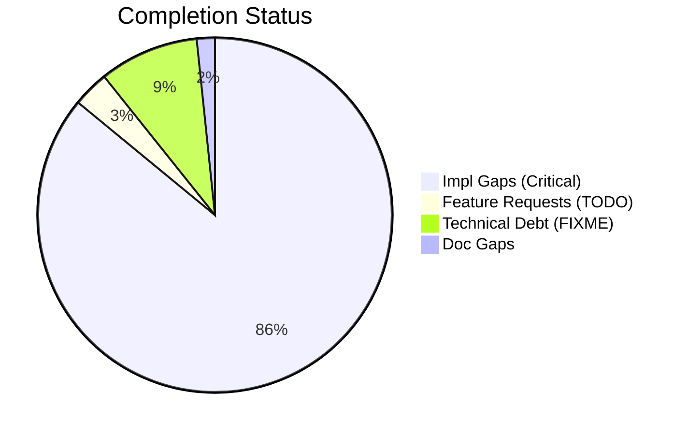
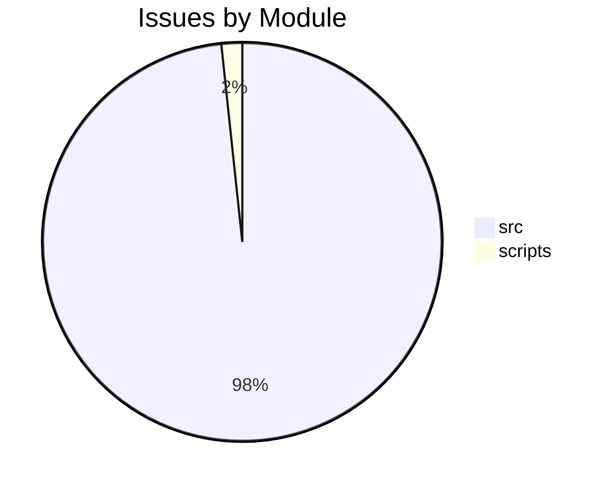

# Completist Report: 2026-01-31

## Executive Summary
- **Critical Gaps**: 104
- **Feature Gaps (TODO)**: 4
- **Technical Debt**: 11
- **Documentation Gaps**: 2

## Visualization
### Status Overview

### Top Impacted Modules

## Critical Incomplete (Top 50)
| File | Line | Type | Impact | Coverage | Complexity |
|---|---|---|---|---|---|
| `./src/engines/Simscape_Multibody_Models/3D_Golf_Model/matlab/src/apps/golf_gui/Simscape Multibody Data Plotters/Python Version/golf_gui_r0/golf_visualizer_implementation.py` | 138 | Stub | 5 | 2 | 4 |
| `./src/engines/Simscape_Multibody_Models/3D_Golf_Model/matlab/src/apps/golf_gui/Simscape Multibody Data Plotters/Python Version/golf_gui_r0/golf_visualizer_implementation.py` | 358 | Stub | 5 | 2 | 4 |
| `./src/engines/Simscape_Multibody_Models/3D_Golf_Model/matlab/src/apps/golf_gui/Simscape Multibody Data Plotters/Python Version/golf_gui_r0/golf_visualizer_implementation.py` | 415 | Stub | 5 | 2 | 4 |
| `./src/engines/Simscape_Multibody_Models/3D_Golf_Model/matlab/src/apps/golf_gui/Simscape Multibody Data Plotters/Python Version/golf_gui_r0/golf_visualizer_implementation.py` | 419 | Stub | 5 | 2 | 4 |
| `./src/engines/Simscape_Multibody_Models/3D_Golf_Model/matlab/src/apps/golf_gui/Simscape Multibody Data Plotters/Python Version/golf_gui_r0/golf_visualizer_implementation.py` | 424 | Stub | 5 | 2 | 4 |
| `./src/engines/Simscape_Multibody_Models/3D_Golf_Model/matlab/src/apps/golf_gui/Simscape Multibody Data Plotters/Python Version/golf_gui_r0/golf_visualizer_implementation.py` | 428 | Stub | 5 | 2 | 4 |
| `./src/engines/Simscape_Multibody_Models/3D_Golf_Model/matlab/src/apps/golf_gui/Simscape Multibody Data Plotters/Python Version/integrated_golf_gui_r0/golf_gui_application.py` | 279 | Stub | 5 | 2 | 4 |
| `./src/engines/physics_engines/pendulum/python/pendulum_physics_engine.py` | 90 | Stub | 5 | 2 | 4 |
| `./src/engines/physics_engines/mujoco/python/humanoid_launcher.py` | 142 | Stub | 5 | 2 | 4 |
| `./src/engines/physics_engines/mujoco/python/humanoid_launcher.py` | 731 | Stub | 5 | 2 | 4 |
| `./src/engines/physics_engines/mujoco/python/mujoco_humanoid_golf/pinocchio_interface.py` | 154 | Stub | 5 | 2 | 4 |
| `./src/engines/physics_engines/mujoco/python/mujoco_humanoid_golf/examples_chaotic_pendulum.py` | 71 | Stub | 5 | 2 | 4 |
| `./src/engines/physics_engines/mujoco/python/mujoco_humanoid_golf/examples_chaotic_pendulum.py` | 75 | Stub | 5 | 2 | 4 |
| `./src/engines/physics_engines/mujoco/python/mujoco_humanoid_golf/urdf_io.py` | 514 | Stub | 5 | 2 | 4 |
| `./src/api/auth/security.py` | 282 | Stub | 5 | 2 | 4 |
| `./src/shared/python/plotting_core.py` | 78 | Stub | 5 | 3 | 4 |
| `./src/shared/python/plotting_core.py` | 89 | Stub | 5 | 3 | 4 |
| `./src/shared/python/plotting_core.py` | 102 | Stub | 5 | 3 | 4 |
| `./src/shared/python/flight_models.py` | 157 | Stub | 5 | 3 | 4 |
| `./src/shared/python/flight_models.py` | 162 | Stub | 5 | 3 | 4 |
| `./src/shared/python/flight_models.py` | 167 | Stub | 5 | 3 | 4 |
| `./src/shared/python/flight_models.py` | 171 | Stub | 5 | 3 | 4 |
| `./src/shared/python/impact_model.py` | 133 | Stub | 5 | 3 | 4 |
| `./src/shared/python/process_worker.py` | 18 | Stub | 5 | 3 | 4 |
| `./src/shared/python/process_worker.py` | 24 | Stub | 5 | 3 | 4 |
| `./src/shared/python/process_worker.py` | 27 | Stub | 5 | 3 | 4 |
| `./src/shared/python/process_worker.py` | 31 | Stub | 5 | 3 | 4 |
| `./src/shared/python/process_worker.py` | 34 | Stub | 5 | 3 | 4 |
| `./src/shared/python/base_physics_engine.py` | 157 | Stub | 5 | 3 | 4 |
| `./src/shared/python/base_physics_engine.py` | 165 | Stub | 5 | 3 | 4 |
| `./src/shared/python/video_pose_pipeline.py` | 385 | Stub | 5 | 3 | 4 |
| `./src/shared/python/interfaces.py` | 26 | Stub | 5 | 3 | 4 |
| `./src/shared/python/interfaces.py` | 31 | Stub | 5 | 3 | 4 |
| `./src/shared/python/interfaces.py` | 40 | Stub | 5 | 3 | 4 |
| `./src/shared/python/interfaces.py` | 50 | Stub | 5 | 3 | 4 |
| `./src/shared/python/interfaces.py` | 55 | Stub | 5 | 3 | 4 |
| `./src/shared/python/interfaces.py` | 64 | Stub | 5 | 3 | 4 |
| `./src/shared/python/interfaces.py` | 73 | Stub | 5 | 3 | 4 |
| `./src/shared/python/interfaces.py` | 84 | Stub | 5 | 3 | 4 |
| `./src/shared/python/interfaces.py` | 94 | Stub | 5 | 3 | 4 |
| `./src/shared/python/interfaces.py` | 103 | Stub | 5 | 3 | 4 |
| `./src/shared/python/interfaces.py` | 144 | Stub | 5 | 3 | 4 |
| `./src/shared/python/interfaces.py` | 153 | Stub | 5 | 3 | 4 |
| `./src/shared/python/interfaces.py` | 162 | Stub | 5 | 3 | 4 |
| `./src/shared/python/interfaces.py` | 171 | Stub | 5 | 3 | 4 |
| `./src/shared/python/interfaces.py` | 183 | Stub | 5 | 3 | 4 |
| `./src/shared/python/interfaces.py` | 207 | Stub | 5 | 3 | 4 |
| `./src/shared/python/interfaces.py` | 227 | Stub | 5 | 3 | 4 |
| `./src/shared/python/interfaces.py` | 249 | Stub | 5 | 3 | 4 |
| `./src/shared/python/interfaces.py` | 287 | Stub | 5 | 3 | 4 |

## Feature Gap Matrix
| Module | Feature Gap | Type |
|---|---|---|
| `./scripts/pragmatic_programmer_review.py` | if "TODO" in content: | TODO |
| `./scripts/pragmatic_programmer_review.py` | "title": f"High TODO count ({len(todos)})", | TODO |
| `./src/tools/humanoid_character_builder/generators/mesh_generator.py` | # TODO: Implement MakeHuman integration | TODO |
| `./src/tools/humanoid_character_builder/generators/mesh_generator.py` | # TODO: Implement SMPL-X integration | TODO |

## Technical Debt Register
| File | Line | Issue | Type |
|---|---|---|---|
| `./src/api/utils/error_codes.py` | 53 | # General Errors (GMS-GEN-XXX) | XXX |
| `./src/api/utils/error_codes.py` | 59 | # Engine Errors (GMS-ENG-XXX) | XXX |
| `./src/api/utils/error_codes.py` | 67 | # Simulation Errors (GMS-SIM-XXX) | XXX |
| `./src/api/utils/error_codes.py` | 76 | # Video Errors (GMS-VID-XXX) | XXX |
| `./src/api/utils/error_codes.py` | 83 | # Analysis Errors (GMS-ANL-XXX) | XXX |
| `./src/api/utils/error_codes.py` | 88 | # Auth Errors (GMS-AUT-XXX) | XXX |
| `./src/api/utils/error_codes.py` | 95 | # Validation Errors (GMS-VAL-XXX) | XXX |
| `./src/api/utils/error_codes.py` | 101 | # Resource Errors (GMS-RES-XXX) | XXX |
| `./src/api/utils/error_codes.py` | 106 | # System Errors (GMS-SYS-XXX) | XXX |
| `./src/tools/matlab_utilities/scripts/matlab_quality_check.py` | 77 | (r"\bHACK\b", "HACK comment found"), | HACK |
| `./src/tools/matlab_utilities/scripts/matlab_quality_check.py` | 78 | (r"\bXXX\b", "XXX comment found"), | XXX |

## Recommended Implementation Order
Prioritized by Impact (High) and Complexity (Low).
| Priority | File | Issue | Metrics (I/C/C) |
|---|---|---|---|
| 1 | `./src/engines/Simscape_Multibody_Models/3D_Golf_Model/matlab/src/apps/golf_gui/Simscape Multibody Data Plotters/Python Version/golf_gui_r0/golf_visualizer_implementation.py` | _calculate_scaling_factors | 5/2/4 |
| 2 | `./src/engines/Simscape_Multibody_Models/3D_Golf_Model/matlab/src/apps/golf_gui/Simscape Multibody Data Plotters/Python Version/golf_gui_r0/golf_visualizer_implementation.py` | _compile_ground_shaders | 5/2/4 |
| 3 | `./src/engines/Simscape_Multibody_Models/3D_Golf_Model/matlab/src/apps/golf_gui/Simscape Multibody Data Plotters/Python Version/golf_gui_r0/golf_visualizer_implementation.py` | _create_sphere_geometry | 5/2/4 |
| 4 | `./src/engines/Simscape_Multibody_Models/3D_Golf_Model/matlab/src/apps/golf_gui/Simscape Multibody Data Plotters/Python Version/golf_gui_r0/golf_visualizer_implementation.py` | _create_club_geometry | 5/2/4 |
| 5 | `./src/engines/Simscape_Multibody_Models/3D_Golf_Model/matlab/src/apps/golf_gui/Simscape Multibody Data Plotters/Python Version/golf_gui_r0/golf_visualizer_implementation.py` | _create_arrow_geometry | 5/2/4 |
| 6 | `./src/engines/Simscape_Multibody_Models/3D_Golf_Model/matlab/src/apps/golf_gui/Simscape Multibody Data Plotters/Python Version/golf_gui_r0/golf_visualizer_implementation.py` | _setup_lighting | 5/2/4 |
| 7 | `./src/engines/Simscape_Multibody_Models/3D_Golf_Model/matlab/src/apps/golf_gui/Simscape Multibody Data Plotters/Python Version/integrated_golf_gui_r0/golf_gui_application.py` | _on_position_changed | 5/2/4 |
| 8 | `./src/engines/physics_engines/pendulum/python/pendulum_physics_engine.py` | forward | 5/2/4 |
| 9 | `./src/engines/physics_engines/mujoco/python/humanoid_launcher.py` | set_analysis_config | 5/2/4 |
| 10 | `./src/engines/physics_engines/mujoco/python/humanoid_launcher.py` | load_config | 5/2/4 |
| 11 | `./src/engines/physics_engines/mujoco/python/mujoco_humanoid_golf/pinocchio_interface.py` | sync_pinocchio_to_mujoco | 5/2/4 |
| 12 | `./src/engines/physics_engines/mujoco/python/mujoco_humanoid_golf/examples_chaotic_pendulum.py` | control | 5/2/4 |
| 13 | `./src/engines/physics_engines/mujoco/python/mujoco_humanoid_golf/examples_chaotic_pendulum.py` | reset | 5/2/4 |
| 14 | `./src/engines/physics_engines/mujoco/python/mujoco_humanoid_golf/urdf_io.py` | __init__ | 5/2/4 |
| 15 | `./src/api/auth/security.py` | __init__ | 5/2/4 |
| 16 | `./src/shared/python/plotting_core.py` | get_time_series | 5/3/4 |
| 17 | `./src/shared/python/plotting_core.py` | get_induced_acceleration_series | 5/3/4 |
| 18 | `./src/shared/python/plotting_core.py` | get_counterfactual_series | 5/3/4 |
| 19 | `./src/shared/python/flight_models.py` | name | 5/3/4 |
| 20 | `./src/shared/python/flight_models.py` | description | 5/3/4 |

## Issues Created
- Created `docs/assessments/issues/Issue_022_Incomplete_Stub_in_golf_visualizer_implementation_py_138.md`
- Created `docs/assessments/issues/Issue_032_Incomplete_Stub_in_golf_visualizer_implementation_py_358.md`
- Created `docs/assessments/issues/Issue_033_Incomplete_Stub_in_golf_visualizer_implementation_py_415.md`
- Created `docs/assessments/issues/Issue_034_Incomplete_Stub_in_golf_visualizer_implementation_py_419.md`
- Created `docs/assessments/issues/Issue_035_Incomplete_Stub_in_golf_visualizer_implementation_py_424.md`
- Created `docs/assessments/issues/Issue_026_Incomplete_Stub_in_golf_visualizer_implementation_py_428.md`
- Created `docs/assessments/issues/Issue_021_Incomplete_Stub_in_golf_gui_application_py_279.md`
- Created `docs/assessments/issues/Issue_038_Incomplete_Stub_in_pendulum_physics_engine_py_90.md`
- Created `docs/assessments/issues/Issue_039_Incomplete_Stub_in_humanoid_launcher_py_142.md`
- Created `docs/assessments/issues/Issue_040_Incomplete_Stub_in_humanoid_launcher_py_731.md`