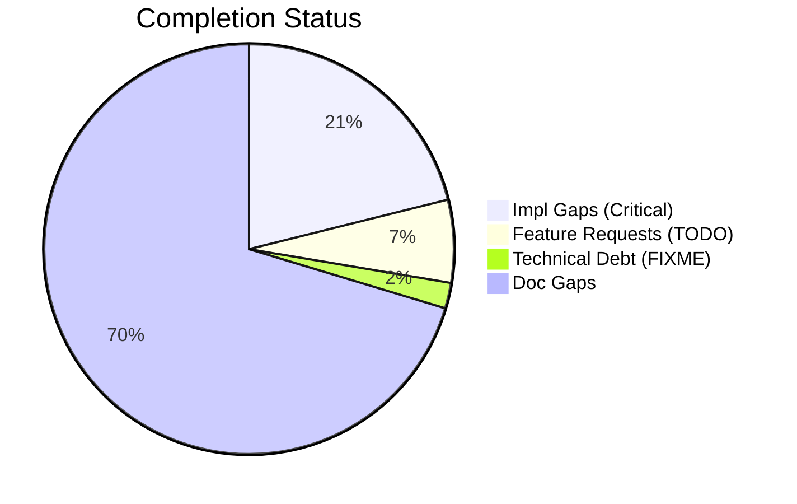
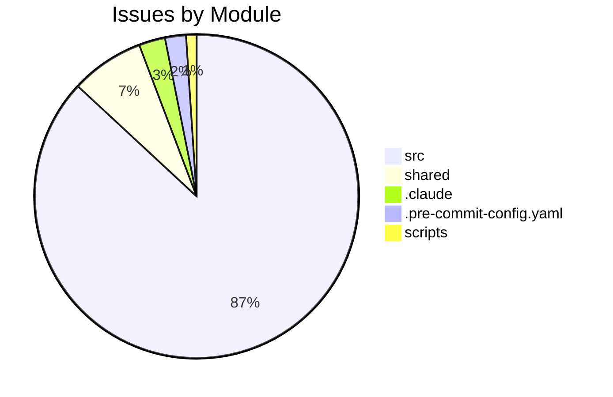

# Completist Report: 2026-01-31

## Executive Summary

- **Critical Gaps**: 136
- **Feature Gaps (TODO)**: 42
- **Technical Debt**: 13
- **Documentation Gaps**: 453

## Visualization

### Status Overview

### Top Impacted Modules

## Critical Incomplete (Top 50)

| File                                                                                                                                                                            | Line | Type | Impact | Coverage | Complexity |
| ------------------------------------------------------------------------------------------------------------------------------------------------------------------------------- | ---- | ---- | ------ | -------- | ---------- |
| `./src/engines/common/physics.py`                                                                                                                                               | 439  | Stub | 5      | 2        | 4          |
| `./src/engines/common/physics.py`                                                                                                                                               | 443  | Stub | 5      | 2        | 4          |
| `./src/engines/common/physics.py`                                                                                                                                               | 447  | Stub | 5      | 2        | 4          |
| `./src/engines/Simscape_Multibody_Models/3D_Golf_Model/matlab/src/apps/golf_gui/Simscape Multibody Data Plotters/Python Version/golf_gui_r0/golf_visualizer_implementation.py`  | 138  | Stub | 5      | 2        | 4          |
| `./src/engines/Simscape_Multibody_Models/3D_Golf_Model/matlab/src/apps/golf_gui/Simscape Multibody Data Plotters/Python Version/golf_gui_r0/golf_visualizer_implementation.py`  | 358  | Stub | 5      | 2        | 4          |
| `./src/engines/Simscape_Multibody_Models/3D_Golf_Model/matlab/src/apps/golf_gui/Simscape Multibody Data Plotters/Python Version/golf_gui_r0/golf_visualizer_implementation.py`  | 415  | Stub | 5      | 2        | 4          |
| `./src/engines/Simscape_Multibody_Models/3D_Golf_Model/matlab/src/apps/golf_gui/Simscape Multibody Data Plotters/Python Version/golf_gui_r0/golf_visualizer_implementation.py`  | 419  | Stub | 5      | 2        | 4          |
| `./src/engines/Simscape_Multibody_Models/3D_Golf_Model/matlab/src/apps/golf_gui/Simscape Multibody Data Plotters/Python Version/golf_gui_r0/golf_visualizer_implementation.py`  | 424  | Stub | 5      | 2        | 4          |
| `./src/engines/Simscape_Multibody_Models/3D_Golf_Model/matlab/src/apps/golf_gui/Simscape Multibody Data Plotters/Python Version/golf_gui_r0/golf_visualizer_implementation.py`  | 428  | Stub | 5      | 2        | 4          |
| `./src/engines/Simscape_Multibody_Models/3D_Golf_Model/matlab/src/apps/golf_gui/Simscape Multibody Data Plotters/Python Version/integrated_golf_gui_r0/golf_gui_application.py` | 279  | Stub | 5      | 2        | 4          |
| `./src/engines/physics_engines/pendulum/python/pendulum_physics_engine.py`                                                                                                      | 90   | Stub | 5      | 2        | 4          |
| `./src/engines/physics_engines/mujoco/python/humanoid_launcher.py`                                                                                                              | 826  | Stub | 5      | 2        | 4          |
| `./src/engines/physics_engines/mujoco/python/mujoco_humanoid_golf/pinocchio_interface.py`                                                                                       | 154  | Stub | 5      | 2        | 4          |
| `./src/engines/physics_engines/mujoco/python/mujoco_humanoid_golf/examples_chaotic_pendulum.py`                                                                                 | 71   | Stub | 5      | 2        | 4          |
| `./src/engines/physics_engines/mujoco/python/mujoco_humanoid_golf/examples_chaotic_pendulum.py`                                                                                 | 75   | Stub | 5      | 2        | 4          |
| `./src/engines/physics_engines/mujoco/python/mujoco_humanoid_golf/urdf_io.py`                                                                                                   | 514  | Stub | 5      | 2        | 4          |
| `./src/api/auth/security.py`                                                                                                                                                    | 282  | Stub | 5      | 2        | 4          |
| `./src/shared/python/plotting_core.py`                                                                                                                                          | 78   | Stub | 5      | 3        | 4          |
| `./src/shared/python/plotting_core.py`                                                                                                                                          | 89   | Stub | 5      | 3        | 4          |
| `./src/shared/python/plotting_core.py`                                                                                                                                          | 102  | Stub | 5      | 3        | 4          |
| `./src/shared/python/flight_models.py`                                                                                                                                          | 157  | Stub | 5      | 3        | 4          |
| `./src/shared/python/flight_models.py`                                                                                                                                          | 162  | Stub | 5      | 3        | 4          |
| `./src/shared/python/flight_models.py`                                                                                                                                          | 167  | Stub | 5      | 3        | 4          |
| `./src/shared/python/flight_models.py`                                                                                                                                          | 171  | Stub | 5      | 3        | 4          |
| `./src/shared/python/impact_model.py`                                                                                                                                           | 133  | Stub | 5      | 3        | 4          |
| `./src/shared/python/process_worker.py`                                                                                                                                         | 18   | Stub | 5      | 3        | 4          |
| `./src/shared/python/process_worker.py`                                                                                                                                         | 24   | Stub | 5      | 3        | 4          |
| `./src/shared/python/process_worker.py`                                                                                                                                         | 27   | Stub | 5      | 3        | 4          |
| `./src/shared/python/process_worker.py`                                                                                                                                         | 31   | Stub | 5      | 3        | 4          |
| `./src/shared/python/process_worker.py`                                                                                                                                         | 34   | Stub | 5      | 3        | 4          |
| `./src/shared/python/base_physics_engine.py`                                                                                                                                    | 241  | Stub | 5      | 3        | 4          |
| `./src/shared/python/base_physics_engine.py`                                                                                                                                    | 249  | Stub | 5      | 3        | 4          |
| `./src/shared/python/video_pose_pipeline.py`                                                                                                                                    | 385  | Stub | 5      | 3        | 4          |
| `./src/shared/python/interfaces.py`                                                                                                                                             | 48   | Stub | 5      | 3        | 4          |
| `./src/shared/python/interfaces.py`                                                                                                                                             | 61   | Stub | 5      | 3        | 4          |
| `./src/shared/python/interfaces.py`                                                                                                                                             | 86   | Stub | 5      | 3        | 4          |
| `./src/shared/python/interfaces.py`                                                                                                                                             | 107  | Stub | 5      | 3        | 4          |
| `./src/shared/python/interfaces.py`                                                                                                                                             | 123  | Stub | 5      | 3        | 4          |
| `./src/shared/python/interfaces.py`                                                                                                                                             | 145  | Stub | 5      | 3        | 4          |
| `./src/shared/python/interfaces.py`                                                                                                                                             | 165  | Stub | 5      | 3        | 4          |
| `./src/shared/python/interfaces.py`                                                                                                                                             | 187  | Stub | 5      | 3        | 4          |
| `./src/shared/python/interfaces.py`                                                                                                                                             | 210  | Stub | 5      | 3        | 4          |
| `./src/shared/python/interfaces.py`                                                                                                                                             | 231  | Stub | 5      | 3        | 4          |
| `./src/shared/python/interfaces.py`                                                                                                                                             | 285  | Stub | 5      | 3        | 4          |
| `./src/shared/python/interfaces.py`                                                                                                                                             | 307  | Stub | 5      | 3        | 4          |
| `./src/shared/python/interfaces.py`                                                                                                                                             | 326  | Stub | 5      | 3        | 4          |
| `./src/shared/python/interfaces.py`                                                                                                                                             | 345  | Stub | 5      | 3        | 4          |
| `./src/shared/python/interfaces.py`                                                                                                                                             | 371  | Stub | 5      | 3        | 4          |
| `./src/shared/python/interfaces.py`                                                                                                                                             | 413  | Stub | 5      | 3        | 4          |
| `./src/shared/python/interfaces.py`                                                                                                                                             | 445  | Stub | 5      | 3        | 4          |

## Feature Gap Matrix

| Module                                                                                                                                         | Feature Gap                                                                            | Type    |
| ---------------------------------------------------------------------------------------------------------------------------------------------- | -------------------------------------------------------------------------------------- | ------- | ----- | ------ | --------------------- | -------------------------- | ---- |
| `./.claude/skills/lint.md`                                                                                                                     | description: Run linting tools (ruff, black, mypy) and fix placeholder/TODO statements | TODO    |
| `./.claude/skills/lint.md`                                                                                                                     | - Search for `TODO`, `FIXME`, `XXX`, `HACK` comments                                   | TODO    |
| `./.claude/skills/lint.md`                                                                                                                     | grep -rn "TODO\\                                                                       | FIXME\\ | XXX\\ | HACK\\ | NotImplementedError\\ | pass$" --include="\*.py" . | TODO |
| `./scripts/pragmatic_programmer_review.py`                                                                                                     | if "TODO" in content:                                                                  | TODO    |
| `./scripts/pragmatic_programmer_review.py`                                                                                                     | "title": f"High TODO count ({len(todos)})",                                            | TODO    |
| `./shared/models/opensim/opensim-models/Tutorials/Building_a_Passive_Dynamic_Walker/DynamicWalkerBuild/DynamicWalkerBuildModelStudent.cpp`     | // TODO: Add Code to Begin Model here                                                  | TODO    |
| `./shared/models/opensim/opensim-models/Tutorials/Building_a_Passive_Dynamic_Walker/DynamicWalkerBuild/DynamicWalkerBuildModelStudent.cpp`     | // TODO: Set the coordinate properties                                                 | TODO    |
| `./shared/models/opensim/opensim-models/Tutorials/Building_a_Passive_Dynamic_Walker/skeleton.cpp`                                              | // TODO: Add Code to Begin Model here                                                  | TODO    |
| `./shared/models/opensim/opensim-models/Tutorials/Building_a_Passive_Dynamic_Walker/DynamicWalkerBuildModel.cpp`                               | // Section A.1 TODO: Create the Pelvis and set the coordinate properties               | TODO    |
| `./shared/models/opensim/opensim-models/Tutorials/Building_a_Passive_Dynamic_Walker/DynamicWalkerBuildModel.cpp`                               | // Section A.2 TODO: Create the LeftThigh, LeftShank, RightThigh and RightShank bodies | TODO    |
| `./shared/models/opensim/opensim-models/Tutorials/Building_a_Passive_Dynamic_Walker/DynamicWalkerBuildModel.cpp`                               | // Section B.1 TODO: Add ContactSphere to the left hip, the knee, and the foot points  | TODO    |
| `./shared/models/opensim/opensim-models/Tutorials/Building_a_Passive_Dynamic_Walker/DynamicWalkerBuildModel.cpp`                               | // Section B.2 TODO: Add HuntCrossleyForces                                            | TODO    |
| `./shared/models/opensim/opensim-models/Tutorials/Building_a_Passive_Dynamic_Walker/DynamicWalkerBuildModel.cpp`                               | // Section B.2 TODO: Add HuntCrossleyForces betweeen the remaining ContactSpheres      | TODO    |
| `./shared/models/opensim/opensim-models/Tutorials/Building_a_Passive_Dynamic_Walker/DynamicWalkerBuildModel.cpp`                               | // Section C.1 TODO: Construct CoordinateLimitForces for the Hip and Knee              | TODO    |
| `./shared/models/opensim/opensim-models/CMakeLists.txt`                                                                                        | RENAME run_forward.xml) # TODO inconsistent filename; which should we use?             | TODO    |
| `./shared/models/opensim/opensim-models/CMakeLists.txt`                                                                                        | # TODO subject01_metabolics\* files?                                                   | TODO    |
| `./shared/models/opensim/opensim-models/CMakeLists.txt`                                                                                        | # TODO should we copy over the OutputReference folder?                                 | TODO    |
| `./shared/models/opensim/opensim-models/CMakeLists.txt`                                                                                        | PATTERN "addPrescribedMotion.py" EXCLUDE # TODO leave in or not?                       | TODO    |
| `./src/engines/pendulum_models/tools/matlab_utilities/README.md`                                                                               | - TODO, FIXME, HACK, XXX placeholders                                                  | TODO    |
| `./src/engines/Simscape_Multibody_Models/3D_Golf_Model/matlab_utilities/README.md`                                                             | - TODO, FIXME, HACK, XXX placeholders                                                  | TODO    |
| `./src/engines/physics_engines/pinocchio/tools/matlab_utilities/README.md`                                                                     | - TODO, FIXME, HACK, XXX placeholders                                                  | TODO    |
| `./src/engines/physics_engines/drake/tools/matlab_utilities/README.md`                                                                         | - TODO, FIXME, HACK, XXX placeholders                                                  | TODO    |
| `./src/tools/humanoid_character_builder/generators/mesh_generator.py`                                                                          | # TODO: Implement MakeHuman integration                                                | TODO    |
| `./src/tools/humanoid_character_builder/generators/mesh_generator.py`                                                                          | # TODO: Implement SMPL-X integration                                                   | TODO    |
| `./src/shared/models/opensim/opensim-models/Tutorials/Building_a_Passive_Dynamic_Walker/DynamicWalkerBuild/DynamicWalkerBuildModelStudent.cpp` | // TODO: Add Code to Begin Model here                                                  | TODO    |
| `./src/shared/models/opensim/opensim-models/Tutorials/Building_a_Passive_Dynamic_Walker/DynamicWalkerBuild/DynamicWalkerBuildModelStudent.cpp` | // TODO: Set the coordinate properties                                                 | TODO    |
| `./src/shared/models/opensim/opensim-models/Tutorials/Building_a_Passive_Dynamic_Walker/skeleton.cpp`                                          | // TODO: Add Code to Begin Model here                                                  | TODO    |
| `./src/shared/models/opensim/opensim-models/Tutorials/Building_a_Passive_Dynamic_Walker/DynamicWalkerBuildModel.cpp`                           | // Section A.1 TODO: Create the Pelvis and set the coordinate properties               | TODO    |
| `./src/shared/models/opensim/opensim-models/Tutorials/Building_a_Passive_Dynamic_Walker/DynamicWalkerBuildModel.cpp`                           | // Section A.2 TODO: Create the LeftThigh, LeftShank, RightThigh and RightShank bodies | TODO    |
| `./src/shared/models/opensim/opensim-models/Tutorials/Building_a_Passive_Dynamic_Walker/DynamicWalkerBuildModel.cpp`                           | // Section B.1 TODO: Add ContactSphere to the left hip, the knee, and the foot points  | TODO    |
| `./src/shared/models/opensim/opensim-models/Tutorials/Building_a_Passive_Dynamic_Walker/DynamicWalkerBuildModel.cpp`                           | // Section B.2 TODO: Add HuntCrossleyForces                                            | TODO    |
| `./src/shared/models/opensim/opensim-models/Tutorials/Building_a_Passive_Dynamic_Walker/DynamicWalkerBuildModel.cpp`                           | // Section B.2 TODO: Add HuntCrossleyForces betweeen the remaining ContactSpheres      | TODO    |
| `./src/shared/models/opensim/opensim-models/Tutorials/Building_a_Passive_Dynamic_Walker/DynamicWalkerBuildModel.cpp`                           | // Section C.1 TODO: Construct CoordinateLimitForces for the Hip and Knee              | TODO    |
| `./src/shared/models/opensim/opensim-models/CMakeLists.txt`                                                                                    | RENAME run_forward.xml) # TODO inconsistent filename; which should we use?             | TODO    |
| `./src/shared/models/opensim/opensim-models/CMakeLists.txt`                                                                                    | # TODO subject01_metabolics\* files?                                                   | TODO    |
| `./src/shared/models/opensim/opensim-models/CMakeLists.txt`                                                                                    | # TODO should we copy over the OutputReference folder?                                 | TODO    |
| `./src/shared/models/opensim/opensim-models/CMakeLists.txt`                                                                                    | PATTERN "addPrescribedMotion.py" EXCLUDE # TODO leave in or not?                       | TODO    |
| `./src/shared/tools/human-gazebo/legacy/control/src/HumanGazeboControlModule.cpp`                                                              | //TODO read the joint names list and then put then in the control board options        | TODO    |
| `./.pre-commit-config.yaml`                                                                                                                    | # TODO/FIXME detection (Issue #780: align with CI placeholder checks)                  | TODO    |
| `./.pre-commit-config.yaml`                                                                                                                    | name: Check for TODO/FIXME                                                             | TODO    |
| `./.pre-commit-config.yaml`                                                                                                                    | bash -c 'if grep -rn --include="\*.py" -E "TODO\|FIXME"                                | TODO    |
| `./.pre-commit-config.yaml`                                                                                                                    | echo "ERROR: Found TODO/FIXME placeholders. Create GitHub issues instead.";            | TODO    |

## Technical Debt Register

| File                                                                       | Line | Issue                                                | Type |
| -------------------------------------------------------------------------- | ---- | ---------------------------------------------------- | ---- |
| `./shared/models/opensim/opensim-models/Tutorials/doc/styles/site.css`     | 3404 | html body { /_ HACK: Temporary fix for CONF-15412 _/ | HACK |
| `./src/api/utils/error_codes.py`                                           | 53   | # General Errors (GMS-GEN-XXX)                       | XXX  |
| `./src/api/utils/error_codes.py`                                           | 59   | # Engine Errors (GMS-ENG-XXX)                        | XXX  |
| `./src/api/utils/error_codes.py`                                           | 67   | # Simulation Errors (GMS-SIM-XXX)                    | XXX  |
| `./src/api/utils/error_codes.py`                                           | 76   | # Video Errors (GMS-VID-XXX)                         | XXX  |
| `./src/api/utils/error_codes.py`                                           | 83   | # Analysis Errors (GMS-ANL-XXX)                      | XXX  |
| `./src/api/utils/error_codes.py`                                           | 88   | # Auth Errors (GMS-AUT-XXX)                          | XXX  |
| `./src/api/utils/error_codes.py`                                           | 95   | # Validation Errors (GMS-VAL-XXX)                    | XXX  |
| `./src/api/utils/error_codes.py`                                           | 101  | # Resource Errors (GMS-RES-XXX)                      | XXX  |
| `./src/api/utils/error_codes.py`                                           | 106  | # System Errors (GMS-SYS-XXX)                        | XXX  |
| `./src/tools/matlab_utilities/scripts/matlab_quality_check.py`             | 77   | (r"\bHACK\b", "HACK comment found"),                 | HACK |
| `./src/tools/matlab_utilities/scripts/matlab_quality_check.py`             | 78   | (r"\bXXX\b", "XXX comment found"),                   | XXX  |
| `./src/shared/models/opensim/opensim-models/Tutorials/doc/styles/site.css` | 3404 | html body { /_ HACK: Temporary fix for CONF-15412 _/ | HACK |

## Recommended Implementation Order

Prioritized by Impact (High) and Complexity (Low).
| Priority | File | Issue | Metrics (I/C/C) |
|---|---|---|---|
| 1 | `./src/engines/pendulum_models/tools/matlab_utilities/README.md` | - TODO, FIXME, HACK, XXX placeholders | 5/2/3 |
| 2 | `./src/engines/Simscape_Multibody_Models/3D_Golf_Model/matlab_utilities/README.md` | - TODO, FIXME, HACK, XXX placeholders | 5/2/3 |
| 3 | `./src/engines/physics_engines/pinocchio/tools/matlab_utilities/README.md` | - TODO, FIXME, HACK, XXX placeholders | 5/2/3 |
| 4 | `./src/engines/physics_engines/drake/tools/matlab_utilities/README.md` | - TODO, FIXME, HACK, XXX placeholders | 5/2/3 |
| 5 | `./src/engines/common/physics.py` | compute_drag | 5/2/4 |
| 6 | `./src/engines/common/physics.py` | compute_lift | 5/2/4 |
| 7 | `./src/engines/common/physics.py` | compute_magnus | 5/2/4 |
| 8 | `./src/engines/Simscape_Multibody_Models/3D_Golf_Model/matlab/src/apps/golf_gui/Simscape Multibody Data Plotters/Python Version/golf_gui_r0/golf_visualizer_implementation.py` | \_calculate_scaling_factors | 5/2/4 |
| 9 | `./src/engines/Simscape_Multibody_Models/3D_Golf_Model/matlab/src/apps/golf_gui/Simscape Multibody Data Plotters/Python Version/golf_gui_r0/golf_visualizer_implementation.py` | \_compile_ground_shaders | 5/2/4 |
| 10 | `./src/engines/Simscape_Multibody_Models/3D_Golf_Model/matlab/src/apps/golf_gui/Simscape Multibody Data Plotters/Python Version/golf_gui_r0/golf_visualizer_implementation.py` | \_create_sphere_geometry | 5/2/4 |
| 11 | `./src/engines/Simscape_Multibody_Models/3D_Golf_Model/matlab/src/apps/golf_gui/Simscape Multibody Data Plotters/Python Version/golf_gui_r0/golf_visualizer_implementation.py` | \_create_club_geometry | 5/2/4 |
| 12 | `./src/engines/Simscape_Multibody_Models/3D_Golf_Model/matlab/src/apps/golf_gui/Simscape Multibody Data Plotters/Python Version/golf_gui_r0/golf_visualizer_implementation.py` | \_create_arrow_geometry | 5/2/4 |
| 13 | `./src/engines/Simscape_Multibody_Models/3D_Golf_Model/matlab/src/apps/golf_gui/Simscape Multibody Data Plotters/Python Version/golf_gui_r0/golf_visualizer_implementation.py` | \_setup_lighting | 5/2/4 |
| 14 | `./src/engines/Simscape_Multibody_Models/3D_Golf_Model/matlab/src/apps/golf_gui/Simscape Multibody Data Plotters/Python Version/integrated_golf_gui_r0/golf_gui_application.py` | \_on_position_changed | 5/2/4 |
| 15 | `./src/engines/physics_engines/pendulum/python/pendulum_physics_engine.py` | forward | 5/2/4 |
| 16 | `./src/engines/physics_engines/mujoco/python/humanoid_launcher.py` | load_config | 5/2/4 |
| 17 | `./src/engines/physics_engines/mujoco/python/mujoco_humanoid_golf/pinocchio_interface.py` | sync_pinocchio_to_mujoco | 5/2/4 |
| 18 | `./src/engines/physics_engines/mujoco/python/mujoco_humanoid_golf/examples_chaotic_pendulum.py` | control | 5/2/4 |
| 19 | `./src/engines/physics_engines/mujoco/python/mujoco_humanoid_golf/examples_chaotic_pendulum.py` | reset | 5/2/4 |
| 20 | `./src/engines/physics_engines/mujoco/python/mujoco_humanoid_golf/urdf_io.py` | **init** | 5/2/4 |

## Issues Created

- Created `docs/assessments/issues/Issue_043_Incomplete_Stub_in_physics_py_439.md`
- Created `docs/assessments/issues/Issue_044_Incomplete_Stub_in_physics_py_443.md`
- Created `docs/assessments/issues/Issue_045_Incomplete_Stub_in_physics_py_447.md`
- Created `docs/assessments/issues/Issue_022_Incomplete_Stub_in_golf_visualizer_implementation_py_138.md`
- Created `docs/assessments/issues/Issue_032_Incomplete_Stub_in_golf_visualizer_implementation_py_358.md`
- Created `docs/assessments/issues/Issue_033_Incomplete_Stub_in_golf_visualizer_implementation_py_415.md`
- Created `docs/assessments/issues/Issue_034_Incomplete_Stub_in_golf_visualizer_implementation_py_419.md`
- Created `docs/assessments/issues/Issue_035_Incomplete_Stub_in_golf_visualizer_implementation_py_424.md`
- Created `docs/assessments/issues/Issue_026_Incomplete_Stub_in_golf_visualizer_implementation_py_428.md`
- Created `docs/assessments/issues/Issue_021_Incomplete_Stub_in_golf_gui_application_py_279.md`
