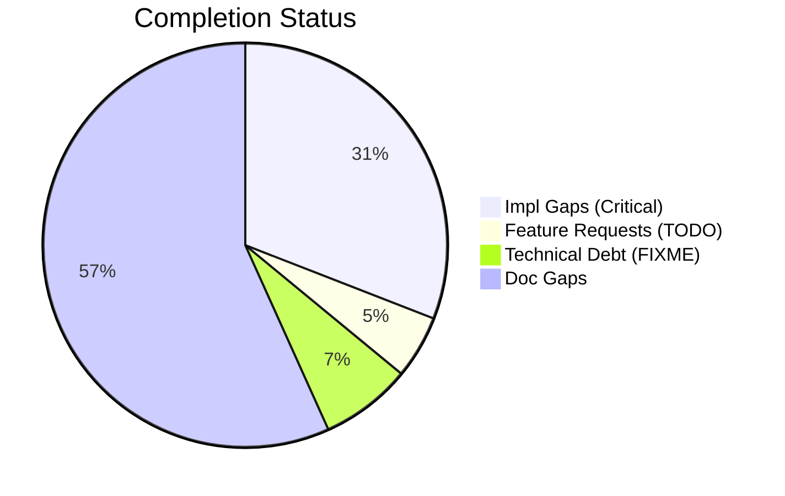
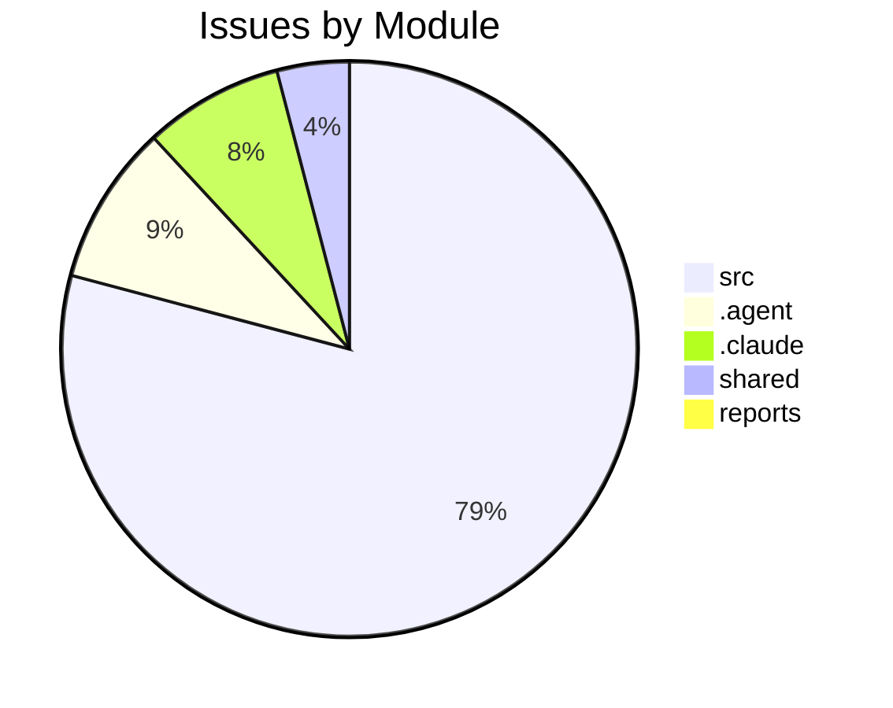

# Completist Report: 2026-02-05

## Executive Summary
- **Critical Gaps**: 250
- **Feature Gaps (TODO)**: 41
- **Technical Debt**: 59
- **Documentation Gaps**: 459

## Visualization
### Status Overview

### Top Impacted Modules

## Critical Incomplete (Top 50)
| File | Line | Type | Impact | Coverage | Complexity |
|---|---|---|---|---|---|
| `./src/engines/common/physics.py` | 443 | Stub | 5 | 2 | 4 |
| `./src/engines/common/physics.py` | 447 | Stub | 5 | 2 | 4 |
| `./src/engines/common/physics.py` | 451 | Stub | 5 | 2 | 4 |
| `./src/engines/Simscape_Multibody_Models/3D_Golf_Model/matlab/src/apps/golf_gui/Simscape Multibody Data Plotters/Python Version/golf_gui_r0/golf_visualizer_implementation.py` | 138 | Stub | 5 | 2 | 4 |
| `./src/engines/Simscape_Multibody_Models/3D_Golf_Model/matlab/src/apps/golf_gui/Simscape Multibody Data Plotters/Python Version/golf_gui_r0/golf_visualizer_implementation.py` | 358 | Stub | 5 | 2 | 4 |
| `./src/engines/Simscape_Multibody_Models/3D_Golf_Model/matlab/src/apps/golf_gui/Simscape Multibody Data Plotters/Python Version/golf_gui_r0/golf_visualizer_implementation.py` | 415 | Stub | 5 | 2 | 4 |
| `./src/engines/Simscape_Multibody_Models/3D_Golf_Model/matlab/src/apps/golf_gui/Simscape Multibody Data Plotters/Python Version/golf_gui_r0/golf_visualizer_implementation.py` | 419 | Stub | 5 | 2 | 4 |
| `./src/engines/Simscape_Multibody_Models/3D_Golf_Model/matlab/src/apps/golf_gui/Simscape Multibody Data Plotters/Python Version/golf_gui_r0/golf_visualizer_implementation.py` | 424 | Stub | 5 | 2 | 4 |
| `./src/engines/Simscape_Multibody_Models/3D_Golf_Model/matlab/src/apps/golf_gui/Simscape Multibody Data Plotters/Python Version/golf_gui_r0/golf_visualizer_implementation.py` | 428 | Stub | 5 | 2 | 4 |
| `./src/engines/Simscape_Multibody_Models/3D_Golf_Model/matlab/src/apps/golf_gui/Simscape Multibody Data Plotters/Python Version/integrated_golf_gui_r0/golf_gui_application.py` | 279 | Stub | 5 | 2 | 4 |
| `./src/engines/physics_engines/putting_green/python/simulator.py` | 367 | Stub | 5 | 2 | 4 |
| `./src/engines/physics_engines/pendulum/python/pendulum_physics_engine.py` | 100 | Stub | 5 | 2 | 4 |
| `./src/engines/physics_engines/mujoco/python/humanoid_launcher.py` | 828 | Stub | 5 | 2 | 4 |
| `./src/engines/physics_engines/mujoco/python/mujoco_humanoid_golf/pinocchio_interface.py` | 154 | Stub | 5 | 2 | 4 |
| `./src/engines/physics_engines/mujoco/python/mujoco_humanoid_golf/examples_chaotic_pendulum.py` | 71 | Stub | 5 | 2 | 4 |
| `./src/engines/physics_engines/mujoco/python/mujoco_humanoid_golf/examples_chaotic_pendulum.py` | 75 | Stub | 5 | 2 | 4 |
| `./src/engines/physics_engines/mujoco/python/mujoco_humanoid_golf/urdf_io.py` | 514 | Stub | 5 | 2 | 4 |
| `./src/api/auth/security.py` | 282 | Stub | 5 | 2 | 4 |
| `./src/shared/python/flight_models.py` | 157 | Stub | 5 | 3 | 4 |
| `./src/shared/python/flight_models.py` | 162 | Stub | 5 | 3 | 4 |
| `./src/shared/python/flight_models.py` | 167 | Stub | 5 | 3 | 4 |
| `./src/shared/python/flight_models.py` | 171 | Stub | 5 | 3 | 4 |
| `./src/shared/python/topography.py` | 92 | Stub | 5 | 3 | 4 |
| `./src/shared/python/topography.py` | 103 | Stub | 5 | 3 | 4 |
| `./src/shared/python/topography.py` | 115 | Stub | 5 | 3 | 4 |
| `./src/shared/python/impact_model.py` | 133 | Stub | 5 | 3 | 4 |
| `./src/shared/python/base_physics_engine.py` | 242 | Stub | 5 | 3 | 4 |
| `./src/shared/python/base_physics_engine.py` | 250 | Stub | 5 | 3 | 4 |
| `./src/shared/python/terrain_engine.py` | 42 | Stub | 5 | 3 | 4 |
| `./src/shared/python/terrain_mixin.py` | 35 | Stub | 5 | 3 | 4 |
| `./src/shared/python/interfaces.py` | 50 | Stub | 5 | 3 | 4 |
| `./src/shared/python/interfaces.py` | 63 | Stub | 5 | 3 | 4 |
| `./src/shared/python/interfaces.py` | 88 | Stub | 5 | 3 | 4 |
| `./src/shared/python/interfaces.py` | 109 | Stub | 5 | 3 | 4 |
| `./src/shared/python/interfaces.py` | 125 | Stub | 5 | 3 | 4 |
| `./src/shared/python/interfaces.py` | 147 | Stub | 5 | 3 | 4 |
| `./src/shared/python/interfaces.py` | 167 | Stub | 5 | 3 | 4 |
| `./src/shared/python/interfaces.py` | 189 | Stub | 5 | 3 | 4 |
| `./src/shared/python/interfaces.py` | 212 | Stub | 5 | 3 | 4 |
| `./src/shared/python/interfaces.py` | 233 | Stub | 5 | 3 | 4 |
| `./src/shared/python/interfaces.py` | 287 | Stub | 5 | 3 | 4 |
| `./src/shared/python/interfaces.py` | 309 | Stub | 5 | 3 | 4 |
| `./src/shared/python/interfaces.py` | 328 | Stub | 5 | 3 | 4 |
| `./src/shared/python/interfaces.py` | 347 | Stub | 5 | 3 | 4 |
| `./src/shared/python/interfaces.py` | 373 | Stub | 5 | 3 | 4 |
| `./src/shared/python/interfaces.py` | 415 | Stub | 5 | 3 | 4 |
| `./src/shared/python/interfaces.py` | 447 | Stub | 5 | 3 | 4 |
| `./src/shared/python/interfaces.py` | 483 | Stub | 5 | 3 | 4 |
| `./src/shared/python/interfaces.py` | 535 | Stub | 5 | 3 | 4 |
| `./src/shared/python/interfaces.py` | 654 | Stub | 5 | 3 | 4 |

## Feature Gap Matrix
| Module | Feature Gap | Type |
|---|---|---|
| `./.claude/skills/lint/SKILL.md` | description: Run linting tools (ruff, black, mypy) and fix placeholder/TODO statements | TODO |
| `./.claude/skills/lint/SKILL.md` | - Search for `TODO`, `FIXME`, `XXX`, `HACK` comments | TODO |
| `./.claude/skills/lint/SKILL.md` | grep -rn "TODO\\|FIXME\\|XXX\\|HACK\\|NotImplementedError\\|pass$" --include="*.py" . | TODO |
| `./scripts/pragmatic_programmer_review.py` | if "TODO" in content: | TODO |
| `./scripts/pragmatic_programmer_review.py` | "title": f"High TODO count ({len(todos)})", | TODO |
| `./.agent/skills/lint/SKILL.md` | description: Run linting tools (ruff, black, mypy) and fix placeholder/TODO statements | TODO |
| `./.agent/skills/lint/SKILL.md` | - Search for `TODO`, `FIXME`, `XXX`, `HACK` comments | TODO |
| `./.agent/skills/lint/SKILL.md` | grep -rn "TODO\\|FIXME\\|XXX\\|HACK\\|NotImplementedError\\|pass$" --include="*.py" . | TODO |
| `./.agent/workflows/lint.md` | description: Run linting tools (ruff, black, mypy) and fix placeholder/TODO statements | TODO |
| `./.agent/workflows/lint.md` | grep -rn "TODO\\|FIXME\\|XXX\\|HACK\\|NotImplementedError\\|pass$" --include="*.py" . | TODO |
| `./shared/models/opensim/opensim-models/Tutorials/Building_a_Passive_Dynamic_Walker/DynamicWalkerBuild/DynamicWalkerBuildModelStudent.cpp` | // TODO: Add Code to Begin Model here | TODO |
| `./shared/models/opensim/opensim-models/Tutorials/Building_a_Passive_Dynamic_Walker/DynamicWalkerBuild/DynamicWalkerBuildModelStudent.cpp` | // TODO: Set the coordinate properties | TODO |
| `./shared/models/opensim/opensim-models/Tutorials/Building_a_Passive_Dynamic_Walker/skeleton.cpp` | // TODO: Add Code to Begin Model here | TODO |
| `./shared/models/opensim/opensim-models/Tutorials/Building_a_Passive_Dynamic_Walker/DynamicWalkerBuildModel.cpp` | // Section A.1 TODO: Create the Pelvis and set the coordinate properties | TODO |
| `./shared/models/opensim/opensim-models/Tutorials/Building_a_Passive_Dynamic_Walker/DynamicWalkerBuildModel.cpp` | // Section A.2 TODO: Create the LeftThigh, LeftShank, RightThigh and RightShank bodies | TODO |
| `./shared/models/opensim/opensim-models/Tutorials/Building_a_Passive_Dynamic_Walker/DynamicWalkerBuildModel.cpp` | // Section B.1 TODO: Add ContactSphere to the left hip, the knee, and the foot points | TODO |
| `./shared/models/opensim/opensim-models/Tutorials/Building_a_Passive_Dynamic_Walker/DynamicWalkerBuildModel.cpp` | // Section B.2 TODO: Add HuntCrossleyForces | TODO |
| `./shared/models/opensim/opensim-models/Tutorials/Building_a_Passive_Dynamic_Walker/DynamicWalkerBuildModel.cpp` | // Section B.2 TODO: Add HuntCrossleyForces betweeen the remaining ContactSpheres | TODO |
| `./shared/models/opensim/opensim-models/Tutorials/Building_a_Passive_Dynamic_Walker/DynamicWalkerBuildModel.cpp` | // Section C.1 TODO: Construct CoordinateLimitForces for the Hip and Knee | TODO |
| `./shared/models/opensim/opensim-models/CMakeLists.txt` | RENAME run_forward.xml) # TODO inconsistent filename; which should we use? | TODO |
| `./shared/models/opensim/opensim-models/CMakeLists.txt` | # TODO subject01_metabolics* files? | TODO |
| `./shared/models/opensim/opensim-models/CMakeLists.txt` | # TODO should we copy over the OutputReference folder? | TODO |
| `./shared/models/opensim/opensim-models/CMakeLists.txt` | PATTERN "addPrescribedMotion.py" EXCLUDE # TODO leave in or not? | TODO |
| `./src/engines/pendulum_models/tools/matlab_utilities/README.md` | - TODO, FIXME, HACK, XXX placeholders | TODO |
| `./src/engines/Simscape_Multibody_Models/3D_Golf_Model/matlab_utilities/README.md` | - TODO, FIXME, HACK, XXX placeholders | TODO |
| `./src/engines/physics_engines/pinocchio/tools/matlab_utilities/README.md` | - TODO, FIXME, HACK, XXX placeholders | TODO |
| `./src/engines/physics_engines/drake/tools/matlab_utilities/README.md` | - TODO, FIXME, HACK, XXX placeholders | TODO |
| `./src/shared/models/opensim/opensim-models/Tutorials/Building_a_Passive_Dynamic_Walker/DynamicWalkerBuild/DynamicWalkerBuildModelStudent.cpp` | // TODO: Add Code to Begin Model here | TODO |
| `./src/shared/models/opensim/opensim-models/Tutorials/Building_a_Passive_Dynamic_Walker/DynamicWalkerBuild/DynamicWalkerBuildModelStudent.cpp` | // TODO: Set the coordinate properties | TODO |
| `./src/shared/models/opensim/opensim-models/Tutorials/Building_a_Passive_Dynamic_Walker/skeleton.cpp` | // TODO: Add Code to Begin Model here | TODO |
| `./src/shared/models/opensim/opensim-models/Tutorials/Building_a_Passive_Dynamic_Walker/DynamicWalkerBuildModel.cpp` | // Section A.1 TODO: Create the Pelvis and set the coordinate properties | TODO |
| `./src/shared/models/opensim/opensim-models/Tutorials/Building_a_Passive_Dynamic_Walker/DynamicWalkerBuildModel.cpp` | // Section A.2 TODO: Create the LeftThigh, LeftShank, RightThigh and RightShank bodies | TODO |
| `./src/shared/models/opensim/opensim-models/Tutorials/Building_a_Passive_Dynamic_Walker/DynamicWalkerBuildModel.cpp` | // Section B.1 TODO: Add ContactSphere to the left hip, the knee, and the foot points | TODO |
| `./src/shared/models/opensim/opensim-models/Tutorials/Building_a_Passive_Dynamic_Walker/DynamicWalkerBuildModel.cpp` | // Section B.2 TODO: Add HuntCrossleyForces | TODO |
| `./src/shared/models/opensim/opensim-models/Tutorials/Building_a_Passive_Dynamic_Walker/DynamicWalkerBuildModel.cpp` | // Section B.2 TODO: Add HuntCrossleyForces betweeen the remaining ContactSpheres | TODO |
| `./src/shared/models/opensim/opensim-models/Tutorials/Building_a_Passive_Dynamic_Walker/DynamicWalkerBuildModel.cpp` | // Section C.1 TODO: Construct CoordinateLimitForces for the Hip and Knee | TODO |
| `./src/shared/models/opensim/opensim-models/CMakeLists.txt` | RENAME run_forward.xml) # TODO inconsistent filename; which should we use? | TODO |
| `./src/shared/models/opensim/opensim-models/CMakeLists.txt` | # TODO subject01_metabolics* files? | TODO |
| `./src/shared/models/opensim/opensim-models/CMakeLists.txt` | # TODO should we copy over the OutputReference folder? | TODO |
| `./src/shared/models/opensim/opensim-models/CMakeLists.txt` | PATTERN "addPrescribedMotion.py" EXCLUDE # TODO leave in or not? | TODO |
| `./src/shared/tools/human-gazebo/legacy/control/src/HumanGazeboControlModule.cpp` | //TODO read the joint names list and then put then in the control board options | TODO |

## Technical Debt Register
| File | Line | Issue | Type |
|---|---|---|---|
| `./.claude/skills/issues-10-sequential/SKILL.md` | 96 | \| 1 \| #XXX - Title \| #YYY \| Merged \| | XXX |
| `./.claude/skills/issues-10-sequential/SKILL.md` | 97 | \| 2 \| #XXX - Title \| #YYY \| Merged \| | XXX |
| `./.claude/skills/issues-5-combined/SKILL.md` | 63 | - #XXX: <brief description> | XXX |
| `./.claude/skills/issues-5-combined/SKILL.md` | 64 | - #XXX: <brief description> | XXX |
| `./.claude/skills/issues-5-combined/SKILL.md` | 65 | - #XXX: <brief description> | XXX |
| `./.claude/skills/issues-5-combined/SKILL.md` | 66 | - #XXX: <brief description> | XXX |
| `./.claude/skills/issues-5-combined/SKILL.md` | 67 | - #XXX: <brief description> | XXX |
| `./.claude/skills/issues-5-combined/SKILL.md` | 69 | Closes #XXX, closes #XXX, closes #XXX, closes #XXX, closes #XXX | XXX |
| `./.claude/skills/issues-5-combined/SKILL.md` | 84 | \| #XXX \| Title \| Brief fix description \| | XXX |
| `./.claude/skills/issues-5-combined/SKILL.md` | 85 | \| #XXX \| Title \| Brief fix description \| | XXX |
| `./.claude/skills/issues-5-combined/SKILL.md` | 86 | \| #XXX \| Title \| Brief fix description \| | XXX |
| `./.claude/skills/issues-5-combined/SKILL.md` | 87 | \| #XXX \| Title \| Brief fix description \| | XXX |
| `./.claude/skills/issues-5-combined/SKILL.md` | 88 | \| #XXX \| Title \| Brief fix description \| | XXX |
| `./.claude/skills/issues-5-combined/SKILL.md` | 95 | Closes #XXX, closes #XXX, closes #XXX, closes #XXX, closes #XXX" | XXX |
| `./.claude/skills/issues-5-combined/SKILL.md` | 140 | \| #XXX \| Title \| Fixed \| | XXX |
| `./.claude/skills/issues-5-combined/SKILL.md` | 141 | \| #XXX \| Title \| Fixed \| | XXX |
| `./.claude/skills/issues-5-combined/SKILL.md` | 142 | \| #XXX \| Title \| Fixed \| | XXX |
| `./.claude/skills/issues-5-combined/SKILL.md` | 143 | \| #XXX \| Title \| Fixed \| | XXX |
| `./.claude/skills/issues-5-combined/SKILL.md` | 144 | \| #XXX \| Title \| Fixed \| | XXX |
| `./.claude/skills/update-issues/SKILL.md` | 132 | \| #XXX \| Title \| High \| assessment.md \| | XXX |
| `./.claude/skills/update-issues/SKILL.md` | 137 | \| #XXX \| Title \| Fixed in commit abc123 \| | XXX |
| `./.claude/skills/update-issues/SKILL.md` | 142 | \| Description \| #XXX \| | XXX |
| `./.agent/skills/issues-10-sequential/SKILL.md` | 96 | \| 1 \| #XXX - Title \| #YYY \| Merged \| | XXX |
| `./.agent/skills/issues-10-sequential/SKILL.md` | 97 | \| 2 \| #XXX - Title \| #YYY \| Merged \| | XXX |
| `./.agent/skills/issues-5-combined/SKILL.md` | 63 | - #XXX: <brief description> | XXX |
| `./.agent/skills/issues-5-combined/SKILL.md` | 64 | - #XXX: <brief description> | XXX |
| `./.agent/skills/issues-5-combined/SKILL.md` | 65 | - #XXX: <brief description> | XXX |
| `./.agent/skills/issues-5-combined/SKILL.md` | 66 | - #XXX: <brief description> | XXX |
| `./.agent/skills/issues-5-combined/SKILL.md` | 67 | - #XXX: <brief description> | XXX |
| `./.agent/skills/issues-5-combined/SKILL.md` | 69 | Closes #XXX, closes #XXX, closes #XXX, closes #XXX, closes #XXX | XXX |
| `./.agent/skills/issues-5-combined/SKILL.md` | 84 | \| #XXX \| Title \| Brief fix description \| | XXX |
| `./.agent/skills/issues-5-combined/SKILL.md` | 85 | \| #XXX \| Title \| Brief fix description \| | XXX |
| `./.agent/skills/issues-5-combined/SKILL.md` | 86 | \| #XXX \| Title \| Brief fix description \| | XXX |
| `./.agent/skills/issues-5-combined/SKILL.md` | 87 | \| #XXX \| Title \| Brief fix description \| | XXX |
| `./.agent/skills/issues-5-combined/SKILL.md` | 88 | \| #XXX \| Title \| Brief fix description \| | XXX |
| `./.agent/skills/issues-5-combined/SKILL.md` | 95 | Closes #XXX, closes #XXX, closes #XXX, closes #XXX, closes #XXX" | XXX |
| `./.agent/skills/issues-5-combined/SKILL.md` | 140 | \| #XXX \| Title \| Fixed \| | XXX |
| `./.agent/skills/issues-5-combined/SKILL.md` | 141 | \| #XXX \| Title \| Fixed \| | XXX |
| `./.agent/skills/issues-5-combined/SKILL.md` | 142 | \| #XXX \| Title \| Fixed \| | XXX |
| `./.agent/skills/issues-5-combined/SKILL.md` | 143 | \| #XXX \| Title \| Fixed \| | XXX |
| `./.agent/skills/issues-5-combined/SKILL.md` | 144 | \| #XXX \| Title \| Fixed \| | XXX |
| `./.agent/skills/update-issues/SKILL.md` | 132 | \| #XXX \| Title \| High \| assessment.md \| | XXX |
| `./.agent/skills/update-issues/SKILL.md` | 137 | \| #XXX \| Title \| Fixed in commit abc123 \| | XXX |
| `./.agent/skills/update-issues/SKILL.md` | 142 | \| Description \| #XXX \| | XXX |
| `./.agent/workflows/issues-5-combined.md` | 44 | Closes #XXX, closes #XXX, closes #XXX, closes #XXX, closes #XXX | XXX |
| `./tests/unit/api/test_error_codes.py` | 36 | """Postcondition: All codes follow GMS-XXX-NNN format.""" | XXX |
| `./shared/models/opensim/opensim-models/Tutorials/doc/styles/site.css` | 3404 | html body { /* HACK: Temporary fix for CONF-15412 */ | HACK |
| `./src/api/utils/error_codes.py` | 53 | # General Errors (GMS-GEN-XXX) | XXX |
| `./src/api/utils/error_codes.py` | 59 | # Engine Errors (GMS-ENG-XXX) | XXX |
| `./src/api/utils/error_codes.py` | 67 | # Simulation Errors (GMS-SIM-XXX) | XXX |
| `./src/api/utils/error_codes.py` | 76 | # Video Errors (GMS-VID-XXX) | XXX |
| `./src/api/utils/error_codes.py` | 83 | # Analysis Errors (GMS-ANL-XXX) | XXX |
| `./src/api/utils/error_codes.py` | 88 | # Auth Errors (GMS-AUT-XXX) | XXX |
| `./src/api/utils/error_codes.py` | 95 | # Validation Errors (GMS-VAL-XXX) | XXX |
| `./src/api/utils/error_codes.py` | 101 | # Resource Errors (GMS-RES-XXX) | XXX |
| `./src/api/utils/error_codes.py` | 106 | # System Errors (GMS-SYS-XXX) | XXX |
| `./src/tools/matlab_utilities/scripts/matlab_quality_check.py` | 77 | (r"\bHACK\b", "HACK comment found"), | HACK |
| `./src/tools/matlab_utilities/scripts/matlab_quality_check.py` | 78 | (r"\bXXX\b", "XXX comment found"), | XXX |
| `./src/shared/models/opensim/opensim-models/Tutorials/doc/styles/site.css` | 3404 | html body { /* HACK: Temporary fix for CONF-15412 */ | HACK |

## Recommended Implementation Order
Prioritized by Impact (High) and Complexity (Low).
| Priority | File | Issue | Metrics (I/C/C) |
|---|---|---|---|
| 1 | `./src/engines/pendulum_models/tools/matlab_utilities/README.md` | - TODO, FIXME, HACK, XXX placeholders | 5/2/3 |
| 2 | `./src/engines/Simscape_Multibody_Models/3D_Golf_Model/matlab_utilities/README.md` | - TODO, FIXME, HACK, XXX placeholders | 5/2/3 |
| 3 | `./src/engines/physics_engines/pinocchio/tools/matlab_utilities/README.md` | - TODO, FIXME, HACK, XXX placeholders | 5/2/3 |
| 4 | `./src/engines/physics_engines/drake/tools/matlab_utilities/README.md` | - TODO, FIXME, HACK, XXX placeholders | 5/2/3 |
| 5 | `./src/engines/common/physics.py` | compute_drag | 5/2/4 |
| 6 | `./src/engines/common/physics.py` | compute_lift | 5/2/4 |
| 7 | `./src/engines/common/physics.py` | compute_magnus | 5/2/4 |
| 8 | `./src/engines/Simscape_Multibody_Models/3D_Golf_Model/matlab/src/apps/golf_gui/Simscape Multibody Data Plotters/Python Version/golf_gui_r0/golf_visualizer_implementation.py` | _calculate_scaling_factors | 5/2/4 |
| 9 | `./src/engines/Simscape_Multibody_Models/3D_Golf_Model/matlab/src/apps/golf_gui/Simscape Multibody Data Plotters/Python Version/golf_gui_r0/golf_visualizer_implementation.py` | _compile_ground_shaders | 5/2/4 |
| 10 | `./src/engines/Simscape_Multibody_Models/3D_Golf_Model/matlab/src/apps/golf_gui/Simscape Multibody Data Plotters/Python Version/golf_gui_r0/golf_visualizer_implementation.py` | _create_sphere_geometry | 5/2/4 |
| 11 | `./src/engines/Simscape_Multibody_Models/3D_Golf_Model/matlab/src/apps/golf_gui/Simscape Multibody Data Plotters/Python Version/golf_gui_r0/golf_visualizer_implementation.py` | _create_club_geometry | 5/2/4 |
| 12 | `./src/engines/Simscape_Multibody_Models/3D_Golf_Model/matlab/src/apps/golf_gui/Simscape Multibody Data Plotters/Python Version/golf_gui_r0/golf_visualizer_implementation.py` | _create_arrow_geometry | 5/2/4 |
| 13 | `./src/engines/Simscape_Multibody_Models/3D_Golf_Model/matlab/src/apps/golf_gui/Simscape Multibody Data Plotters/Python Version/golf_gui_r0/golf_visualizer_implementation.py` | _setup_lighting | 5/2/4 |
| 14 | `./src/engines/Simscape_Multibody_Models/3D_Golf_Model/matlab/src/apps/golf_gui/Simscape Multibody Data Plotters/Python Version/integrated_golf_gui_r0/golf_gui_application.py` | _on_position_changed | 5/2/4 |
| 15 | `./src/engines/physics_engines/putting_green/python/simulator.py` | forward | 5/2/4 |
| 16 | `./src/engines/physics_engines/pendulum/python/pendulum_physics_engine.py` | forward | 5/2/4 |
| 17 | `./src/engines/physics_engines/mujoco/python/humanoid_launcher.py` | load_config | 5/2/4 |
| 18 | `./src/engines/physics_engines/mujoco/python/mujoco_humanoid_golf/pinocchio_interface.py` | sync_pinocchio_to_mujoco | 5/2/4 |
| 19 | `./src/engines/physics_engines/mujoco/python/mujoco_humanoid_golf/examples_chaotic_pendulum.py` | control | 5/2/4 |
| 20 | `./src/engines/physics_engines/mujoco/python/mujoco_humanoid_golf/examples_chaotic_pendulum.py` | reset | 5/2/4 |

## Issues Created
- Created `docs/assessments/issues/Issue_044_Incomplete_Stub_in_physics_py_443.md`
- Created `docs/assessments/issues/Issue_045_Incomplete_Stub_in_physics_py_447.md`
- Created `docs/assessments/issues/Issue_048_Incomplete_Stub_in_physics_py_451.md`
- Created `docs/assessments/issues/Issue_022_Incomplete_Stub_in_golf_visualizer_implementation_py_138.md`
- Created `docs/assessments/issues/Issue_032_Incomplete_Stub_in_golf_visualizer_implementation_py_358.md`
- Created `docs/assessments/issues/Issue_033_Incomplete_Stub_in_golf_visualizer_implementation_py_415.md`
- Created `docs/assessments/issues/Issue_034_Incomplete_Stub_in_golf_visualizer_implementation_py_419.md`
- Created `docs/assessments/issues/Issue_035_Incomplete_Stub_in_golf_visualizer_implementation_py_424.md`
- Created `docs/assessments/issues/Issue_026_Incomplete_Stub_in_golf_visualizer_implementation_py_428.md`
- Created `docs/assessments/issues/Issue_021_Incomplete_Stub_in_golf_gui_application_py_279.md`