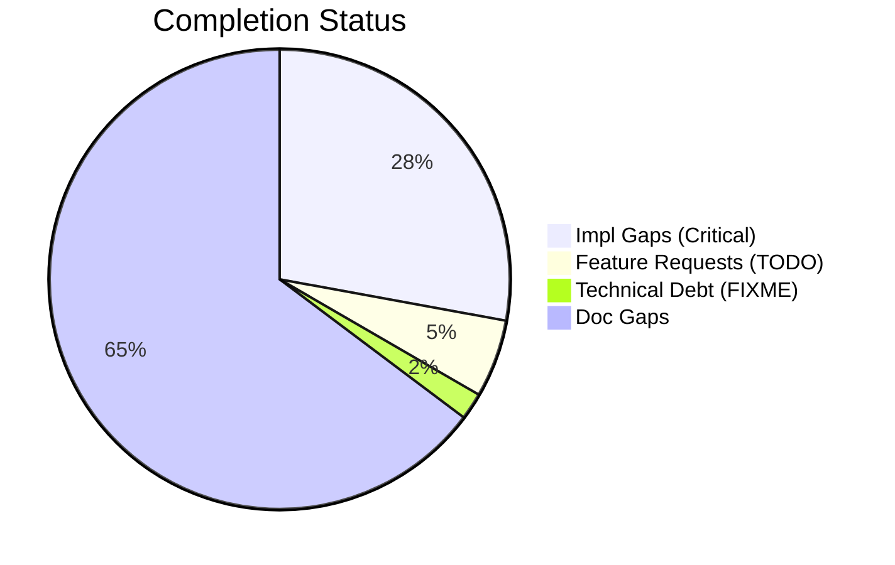
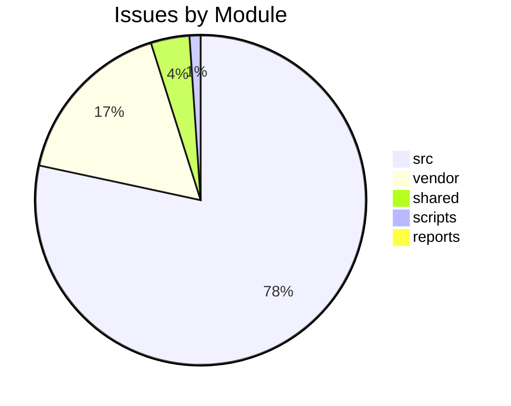

# Completist Report: 2026-02-12

## Executive Summary
- **Critical Gaps**: 295
- **Feature Gaps (TODO)**: 58
- **Technical Debt**: 20
- **Documentation Gaps**: 685

## Visualization
### Status Overview

### Top Impacted Modules

## Critical Incomplete (Top 50)
| File | Line | Type | Impact | Coverage | Complexity |
|---|---|---|---|---|---|
| `./vendor/ud-tools/src/shared/python/model_generation/library/repository.py` | 40 | Stub | 5 | 3 | 4 |
| `./vendor/ud-tools/src/shared/python/model_generation/library/repository.py` | 46 | Stub | 5 | 3 | 4 |
| `./vendor/ud-tools/src/shared/python/model_generation/library/repository.py` | 51 | Stub | 5 | 3 | 4 |
| `./vendor/ud-tools/src/shared/python/model_generation/library/repository.py` | 56 | Stub | 5 | 3 | 4 |
| `./vendor/ud-tools/src/shared/python/model_generation/builders/base_builder.py` | 183 | Stub | 5 | 3 | 4 |
| `./vendor/ud-tools/src/shared/python/model_generation/builders/base_builder.py` | 193 | Stub | 5 | 3 | 4 |
| `./vendor/ud-tools/src/shared/python/model_generation/plugins/__init__.py` | 21 | Stub | 5 | 3 | 4 |
| `./vendor/ud-tools/src/shared/python/model_generation/plugins/__init__.py` | 27 | Stub | 5 | 3 | 4 |
| `./vendor/ud-tools/src/shared/python/model_generation/plugins/__init__.py` | 32 | Stub | 5 | 3 | 4 |
| `./vendor/ud-tools/src/shared/python/model_generation/plugins/__init__.py` | 36 | Stub | 5 | 3 | 4 |
| `./vendor/ud-tools/src/shared/python/upstream_drift_tools/process_calculators/acid_gas_dewpoint_calculator.py` | 713 | Stub | 5 | 3 | 4 |
| `./vendor/ud-tools/src/shared/python/upstream_drift_tools/process_calculators/acid_gas_dewpoint_calculator.py` | 716 | Stub | 5 | 3 | 4 |
| `./vendor/ud-tools/src/shared/python/upstream_drift_tools/process_calculators/acid_gas_dewpoint_calculator.py` | 863 | Stub | 5 | 3 | 4 |
| `./vendor/ud-tools/src/shared/python/upstream_drift_tools/process_calculators/acid_gas_dewpoint_calculator.py` | 866 | Stub | 5 | 3 | 4 |
| `./vendor/ud-tools/src/shared/python/upstream_drift_tools/process_calculators/pressure_drop_calculator/__init__.py` | 221 | Stub | 5 | 3 | 4 |
| `./vendor/ud-tools/src/shared/python/upstream_drift_tools/process_calculators/psa_package/psa_gui.py` | 156 | Stub | 5 | 3 | 4 |
| `./vendor/ud-tools/src/shared/python/upstream_drift_tools/ui/mixins/calculator_state_mixin.py` | 428 | Stub | 5 | 3 | 4 |
| `./vendor/ud-tools/src/shared/python/humanoid_character_builder/generators/mesh_generator.py` | 68 | Stub | 5 | 3 | 4 |
| `./vendor/ud-tools/src/shared/python/humanoid_character_builder/generators/mesh_generator.py` | 74 | Stub | 5 | 3 | 4 |
| `./vendor/ud-tools/src/shared/python/humanoid_character_builder/generators/mesh_generator.py` | 79 | Stub | 5 | 3 | 4 |
| `./vendor/ud-tools/src/shared/python/humanoid_character_builder/generators/mesh_generator.py` | 99 | Stub | 5 | 3 | 4 |
| `./src/engines/common/simulation_control.py` | 188 | Stub | 5 | 2 | 4 |
| `./src/engines/common/simulation_control.py` | 194 | Stub | 5 | 2 | 4 |
| `./src/engines/common/simulation_control.py` | 206 | Stub | 5 | 2 | 4 |
| `./src/engines/common/simulation_control.py` | 240 | Stub | 5 | 2 | 4 |
| `./src/engines/common/simulation_control.py` | 252 | Stub | 5 | 2 | 4 |
| `./src/engines/common/physics.py` | 443 | Stub | 5 | 2 | 4 |
| `./src/engines/common/physics.py` | 447 | Stub | 5 | 2 | 4 |
| `./src/engines/common/physics.py` | 451 | Stub | 5 | 2 | 4 |
| `./src/engines/common/export.py` | 69 | Stub | 5 | 2 | 4 |
| `./src/engines/common/export.py` | 81 | Stub | 5 | 2 | 4 |
| `./src/engines/common/export.py` | 95 | Stub | 5 | 2 | 4 |
| `./src/engines/common/export.py` | 104 | Stub | 5 | 2 | 4 |
| `./src/engines/common/export.py` | 109 | Stub | 5 | 2 | 4 |
| `./src/engines/Simscape_Multibody_Models/3D_Golf_Model/matlab/src/apps/golf_gui/Simscape Multibody Data Plotters/Python Version/golf_gui_r0/golf_visualizer_implementation.py` | 854 | Stub | 5 | 2 | 4 |
| `./src/engines/Simscape_Multibody_Models/3D_Golf_Model/matlab/src/apps/golf_gui/Simscape Multibody Data Plotters/Python Version/golf_gui_r0/golf_visualizer_implementation.py` | 1306 | Stub | 5 | 2 | 4 |
| `./src/engines/Simscape_Multibody_Models/3D_Golf_Model/matlab/src/apps/golf_gui/Simscape Multibody Data Plotters/Python Version/integrated_golf_gui_r0/golf_gui_application.py` | 310 | Stub | 5 | 2 | 4 |
| `./src/engines/physics_engines/pendulum/python/pendulum_physics_engine.py` | 106 | Stub | 5 | 2 | 4 |
| `./src/engines/physics_engines/pinocchio/python/pinocchio_golf/gui.py` | 1878 | Stub | 5 | 2 | 4 |
| `./src/engines/physics_engines/drake/python/src/drake_gui_app.py` | 1937 | Stub | 5 | 2 | 4 |
| `./src/engines/physics_engines/mujoco/python/humanoid_launcher.py` | 1183 | Stub | 5 | 2 | 4 |
| `./src/engines/physics_engines/mujoco/python/mujoco_humanoid_golf/pinocchio_interface.py` | 154 | Stub | 5 | 2 | 4 |
| `./src/engines/physics_engines/mujoco/python/mujoco_humanoid_golf/examples_chaotic_pendulum.py` | 71 | Stub | 5 | 2 | 4 |
| `./src/engines/physics_engines/mujoco/python/mujoco_humanoid_golf/examples_chaotic_pendulum.py` | 75 | Stub | 5 | 2 | 4 |
| `./src/engines/physics_engines/mujoco/python/mujoco_humanoid_golf/urdf_io.py` | 514 | Stub | 5 | 2 | 4 |
| `./src/engines/physics_engines/mujoco/python/mujoco_humanoid_golf/gui/core/main_window.py` | 496 | Stub | 5 | 2 | 4 |
| `./src/api/auth/security.py` | 282 | Stub | 5 | 2 | 4 |
| `./src/shared/python/physics/flight_models.py` | 157 | Stub | 5 | 3 | 4 |
| `./src/shared/python/physics/flight_models.py` | 162 | Stub | 5 | 3 | 4 |
| `./src/shared/python/physics/flight_models.py` | 167 | Stub | 5 | 3 | 4 |

## Feature Gap Matrix
| Module | Feature Gap | Type |
|---|---|---|
| `./scripts/pragmatic_programmer_review.py` | if "TODO" in content: | TODO |
| `./scripts/pragmatic_programmer_review.py` | "title": f"High TODO count ({len(todos)})", | TODO |
| `./vendor/ud-tools/drafts/Jules-Code-Quality-Reviewer.yml` | 5. **Placeholders**: Identify placeholder code (TODO, FIXME, NotImplemented, pass statements) | TODO |
| `./vendor/ud-tools/scripts/generate_assessments.py` | - **Markers**: 445 `TODO` and 140 `FIXME` markers indicate significant unfinished work. | TODO |
| `./vendor/ud-tools/scripts/generate_assessments.py` | -   445 `TODO` markers. | TODO |
| `./vendor/ud-tools/scripts/generate_assessments.py` | -   Convert valid `TODO` items into GitHub Issues. | TODO |
| `./vendor/ud-tools/scripts/generate_assessments.py` | f.write("    - **Issue**: 445 `TODO` markers.\n") | TODO |
| `./vendor/ud-tools/scripts/pragmatic_programmer_review.py` | if "TODO" in content: | TODO |
| `./vendor/ud-tools/scripts/pragmatic_programmer_review.py` | "title": f"High TODO count ({len(todos)})", | TODO |
| `./vendor/ud-tools/.cursor/rules/.cursorrules.md` | - **NEVER USE PLACEHOLDERS** → No `TODO`, `FIXME`, `...`, `pass`, `NotImplementedError`, `<your-valu | TODO |
| `./vendor/ud-tools/.cursor/rules/.cursorrules.md` | - [X] Zero TODO/FIXME/pass in diff | TODO |
| `./vendor/ud-tools/.cursor/rules/.cursorrules.md` | # TODO: implement this properly | TODO |
| `./vendor/ud-tools/src/media_processing/video_processor/apps/web/lib/logger.ts` | * TODO: Add pino when ready for production. | TODO |
| `./vendor/ud-tools/src/media_processing/video_processor/apps/web/lib/golf/swingAnalyzer.ts` | swingType: SwingType.UNKNOWN, // TODO: Implement swing type detection | TODO |
| `./vendor/ud-tools/src/media_processing/video_processor/apps/web/lib/golf/swingAnalyzer.ts` | armHang: 'good', // TODO: Implement arm hang detection | TODO |
| `./vendor/ud-tools/src/media_processing/video_processor/apps/web/lib/sanitize.ts` | * TODO: Add DOMPurify when ready for production. | TODO |
| `./vendor/ud-tools/src/media_processing/video_processor/apps/web/lib/sanitize.ts` | // TODO: Use DOMPurify to allow safe HTML tags | TODO |
| `./vendor/ud-tools/src/media_processing/video_processor/apps/web/lib/sanitize.ts` | // TODO: Parse and validate RGB values | TODO |
| `./vendor/ud-tools/src/media_processing/video_processor/apps/web/app/page.tsx` | // TODO: Move fps to client-side config or use from video metadata | TODO |
| `./vendor/ud-tools/src/media_processing/video_processor/apps/web/app/page.tsx` | // TODO: Save to database when backend is ready | TODO |
| `./vendor/ud-tools/src/media_processing/video_processor/apps/web/app/page.tsx` | // TODO: Save pose data to state or database when ready | TODO |
| `./vendor/ud-tools/src/media_processing/video_processor/javascript/README.md` | - No placeholders (no TODO, FIXME, etc.) | TODO |
| `./vendor/ud-tools/src/media_processing/video_processor/matlab/models/pendulum_model.m` | % TODO: Implement pendulum model | TODO |
| `./vendor/ud-tools/src/tools/README.md` | - **Banned Patterns**: TODO, FIXME, placeholders, NotImplementedError | TODO |
| `./vendor/ud-tools/src/tools/matlab_utilities/README.md` | - TODO, FIXME, HACK, XXX placeholders | TODO |
| `./vendor/ud-tools/src/tools/matlab_quality_utils.py` | (r"\bTODO\b", "TODO placeholder found"), | TODO |
| `./vendor/ud-tools/src/tools/quality_utils.py` | "Angle bracket TODO placeholder", | TODO |
| `./shared/models/opensim/opensim-models/Tutorials/Building_a_Passive_Dynamic_Walker/DynamicWalkerBuild/DynamicWalkerBuildModelStudent.cpp` | // TODO: Add Code to Begin Model here | TODO |
| `./shared/models/opensim/opensim-models/Tutorials/Building_a_Passive_Dynamic_Walker/DynamicWalkerBuild/DynamicWalkerBuildModelStudent.cpp` | // TODO: Set the coordinate properties | TODO |
| `./shared/models/opensim/opensim-models/Tutorials/Building_a_Passive_Dynamic_Walker/skeleton.cpp` | // TODO: Add Code to Begin Model here | TODO |
| `./shared/models/opensim/opensim-models/Tutorials/Building_a_Passive_Dynamic_Walker/DynamicWalkerBuildModel.cpp` | // Section A.1 TODO: Create the Pelvis and set the coordinate properties | TODO |
| `./shared/models/opensim/opensim-models/Tutorials/Building_a_Passive_Dynamic_Walker/DynamicWalkerBuildModel.cpp` | // Section A.2 TODO: Create the LeftThigh, LeftShank, RightThigh and RightShank bodies | TODO |
| `./shared/models/opensim/opensim-models/Tutorials/Building_a_Passive_Dynamic_Walker/DynamicWalkerBuildModel.cpp` | // Section B.1 TODO: Add ContactSphere to the left hip, the knee, and the foot points | TODO |
| `./shared/models/opensim/opensim-models/Tutorials/Building_a_Passive_Dynamic_Walker/DynamicWalkerBuildModel.cpp` | // Section B.2 TODO: Add HuntCrossleyForces | TODO |
| `./shared/models/opensim/opensim-models/Tutorials/Building_a_Passive_Dynamic_Walker/DynamicWalkerBuildModel.cpp` | // Section B.2 TODO: Add HuntCrossleyForces betweeen the remaining ContactSpheres | TODO |
| `./shared/models/opensim/opensim-models/Tutorials/Building_a_Passive_Dynamic_Walker/DynamicWalkerBuildModel.cpp` | // Section C.1 TODO: Construct CoordinateLimitForces for the Hip and Knee | TODO |
| `./shared/models/opensim/opensim-models/CMakeLists.txt` | RENAME run_forward.xml) # TODO inconsistent filename; which should we use? | TODO |
| `./shared/models/opensim/opensim-models/CMakeLists.txt` | # TODO subject01_metabolics* files? | TODO |
| `./shared/models/opensim/opensim-models/CMakeLists.txt` | # TODO should we copy over the OutputReference folder? | TODO |
| `./shared/models/opensim/opensim-models/CMakeLists.txt` | PATTERN "addPrescribedMotion.py" EXCLUDE # TODO leave in or not? | TODO |
| `./src/engines/pendulum_models/tools/matlab_utilities/README.md` | - TODO, FIXME, HACK, XXX placeholders | TODO |
| `./src/engines/Simscape_Multibody_Models/3D_Golf_Model/matlab_utilities/README.md` | - TODO, FIXME, HACK, XXX placeholders | TODO |
| `./src/engines/physics_engines/pinocchio/tools/matlab_utilities/README.md` | - TODO, FIXME, HACK, XXX placeholders | TODO |
| `./src/engines/physics_engines/drake/tools/matlab_utilities/README.md` | - TODO, FIXME, HACK, XXX placeholders | TODO |
| `./src/shared/models/opensim/opensim-models/Tutorials/Building_a_Passive_Dynamic_Walker/DynamicWalkerBuild/DynamicWalkerBuildModelStudent.cpp` | // TODO: Add Code to Begin Model here | TODO |
| `./src/shared/models/opensim/opensim-models/Tutorials/Building_a_Passive_Dynamic_Walker/DynamicWalkerBuild/DynamicWalkerBuildModelStudent.cpp` | // TODO: Set the coordinate properties | TODO |
| `./src/shared/models/opensim/opensim-models/Tutorials/Building_a_Passive_Dynamic_Walker/skeleton.cpp` | // TODO: Add Code to Begin Model here | TODO |
| `./src/shared/models/opensim/opensim-models/Tutorials/Building_a_Passive_Dynamic_Walker/DynamicWalkerBuildModel.cpp` | // Section A.1 TODO: Create the Pelvis and set the coordinate | TODO |
| `./src/shared/models/opensim/opensim-models/Tutorials/Building_a_Passive_Dynamic_Walker/DynamicWalkerBuildModel.cpp` | // Section A.2 TODO: Create the LeftThigh, LeftShank, RightThigh and | TODO |
| `./src/shared/models/opensim/opensim-models/Tutorials/Building_a_Passive_Dynamic_Walker/DynamicWalkerBuildModel.cpp` | // Section B.1 TODO: Add ContactSphere to the left hip, the knee, | TODO |

## Technical Debt Register
| File | Line | Issue | Type |
|---|---|---|---|
| `./tests/unit/api/test_error_codes.py` | 36 | """Postcondition: All codes follow GMS-XXX-NNN format.""" | XXX |
| `./vendor/ud-tools/scripts/generate_assessments.py` | 213 | -   140 `FIXME` markers. | FIXME |
| `./vendor/ud-tools/scripts/generate_assessments.py` | 216 | -   Audit all `FIXME` items and resolve high-priority ones. | FIXME |
| `./vendor/ud-tools/src/tools/matlab_quality_utils.py` | 231 | (r"\bFIXME\b", "FIXME placeholder found"), | FIXME |
| `./vendor/ud-tools/src/tools/matlab_quality_utils.py` | 232 | (r"\bHACK\b", "HACK comment found"), | HACK |
| `./vendor/ud-tools/src/tools/matlab_quality_utils.py` | 233 | (r"\bXXX\b", "XXX comment found"), | XXX |
| `./vendor/ud-tools/src/tools/quality_utils.py` | 49 | "Angle bracket FIXME placeholder", | FIXME |
| `./shared/models/opensim/opensim-models/Tutorials/doc/styles/site.css` | 3404 | html body { /* HACK: Temporary fix for CONF-15412 */ | HACK |
| `./src/api/utils/error_codes.py` | 53 | # General Errors (GMS-GEN-XXX) | XXX |
| `./src/api/utils/error_codes.py` | 59 | # Engine Errors (GMS-ENG-XXX) | XXX |
| `./src/api/utils/error_codes.py` | 67 | # Simulation Errors (GMS-SIM-XXX) | XXX |
| `./src/api/utils/error_codes.py` | 76 | # Video Errors (GMS-VID-XXX) | XXX |
| `./src/api/utils/error_codes.py` | 83 | # Analysis Errors (GMS-ANL-XXX) | XXX |
| `./src/api/utils/error_codes.py` | 88 | # Auth Errors (GMS-AUT-XXX) | XXX |
| `./src/api/utils/error_codes.py` | 95 | # Validation Errors (GMS-VAL-XXX) | XXX |
| `./src/api/utils/error_codes.py` | 101 | # Resource Errors (GMS-RES-XXX) | XXX |
| `./src/api/utils/error_codes.py` | 106 | # System Errors (GMS-SYS-XXX) | XXX |
| `./src/tools/matlab_utilities/scripts/matlab_quality_check.py` | 77 | (r"\bHACK\b", "HACK comment found"), | HACK |
| `./src/tools/matlab_utilities/scripts/matlab_quality_check.py` | 78 | (r"\bXXX\b", "XXX comment found"), | XXX |
| `./src/shared/models/opensim/opensim-models/Tutorials/doc/styles/site.css` | 3404 | html body { /* HACK: Temporary fix for CONF-15412 */ | HACK |

## Recommended Implementation Order
Prioritized by Impact (High) and Complexity (Low).
| Priority | File | Issue | Metrics (I/C/C) |
|---|---|---|---|
| 1 | `./src/engines/pendulum_models/tools/matlab_utilities/README.md` | - TODO, FIXME, HACK, XXX placeholders | 5/2/3 |
| 2 | `./src/engines/Simscape_Multibody_Models/3D_Golf_Model/matlab_utilities/README.md` | - TODO, FIXME, HACK, XXX placeholders | 5/2/3 |
| 3 | `./src/engines/physics_engines/pinocchio/tools/matlab_utilities/README.md` | - TODO, FIXME, HACK, XXX placeholders | 5/2/3 |
| 4 | `./src/engines/physics_engines/drake/tools/matlab_utilities/README.md` | - TODO, FIXME, HACK, XXX placeholders | 5/2/3 |
| 5 | `./vendor/ud-tools/src/shared/python/model_generation/library/repository.py` | name | 5/3/4 |
| 6 | `./vendor/ud-tools/src/shared/python/model_generation/library/repository.py` | description | 5/3/4 |
| 7 | `./vendor/ud-tools/src/shared/python/model_generation/library/repository.py` | list_models | 5/3/4 |
| 8 | `./vendor/ud-tools/src/shared/python/model_generation/library/repository.py` | download_model | 5/3/4 |
| 9 | `./vendor/ud-tools/src/shared/python/model_generation/builders/base_builder.py` | build | 5/3/4 |
| 10 | `./vendor/ud-tools/src/shared/python/model_generation/builders/base_builder.py` | clear | 5/3/4 |
| 11 | `./vendor/ud-tools/src/shared/python/model_generation/plugins/__init__.py` | name | 5/3/4 |
| 12 | `./vendor/ud-tools/src/shared/python/model_generation/plugins/__init__.py` | version | 5/3/4 |
| 13 | `./vendor/ud-tools/src/shared/python/model_generation/plugins/__init__.py` | initialize | 5/3/4 |
| 14 | `./vendor/ud-tools/src/shared/python/model_generation/plugins/__init__.py` | shutdown | 5/3/4 |
| 15 | `./vendor/ud-tools/src/shared/python/upstream_drift_tools/process_calculators/acid_gas_dewpoint_calculator.py` | setup_connections | 5/3/4 |
| 16 | `./vendor/ud-tools/src/shared/python/upstream_drift_tools/process_calculators/acid_gas_dewpoint_calculator.py` | set_default_values | 5/3/4 |
| 17 | `./vendor/ud-tools/src/shared/python/upstream_drift_tools/process_calculators/acid_gas_dewpoint_calculator.py` | set_default_values | 5/3/4 |
| 18 | `./vendor/ud-tools/src/shared/python/upstream_drift_tools/process_calculators/acid_gas_dewpoint_calculator.py` | setup_connections | 5/3/4 |
| 19 | `./vendor/ud-tools/src/shared/python/upstream_drift_tools/process_calculators/pressure_drop_calculator/__init__.py` | __init__ | 5/3/4 |
| 20 | `./vendor/ud-tools/src/shared/python/upstream_drift_tools/process_calculators/psa_package/psa_gui.py` | _on_input_change | 5/3/4 |

## Issues Created
- Created `docs/assessments/issues/Issue_049_Incomplete_Stub_in_repository_py_40.md`
- Created `docs/assessments/issues/Issue_050_Incomplete_Stub_in_repository_py_46.md`
- Created `docs/assessments/issues/Issue_051_Incomplete_Stub_in_repository_py_51.md`
- Created `docs/assessments/issues/Issue_052_Incomplete_Stub_in_repository_py_56.md`
- Created `docs/assessments/issues/Issue_053_Incomplete_Stub_in_base_builder_py_183.md`
- Created `docs/assessments/issues/Issue_054_Incomplete_Stub_in_base_builder_py_193.md`
- Created `docs/assessments/issues/Issue_055_Incomplete_Stub_in___init___py_21.md`
- Created `docs/assessments/issues/Issue_056_Incomplete_Stub_in___init___py_27.md`
- Created `docs/assessments/issues/Issue_057_Incomplete_Stub_in___init___py_32.md`
- Created `docs/assessments/issues/Issue_058_Incomplete_Stub_in___init___py_36.md`
- Created `docs/assessments/issues/Issue_069_Incomplete_Stub_in_acid_gas_dewpoint_calculator_py_713.md`
- Created `docs/assessments/issues/Issue_070_Incomplete_Stub_in_acid_gas_dewpoint_calculator_py_716.md`
- Created `docs/assessments/issues/Issue_071_Incomplete_Stub_in_acid_gas_dewpoint_calculator_py_863.md`
- Created `docs/assessments/issues/Issue_072_Incomplete_Stub_in_acid_gas_dewpoint_calculator_py_866.md`
- Created `docs/assessments/issues/Issue_073_Incomplete_Stub_in___init___py_221.md`
- Created `docs/assessments/issues/Issue_074_Incomplete_Stub_in_psa_gui_py_156.md`
- Created `docs/assessments/issues/Issue_075_Incomplete_Stub_in_calculator_state_mixin_py_428.md`
- Created `docs/assessments/issues/Issue_076_Incomplete_Stub_in_mesh_generator_py_68.md`
- Created `docs/assessments/issues/Issue_077_Incomplete_Stub_in_mesh_generator_py_74.md`
- Created `docs/assessments/issues/Issue_078_Incomplete_Stub_in_mesh_generator_py_79.md`
- Created `docs/assessments/issues/Issue_079_Incomplete_Stub_in_mesh_generator_py_99.md`
- Created `docs/assessments/issues/Issue_2048_Incomplete_Stub_in_simulation_control_py_188.md`
- Created `docs/assessments/issues/Issue_2049_Incomplete_Stub_in_simulation_control_py_194.md`
- Created `docs/assessments/issues/Issue_2050_Incomplete_Stub_in_simulation_control_py_206.md`
- Created `docs/assessments/issues/Issue_2051_Incomplete_Stub_in_simulation_control_py_240.md`
- Created `docs/assessments/issues/Issue_2052_Incomplete_Stub_in_simulation_control_py_252.md`
- Created `docs/assessments/issues/Issue_044_Incomplete_Stub_in_physics_py_443.md`
- Created `docs/assessments/issues/Issue_045_Incomplete_Stub_in_physics_py_447.md`
- Created `docs/assessments/issues/Issue_048_Incomplete_Stub_in_physics_py_451.md`
- Created `docs/assessments/issues/Issue_2056_Incomplete_Stub_in_export_py_69.md`
- Created `docs/assessments/issues/Issue_2057_Incomplete_Stub_in_export_py_81.md`
- Created `docs/assessments/issues/Issue_2058_Incomplete_Stub_in_export_py_95.md`
- Created `docs/assessments/issues/Issue_2059_Incomplete_Stub_in_export_py_104.md`
- Created `docs/assessments/issues/Issue_2060_Incomplete_Stub_in_export_py_109.md`
- Created `docs/assessments/issues/Issue_2061_Incomplete_Stub_in_golf_visualizer_implementation_py_854.md`
- Created `docs/assessments/issues/Issue_2062_Incomplete_Stub_in_golf_visualizer_implementation_py_1306.md`
- Created `docs/assessments/issues/Issue_2063_Incomplete_Stub_in_golf_gui_application_py_310.md`
- Created `docs/assessments/issues/Issue_2064_Incomplete_Stub_in_pendulum_physics_engine_py_106.md`
- Created `docs/assessments/issues/Issue_2065_Incomplete_Stub_in_gui_py_1878.md`
- Created `docs/assessments/issues/Issue_2066_Incomplete_Stub_in_drake_gui_app_py_1937.md`
- Created `docs/assessments/issues/Issue_2067_Incomplete_Stub_in_humanoid_launcher_py_1183.md`
- Created `docs/assessments/issues/Issue_093_Incomplete_Stub_in_pinocchio_interface_py_154.md`
- Created `docs/assessments/issues/Issue_094_Incomplete_Stub_in_examples_chaotic_pendulum_py_71.md`
- Created `docs/assessments/issues/Issue_095_Incomplete_Stub_in_examples_chaotic_pendulum_py_75.md`
- Created `docs/assessments/issues/Issue_096_Incomplete_Stub_in_urdf_io_py_514.md`
- Created `docs/assessments/issues/Issue_2072_Incomplete_Stub_in_main_window_py_496.md`
- Created `docs/assessments/issues/Issue_097_Incomplete_Stub_in_security_py_282.md`
- Created `docs/assessments/issues/Issue_098_Incomplete_Stub_in_flight_models_py_157.md`
- Created `docs/assessments/issues/Issue_099_Incomplete_Stub_in_flight_models_py_162.md`
- Created `docs/assessments/issues/Issue_100_Incomplete_Stub_in_flight_models_py_167.md`