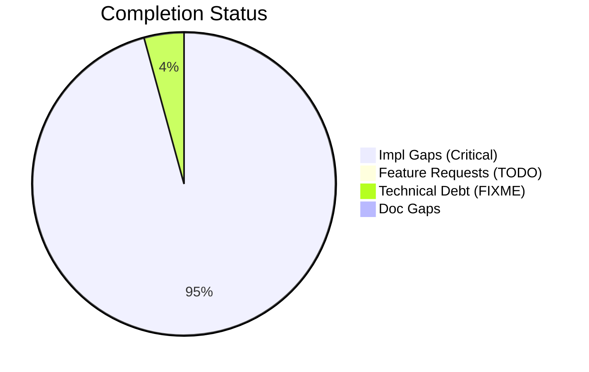
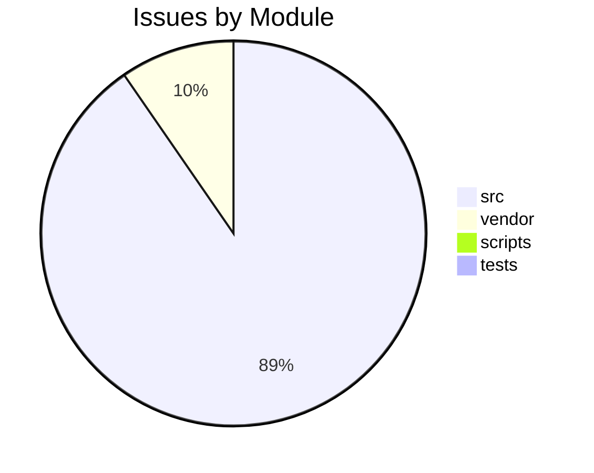

# Completist Report: 2026-02-12

## Executive Summary
- **Critical Gaps**: 270
- **Feature Gaps (TODO)**: 2
- **Technical Debt**: 12
- **Documentation Gaps**: 0

## Visualization
### Status Overview

### Top Impacted Modules

## Critical Incomplete (Top 50)
| File | Line | Type | Impact | Coverage | Complexity |
|---|---|---|---|---|---|
| `./vendor/ud-tools/src/shared/python/model_generation/library/repository.py` | 40 | Stub | 5 | 3 | 4 |
| `./vendor/ud-tools/src/shared/python/model_generation/library/repository.py` | 46 | Stub | 5 | 3 | 4 |
| `./vendor/ud-tools/src/shared/python/model_generation/library/repository.py` | 51 | Stub | 5 | 3 | 4 |
| `./vendor/ud-tools/src/shared/python/model_generation/library/repository.py` | 56 | Stub | 5 | 3 | 4 |
| `./vendor/ud-tools/src/shared/python/model_generation/builders/base_builder.py` | 183 | Stub | 5 | 3 | 4 |
| `./vendor/ud-tools/src/shared/python/model_generation/builders/base_builder.py` | 193 | Stub | 5 | 3 | 4 |
| `./vendor/ud-tools/src/shared/python/model_generation/plugins/__init__.py` | 21 | Stub | 5 | 3 | 4 |
| `./vendor/ud-tools/src/shared/python/model_generation/plugins/__init__.py` | 27 | Stub | 5 | 3 | 4 |
| `./vendor/ud-tools/src/shared/python/model_generation/plugins/__init__.py` | 32 | Stub | 5 | 3 | 4 |
| `./vendor/ud-tools/src/shared/python/model_generation/plugins/__init__.py` | 36 | Stub | 5 | 3 | 4 |
| `./vendor/ud-tools/src/shared/python/upstream_drift_tools/process_calculators/acid_gas_dewpoint_calculator.py` | 713 | Stub | 5 | 3 | 4 |
| `./vendor/ud-tools/src/shared/python/upstream_drift_tools/process_calculators/acid_gas_dewpoint_calculator.py` | 716 | Stub | 5 | 3 | 4 |
| `./vendor/ud-tools/src/shared/python/upstream_drift_tools/process_calculators/acid_gas_dewpoint_calculator.py` | 863 | Stub | 5 | 3 | 4 |
| `./vendor/ud-tools/src/shared/python/upstream_drift_tools/process_calculators/acid_gas_dewpoint_calculator.py` | 866 | Stub | 5 | 3 | 4 |
| `./vendor/ud-tools/src/shared/python/upstream_drift_tools/process_calculators/pressure_drop_calculator/__init__.py` | 221 | Stub | 5 | 3 | 4 |
| `./vendor/ud-tools/src/shared/python/upstream_drift_tools/process_calculators/psa_package/psa_gui.py` | 156 | Stub | 5 | 3 | 4 |
| `./vendor/ud-tools/src/shared/python/upstream_drift_tools/ui/mixins/calculator_state_mixin.py` | 428 | Stub | 5 | 3 | 4 |
| `./vendor/ud-tools/src/shared/python/humanoid_character_builder/generators/mesh_generator.py` | 68 | Stub | 5 | 3 | 4 |
| `./vendor/ud-tools/src/shared/python/humanoid_character_builder/generators/mesh_generator.py` | 74 | Stub | 5 | 3 | 4 |
| `./vendor/ud-tools/src/shared/python/humanoid_character_builder/generators/mesh_generator.py` | 79 | Stub | 5 | 3 | 4 |
| `./vendor/ud-tools/src/shared/python/humanoid_character_builder/generators/mesh_generator.py` | 99 | Stub | 5 | 3 | 4 |
| `./src/engines/common/physics.py` | 443 | Stub | 5 | 2 | 4 |
| `./src/engines/common/physics.py` | 447 | Stub | 5 | 2 | 4 |
| `./src/engines/common/physics.py` | 451 | Stub | 5 | 2 | 4 |
| `./src/engines/Simscape_Multibody_Models/3D_Golf_Model/matlab/src/apps/golf_gui/Simscape Multibody Data Plotters/Python Version/golf_gui_r0/golf_visualizer_implementation.py` | 138 | Stub | 5 | 2 | 4 |
| `./src/engines/Simscape_Multibody_Models/3D_Golf_Model/matlab/src/apps/golf_gui/Simscape Multibody Data Plotters/Python Version/golf_gui_r0/golf_visualizer_implementation.py` | 358 | Stub | 5 | 2 | 4 |
| `./src/engines/Simscape_Multibody_Models/3D_Golf_Model/matlab/src/apps/golf_gui/Simscape Multibody Data Plotters/Python Version/golf_gui_r0/golf_visualizer_implementation.py` | 415 | Stub | 5 | 2 | 4 |
| `./src/engines/Simscape_Multibody_Models/3D_Golf_Model/matlab/src/apps/golf_gui/Simscape Multibody Data Plotters/Python Version/golf_gui_r0/golf_visualizer_implementation.py` | 419 | Stub | 5 | 2 | 4 |
| `./src/engines/Simscape_Multibody_Models/3D_Golf_Model/matlab/src/apps/golf_gui/Simscape Multibody Data Plotters/Python Version/golf_gui_r0/golf_visualizer_implementation.py` | 424 | Stub | 5 | 2 | 4 |
| `./src/engines/Simscape_Multibody_Models/3D_Golf_Model/matlab/src/apps/golf_gui/Simscape Multibody Data Plotters/Python Version/golf_gui_r0/golf_visualizer_implementation.py` | 428 | Stub | 5 | 2 | 4 |
| `./src/engines/Simscape_Multibody_Models/3D_Golf_Model/matlab/src/apps/golf_gui/Simscape Multibody Data Plotters/Python Version/integrated_golf_gui_r0/golf_gui_application.py` | 279 | Stub | 5 | 2 | 4 |
| `./src/engines/physics_engines/putting_green/python/simulator.py` | 367 | Stub | 5 | 2 | 4 |
| `./src/engines/physics_engines/pendulum/python/pendulum_physics_engine.py` | 100 | Stub | 5 | 2 | 4 |
| `./src/engines/physics_engines/mujoco/python/humanoid_launcher.py` | 828 | Stub | 5 | 2 | 4 |
| `./src/engines/physics_engines/mujoco/python/mujoco_humanoid_golf/pinocchio_interface.py` | 154 | Stub | 5 | 2 | 4 |
| `./src/engines/physics_engines/mujoco/python/mujoco_humanoid_golf/examples_chaotic_pendulum.py` | 71 | Stub | 5 | 2 | 4 |
| `./src/engines/physics_engines/mujoco/python/mujoco_humanoid_golf/examples_chaotic_pendulum.py` | 75 | Stub | 5 | 2 | 4 |
| `./src/engines/physics_engines/mujoco/python/mujoco_humanoid_golf/urdf_io.py` | 514 | Stub | 5 | 2 | 4 |
| `./src/api/auth/security.py` | 282 | Stub | 5 | 2 | 4 |
| `./src/shared/python/flight_models.py` | 157 | Stub | 5 | 3 | 4 |
| `./src/shared/python/flight_models.py` | 162 | Stub | 5 | 3 | 4 |
| `./src/shared/python/flight_models.py` | 167 | Stub | 5 | 3 | 4 |
| `./src/shared/python/flight_models.py` | 171 | Stub | 5 | 3 | 4 |
| `./src/shared/python/topography.py` | 92 | Stub | 5 | 3 | 4 |
| `./src/shared/python/topography.py` | 103 | Stub | 5 | 3 | 4 |
| `./src/shared/python/topography.py` | 115 | Stub | 5 | 3 | 4 |
| `./src/shared/python/impact_model.py` | 133 | Stub | 5 | 3 | 4 |
| `./src/shared/python/base_physics_engine.py` | 242 | Stub | 5 | 3 | 4 |
| `./src/shared/python/base_physics_engine.py` | 250 | Stub | 5 | 3 | 4 |
| `./src/shared/python/terrain_engine.py` | 42 | Stub | 5 | 3 | 4 |

## Feature Gap Matrix
| Module | Feature Gap | Type |
|---|---|---|
| `./scripts/pragmatic_programmer_review.py` | if "TODO" in content: | TODO |
| `./scripts/pragmatic_programmer_review.py` | "title": f"High TODO count ({len(todos)})", | TODO |

## Technical Debt Register
| File | Line | Issue | Type |
|---|---|---|---|
| `./tests/unit/api/test_error_codes.py` | 36 | """Postcondition: All codes follow GMS-XXX-NNN format.""" | XXX |
| `./src/api/utils/error_codes.py` | 53 | # General Errors (GMS-GEN-XXX) | XXX |
| `./src/api/utils/error_codes.py` | 59 | # Engine Errors (GMS-ENG-XXX) | XXX |
| `./src/api/utils/error_codes.py` | 67 | # Simulation Errors (GMS-SIM-XXX) | XXX |
| `./src/api/utils/error_codes.py` | 76 | # Video Errors (GMS-VID-XXX) | XXX |
| `./src/api/utils/error_codes.py` | 83 | # Analysis Errors (GMS-ANL-XXX) | XXX |
| `./src/api/utils/error_codes.py` | 88 | # Auth Errors (GMS-AUT-XXX) | XXX |
| `./src/api/utils/error_codes.py` | 95 | # Validation Errors (GMS-VAL-XXX) | XXX |
| `./src/api/utils/error_codes.py` | 101 | # Resource Errors (GMS-RES-XXX) | XXX |
| `./src/api/utils/error_codes.py` | 106 | # System Errors (GMS-SYS-XXX) | XXX |
| `./src/tools/matlab_utilities/scripts/matlab_quality_check.py` | 77 | (r"\bHACK\b", "HACK comment found"), | HACK |
| `./src/tools/matlab_utilities/scripts/matlab_quality_check.py` | 78 | (r"\bXXX\b", "XXX comment found"), | XXX |

## Recommended Implementation Order
Prioritized by Impact (High) and Complexity (Low).
| Priority | File | Issue | Metrics (I/C/C) |
|---|---|---|---|
| 1 | `./vendor/ud-tools/src/shared/python/model_generation/library/repository.py` | name | 5/3/4 |
| 2 | `./vendor/ud-tools/src/shared/python/model_generation/library/repository.py` | description | 5/3/4 |
| 3 | `./vendor/ud-tools/src/shared/python/model_generation/library/repository.py` | list_models | 5/3/4 |
| 4 | `./vendor/ud-tools/src/shared/python/model_generation/library/repository.py` | download_model | 5/3/4 |
| 5 | `./vendor/ud-tools/src/shared/python/model_generation/builders/base_builder.py` | build | 5/3/4 |
| 6 | `./vendor/ud-tools/src/shared/python/model_generation/builders/base_builder.py` | clear | 5/3/4 |
| 7 | `./vendor/ud-tools/src/shared/python/model_generation/plugins/__init__.py` | name | 5/3/4 |
| 8 | `./vendor/ud-tools/src/shared/python/model_generation/plugins/__init__.py` | version | 5/3/4 |
| 9 | `./vendor/ud-tools/src/shared/python/model_generation/plugins/__init__.py` | initialize | 5/3/4 |
| 10 | `./vendor/ud-tools/src/shared/python/model_generation/plugins/__init__.py` | shutdown | 5/3/4 |
| 11 | `./vendor/ud-tools/src/shared/python/upstream_drift_tools/process_calculators/acid_gas_dewpoint_calculator.py` | setup_connections | 5/3/4 |
| 12 | `./vendor/ud-tools/src/shared/python/upstream_drift_tools/process_calculators/acid_gas_dewpoint_calculator.py` | set_default_values | 5/3/4 |
| 13 | `./vendor/ud-tools/src/shared/python/upstream_drift_tools/process_calculators/acid_gas_dewpoint_calculator.py` | set_default_values | 5/3/4 |
| 14 | `./vendor/ud-tools/src/shared/python/upstream_drift_tools/process_calculators/acid_gas_dewpoint_calculator.py` | setup_connections | 5/3/4 |
| 15 | `./vendor/ud-tools/src/shared/python/upstream_drift_tools/process_calculators/pressure_drop_calculator/__init__.py` | __init__ | 5/3/4 |
| 16 | `./vendor/ud-tools/src/shared/python/upstream_drift_tools/process_calculators/psa_package/psa_gui.py` | _on_input_change | 5/3/4 |
| 17 | `./vendor/ud-tools/src/shared/python/upstream_drift_tools/ui/mixins/calculator_state_mixin.py` | set_calculator_specific_state | 5/3/4 |
| 18 | `./vendor/ud-tools/src/shared/python/humanoid_character_builder/generators/mesh_generator.py` | backend_name | 5/3/4 |
| 19 | `./vendor/ud-tools/src/shared/python/humanoid_character_builder/generators/mesh_generator.py` | is_available | 5/3/4 |
| 20 | `./vendor/ud-tools/src/shared/python/humanoid_character_builder/generators/mesh_generator.py` | generate | 5/3/4 |

## Issues Created
- Created `docs/assessments/issues/Issue_049_Incomplete_Stub_in_repository_py_40.md`
- Created `docs/assessments/issues/Issue_050_Incomplete_Stub_in_repository_py_46.md`
- Created `docs/assessments/issues/Issue_051_Incomplete_Stub_in_repository_py_51.md`
- Created `docs/assessments/issues/Issue_052_Incomplete_Stub_in_repository_py_56.md`
- Created `docs/assessments/issues/Issue_053_Incomplete_Stub_in_base_builder_py_183.md`
- Created `docs/assessments/issues/Issue_054_Incomplete_Stub_in_base_builder_py_193.md`
- Created `docs/assessments/issues/Issue_055_Incomplete_Stub_in___init___py_21.md`
- Created `docs/assessments/issues/Issue_056_Incomplete_Stub_in___init___py_27.md`
- Created `docs/assessments/issues/Issue_057_Incomplete_Stub_in___init___py_32.md`
- Created `docs/assessments/issues/Issue_058_Incomplete_Stub_in___init___py_36.md`
- Created `docs/assessments/issues/Issue_069_Incomplete_Stub_in_acid_gas_dewpoint_calculator_py_713.md`
- Created `docs/assessments/issues/Issue_070_Incomplete_Stub_in_acid_gas_dewpoint_calculator_py_716.md`
- Created `docs/assessments/issues/Issue_071_Incomplete_Stub_in_acid_gas_dewpoint_calculator_py_863.md`
- Created `docs/assessments/issues/Issue_072_Incomplete_Stub_in_acid_gas_dewpoint_calculator_py_866.md`
- Created `docs/assessments/issues/Issue_073_Incomplete_Stub_in___init___py_221.md`
- Created `docs/assessments/issues/Issue_074_Incomplete_Stub_in_psa_gui_py_156.md`
- Created `docs/assessments/issues/Issue_075_Incomplete_Stub_in_calculator_state_mixin_py_428.md`
- Created `docs/assessments/issues/Issue_076_Incomplete_Stub_in_mesh_generator_py_68.md`
- Created `docs/assessments/issues/Issue_077_Incomplete_Stub_in_mesh_generator_py_74.md`
- Created `docs/assessments/issues/Issue_078_Incomplete_Stub_in_mesh_generator_py_79.md`
- Created `docs/assessments/issues/Issue_079_Incomplete_Stub_in_mesh_generator_py_99.md`
- Created `docs/assessments/issues/Issue_044_Incomplete_Stub_in_physics_py_443.md`
- Created `docs/assessments/issues/Issue_045_Incomplete_Stub_in_physics_py_447.md`
- Created `docs/assessments/issues/Issue_048_Incomplete_Stub_in_physics_py_451.md`
- Created `docs/assessments/issues/Issue_022_Incomplete_Stub_in_golf_visualizer_implementation_py_138.md`
- Created `docs/assessments/issues/Issue_032_Incomplete_Stub_in_golf_visualizer_implementation_py_358.md`
- Created `docs/assessments/issues/Issue_033_Incomplete_Stub_in_golf_visualizer_implementation_py_415.md`
- Created `docs/assessments/issues/Issue_034_Incomplete_Stub_in_golf_visualizer_implementation_py_419.md`
- Created `docs/assessments/issues/Issue_035_Incomplete_Stub_in_golf_visualizer_implementation_py_424.md`
- Created `docs/assessments/issues/Issue_026_Incomplete_Stub_in_golf_visualizer_implementation_py_428.md`
- Created `docs/assessments/issues/Issue_021_Incomplete_Stub_in_golf_gui_application_py_279.md`
- Created `docs/assessments/issues/Issue_090_Incomplete_Stub_in_simulator_py_367.md`
- Created `docs/assessments/issues/Issue_091_Incomplete_Stub_in_pendulum_physics_engine_py_100.md`
- Created `docs/assessments/issues/Issue_092_Incomplete_Stub_in_humanoid_launcher_py_828.md`
- Created `docs/assessments/issues/Issue_093_Incomplete_Stub_in_pinocchio_interface_py_154.md`
- Created `docs/assessments/issues/Issue_094_Incomplete_Stub_in_examples_chaotic_pendulum_py_71.md`
- Created `docs/assessments/issues/Issue_095_Incomplete_Stub_in_examples_chaotic_pendulum_py_75.md`
- Created `docs/assessments/issues/Issue_096_Incomplete_Stub_in_urdf_io_py_514.md`
- Created `docs/assessments/issues/Issue_097_Incomplete_Stub_in_security_py_282.md`
- Created `docs/assessments/issues/Issue_098_Incomplete_Stub_in_flight_models_py_157.md`
- Created `docs/assessments/issues/Issue_099_Incomplete_Stub_in_flight_models_py_162.md`
- Created `docs/assessments/issues/Issue_100_Incomplete_Stub_in_flight_models_py_167.md`
- Created `docs/assessments/issues/Issue_101_Incomplete_Stub_in_flight_models_py_171.md`
- Created `docs/assessments/issues/Issue_102_Incomplete_Stub_in_topography_py_92.md`
- Created `docs/assessments/issues/Issue_103_Incomplete_Stub_in_topography_py_103.md`
- Created `docs/assessments/issues/Issue_104_Incomplete_Stub_in_topography_py_115.md`
- Created `docs/assessments/issues/Issue_105_Incomplete_Stub_in_impact_model_py_133.md`
- Created `docs/assessments/issues/Issue_106_Incomplete_Stub_in_base_physics_engine_py_242.md`
- Created `docs/assessments/issues/Issue_107_Incomplete_Stub_in_base_physics_engine_py_250.md`
- Created `docs/assessments/issues/Issue_108_Incomplete_Stub_in_terrain_engine_py_42.md`