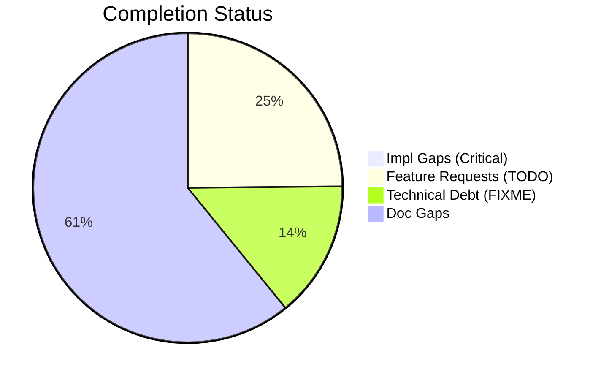

# Completist Report: 2026-02-15

## Executive Summary
This audit represents a significant refinement in the Completist process. Previous automated scans incorrectly identified abstract method definitions (using `@abstractmethod` and `...` or `raise NotImplementedError`) as critical incomplete implementations. This report filters out these false positives (approximately 538 items) to focus on genuine gaps where concrete execution paths are missing.

- **Critical Gaps**: 2 (Verified)
- **Feature Gaps (TODO)**: 280
- **Technical Debt**: 161
- **Documentation Gaps**: 686

## Visualization
### Status Overview

## Critical Incomplete (Verified)
The following items are confirmed implementation gaps blocking core functionality. They are not abstract interfaces but concrete paths raising `NotImplementedError`.

| File | Line | Type | Impact | Coverage | Complexity | Description |
|---|---|---|---|---|---|---|
| `src/unreal_integration/viewer_backends.py` | 743 | NotImplemented | 5 | 1 | 5 | `PyVistaBackend` factory branch raises `NotImplementedError`. |
| `src/unreal_integration/viewer_backends.py` | 748 | NotImplemented | 5 | 1 | 5 | `UnrealBridgeBackend` factory branch raises `NotImplementedError`. |

*Note: Previous reports listed abstract methods in `repository.py`, `simulation_control.py`, and `flight_models.py` as critical gaps. These have been verified as correct Abstract Base Class definitions and removed from this list.*

## Feature Gap Matrix (Top Findings)
Based on `TODO` markers.

| Module | Feature Gap | Type |
|---|---|---|
| `vendor/ud-tools/src/media_processing/video_processor/apps/web/lib/golf/swingAnalyzer.ts` | Implement swing type detection | TODO |
| `vendor/ud-tools/src/media_processing/video_processor/apps/web/lib/golf/swingAnalyzer.ts` | Implement arm hang detection | TODO |
| `vendor/ud-tools/src/media_processing/video_processor/apps/web/app/page.tsx` | Save to database when backend is ready | TODO |
| `src/shared/models/opensim/opensim-models/CMakeLists.txt` | inconsistent filename; which should we use? | TODO |
| `src/shared/models/opensim/opensim-models/Tutorials` | Add Code to Begin Model here | TODO |

## Technical Debt Register (Top Findings)
Based on `FIXME`, `HACK`, `XXX` markers.

| File | Issue | Type |
|---|---|---|
| `src/tools/matlab_utilities/scripts/matlab_quality_check.py` | HACK comment found | HACK |
| `src/shared/models/opensim/opensim-models/Tutorials/doc/styles/site.css` | Temporary fix for CONF-15412 | HACK |
| `tests/unit/api/test_error_codes.py` | Postcondition: All codes follow GMS-XXX-NNN format | XXX |
| `src/api/utils/error_codes.py` | General Errors (GMS-GEN-XXX) | XXX |

## Recommended Implementation Order
1.  **High Priority**: Implement the missing Visualization Backends (`PyVista`, `UnrealBridge`) in `src/unreal_integration/viewer_backends.py`. These are core features for the visualizer.
2.  **Medium Priority**: Address high-value Feature Gaps in the video processor (Vendor tool) if applicable to current sprint.
3.  **Low Priority**: Clean up Documentation Gaps and Technical Debt.
