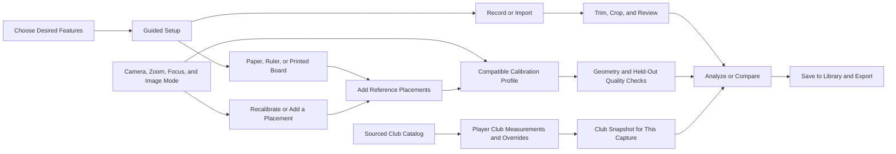

# Guided Capture Setup Execution Plan

These epics extend the active professional Capture Rig goal. Completion requires
their delivered workflows as well as the outstanding fleet communication rollout.

## Execution Map

This is an execution-plan illustration. The shipped interactive route will use
the existing canonical capability registry and generated atlas; it must not add
a second hand-maintained workflow graph. Editing-only routes skip 3-D calibration.

## Epics and Acceptance

| Epic                                                                                       | Execution Issues           | Required Result                                                                                                                                                   |
| ------------------------------------------------------------------------------------------ | -------------------------- | ----------------------------------------------------------------------------------------------------------------------------------------------------------------- |
| [Everyday Calibration #9897](https://github.com/D-sorganization/UpstreamDrift/issues/9897) | #9898, #9899, #9900, #9901 | Common references, repeat placements, compatible zoom profiles, qualified multi-camera geometry, persistent recalibration controls and real consumer integration. |
| [Player Clubs #9902](https://github.com/D-sorganization/UpstreamDrift/issues/9902)         | #9903, #9904, #9905        | Maintained public-source catalog, explicit unknowns/provenance, player bag editor, immutable capture snapshots and model adapters.                                |
| [Player Wizard #9906](https://github.com/D-sorganization/UpstreamDrift/issues/9906)        | #9907, #9908, #9909        | Goal-driven, resumable routes backed by the capability registry; actual accessible UI and qualified example journeys.                                             |

Each issue contains detailed implementation and test acceptance. Start with
#9898 profile selection and reference-session persistence; source geometry must
respect ADR-0041 and be connected through the established Tools boundary.

## Calibration Boundaries

US Letter is 0.2159 by 0.2794 m; A4 is 0.210 by 0.297 m; a yardstick is 0.9144 m.
Offer measured custom sizes, a meter stick, and a printable calibration board.
Ordered point identities, target placement identity and shared camera observations
matter as much as the nominal dimensions. Do not equate a moving reference in one
view with the same physical placement in another.

Plain paper on the ground can constrain a plane and scale. A line segment supplies
known length, but neither alone proves fully observable 3-D camera geometry.
Full intrinsic calibration needs adequate points and varied views; repeated nearly
identical images are not independent evidence. Existing #9621, #9622, #9623, #9630
and #9554 remain linked dependencies, not automatically completed work.

Optical zoom changes focal length. Profiles must distinguish camera identity,
lens, zoom, focus, resolution and sensor/crop mode. Unreported manual settings
need explicit player confirmation. A changed setting invalidates incompatible
results or selects another independently qualified profile. Reprojection quality
must include held-out observations and adequate geometry rather than relying only
on fit residuals. See [OpenCV Calibration](https://docs.opencv.org/4.13.0/dc/dbb/tutorial_py_calibration.html)
and [Calibration Views](https://docs.opencv.org/4.12.0/d4/d94/tutorial_camera_calibration.html).

## Club Data Boundaries

Extend `src/shared/python/club_data`, preserving compatibility while preventing
legacy fallback values from becoming measured facts. Missing length, mass, MOI,
loft or lie remains unknown. Preserve manufacturer/build identity, user overrides,
source URL, original units, retrieval date and redistribution status per value.
Distinguish head, shaft, grip and assembled mass, MOI axes and reference points.
Swing weight is neither mass nor MOI; a multi-axis marketing total is not an
inertia tensor. Public access does not establish an open-data license.

The player may know only a club number and measured length. That must be useful
without inventing other properties or certifying camera geometry. A per-capture
snapshot prevents later catalog updates from rewriting old analysis.

## Reuse and Compatibility

Use `src/tools/capture_rig/workflow.py`, existing editing/library/comparison dialogs,
`src/shared/python/config/setup_wizard.py`, `src/config/capability_connections.json`
and the capability registry. Workflow prerequisites must be distinguished from
architecture edges. Keep asynchronous job execution and cancellation, explicit
readiness reasons, Back/Next, save/resume, and direct access for experienced users.

The current testable application stays in its existing checkout. New work is
isolated in `feat/capture-guided-setup`; use claims and the shared communication
board before changing overlapping contracts or another agent's active work.
