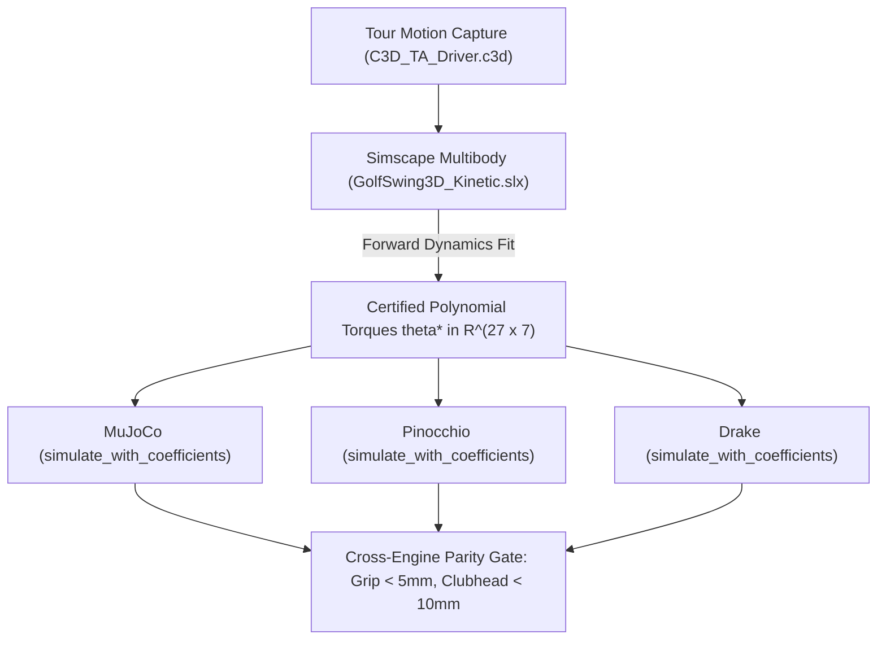

# Cross-Engine Golf Swing Matching & Migration Guide: Simscape Baseline to MuJoCo, Pinocchio, and Drake

> **Status:** Active Fleet Engineering Guide  
> **Parent Epic:** [Epic: Cross-Engine Physics Equivalency (#9964)](https://github.com/D-sorganization/UpstreamDrift/issues/9964)  
> **Child Work Packages:**
>
> - WP1 (URDF/MJCF Export): [#9965](https://github.com/D-sorganization/UpstreamDrift/issues/9965)
> - WP2 (MuJoCo Driver): [#9966](https://github.com/D-sorganization/UpstreamDrift/issues/9966)
> - WP3 (Pinocchio Driver): [#9967](https://github.com/D-sorganization/UpstreamDrift/issues/9967)
> - WP4 (Drake Driver): [#9968](https://github.com/D-sorganization/UpstreamDrift/issues/9968)
> - WP5 (Parity CI Gate): [#9969](https://github.com/D-sorganization/UpstreamDrift/issues/9969)  
>   **Authoritative Specification:** [`CROSS_ENGINE_GOLF_EQUIVALENCE_SPEC.md`](CROSS_ENGINE_GOLF_EQUIVALENCE_SPEC.md)

---

## 1. Executive Overview

This document provides complete instructions and architecture for achieving dynamical and kinematic equivalency across all four physics engines in the fleet:

1. **Simscape Multibody** (`GolfSwing3D_Kinetic.slx` on MATLAB R2025b) — Ground-truth baseline oracle.
2. **MuJoCo** (`src/engines/physics_engines/mujoco`) — High-speed simulation and RL.
3. **Pinocchio** (`src/engines/physics_engines/pinocchio`) — Analytical Jacobians and spatial algebra.
4. **Drake** (`src/engines/physics_engines/drake`) — MultibodyPlant and mathematical programming.

A single continuous polynomial torque profile $\tau(t)$ fitted against measured tour motion capture (`data/C3D_TA_Driver.c3d`, $1.814\text{ s}$) in Simscape serves as the universal driver. When executed in MuJoCo, Pinocchio, and Drake, each engine must reproduce identical forward dynamics within $< 5.0\text{ mm}$ grip RMSE and $< 10.0\text{ mm}$ clubhead RMSE.



---

## 2. Simscape Baseline Methodology

### 2.1 Physics Model Architecture

- **Model**: `src/engines/Simscape_Multibody_Models/3D_Golf_Model/matlab/src/model/GolfSwing3D_Kinetic.slx`.
- **Closed Kinematic Loop**: The model features a closed parallel kinematic chain formed by the pelvis $\to$ torso $\to$ left/right clavicles $\to$ left/right arms $\to$ dual grip $\to$ golf club.
- **Strict Scope Boundary**: **100% Forward Dynamics**. Inverse dynamics is mathematically indeterminate due to the closed loop internal constraint forces. Simscape's multibody constraint solver resolves internal loop forces natively.

### 2.2 Actuation & Torque Representation

- **Degrees of Freedom**: 27 independent generalized actuation coordinates (3 base forces, 3 pelvis torques, 21 joint torques).
- **Polynomial Basis**: Single degree-6 polynomial per channel across the swing, parameterized via 7 Bernstein control points on normalized time $s = t / T_{\text{full}}$ ($T_{\text{full}} = 1.814\text{ s}$):
  $$\tau_j(s) = \sum_{k=0}^6 c_{j, k} \binom{6}{k} s^k (1 - s)^{6-k}$$
- **Physical Conversion**: The function `bernstein_to_simscape(controls, duration_s)` converts Bernstein control points into standard ascending power series coefficients $\theta \in \mathbb{R}^{27 \times 7}$:
  $$\tau_j(t) = \theta_{j,0} + \theta_{j,1} t + \theta_{j,2} t^2 + \theta_{j,3} t^3 + \theta_{j,4} t^4 + \theta_{j,5} t^5 + \theta_{j,6} t^6$$

### 2.3 The 5 Acceptance Gates

Every candidate polynomial profile evaluated at horizon $T$ must pass five certified gates:

1. **Early Retention Gate**: $[0, 0.60\text{ s}]$ marker RMSE $\le 12.0\text{ mm}$ (preserving address and early takeaway).
2. **Whole-Window RMSE**: $[0, T]$ marker RMSE $\le 25.0\text{ mm}$.
3. **Terminal Frame RMSE**: Marker RMSE at terminal sample $t = T$ must be $\le 35.0\text{ mm}$.
4. **Clubhead Terminal Position Error**: Clubhead markers (`Marker_2:2:*`, `Marker_3:3:*`) RMSE at terminal sample $\le 60.0\text{ mm}$.
5. **Pelvis Yaw Error**: Strictly $< 5.0\%$ relative to target mocap yaw:
   $$\frac{|\text{yaw}_{\text{pred}} - \text{yaw}_{\text{target}}|}{|\text{yaw}_{\text{target}}|} < 0.05$$

---

## 3. Anthropometrics, Geometry, and Model Generation

To ensure dynamical consistency, all engines share identical link dimensions, masses, centers of mass, and inertia tensors.

### 3.1 Single Source of Truth

- **Dimensions & Topology**: `shared/models/golf_humanoid_dimensions.yaml`, `golf_humanoid_inertia.yaml`, `golf_humanoid_topology.yaml`.
- **Authoritative Biomechanical YAML**: `src/engines/physics_engines/pinocchio/models/spec/golfer_canonical.yaml`.

### 3.2 Canonical Body Segments & Inertia Properties

| Segment            | Mass ($\text{kg}$) | Principal Inertia $I_{xx}, I_{yy}, I_{zz}$ ($\text{kg}\cdot\text{m}^2$) | Joint Type                        | Parent     |
| :----------------- | :----------------- | :---------------------------------------------------------------------- | :-------------------------------- | :--------- |
| **Pelvis (Root)**  | 11.70              | `0.1337, 0.1337, 0.1337`                                                | 6-DOF Floating Base               | World Base |
| **Lumbar 1-3**     | $3 \times 2.00$    | `0.0150, 0.0150, 0.0020`                                                | Universal (Flexion/Lateral)       | Pelvis     |
| **Thorax / Torso** | 18.00              | `0.2200, 0.2000, 0.1000`                                                | Revolute (Yaw)                    | Lumbar 3   |
| **Head & Neck**    | 5.00               | `0.0300, 0.0300, 0.0300`                                                | Spherical / Fixed                 | Thorax     |
| **L/R Scapula**    | $2 \times 1.50$    | `0.0050, 0.0050, 0.0020`                                                | Universal                         | Thorax     |
| **L/R Upper Arm**  | $2 \times 2.50$    | `0.0180, 0.0180, 0.0040`                                                | Spherical / Gimbal                | Scapula    |
| **L/R Forearm**    | $2 \times 1.50$    | `0.0080, 0.0080, 0.0015`                                                | Revolute (Flex) + Revolute (Pron) | Upper Arm  |
| **L/R Wrist/Hand** | $2 \times 0.50$    | `0.0010, 0.0010, 0.0005`                                                | Universal (Dev / Flex)            | Forearm    |
| **Golf Club**      | 0.35               | `0.0450, 0.0450, 0.0002`                                                | Dual Grip Coupling                | Hands      |

### 3.3 Model Build Pipeline

Run the unified build orchestrator to generate and verify models for all engines:

```bash
python scripts/build_humanoid_models.py --engine all --check
```

Generated artifacts:

- **Pinocchio**: `src/engines/physics_engines/pinocchio/models/generated/golfer.urdf`
- **Drake**: `src/engines/physics_engines/drake/models/generated/golfer.urdf`
- **MuJoCo**: Compiled via `src/engines/physics_engines/mujoco/_golf_swing_full_body_xml.py`

---

## 4. Cross-Engine Simulation Harness & Parity Verification

Every physics engine implements the canonical simulation interface:

```python
def simulate_with_coefficients(
    theta: np.ndarray,                 # Shape (27, 7): ascending power coefficients per channel
    options: SimOptions = ...,         # Simulation duration, timestep, sample rate
    initial_pose: dict | None = None,  # (q_0, qd_0) initial state
) -> SimOut:
```

### 4.1 Engine Implementation Modules

- **MuJoCo**: [`src.engines.physics_engines.mujoco.python.motion_matching.simulate`](file:///C:/Users/diete/Repositories/Worktrees/UpstreamDrift-simscape-tour/src/engines/physics_engines/mujoco/python/motion_matching/simulate.py)
- **Pinocchio**: [`src.engines.physics_engines.pinocchio.python.motion_matching.simulate`](file:///C:/Users/diete/Repositories/Worktrees/UpstreamDrift-simscape-tour/src/engines/physics_engines/pinocchio/python/motion_matching/simulate.py)
- **Drake**: [`src.engines.physics_engines.drake.python.motion_matching.simulate`](file:///C:/Users/diete/Repositories/Worktrees/UpstreamDrift-simscape-tour/src/engines/physics_engines/drake/python/motion_matching/simulate.py)

### 4.2 Cross-Engine Parity Acceptance Gate

When driving each engine with a certified Simscape polynomial $\theta^*$:

1. **Grip Trajectory RMSE**: $< 5.0\text{ mm}$ vs Simscape.
2. **Clubhead Trajectory RMSE**: $< 10.0\text{ mm}$ vs Simscape.
3. **Joint Angle Trajectory RMSE**: $< 0.05\text{ rad}$ ($< 2.8^\circ$) vs Simscape.
4. **Energy Conservation**: $\int \tau \cdot \dot{q} \, dt \approx \Delta T + \Delta V$ within $1.0\%$.

---

## 5. Parallel Fleet Execution Strategy

To match the entire swing efficiently without resource contention:

1. **Simscape Primary Lane (`DeskComputer`)**:
   - Executes full forward dynamics optimization using MATLAB Engine R2025b.
   - Advances progressively: $0.70\text{ s} \to 0.75\text{ s} \to 0.80\text{ s} \to \dots \to 1.814\text{ s}$.
2. **Simscape Secondary / Parallel Lane (`ControlTower`)**:
   - `ControlTower` (100.69.12.6) has MATLAB R2025b and R2026a ready for parallel downswing exploration.
3. **Open-Source Engine Fleet (`brick`, `pi5-nvme`, `oglaptop`)**:
   - MuJoCo, Pinocchio, and Drake run in pure C++/Python without MATLAB license limits.
   - These engines execute forward dynamics simulations and gradient-based trajectory matching at $10\times$ to $50\times$ real-time speed.
   - Any polynomial found by an open-source engine is cross-validated on Simscape to confirm total parity.
