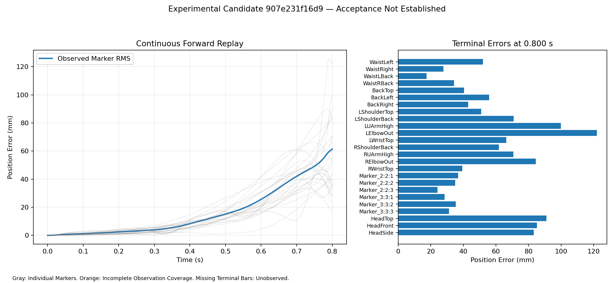
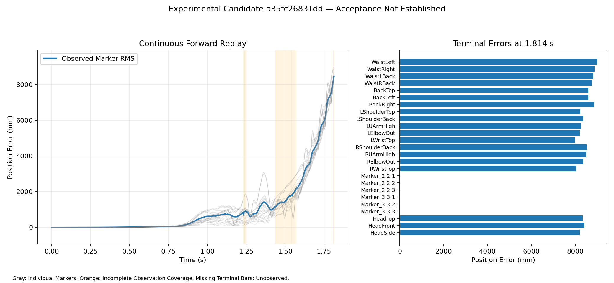
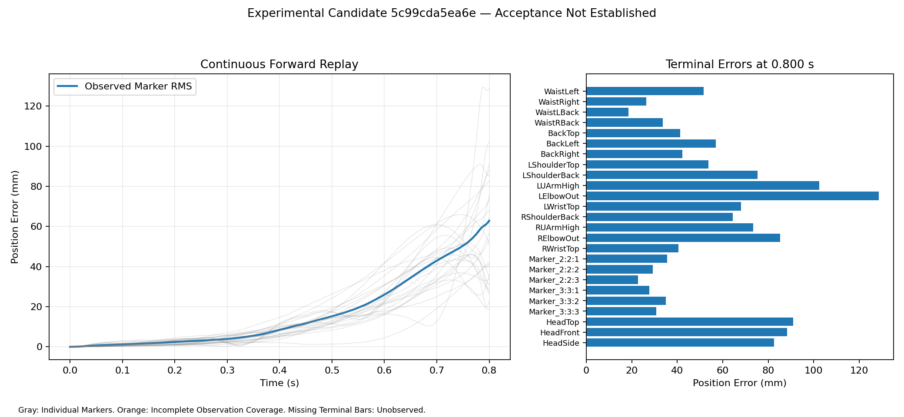
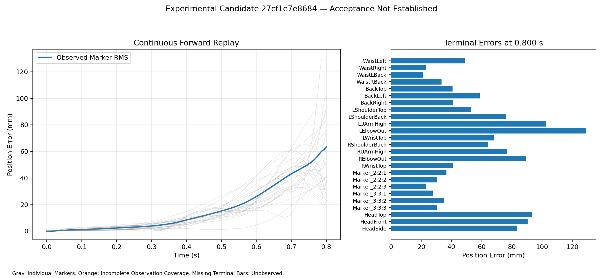
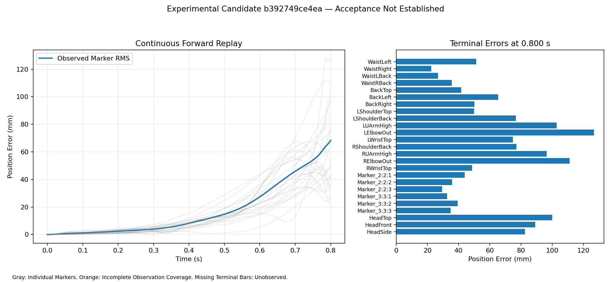
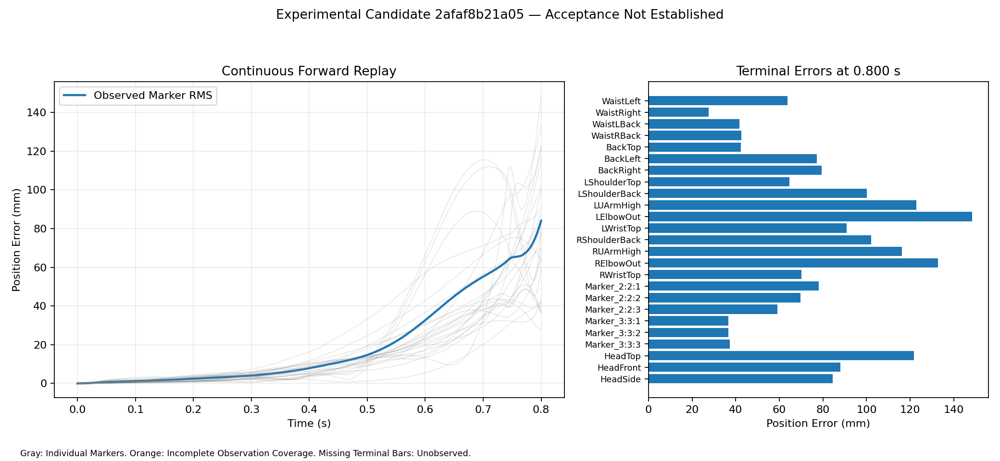
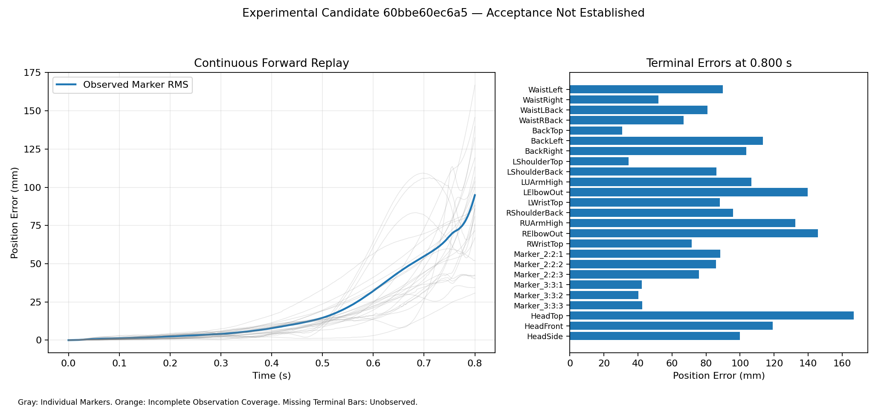
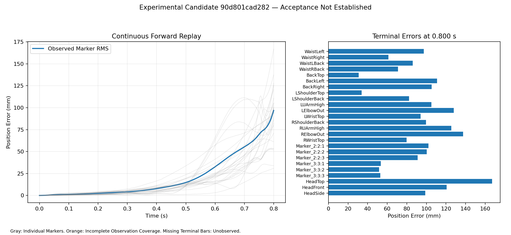
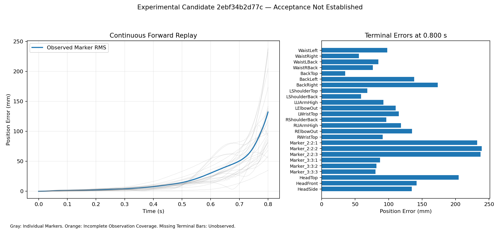

# Native Port Implementation Checkpoint

## Run 20 Terminal: Independent Audit Complete

Current checkpoint SELF, 2026-09-12 UTC. Run20 session43223 exited0 after
60 iterations/61 evaluations; no optimizer is live. All later sections headed
Live describe historical checkpoints. Do not restart run20 or extend its budget.
The returned candidate is unaccepted and optimizer_converged=false.
Canonical SHA `19193da32ec5665e093b0617d41c4aed99f1d2fc35a3c62c446235db8a6491d3`;
raw candidate SHA `e2f29f83711b4ed09bb926538231f01c7540e13e3c743a3abbdba840c6c32678`.

Independent replay and bound audit both exited0. Whole RMS29.941228 mm,
early10.123903 mm, terminal98.417488 mm, club41.593980 mm, yaw19.473411%.
Maximum full scaled continuity defect1.202905e-4 fails1e-4; pointwise terminal
gap6.371635 mm. Whole, terminal, yaw and convergence also fail. There are
105 active bounds:58 effort controls and47 node coordinates. The independent
replay matches returned marker metrics exactly; closure pose/rate maxima are
4.74463e-11/9.06339e-11. Runtime about4.07 s. The benchmark's historical
baseline-only text does not describe this optimized, unaccepted candidate.

All61 raw snapshots, exact config, driver, bound audit, returned controls/nodes,
independent trajectory and inspected plot are archived under
`native_evidence/ms_fit_9967_20/`; use raw-run.zip for original hashed bytes.
The plot shows increasing body error through transition, with left elbow near
170 mm at0.85 s. This remains a partial prefix, not a full-swing match.

Compared with run19, whole RMS improves30.7911 to29.9412 mm and terminal
99.9887 to98.4175 mm; club improves56.5570 to41.5940 mm. Yaw and continuity
worsen. Thus selected bound expansion alone did not resolve transition. Do not
claim a best accepted candidate or choose solely by one metric.

The solver/cache portion of Third Task is now implemented at the shared boundary:
`MultipleShootingOptions.segmented_forward_batch` receives only ordered cache
misses, while the parent retains cache ownership, residual/defect assembly,
analytic Jacobians and sequential default behavior. Two TDD tests first failed
without the boundary, then passed: repeated candidates submit one two-window
batch followed by no empty/cache-hit submission; analytic Jacobian assembly is
unchanged; malformed result counts and nonfinite batch output are rejected.
Focused multiple-shooting plus executor tests (30) and Ruff/mypy pass. The
native driver now has a reusable trusted byte serialization and module-level
worker evaluator in `native_sensitivity_batch.py`; its unit tests verify model
identity reconstruction and output contracts. One isolated ControlTower fixed
six-window worker qualification passed with exact markers, states and full
Jacobians against archived sequential arrays (21.12844s sequential,11.14284s
two workers). This qualifies worker transport, not solver residual/constraint
assembly, repeated cache behavior or a whole-fit speedup. Those solver gates and
a bounded trial remain pending. No follow-on optimization has been launched.

The parent-side `NativeSensitivityBatchAdapter` now implements the exact
`segmented_forward_batch` callable. It leaves candidate/tangent construction in
the driver and maps ordered worker outputs to parent solver arrays;31 focused
tests pass. The fixed-input full solver residual/Jacobian and constraint-assembly
comparison now passes: generated guarded run20 source replayed the frozen 0.85 s
six-window, two-evaluation SLSQP receipt sequentially and with two spawned
workers. All result artifacts match exactly except measured sensitivity timing;
the returned candidate is `dbfcc0f...`. The recorded receipt is
`../native_parallel_performance/batched-solver-qualification-9967-24.json`.
This is not a speed, convergence or matching claim. The remaining prerequisite
for one bounded fit is the reviewed smooth closure-feasible transition
initializer; do not repeat a blind control-bound continuation.

The first required native primitive for that initializer is now available:
`NativePinocchioModel.closure_residuals(coordinates, rates=None)` refreshes the
actual 6D weld through constrained dynamics with explicit zero efforts and
returns its pose/rate residuals. It validates complete finite native coordinate
and rate inventories and does not correct state, invoke inverse dynamics or
change a replay. Unit contracts cover the static zero-rate probe and rejection
of incomplete/nonfinite inputs. An isolated ControlTower runtime22 receipt now
also passes at archived run19 candidate
`b5b1c3823c86a21df323dc4e430366dc093495b069b3d25c361b0d007b8ff24f`:
the probe and direct constrained dynamics agree exactly for recorded qd and
zero qd. See `native_evidence/closure_probe_9967_22/receipt.json` (model
`b817fea...`). This is a single-state oracle qualification, not a
trajectory-level closure proof or a C3D match.

`NativeConstrainedPoseOracle` now connects that engine-owned marker/closure
contract to the shared `fit_marker_pose` solver. It accepts only the fixed
native coordinate order plus named marker bodies/offsets, validates all shapes
and finiteness, and returns copied marker positions or weld-pose residuals. It
does not contain a second IK implementation, smooth independent poses, infer
derivatives, identify torque, or claim a trajectory. The immediate next task is
additional transition-frame constrained-pose receipts, then a separately
qualified smooth path across such frames. The t=0 receipt is complete in
`native_evidence/marker_pose_seed_9967_23/receipt.json`: all25 observed markers
fit at2.89808e-13 m RMS with weld pose residual5.54112e-13 m; SLSQP converged
in one iteration because archived run19 q0 is the target's calibrated initial
state. This only proves wiring/identity at the initial frame, not later
reachability or transition tracking.

The first transition-frame diagnostic is also complete at frame216/t=0.6 s,
with the same model, run19 candidate, attachments and25 observed markers. The
local ±0.05 coordinate chart converges with closure1.90450e-14 but marker
RMS527.809 mm. An explicitly separate ±0.5 static search converges with
closure6.12878e-15 and RMS27.1366 mm. Receipts are
`native_evidence/marker_pose_transition_9967_23/`. Thus the large transition
error is not immediate closed-chain infeasibility; it is not solved either:
the wide static result fails the eventual25 mm whole-motion gate, has no
continuation guarantee, no derivative/acceleration qualification and no
forward torque replay. Do not use it as a dynamic candidate. It establishes the
next action: continuation across sparse frames from preceding feasible poses,
with branch, bounds and marker-residual evidence retained before smoothing.

That sparse continuation is now complete fromt=0 through0.6 s using one fixed
±0.15 coordinate chart per adjacent seed. Receipt:
`native_evidence/marker_pose_sequence_9967_23/receipt.json`. RMS is
0.524/1.631/3.556/7.544/14.894/25.235 mm at0.1/0.2/0.3/0.4/0.5/0.6 s;
all weld residuals are at most1.649e-11. The0.1 s SLSQP solve reaches its
100-iteration limit despite0.524 mm residual and valid closure, so its status
is a warning, not convergence. This shows a static pose continuation can cross
the prior transition location. It does not provide a C1/C2 path, valid qd/qdd,
global effort coefficients, forward dynamics or an accepted match. The next
implementation stage is a derivative-aware smooth path fit that rechecks pose,
rate and acceleration closure before reaction-eliminated effort initialization.

A finer50 ms continuation through0.85 s is now preserved in
`native_evidence/marker_pose_sequence_fine_9967_23/receipt.json`. It remains
on a closure-valid branch but static RMS rises smoothly from22.636 mm at0.6 s
to31.141 mm at0.7 s and40.732 mm at0.85 s. This is the current local static
kinematic floor for the fixed native geometry, markers and attachments; it
explains why forward matching gets worse after transition but does not prove
that it is a global floor or excuse relaxing final acceptance. The next work
must examine marker attachments/geometry and smooth-path dynamic compatibility
before another torque optimization.

The first sampled smooth initializer is complete in
`native_evidence/smooth_pose_sequence_9967_23/receipt.json`. A cubic path was
fit through the18 retained static poses and each sampled q/qd was reprojected
through the native weld. At those samples pose closure is2.59331e-10, rate
closure2.17763e-13 and the finite-difference rate-residual change8.71157e-12.
This makes it suitable to investigate reaction-eliminated global-sextic effort
initialization. The receipt deliberately labels its qdd as finite difference;
it is not a constrained-dynamics acceleration qualification or forward match.

That limitation is now independently measured with an isolated ControlTower
Drake1.57 environment. The finite-difference qdd fails acceleration closure:
maximum `J*qdd+gamma` is1.33668 and RMS0.24240 over18 samples; receipt
`../drake_native_matching/evidence/smooth_native_acceleration_9967_24/receipt.json`.
This rejects using the current spline directly for reaction-eliminated effort
identification. The companion pointwise projection receipt,
`../drake_native_matching/evidence/smooth_native_acceleration_projection_9967_24/receipt.json`,
reduces its sampled Drake `J*qdd+gamma` maximum to3.99680e-15 with a
minimum-norm coordinate correction maximum0.500529 and RMS0.0710317. It checks
the closure convention only. Because the projected acceleration has not been
shown to equal the derivative of the projected qd, it is not a dynamic path,
torque initializer, or forward match. The next required implementation is a
derivative-consistent collocation trajectory that jointly preserves pose, rate,
and acceleration closure before reaction-eliminated effort identification.

A tested shared C2 collocation scaffold is now present at
`src/shared/python/motion_matching/constrained_trajectory.py`; it derives qd
and qdd from one position spline and evaluates all three weld levels. Its
first bounded native Drake probe is preserved in
`../drake_native_matching/evidence/smooth_native_collocation_probe_9967_24/receipt.json`.
After two finite-difference trust-constr iterations it remains unqualified:
pose0.00126302, rate0.0172004, acceleration0.724940 maximum absolute closure.
Do not increase that blind finite-difference budget. It confirms the generic
contract and shows that this problem requires constraint derivatives and
manifold continuation/retraction before a dynamic path or torque fit.

The first required native manifold derivative is now qualified. The new
`NativePinocchioModel.closure_position_linearization` exposes the exact6-by-27
Pinocchio weld Jacobian in the caller's native coordinate order, after its
explicit zero-rate/zero-effort constraint-data refresh. ControlTower receipt
`native_evidence/closure_jacobian_9967_24/receipt.json` checks the archived
initial smooth-path state with centered1e-6 differences: position closure is
5.32629e-13 and maximum Jacobian discrepancy1.98424e-10. The executable is
`qualify_native_closure_jacobian.py`. This is kinematic node-chart evidence
only; it does not yet differentiate rate/acceleration closure or qualify a
trajectory. Use it with the existing `node_retraction.retract_node` to keep
each collocation node on the weld manifold before adding those remaining
derivatives.

That node-chart construction is now also qualified on ControlTower in
`native_evidence/weld_node_chart_9967_24/receipt.json`. With translational
coordinates scaled0.1m and rotational coordinates1rad, the exact native
Jacobian produces an orthonormal21-dimensional chart. A nonzero0.001 chart
step retracted through `node_retraction.retract_node` to weld residual
3.93974e-16, scaled displacement0.001 and state-Jacobian shape27-by-21. The
runner is `qualify_native_weld_node_chart.py`. This preserves pose closure at
every node; it still does not supply the rate/acceleration derivative blocks,
marker objective, dynamic trajectory, torque identification, or forward match.

Pinocchio now also owns a no-inverse-dynamics three-level weld residual oracle:
`closure_trajectory_residuals(q,v,a)` evaluates pose, `J*v`, and
`J*(a-a0)`, where a0 is the actual zero-effort constrained forward
acceleration. The ControlTower receipt
`native_evidence/trajectory_residuals_9967_24/receipt.json` repeats the18
smooth-path samples and returns pose2.59331e-10, rate2.17740e-13, and
acceleration1.336681893544. The acceleration value matches the independent
Drake diagnostic1.336681893545 to displayed precision, establishing a common
fast residual convention for the next Pinocchio chart solver. This does not
repair the path or identify a torque; the same nonzero acceleration defect
still blocks reaction-eliminated effort identification.

The first bounded retracted-node solve is preserved in
`native_evidence/retracted_collocation_probe_9967_24/receipt.json` with its
runner `probe_retracted_native_collocation.py`. It uses the first four path
nodes, the qualified21-dimensional node charts, explicit±0.01 chart bounds,
and exactly two trust-constr iterations. It remains unqualified, but the
combined rate/acceleration residual falls to0.1041854 without a pose-closure
violation, compared with the original full-path acceleration residual1.33668.
This is local preflight evidence only: it has no marker objective, no full
window continuation, no torque profile, and no forward replay. Do not expand
the same blind finite-difference solve; next add chart-space derivatives and
continue the window only after recording their qualification.

The next implementation increment is present but has no ControlTower receipt
yet. `NativePinocchioModel.closure_trajectory_linearization` returns local
centered q/v derivatives of the three-level residual and the exact
acceleration partial J. The shared `compose_chart_residual_jacobian` composes
those local blocks with the full target-q-source-chart spline/retraction maps.
`probe_retracted_native_collocation.py` now supplies this structured Jacobian
to trust-constr with its finite-difference step recorded in the output. First
qualify that Jacobian against a direct bounded chart perturbation on the same
four-node window; do not interpret its availability as an accepted solve.
identification. The next path stage is an explicit acceleration projection with
reported correction magnitude, followed by derivative-consistency review; no
torque fit or forward replay may be inferred from this failed diagnostic.

## Run 20 Saved Evaluation 44 Audit

Run20 PID2348439 was reverified live at 16:40 elapsed; do not restart it.
Read-only audit session85985 exited0. Saved evaluation44 independently replays
at whole32.896477 mm and terminal133.589162 mm, versus segmented terminal
95.877355 mm. The terminal pointwise gap is65.749435 mm and maximum full scaled
continuity defect1.541224e-4 fails1e-4. Callback cost29.95454 is therefore not
continuous fit improvement over run19. This is a residual evaluation, not an
accepted iterate or terminal result. Let the existing bounded solve finish.
Candidate canonical SHA:
`5ddc46705f245d4e0d92a731cc65cf7d9e9ee5074f71407657b17a614d1d7324`.
Exact snapshot/config/audit script/report are preserved in
`native_evidence/ms_bound_continuation_9967_20/raw-evaluation44-audit.zip`;
adjacent evaluation44-audit.json is the readable receipt. No optimizer or
runtime modification occurred. Next agent must still audit the returned result.

## Current Turnover for the Next Agent

Read [Lower-Cost Agent Turnover](LOW_COST_AGENT_TURNOVER_20260912.md) for the
ordered executable plan, exact audit commands, immutable inputs, acceptance
criteria and stop conditions. The user requests delegation after this groundwork
checkpoint. Do not expand the current turn into another optimizer run. Run20
continues; latest observed evaluation32 cost29.99290425 is not audited acceptance.
The optional persistent executor from agent commit621efab7a is now integrated
in SELF. Root reran five unit tests: pass. Its one native sequential/executor
qualification returned exactly equal primal states/markers and full Jacobians
(21.30037 s versus11.18647 s). No optimizer or runtime was changed. Production
solver/cache integration is explicitly left for the next agent. Read the
performance HANDOFF for indexed failures, cleanup and hung-worker limitations.

## Run 20 Live; Run 19 Rejected and Archived

Updated 2026-09-12 UTC. Integration checkpoint SELF; branch
`feat/9967-native-simscape-pinocchio`, worktree
`C:/Users/diete/Repositories/Worktrees/UpstreamDrift-pinocchio-native`.
The active goal includes native MuJoCo and Drake equivalence, Pinocchio and
R2025b Simscape matching, and the staged OpenSim epic #10003. Full swing is
not matched. Read this current section before historical entries below.

Run 19 ended at the 60-iteration limit (61 evaluations), accepted=false and
optimizer_converged=false. Independent continuous replay from original q0/qd0
reports whole 30.791102 mm, early 10.667481 mm, terminal 99.988650 mm,
club 56.556950 mm and yaw 16.764308%. Full scaled continuity defect is
1.091819e-5, with a 1.194107 mm pointwise terminal gap. Club and continuity now
pass, but other gates and convergence do not. Returned canonical identity:
`b5b1c3823c86a21df323dc4e430366dc093495b069b3d25c361b0d007b8ff24f`.
All 61 raw snapshots, config, bound audit, independent replay and inspected
plot are archived in `native_evidence/ms_fit_9967_19/`. The generic replay
runner's historical baseline-only wording does not describe this optimized,
unaccepted candidate. No new MATLAB validation was run for this candidate.

Run 20 is the sole optimizer: session 43223, ControlTower-Runner PID 2348439;
output `C:/Users/diete/native-ms-fit-9967-20`; immutable runtime
`/home/dieterolson/native-ms-pilot-9967-20`. Driver:
`C:/Users/diete/run_native_ms_bound_continuation_9967_20.py`. Resume by polling
this process/output, never launching a duplicate because a wait times out.
Latest observed callback is evaluation 16, cost 30.13388646; a lower callback
cost is not an independently verified continuous fit improvement.

Run 20 explicitly widens 71 saturated run19 effort intervals from +/-2 to +/-4;
other intervals, including eight +/-10 entries, are unchanged. These are
numerical correction bounds, not physical actuator limits. Variable scales
remain frozen to run19. Original parent, model, q0/qd0, target/masks, single
sextic, 0.8 s basis and all acceptance gates are unchanged. Chart centers use
the reconstructed source's own continuous replay. Warm start, chart recentering
and bounds change together are not a one-factor experiment.

Preflight session 5587 exited 0: all 12 derivative checks passed (maximum
relative error 1.196781e-4), and initial full scaled defects were below
4.5100e-9. Strict source-state comparison remains FAILED: q difference
3.776193e-7, scalar-rate difference 3.202742e-4 exceeds 1e-4, marker difference
7.243619e-8 m. There was no bound snapping. The independently identified
reconstructed seed is
`b9d610b405ac8e614aca1b3a771065d8b13466417fa0b2946bdf88b9b22f4048`.
It is a distinct seed trial, not exact numerical restart or full-state parity.
Exact preflight, source/config, bounds, runtime and driver bytes are in
`native_evidence/ms_bound_continuation_9967_20/`.

## Parallel Studies Integrated in This Checkpoint

Drake study commits 151659026 and cleanup 10d68e35a are integrated together
without committing generated bytecode. Read
`../drake_native_matching/REACTION_IDENTIFICATION_FEASIBILITY.md`.
A reaction-eliminated degree-six linear system has rank 189 on the known
baseline, with held-out acceleration difference below 2e-7. It does not require
zero loop reactions. The identified profile's continuous marker difference is
8.84e-9 m, but its scalar-rate difference 3.37e-4 FAILS the unchanged 1e-4
full-state gate. Six analytic tests pass on root. This is an initializer
feasibility study, not target C3D matching or production inverse dynamics.
A smooth closure-feasible native target path with consistent derivatives is
still required; the report gives seven sequential implementation gates.

MuJoCo lane's bounded performance study ef4ef2888 is integrated. Read
`../native_parallel_performance/HANDOFF.md`. Six sensitivity windows took
20.18865 s sequentially and 10.99769 s using two spawned workers, including
startup/IPC/shutdown. All primal states/markers and complete state/marker
Jacobians were exactly equal. This is one ordered pair, not a whole-solver
speedup measurement. Large arrays remain in two checkpoint locations with
recorded hashes; small inputs and exact runner are archived in Git. Both
parallel studies are terminal; neither modified the live optimizer/runtime.

## Ordered Next Actions

1. Poll run20 session 43223 or its exact output. At termination independently
   replay the returned polynomial, audit bounds/continuity, and generate and
   inspect its marker overlay. Do not accept callback cost or segmented fit.
2. Implement optional persistent two-worker window evaluation through the
   shared solver contracts, using TDD for ordering, identical assembled
   residuals/Jacobians, cache behavior, worker failures and cleanup. Preserve
   sequential fallback and parent-owned optimizer/retraction/assembly. Qualify
   on an isolated runtime before one bounded fit; do not patch runtime20.
3. Develop the native smooth target-trajectory prerequisite for the loop-aware
   polynomial initializer. Test closure at position, rate and acceleration
   levels and continuous coordinate branches before identifying controls.
4. Replay the next accepted candidate through both native engine adapters and
   R2025b. Baseline adapter parity does not certify final fitted controls,
   full swing, stock mj_step, stock Drake SAP, or engine sensitivities.
5. Maintain issue9964 coordination and each lane's HANDOFF.md. OpenSim epic
   #10003 remains planned with OS-0 implementation pending.

## Run 19 Live: Recentered Charts With a Distinct Reconstructed Seed

Effort-bound audit integrated as `e917c9a2f`; root reran its three extrema tests,
all pass. `docs/development/mujoco_native_matching/RUN18_EFFORT_AUDIT.md`
contains the complete 27-channel table and raw/source receipts. Independent
recovery confirms 65 saturated controls across 23 channels: 16 root-force and
49 joint-torque controls. Every saturation is at a +/-2 correction bound; none
of the eight widened +/-10 entries is active. Total forces/torques are different
quantities (world Fz about 752--843 N, HipInputY about 164--172 Nm). Eleven
torque channels whose controls are all bounded +/-2 exceed 2 Nm correction in
the extrapolated 0.8--0.85 s interval; the Bernstein convex-hull bound applies
only within its 0.8 s basis interval. This is not a physical-limit violation.
Use this evidence after run19 to design one bounded continuation of actually
saturated controls, with separate declared torque/force magnitude checks if
physical limits are introduced. Do not alter the live run or reuse a tighter
bound on correction coefficients as a claimed actuator capability.

Progress addendum: PID 2330720 verified live at 4:58 elapsed. Saved evaluation 6
was independently replayed (audit session 38056 exited 0): whole 31.546855 mm,
terminal 105.761778 mm, segmented terminal 101.229504 mm, pointwise gap
10.557738 mm and max scaled defect 2.34566e-4. It fails marker and continuity
gates; lower callback cost 33.30522 is not continuous fit improvement. Exact
snapshot/config/runner are in raw-evaluation6-audit.zip. This is a residual
evaluation, not an accepted optimizer iterate; let the bounded solve finish.

Drake physical-rate diagnostic is integrated as `50010ee50`. One replay pair
using actual world frame angular Jacobians reproduces the strict rate failure,
but physical body angular-velocity vector differences peak at 1.47290e-5 rad/s;
relative shoulder difference is 1.48139e-5 rad/s (2.80710e-7 relative). This
supports coordinate amplification without establishing exact restart. Read
Drake's `evidence/reconstructed-seed` report/raw archive. No Drake jobs remain.

Read-only Gemini inspection: worktree `UpstreamDrift-simscape-tour` is clean at
`6fee8b5ea`; latest `candidate_transition_080s_diffstep_package.json` reports
whole 32.202380 mm, early 11.188804 mm, terminal 95.968351 mm, club 69.149303 mm,
yaw 1.033985%, converged true, accepted false, 2/5 gates. This is its reported
0.8 s result, not root's independent qualification. Package includes degree six
and basis 1.813889 but lacks model/capture/source hashes, q0/qd0 and explicit
force/coefficient conventions. Do not silently translate or compare its metrics
as the same model/input. Request producer provenance in the coordination issue.

Updated 2026-09-12 UTC. This section supersedes terminal/live claims below.
Run 19 is the sole live fit: session 60944, ControlTower-Runner PID 2330720,
output `C:/Users/diete/native-ms-fit-9967-19`. Do not restart on a polling timeout.
Runtime `/home/dieterolson/native-ms-pilot-9967-19` copies immutable runtime18
and adds only `native_restart.py` from commit `944fe4d94`. No native physics or
existing runtime was edited. Driver is
`C:/Users/diete/run_native_ms_recentered_9967_19b.py`; run with the existing Pin
venv, PYTHONPATH pointing at runtime19, OPENBLAS_NUM_THREADS=1 and OMP_NUM_THREADS=1.
Arguments: `--horizon .85 --nodes .2 .4 .6 .7 .8 .85 --basis-duration .8
--max-nfev 100 --max-iterations 60 --equality-tolerance 1e-7 --node-bound .05`.

### Restart Contract and Explicit Numerical Limitation

The new shared `prepare_native_restart` reuses native Bernstein recovery and
increment functions. It rejects changed non-control identity, malformed bounds,
and actual control-bound violations. Only explicitly tolerated numerical bound
roundoff is snapped; original parent and effort bounds remain fixed. Returned
controls are immutable and their reconstructed candidate has an explicit hash.
Eleven new tests failed on the missing module before implementation; all 35
restart/candidate/retraction tests now pass, plus Ruff and direct mypy.

The strict run19 preflight terminated with exit 1 before optimization: snapping
30 controls by at most 5.99520e-14 and reconstructing the polynomial produced
candidate `c89597f6ccc00eadcbcab3008b83fdc7eb30b25efa442aab5ecf69273b67d049`.
Against original run18 `917d2d29...`, independent replay differences are q
3.55906e-7, qd 3.31409e-4 and markers 6.93357e-8 m. The qd comparison exceeds
1e-4; strict numerical restart equivalence is FALSE. Preserve that failed
receipt; do not change its result or claim an exact one-factor restart.

Run19b's audit (session 42785, exit 0) instead qualifies this explicitly distinct
reconstructed candidate for its own trial. Sampled effort-profile difference
from run18 is 1.27898e-13; q/marker proximity checks pass. It does not require
or claim strict source-state parity. Its own continuous replay supplies all new
chart centers; no prior static states or intermediate target resets are used.
The original native q0/qd0, model, capture, degree-six basis, absolute effort
bounds, node box and all FINAL fit acceptance gates remain unchanged. Thus this
is a chart-recentered trial with a documented numerical seed perturbation.

All 12 composed derivative checks pass the existing 1e-3 threshold (maximum
relative error 6.81866e-4). Early effort probes choose available interior B0/B1
columns rather than stepping outside a saturated bound. Initial scaled defects
are below 8.211e-9. The fit repeats these checks before optimization. Neither a
preflight nor a smaller callback cost is fit acceptance; independently replay
the returned candidate, inspect all full-state defects and pointwise gap, and
apply unchanged observed-marker/club/yaw/optimizer gates.

### Evidence and Resume Assignment

`native_evidence/ms_recenter_9967_19` preserves failed strict restart receipt,
passing distinct-seed derivative/config/defect receipts, exact raw archives,
runtime module+manifest, staging/generation scripts and both drivers. Raw ZIPs
retain hashes when adjacent JSON is reformatted. Source and parent inputs are
the previously archived run18 and original root-force candidate; no new data.

Next: poll session 60944 or exact PID 2330720, inspect actual fit progress, then
perform independent final replay/bound audit/plot without changing live files.
Do not expand effort bounds in this run. Drake agent is archiving one bounded
physical angular-velocity comparison of source and reconstructed seeds; strict
state parity remains failed. MuJoCo agent owns a read-only active-effort-bound
and actual-effort magnitude audit to inform a separate future continuation.
No agent is running another optimizer. Full 1.8138888889 s matching, geometry
calibration when justified and extended native engine parity remain unmet.

## Run 18 Verified and Rejected; Native Bundle Integration

Integration addendum: MuJoCo import fix is now integrated as `8ac65c486`.
The root engine facade lazily exposes the generic Engine, avoiding unrelated
GUI/model imports during native adapter import. Two fresh-process regressions
first reproduced failure under the old initializer; root now passes all 23
selected import, live dynamics and bundle-binding tests. This fixes the native
entry sequence, not arbitrary Tools alias collisions. Drake's first run 18
comparison and one tighter matched-tolerance comparison both fail the absolute
rate gate (1.46002e-4 and 3.29386e-4 versus 1e-4). Marker differences remain
below 1e-7 m. No gate was relaxed; 0.85 s full-state parity is not qualified.
The two failures and bounded localization evidence are integrated as
`ff7a2e1de`, under `docs/development/drake_native_matching/evidence/run18`.
Both peaks occur at 0.7861111111 s in LSInputX, near 400.447 rad/s; relative
cross-engine discrepancies are 3.65e-7 and 8.23e-7. Within-engine coarse/fine
rate changes are 3.32e-4 for Pinocchio and 1.43e-4 for Drake, so reference
convergence at the existing absolute rate gate is not established. The raw
generalized-coordinate mass condition is about 6.65e7 with positive minimum
eigenvalue 1.38e-6; this quantity is unit-dependent. Diagnose native Euler
coordinate amplification and integration convergence before calling this a
physical model mismatch or changing representation/gates. No third tolerance
sweep or model alteration was performed. Existing-state shoulder evidence is
integrated as `a5b817840`: Rx/Ry/Rz middle angle -94.58857 degrees, rate-map
condition 24.96, relative physical angular speed 52.7732 rad/s. This supports
coordinate amplification, not a sole-cause claim. The exact extractor and raw
report are archived in Drake's run18 evidence. Both agents have finished;
no fitting or qualification jobs remain live. All root work is committed.

Updated 2026-09-12 UTC. This section supersedes historical LIVE statuses below.
Run 18 session 94942 exited 0 and ControlTower PID 2294114 is absent. No new
fit has been launched. The full 1.8138888889 s matching goal remains active.

The scaled solve reached its 60-iteration limit with 61 residual evaluations.
Candidate `917d2d29b66bc2ab947a6ea75255c35e47134e6a2d51cde7e1e69847cad379f7`
is rejected and optimizer convergence is false. Independent continuous replay
from original q0/qd0 reproduces whole 30.846699 mm, early 10.604514 mm,
terminal 103.948841 mm and terminal club 69.776967 mm. Yaw error is 18.354964%.
Full scaled defect is 5.84673e-6 and terminal segmented/continuous pointwise
gap is 0.151144 mm. Continuity improved materially compared with run 17, but
marker accuracy still fails. Independent replay took 3.589 s; closure maxima
are 5.31e-11 pose and 8.93e-11 velocity. The independent runner's historical
"baseline only" label does not describe this optimized candidate: this is an
unaccepted optimizer result, independently replayed without further fitting.

Evidence is `native_evidence/ms_fit_9967_18/`: returned candidate/nodes/config,
metrics, independent receipt/trajectory, inspected PNG, bound audit and raw ZIP
containing all 61 snapshots plus audit runners. Evaluation 28's intermediate
audit is retained in raw-run.zip; it was not an accepted iterate. Canonical
candidate identity above differs from raw file SHA
`a3fa5c4ccb503c33fef9d72a061718ccbd3fa8b2449cd07959d09f42f564fd10`.

### Bound Diagnosis and Next Controlled Experiment

Fresh reconstruction confirms 126 active bounds: 65 effort controls and 61
node coordinates, distributed 3/8/9/17/24 at 0.2/0.4/0.6/0.7/0.8 s. Node
reconstruction error is below 5.4e-15. These are numerical correction bounds,
not native physical joint or total-effort limits. The saved 33.304 mm static
pose at 0.8 s has position-only scaled distance 43.108 from the initial chart
after individual 2\*pi wrapping, versus chart radius 0.5. Alternate Euler
branches were not searched: this excludes that saved representation only,
not all good poses or dynamically reachable solutions. Exact script, inputs
and hashes are in raw-pose-chart-audit.zip. Do not use static states as hidden
resets in forward replay.

Next agent: implement a tested warm-start/recentering path using run 18's
continuous replay states as new chart centers and its physical controls as
initial controls. Preserve the original parent polynomial, absolute effort
bounds, degree six, 0.8 s polynomial basis, 0.85 s coverage, q0/qd0 and all
acceptance gates. First prove identical physical initialization/replay and
qualified chart derivatives with TDD; then run one immutable bounded trial
changing chart centers only. Inspect actual radius and active bounds before
separately considering effort-bound continuation. Do not conflate recentering
with geometry calibration or raise budgets without a new diagnostic reason.

### Engine Integration and Active Ownership

MuJoCo validated URDF/sidecar/model bundle factory integrated as 23f2d0235;
precise import-order reproduction handoff as 055267f87. It converts validated
canonical geometry to MJCF; this is not native MuJoCo URDF parsing. The new
168-case/0.8 s qualification passes with unchanged prior results. Root reran
26 MuJoCo live, Drake analytic and shared binding tests: all pass. An initial
test command used a nonexistent Drake test filename and was corrected before
the successful run. Drake native library tests remain in its isolated runtime.

MuJoCo agent is fixing an import-order-dependent native exporter failure:
eager generic engine imports can select the vendored writer lacking precision.
Fresh standalone export succeeds; the exact failing collection sequence is
in its HANDOFF. Do not lower precision or claim arbitrary import paths qualify.
Drake agent is independently extending parity to this run 18 candidate at
0.85 s in its unchanged isolated runtime. Neither agent is running a fit.
Read lane handoffs and collect their final commits before claiming completion.

## Native Engine Lanes Integrated; Transition Pose Seeds Compared

Updated 2026-09-12 UTC. Run18 remains the sole active fit (session94942,
ControlTower-Runner PID2294114); last observed evaluation16. No new fit was
started. This turn integrated reviewed engine work and added independent local
pose evidence while that solve continued.

Reviewed and cherry-picked MuJoCobcb86ea4e as06576fa4a and Drakea837d4bdd as
9ff486f11. Their branches are pushed and clean, normal checks pass and no engine
qualification jobs remain live. Root reran20 engine/shared-binding tests: all
pass. Drake live tests remain qualified in its isolated CT environment; root
local tests do not claim the Drake native library exists locally. Read each
engine HANDOFF.md and exact raw evidence archive under docs/development.

Qualified scope is native rigid constrained dynamics with each engine's own
mass/bias/J/Jdot and the shared DOP853 integrator, through0.8 s baseline only.
MuJoCo direct R2025b marker component max1.26345e-6 m; independent Pinocchio
marker max2.84716e-9 m and168 pulse comparisons pass. Drake direct R2025b
moving acceleration max2.901e-9 and continuous frame-position max1.002e-6 m;
independent Pinocchio marker max7.696e-9 m. Both preserve27 coordinates and16
frames; Drake additionally reports31-solid mass/inertia/COM inventory. These
are different measured quantities; do not present frame-position and marker
component maxima as identical metrics. Stock mj_step / discrete SAP, arbitrary
geometry, full swing and sensitivities remain outside this qualification.
Reference-specific native coefficients differ from2af root-force baseline;
exact same-input guards and separately saved candidates prevent mixing them.

### Local Pose Evidence at the New Horizon

Two read-only static experiments using the existing tested fit_marker_pose
function both completed successfully; no fitting runtime was edited. Isolated
/home/dieterolson/native-transition-pose-9967-01 copies runtime18 and adds the
existing static-pose module. First uses independent run17 dynamic states as
initial poses. Second continues from previously saved static forward0.8 s pose,
with unchanged local +/-0.2 m translations and +/-0.5 rad rotations around
each starting pose. Exact source/target/model identities and scripts are saved
in native_evidence/transition_pose_9967_01/raw-pose-audits.zip.

| Time    | Dynamic-Seed Static RMS | Static-Continuation RMS |
| ------- | ----------------------- | ----------------------- |
| 0.8 s   | 40.551980 mm            | 33.304031 mm            |
| 0.825 s | 41.935970 mm            | 34.602530 mm            |
| 0.85 s  | 60.290122 mm            | 35.773374 mm            |

All six solves converged with pose closure below1.1e-13. The second branch
invalidates treating the first local optimum as a global geometric floor.
Neither is a forward trajectory or proof of dynamic reachability. The0.85 s
pose is close to, but above, the35 mm gate; do not relax that gate or claim
impossibility from a local solve. Retain distinct static/dynamic qualifications.
Use these as seed/geometry diagnostics after run18, not as reset states that
silently replace the continuous swing. Length/attachment calibration remains
an explicit unmet part of the broader goal when justified by model constraints.

## Scaled Native Audits Passed; Run18 Is Live

Updated 2026-09-12 UTC. Audit18b session36203 exited zero, confirming actual
scaled objective/constraint callbacks at the native common initial point.
Three of399 variables near bounds were excluded from centered probe directions;
396 remained. Max cost-slope relative error1.10963e-6 and constraint-direction
relative error1.03862e-4 pass1e-3. This qualifies the sampled directions, not
every possible nonlinear step. Native selected window derivative checks also
pass. Receipts and all10 snapshots are in ms_scaled_audit_9967_18b/raw-audit.zip.

Conditioning audit18c session40405 exited zero. At the same initial point,
all210 projected constraint directions and189 feasible marker directions have
full numerical rank at the reported relative1e-8 threshold:

| Variable Scaling          | Constraint Condition | Feasible Marker Jacobian Condition |
| ------------------------- | -------------------- | ---------------------------------- |
| Identity                  | 4023.59              | 355571.89                          |
| Half Box                  | 48487.10             | 35000.52                           |
| Combined Jacobian Columns | 987.94               | 1322204.94                         |

Thus half-box scaling worsens constraint conditioning but improves the feasible
marker map about10-fold. Combined-column scaling makes that map worse. These
local numbers are not achieved fit quality or convergence evidence. They support
one controlled half-box experiment, not a claim that scaling has solved fitting.
Exact vectors, script and native data are in ms_scaling_conditioning_9967_18c.

LIVE fit18: session94942, confirmed ControlTower-Runner PID2294114; output
C:/Users/diete/native-ms-fit-9967-18. Before launch, no scaled driver or output
existed. Runtime18 and scaled driver18 are unchanged from the passed audits.
Launch uses the usual Pinocchio venv and single-thread BLAS environment:

```text
PYTHONPATH=/home/dieterolson/native-ms-pilot-9967-18
OPENBLAS_NUM_THREADS=1 OMP_NUM_THREADS=1
/home/dieterolson/simscape-pinocchio-9967/.venv/bin/python
/mnt/c/Users/diete/run_native_ms_scaled_9967_18.py
--output /mnt/c/Users/diete/native-ms-fit-9967-18
--horizon .85 --nodes .2 .4 .6 .7 .8 .85 --basis-duration .8
--max-nfev 100 --max-iterations 60 --equality-tolerance 1e-7 --node-bound .05
```

Use env with these assignments and join wrapped lines. This preserves run17's
physical problem and budgets, changing only solver variable scaling. Every
residual evaluation is saved, including rejected proposals. Poll this process;
never restart solely after an observation timeout. On completion independently
replay, audit physical defects/marker gates/yaw/pointwise gap and active bounds.
Do not promote any candidate without all gates. Full capture remains unfinished.

Shared validator extraction reviewed and integrated asd234d6133;9 binding tests
and normal push checks pass. Runtime18 intentionally keeps its prior validator
files because that extraction changes no semantics. Engine agents10021/10022
continue native equivalence work; their final source-hashed evidence and commits
still need root review/integration before program-wide equivalence is claimed.

## Runtime18 Staged; Corrected Scaled Callback Audit Is Live

Updated 2026-09-12 UTC. Prior turn made progress with tested scaling code and
parallel native-engine assignments. Runtime18 copies runtime14 and changes only
two source modules, verified against manifest hashes:

- equality_least_squares.py:957824da301fa29d5ef6dfcb32fe5dbc83012359f1a8bd8452beee063d29fc45
- multi_shooting_fit.py:aa3389db38600c7706ada8edc6485716f551385386f798f76a5343721c4a4ee9

Path /home/dieterolson/native-ms-pilot-9967-18, same Pinocchio venv and single
BLAS thread settings as before. Driver18 records actual half-box-width scales:
effort half-widths from unchanged bounds, node scales0.05. All physical inputs,
original q0/qd0,0.85 s coverage and0.8 s sextic basis remain the run17 problem.

Initial audit18 session36816 exited1 after its centered random probe crossed a
nearby effort bound. Native selected window derivative audit passed first; no
optimization ran. Preserve raw-failed-audit.zip under ms_scaled_audit_9967_18.
This is a probe-domain failure, not a failed model comparison. Corrected audit18b
masks probe directions for variables with scaled room<=1e-4 on either side,
then checks actual scaled objective and constraint callbacks by centered finite
differences. It records the excluded count; these checks do not cover boundary
coordinates. Bounds and solver code are unchanged. Full mathematical chain-rule
coverage comes from local tests; native selected window checks are separate.

LIVE audit18b: session36203, confirmed ControlTower-Runner PID2290561. Output
C:/Users/diete/native-ms-scaled-audit-9967-18b. Run via env
PYTHONPATH=/home/dieterolson/native-ms-pilot-9967-18 OPENBLAS_NUM_THREADS=1
OMP_NUM_THREADS=1 and the existing Pinocchio venv Python, executing
/mnt/c/Users/diete/audit_native_scaled_9967_18b.py. Poll exact process/session;
do not rerun against existing output or edit runtime18. No fit has launched.

Exact staging files, both audit scripts and scaled driver are archived in
native_evidence/native-ms-scaled-bundle-9967-18.zip. On terminal audit exit,
inspect derivative results AND conditioning report before authorizing the same-
problem scaled fitting comparison. Preserve failure evidence if any check fails.
Issue9967 lease renewed through17:37:05 UTC (receipt5646875703).

MuJoCo10021 and Drake10022 agents report preliminary native pulse/moving parity;
Drake additionally reports custom constrained0.8 s replay parity. Root has not
yet independently reviewed their durable artifacts. Their engine-specific
handoffs and commits must be inspected before publishing equivalence claims.

## Parallel MuJoCo and Drake Scope Added

Updated 2026-09-12 UTC. The user explicitly added MuJoCo and Drake native
equivalence implementation to the active goal and authorized parallel agents.
See MULTI_ENGINE_NATIVE_PROGRAM.md for ownership, exact issues/worktrees,
shared contracts, acceptance gates and turnover requirements. MuJoCo10021 and
Drake10022 are active implementation lanes; equivalence is not yet established.
Root retains shared solver/Pinocchio ownership. Scaling commit3cab80075 is
pushed;45 focused tests and normal commit/push checks pass. Native scaling
qualification is next, and no new fitting job is live.

## Variable Scaling Implemented and Locally Qualified

Updated 2026-09-12 UTC. Previous goal turn made progress by completing and
independently rejecting run17. No native fit is live and no runtime18 is deployed.
The optional variable_scales implementation is now in equality_least_squares.py
and MultipleShootingOptions. None preserves the prior variables; explicit scales
use x=initial+scale\*y, scale both objective and constraint Jacobian columns,
transform bounds, and return physical x/jac/active-bound diagnostics. Residual
caching, callbacks, projected equality tolerances, full physical defect checks
and acceptance rules are unchanged. The least_squares backend rejects this
option rather than silently ignoring it. Ordering is theta followed by internal
node optimization coordinates in increasing time order.

TDD evidence:10 new equality tests first failed on the missing keyword;
shared integration cases then failed on the missing option. After implementation,
45 focused equality/shooting/node-retraction tests pass. They include a known
constrained optimum with units1000 and0.001, physical initial/residual/result
values, physical budget fallback, affine bounds, centered objective/constraint
Jacobians, invalid scales, transformed node integration and omitted-physical-
defect rejection. Ruff passes and direct mypy reports no issues in both source
files. Governance check passes its current inventory check; manual release still
reports blocked-inventory-required, unrelated to solver scientific acceptance.

Next action: commit/push this implementation with normal hooks, then copy
runtime14 to a NEW immutable runtime18 and replace only the two tested source
modules. Preserve a source-hashed bundle. Adapt driver16 to supply and record
half-box-width scales (efforts use their actual half-width, nodes0.05). Keep the
run17 physical problem/budgets unchanged. Before a fit, perform a native audit
of the scaled objective/constraint chain rule and compare identity versus scaled
constraint and feasible-objective conditioning at the common initial point.
Do not treat toy tests as native qualification or scaling as a guaranteed gain.
Only after that audit should one controlled same-budget native trial launch.
The older detailed next-assignment section below remains the acceptance guide;
do not reimplement the now-complete optional scaling API.

## Run17 Completed and Rejected; Next Step Is Solver Variable Scaling

Updated 2026-09-12 UTC. All historical LIVE entries below are superseded.
Session60582 exited zero; PID2248513 is gone. Run17 stopped at60 iterations /
61 residual evaluations, accepted=false and optimizer_converged=false. No new
fit has launched. The larger-budget experiment did not produce a matched swing.

Independent replay session75036 exited zero and exactly reproduces whole
31.552173 mm, early10.596879 mm, terminal114.716410 mm and club69.339120 mm
through0.85 s. Yaw31.329591% fails. Maximum full scaled defect4.54681e-5 now
passes1e-4, but pointwise terminal shooting/replay gap23.366983 mm remains
material; local defect tolerance alone does not ensure a continuous marker match.
Previous0.8 s terminal RMS58.868034 mm; segmented whole30.934265 mm.
Closure pose/rate8.90196e-12 /3.98792e-11, independent replay4.239442 s.
Canonical candidatec7a279ba040e087c24153d17c93d80de6df27d30945e4c3b7fac0d34b718a715.
Raw candidate SHA11ca391af0d31b5f6cdbf00e904d9dd2ef87b4c50801bd93c4fced366b206cd0.

Fresh bound reconstruction agrees within5.32908e-15. All117 active bounds
are accounted for:46 effort controls and71 node coordinates. Node counts at
0.2/0.4/0.6/0.7/0.8 s are10/7/13/17/24. These remain numerical search bounds,
not biological or native Simscape physical limits. Exact raw outputs, all61
snapshots and bound-audit source are preserved in ms_fit_9967_17/raw-run.zip;
adjacent JSON and independent trajectory support review. The generic replay
receipt baseline-only wording is historical; this candidate is optimized and
unaccepted. Do not promote it based on passing the local continuity gate.

### Next Controlled Implementation Assignment

Do not launch another unchanged budget increase. Test explicit decision-variable
scaling in the existing equality backend, preserving all physical constraints,
original model, q0/qd0, target, torque bounds and global degree-six definition.
This is a numerical-conditioning hypothesis, not a promised tracking gain.

1. Read repo guidance and renew issue9967 ownership. Inspect existing optimizer
   scaling utilities and reuse public boundaries before adding code. Use TDD:
   known constrained optimum under differing units; equivalence of physical
   residuals/constraints/bounds; analytic chain rule checked by central finite
   differences; invalid/nonfinite/nonpositive scales; physical callback values;
   unchanged evaluation-budget and rejected-result semantics.
2. Add optional positive variable scales with identity behavior by default.
   In scaled variables y, x=x0+diag(scale)\*y. Transform bounds and both objective
   and constraint derivatives consistently. Return physical x and physical-bound
   diagnostics. Do not loosen equalities or alter physical tolerance semantics.
   Preserve DbC checks and reuse current residual/Jacobian cache and callbacks.
3. Run focused shared solver/shooting tests, lint/type checks and normal hooks.
   Deploy a NEW immutable runtime; never edit runtime14. On the native common
   initial point, audit transformed derivatives and compare constraint/feasible
   objective conditioning for identity versus chosen scales. A candidate is
   half physical box width, giving roughly2 effort versus0.05 node scale.
   Document the exact vector and rationale; qualify before any fit.
4. Only after qualification, run one same-budget native comparison using the
   same run17 problem. Archive source/config hashes and all checkpoints.
   Independently replay and check all gates, including terminal pointwise gap.
   If bounds still dominate a converged solution, investigate chart validity,
   recentering and effort limits separately. Do not silently widen them.
5. Full1.8138888889 s matching, geometry/length calibration where justified,
   portable native-model application integration and final R2025b/cross-engine
   replay remain outstanding. This assignment does not replace those outcomes.

## Live Run17 Evaluation22 Independently Replayed

Updated 2026-09-12 UTC. Run17 remains live at ControlTower-Runner PID2248513;
this is an intermediate residual evaluation, not a returned or accepted fit.
Separate read-only audit session62326 exited zero. Evaluation22 candidate
80bc6b34394d1e7247af4e7a98a7cca7510d3f2f0f28d193a3c752f85c59e225
replays at whole31.122249 mm and terminal106.807245 mm through0.85 s.
Final shooting window terminal104.265129 mm; pointwise replay gap5.805916 mm.
Maximum full scaled defect0.001926457 remains above1e-4, despite the gap
shrinking from run16's38.007483 mm. Callback cost34.715259 is not acceptance.
The first11 run17 callback costs exactly reproduce run16, supporting the
controlled budget comparison. Preserve current solver/runtime; wait for its
terminal result before changing the next experiment.

Raw selected snapshot, exact config, audit script and receipt are preserved in
native_evidence/ms_fit_9967_17/evaluation22-audit.zip. Snapshot SHA matches
its audit receipt and evaluation ledger. This audit changes no production code
or optimizer state. Gemini coordination issue9964 comment5646697290 records
the active job identity. Final replay, every acceptance gate and full capture
coverage are still outstanding. See the run17 launch section below to resume.

## Selected Run16 History Independently Audited While Run17 Runs

Updated 2026-09-12 UTC. Read the Run17 live-process section immediately below
for the active solver identity. The previous turn made progress by launching
and preserving its controlled larger-budget configuration. No new solver was
launched in this audit turn; run17 remains the one ongoing fit.

A separate read-only replay experiment (session59514 exited zero) replays
run16 saved evaluations1,7 and13 with original q0/qd0 and every saved physical
shooting state. Candidate, config and capture identities are checked. Findings:

| Evaluation | Callback Cost | Continuous Terminal RMS | Shooting Terminal RMS | Pointwise Gap | Max Scaled Defect |
| ---------- | ------------- | ----------------------- | --------------------- | ------------- | ----------------- |
| 1          | 41.858400     | 117.611447 mm           | 117.611445 mm         | 0.000006 mm   | 1.92242e-8        |
| 7          | 35.717634     | 359.917928 mm           | 106.343909 mm         | 358.718968 mm | 0.00647676        |
| 13         | 35.038818     | 96.757316 mm            | 104.831777 mm         | 38.007483 mm  | 0.00227859        |

These are residual evaluations, not guaranteed accepted solver iterates. They
show that an improving objective can accompany worse continuous motion until
feasibility is restored. The final audit exactly reproduces run16 returned
candidate identity, whole/terminal marker RMS, maximum defect and pointwise gap.
No production code or active runtime was changed. Raw script and receipt are in
native_evidence/ms_fit_9967_16/history-audit.zip; adjacent JSON is for review.
Source SHA1b393f48e933b9ee21ea7807dfa10c5859be1c472ab42780d10bd52d73c65c23.

A live run17 timing sample gives median sensitivity seconds by window:
0-.2:3.893; .2-.4:4.029; .4-.6:4.025; .6-.7:1.954;
.7-.8:2.097; .8-.85:0.982. This is about17 s sensitivity work per
six-window evaluation, excluding other solver work. It suggests a potential
future benefit from qualified process-level window parallelism, not a measured
parallel speedup. Keep runtime14 unchanged during the current experiment.

## Run17 Is Live: Controlled Larger-Budget Constrained Solve

Updated 2026-09-12 UTC. The previous goal turn made progress by independently
verifying run16 and committing raw evidence, the inspected plot and handoffs.
This section supersedes the no-run17 statement below. Before launch, remote
process inspection found no matching driver, and run17 output did not exist.

LIVE: session60582, confirmed ControlTower-Runner PID2248513. Output directory
C:/Users/diete/native-ms-fit-9967-17. Driver16 SHA matches the archived source:
ca44f7455664ae4009fe05f336b3fba3a3964c31efc1a27cec414efb32df30a1.
A parsed comparison of saved run16/run17 configurations finds exactly two
changed fields: max_iterations12 ->60 and max_nfev24 ->100. No model, chart,
initial point, polynomial basis or effort bound changed. Derivative qualification
runs before fitting, with exclusive output creation and per-evaluation snapshots.

Exact launch, over SSH to controltower, is:

```text
wsl -d ControlTower-Runner -- env
PYTHONPATH=/home/dieterolson/native-ms-pilot-9967-14
OPENBLAS_NUM_THREADS=1 OMP_NUM_THREADS=1
/home/dieterolson/simscape-pinocchio-9967/.venv/bin/python
/mnt/c/Users/diete/run_native_ms_constrained_9967_16.py
--output /mnt/c/Users/diete/native-ms-fit-9967-17
--horizon .85 --nodes .2 .4 .6 .7 .8 .85 --basis-duration .8
--max-nfev 100 --max-iterations 60 --equality-tolerance 1e-7 --node-bound .05
```

Join these wrapped lines with spaces when executing. Do not relaunch while
PID2248513 is alive or infer termination from an SSH observation timeout.
Poll session60582 or this exact remote PID. On terminal exit, preserve raw
outputs, independently replay returned controls and audit full continuity,
convergence and every acceptance metric before promotion. A budget stop remains
unaccepted. If the job fails, save its error and last complete snapshot before
making a new output directory. The run16 next-assignment analysis below still
applies after this budget experiment; full-capture/final R2025b proof is pending.

## Run16 Completed and Independently Replayed; User Planning Check-In

Updated 2026-09-12 UTC. This section supersedes historical LIVE entries below.
Session22441 exited zero; run16 is terminal. No run17 has been launched.
The wider node-box trial stopped at12 iterations /13 evaluations without
convergence or acceptance. Independent replay reproduces all reported marker
metrics: whole30.956978 mm, early10.810453 mm, terminal96.757316 mm and
club74.940059 mm through0.85 s. Yaw3.559596% passes its gate, but physical
scaled defect0.002278590 exceeds1e-4 and terminal pointwise shooting/replay
gap is38.007483 mm. Do not promote this candidate as a matched swing.

Canonical candidate92f64ee67187836f1290319df6ff4d7bff4c4763451aa863dc4e109d1872c91d.
Raw candidate SHA4cc867f8ce1a57e9ee42f274d7078ac57fce89f1b23ff6fa92d8910389c7c161.
Independent replay3.514833 s; closure pose/rate maxima2.86220e-11 /5.35150e-11.
The replay receipt's historical generic baseline-only qualification wording is
not a description of this optimized candidate; it remains unaccepted.
Fresh bound audit reconstructs original chart states and classifies77 active
bounds:11 effort controls and66 node coordinates, including26 of42 at0.8 s.
Thus widening the numerical box helped terminal error compared with run15,
but neither trial converged; this does not establish a constrained optimum.
Exact raw files and all13 evaluation snapshots are in
native_evidence/ms_fit_9967_16/raw-run.zip. Adjacent JSON is for review;
use the ZIP for raw byte hashes. Independent trajectory NPZ is also preserved.

### Next Pinocchio Assignment

1. Read this checkpoint, current repo guidance and issue9967 lease. Confirm no
   live matching job or existing run17 output before launch. Preserve runtime14.
2. Reuse driver16 with the SAME common run12-derived initial point, geometry,
   capture, node box0.05, effort bounds,0.8 s polynomial basis and0.85 s horizon.
   Change only budgets to --max-iterations60 --max-nfev100. Use a new output:
   /mnt/c/Users/diete/native-ms-fit-9967-17. Full command is the run16 command
   below with these output/budget substitutions. This is a fresh deterministic
   solve from the common initial point, not an exact solver-state resume.
3. Preserve every checkpoint and the exit reason. Independently replay the
   returned global degree-six controls from original q0/qd0. Evaluate full
   physical continuity, closure, all marker gates, yaw and pointwise replay gap.
   Iteration limits, a small segmented cost or a feasible projection alone are
   not acceptance. Do not declare progress solely from a lower objective.
4. If convergence fails, inspect feasibility history, active bounds and chart
   validity before another parameter change. A qualified chart-recentering
   method or better constrained step scaling may be needed; each is a separate
   TDD change with derivative and restart checks. Do not repeatedly widen boxes.
5. Extend verified coverage incrementally only after resolving this bottleneck.
   Final target remains1.8138888889 s, with one global sextic per effort channel.
   Final controls require fresh R2025b replay and native cross-engine checks.
   Missing club observations at the final two frames remain missing, never zero.

### OpenSim Program and Handoff

OpenSim scope is part of the ongoing program; epic10003 is open and its
parallel planning lane is complete. See the separate worktree
../UpstreamDrift-opensim-10003/docs/development/opensim_tour_matching/EPIC_10003.md
and HANDOFF.md for OS-0 through OS-6, sequential lower-level-agent prompts,
TDD/DbC/LoD/DRY contracts and per-stage evidence gates. No OpenSim native
implementation or job has started. This is the user's requested plan/epic
check-in. The goal remains active and incomplete. Pinocchio assignments remain
in CONSTRAINED_SHOOTING_NEXT_AGENT.md and this checkpoint; do not duplicate
already implemented shared fitting infrastructure.

## Run15 Rejected; Shooting-Chart Bounds Identified and Audited

Updated 2026-09-12 UTC. Session77080 exited zero after12 solver iterations and
13 physical residual evaluations, without convergence or acceptance. Run15
canonical a548e11df96c2b7d58aaf51bef9246fc466dc54fc972dc3beb45ef41e7b93d89
independently reproduces whole40.725889 mm, early10.385589 mm, terminal196.897900
mm and club82.941660 mm through0.85 s. Reported yaw107.146852%,0.8 s endpoint
76.885157 mm, full scaled defect maximum0.000740345, terminal replay gap136.933627
mm. This is an unconverged iterate, not proof that constrained fitting cannot
work. Do not promote it. Independent replay3.57884 s, closure5.09124e-11 /
9.21738e-11. Raw candidate hash224a69d5bfd6918924c694886ff02a3f0c4b6df00e1640e4a18909edc89411c0.
All13 snapshots, reports, independently replayed NPZ and inspected visual are
preserved in native_evidence/ms_fit_9967_15/raw-run.zip and adjacent review files.

Fresh original-chart reconstruction agrees with saved physical nodes within
8.8818e-15. It classifies exactly79 active bounds:5 effort controls and74 node
coordinates. Node counts at0.2/0.4/0.6/0.7/0.8 s are8/8/6/19/33. Thus33 of42
coordinates at the new0.8 s node saturate the arbitrary +/-0.02 chart box.
These are numerical search bounds, not native Simscape joint limits. Active
efforts: HipInputY B5,+2; TorsoInput B4,+2; RScapInputY B6,+2; RSInputZ B6,-2;
RWInputX B5,+2 (all relative to the original effort parent). Full bound receipt
and exact script are in the raw package. Initial JSON serialization of a NumPy
integer failed before output; corrected conversion and rerun passed all checks.

Controlled next trial changes ONLY the optimizer's node box to+/-0.05 from the
same common run12-derived starting point. Runtime14, torque bounds, model,
original q0/qd0, chart references, basis, equality tolerance and budgets stay
fixed. Parameter-box corner norm0.05\*sqrt(42)=0.32404 is within existing radius0.5;
actual physical retraction validity remains checked, not assumed globally.
Driver16 exposes --node-bound and rejects nonpositive/nonfinite boxes or those
whose parameter corners exceed the radius. Audit probes move chart coordinate14
to80% of the configured bound (0.04 here), then check native window derivatives.

Separate range audit session90171 exited zero; all12 selected probes pass1e-3,
max marker/state relative errors1.54633e-4/1.81097e-4. Receipts in
native_evidence/ms_node_range_audit_9967_16. Exact driver16 SHA-256:
ca44f7455664ae4009fe05f336b3fba3a3964c31efc1a27cec414efb32df30a1,
archived in native-ms-constrained-driver-9967-16.zip.

LIVE fit: session22441, confirmed ControlTower-Runner PID2235466; output
C:/Users/diete/native-ms-fit-9967-16. Runtime14/Python/thread settings below.
Command: run_native_ms_constrained_9967_16.py --output
/mnt/c/Users/diete/native-ms-fit-9967-16 --horizon .85
--nodes .2 .4 .6 .7 .8 .85 --basis-duration .8 --max-nfev 24
--max-iterations 12 --equality-tolerance 1e-7 --node-bound .05.
Poll this exact process, preserve terminal/failure evidence, independently replay
and compare physical feasibility and active bounds before deciding whether a
longer solve is justified. No claim of constrained convergence has been made.
Full1.8138888889 s matching and final R2025b/cross-engine proof remain required.
This turn advances the goal by verifying the first constrained result and
identifying the dominant numerical bounds with reproducible evidence.

## Native Equality Audit Completed; First Constrained Fit Is Live

Updated 2026-09-12 UTC. Audit session15469 exited zero. Its399-variable
constraint Jacobian has full rank210 (270 raw physical defect rows projected
into five42-dimensional charts); singular range229.563771..0.0570544.
Initial projected maximum1.29738e-8, full physical scaled-defect norm1.99600e-8.
These are small but not identically zero. Raw receipts and all diagnostic
evaluation snapshots are preserved in native_evidence/ms_constraint_audit_9967_14.

At h=1e-5, feasible random/gradient cost-slope relative errors are7.05545e-6 /
5.51597e-7. At h=1e-6 they are4.75442e-5 /1.25841e-6. Projected constraint
direction differences are noisier: max9.11706e-5 /6.07289e-5 at h=1e-5,
and0.00107552 /0.00217581 at h=1e-6 despite predicted tangent derivatives near
zero. The corresponding finite-difference constraint residual changes are a
few1e-9. This supports numerical-resolution limits in that null direction,
not blanket exact derivative certification. Existing nonzero chart derivative
probes also passed. The first solver trial uses equality_tolerance1e-7 rather
than a threshold comparable to the measured initial/noise level1e-8.

LIVE FIRST CONSTRAINED FIT: session77080, confirmed ControlTower-Runner PID2223534.
Output C:/Users/diete/native-ms-fit-9967-15. Driver
run_native_ms_constrained_9967_15.py SHA-256:
ab3f9a1302f85d0612dfc4536feb632cf155227fcba3b5d9684e4cb290e5128d.
It preserves the audited driver14 and only exposes the equality tolerance as
a configurable argument. Exact driver in native-ms-constrained-driver-9967-15.zip.
Runtime14 is unchanged, with solver source77eb87cca plus5c6765de4.

Command: PYTHONPATH=/home/dieterolson/native-ms-pilot-9967-14,
OPENBLAS_NUM_THREADS=1, OMP_NUM_THREADS=1,
/home/dieterolson/simscape-pinocchio-9967/.venv/bin/python,
/mnt/c/Users/diete/run_native_ms_constrained_9967_15.py,
--output /mnt/c/Users/diete/native-ms-fit-9967-15 --horizon .85
--nodes .2 .4 .6 .7 .8 .85 --basis-duration .8 --max-nfev 24
--max-iterations 12 --equality-tolerance 1e-7.
No penalty tuning: SLSQP excludes defect rows from its objective and imposes
the projected equalities. All full physical and continuous marker gates remain.

Next: poll session77080/PID2223534; preserve either returned result or exact
failure. On a returned candidate, independently replay and compare all markers,
full physical defects and pointwise endpoint gap with run13 and the common
run12-derived0.85 s starting point. Budget fallback is explicitly unaccepted;
do not treat it as a converged optimizer step. Do not change bounds/geometry or
start a duplicate if observation times out. Full1.8138888889 s matching, final
R2025b qualification and other-engine native proof remain incomplete.

## Explicit Equality Backend Implemented; Native Audit Is Live

Updated 2026-09-12 UTC. Source77eb87cca and type fix5c6765de4 are pushed.
MultipleShootingOptions now supports solver='slsqp', preserving least_squares
as default. The new equality_least_squares.py helper splits the existing
assembled residual/Jacobian into marker objective and projected continuity
constraints; it shares evaluations between objective/constraint calls, uses
analytic derivatives and fixed full-row-rank projections, and preserves bounds.
No native simulation or polynomial implementation was duplicated.

max_iterations and hard max_nfev are distinct. Evaluation-budget exhaustion
returns a previously evaluated fallback (prefer feasible lower objective;
otherwise smaller projected violation) with success FALSE. It is not an accepted
iterate or fit certificate. Callbacks retain assembled residual snapshots;
for SLSQP they include UNWEIGHTED physical defects, while the actual constrained
objective excludes those rows. defect_weight is ignored in this backend.
optimality is None because SLSQP provides no comparable least_squares metric.
Full physical scaled defects, convergence, finite continuous replay and explicit
application gates still determine acceptance; projected equalities alone do not.

TDD: missing helper and solver option tests failed first, then33 combined
equality/shooting/retraction tests pass. Tests include competing marker objective,
non-square projections, objective/constraint finite differences, assembled
transformed-node Jacobians, hard budget, invalid/dependent projection, and
rejecting nonzero physical defects even when projected constraints converge.
Ruff, direct mypy, actual repo mypy hook and normal push checks passed. An initial
push type failure was corrected before native audit launch. No completed native
runtime was edited; fresh runtime14 was finalized before its first execution.

LIVE AUDIT ONLY: session15469, confirmed ControlTower-Runner PID2208970.
Runner C:/Users/diete/audit_native_constraints_9967_14.py SHA-256:
9b24997a71ef5539098af071e0a0c2b378b240aeed81254ab5419a8041284a38.
It invokes run_native_ms_constrained_9967_14.py (SHA-256
368fddbe90824afcb2d5bcb5633459379d675f00facdd9afcac38071e6024af1)
but intercepts the constrained solver with native derivative checks. No fitting.
Output C:/Users/diete/native-ms-constrained-audit-9967-14.

Runtime /home/dieterolson/native-ms-pilot-9967-14 copies runtime13 plus hashed
equality helper and shared shooting solver. PYTHONPATH is runtime14;
Python /home/dieterolson/simscape-pinocchio-9967/.venv/bin/python;
OPENBLAS_NUM_THREADS=1, OMP_NUM_THREADS=1. Exact staging/finalization scripts,
runtime files/manifest, runner and audit are in native-ms-constrained-bundle-9967-14.zip.
Same run12 duration-only0.85 s starting candidate, continuous references,
original physical bounds, q0/qd0 and single sextic with0.8 s basis as run13.
Projection is the existing fixed scaled chart basis transpose,42 rows per node.

Next: poll this exact audit session/PID and inspect constraint-audit.json plus
initial-defects.json and derivative-audit.json. Require full rank210 of projected
equalities, small full physical initialization defects, and credible finite-
difference agreement in feasible directions. Do not claim success from process
exit alone or extrapolate the unit tests to native correctness. Only then
consider one bounded constrained fit with max_iterations12 and max_nfev24,
followed by independent continuous replay and all physical/marker gates.
The full1.8138888889 s goal and final R2025b/cross-engine qualification remain
incomplete. Previous turn measured conditioning; this turn implements its
evidence-driven algorithm change and begins native qualification.

## Run13 Replayed; Conditioning Evidence Changes the Next Step

Updated 2026-09-12 UTC. Fit session41782 and conditioning session69936 both
exited zero. No fit or diagnostic is running in this lane. Run13 canonical
f9787350c574149d83bc092c1542b3065e6e72c08facf82294d08aae1de9babc independently
replays EXACTLY through0.85 s: whole30.206118 mm, early10.311689 mm,
terminal111.362182 mm and club106.482067 mm. Reported yaw12.245565%.
The0.8 s endpoint RMS is58.653330 mm. Native replay3.52714 s, closure
3.90992e-11/2.71248e-10. Raw candidate hash
3716a67cc6e4babdebd1fc6f5fb3ffad656d82f971b98c91135faa74231e5115.
All12 evaluation snapshots, independent replay, exact config and inspected
marker-errors.png are preserved in native_evidence/ms_fit_9967_13.

Acceptance/convergence FALSE;12 evaluations exhausted, optimality938.765486,
active bounds zero. All5 local scaled defects pass1e-4 (max3.20464e-5), yet
pointwise terminal replay gap is11.656173 mm. Terminal RMS improves6.249262 mm
from the unoptimized117.611445 mm starting endpoint, insufficient for acceptance.
This shows that the local defect threshold does not guarantee small accumulated
replay disagreement at the extended horizon. Do not call this a solved extension.

Separate conditioning audit at run13's INITIAL point:399 variables,23745 residuals,
cost41.858400. All columns nonzero; raw norms62.777..85540.377. Column-normalized
singular values7.53552..3.09930e-10 (condition ratio about2.43e10). At relative
cutoff1e-4 only210 directions remain, predicting cost41.849222. At1e-6,
258 directions predict9.558077 but require maximum135.96 N/Nm effort-control
steps and15.91 node-coordinate steps, outside existing bounds. These are
UNCONSTRAINED LINEAR predictions, not simulated or accepted steps; they do not
prove bounded fitting impossible. Receipts and exact script are archived in
native_evidence/ms_conditioning_9967_13/raw-audit.zip.

Next action is the bounded TDD assignment in CONSTRAINED_SHOOTING_NEXT_AGENT.md:
test an explicitly constrained backend with independent chart continuity rows,
shared objective/Jacobian/cache and full physical replay diagnostics. Do not
repeat unchanged penalty/budget continuation or increase weights blindly. The
210 strong directions matching the chart dimension supports a penalty-conditioning
hypothesis; the constrained formulation must itself be qualified before a native
fit. Full1.8138888889 s matching and final R2025b/cross-engine evidence remain
incomplete. This turn made progress by independently replaying the extension and
measuring the numerical bottleneck that changes the implementation plan.

## Configurable 0.85 s Extension Qualified; Run13 Is Live

Updated 2026-09-12 UTC. Previous turn made progress by independently validating
run12's continuity recovery and measuring unoptimized later-horizon failure.
The next extension is now implemented with an explicit unchanged0.8 s effort
basis and configurable horizon/node schedule. Source commits d4e31552a and
405328ff2 are pushed. Native sensitivity previously implicitly used candidate
coverage as its Bernstein duration; basis_duration_s now allows independent
coverage without silently changing control derivatives or physical bounds.
Default None preserves prior behavior. Numeric validation rejects invalid basis
durations. The free-mass analytic sextic response tests failed first, then pass
for original/shorter/longer bases, including window sensitivities.

New shared sampled_shooting_windows validates actual capture nodes and returns
detached readonly inclusive windows. Missing, unordered, duplicate/nonfinite
nodes and invalid capture clocks are tested. Combined schedule, native candidate
and sensitivity suite:31 pass; ruff/direct mypy and normal push checks pass.
An explicit mypy scalar-type error was fixed in405328ff2 before runtime staging.
No completed runtime was edited.

Fresh runtime /home/dieterolson/native-ms-pilot-9967-13 copies runtime09 plus
hashed native_sensitivity.py, shooting_schedule.py, multi_shooting_fit.py and
marker_replay_report.py. Bundle native-ms-horizon-bundle-9967-13.zip preserves
these exact files, manifest, staging script and run_native_ms_horizon_9967_13.py.
Runner hash0d46c2d893d5f9c25a33873a52dc3e37f7f1e7278d4fc4867b64ef610fdd78de.

Audit session73731 exited zero; native_evidence/ms_horizon_audit_9967_13 contains
receipts and raw package. All5 initial scaled defects are below1.421e-9.
Twelve selected marker/state derivative probes pass1e-3, maximum1.54633e-4 /
1.81097e-4. New node0.8 s is included. This is selected derivative qualification,
not an entire-Jacobian certificate. All chart references use continuous run12
replay, with zero chart coordinates; this is an explicitly new initialization,
not a claim to restore old run12 shooting variables byte-for-byte.

LIVE: unified session41782, confirmed ControlTower-Runner PID2191645. Output
C:/Users/diete/native-ms-fit-9967-13. Python remains
/home/dieterolson/simscape-pinocchio-9967/.venv/bin/python, PYTHONPATH runtime13,
OPENBLAS_NUM_THREADS=1 and OMP_NUM_THREADS=1. Script above, arguments:
--output /mnt/c/Users/diete/native-ms-fit-9967-13 --horizon .85
--nodes .2 .4 .6 .7 .8 .85 --basis-duration .8 --max-nfev 12
--defect-weight 1000. It reruns audits before fitting. Same native model, q0/qd0,
global sextic, original root-force02 effort parent and physical Bernstein bounds.
Candidate coverage changes for both parent and seed; coefficients do not retime.

Next action: poll session41782/PID2191645. Independently replay any returned
candidate; compare0.8 and0.85 s markers, all acceptance gates and pointwise
terminal replay gap. Runtime13 now reports terminal_replay_gap_m directly and
the runner additionally records previous_terminal_rms_m at0.8 s. Preserve raw
packages before formatting. Do not promote a partial horizon as full-swing
acceptance. Canonical capture end1.8138888889 s and final R2025b qualification
remain required. Lease renewed through2026-09-12T15:49:18.615385Z.

## Run12 Replayed: Continuity Recovered; Horizon Extension Remains

Updated 2026-09-12 UTC. Session2134 exited zero. No native fit is running in
this lane. Candidate510b7a35152d9bd050be5b95e432c4619171f6a6385e683eab070566eeae02a3
independently reproduces whole RMS23.154869 mm, early10.153892 mm,
terminal59.362801 mm and club26.933878 mm through0.8 s. Reported yaw8.676164%.
Acceptance/convergence remain FALSE: terminal/yaw gates fail and24 evaluations
exhausted. Optimality155.162102; zero active bounds. All four scaled defects
PASS1e-4: 2.41797e-5/2.04988e-5/1.59750e-5/1.30544e-5.

Fresh final-window terminal RMS59.361001 mm agrees with continuous59.362801 mm;
POINTWISE terminal replay gap is0.871292 mm, versus run11's118.984255 mm.
This controlled weight1000 versus100 comparison supports stronger continuity
weighting for this formulation. It is not proof of global convergence or a
full-swing match. Independent replay3.34637 s, closure2.77203e-11/1.49464e-10.
Raw candidate hash d2b9a801b70568d11ceda8631d68f8e467c413c8186256293e433f92a3eb5350.
Raw run, all24 checkpoints, reports, independent NPZ and inspected error visual
are preserved in native_evidence/ms_fit_9967_12. Retain run08/run10 as alternate
seeds; run12 is the latest candidate with qualified small shooting defects.

Shared solver commit ee2caf504 adds terminal_replay_gap_m to MultipleShootingFit,
using observed pointwise Euclidean RMS rather than subtracting RMS-to-target.
None means no observed/common terminal clock; infinity marks nonfinite observed
endpoint. Default None preserves old direct dataclass construction. Reporting
only; acceptance gates unchanged. TDD: three initial cases failed on missing
field, then25 combined shooting/retraction tests pass, including opposite equal-RMS
poses, missing observations, zero-weight markers, unequal clocks and nonfinite
replay. Ruff/mypy and normal push checks passed. Runtime09/run12 did NOT receive
this source change; new runners must stage a fresh pinned runtime to use it.

An UNOPTIMIZED duration-only extension of run12 to1.0 s completed in4.22264 s.
Canonical992d26b7d47d8668817d1bd01013042524b505dcd655aad5a2fa991e9d3f2b44;
physical polynomial coefficients and initial state are unchanged. Whole165.473624
mm, terminal649.689203 mm, club849.635080 mm; native closure still passes.
Instantaneous RMS at0.85/0.90/0.95 s is117.611445/267.299776/496.233430 mm.
All25 modeled markers are observed at these checked frames. This diagnoses the
need to fit the later interval; extrapolating an early fit is insufficient.
Exact candidate, receipt, NPZ and phase summary are in ms12_extension_1000ms.

Next bounded task: qualify a0.85 s exploratory horizon extension seeded from
run12, preserving original initial state and a single global sixth-order effort
law. Use continuity weight1000, retain early/0.8 s diagnostics and all full-swing
acceptance requirements; do not call extending the horizon acceptance. Add a new
0.8 s physical shooting node from continuous run12 replay, qualify its retraction
and window derivatives, and audit initialization/target clock before fitting.
Reuse the shared fitter; parameterize the experiment runner's horizon/node list
with tests instead of growing a separate optimizer implementation. Polynomial
basis changes must preserve the physical torque function at restart; explicitly
document bounds if rebasing. Keep the canonical capture end1.8138888889 s as the
actual final objective. Final candidate R2025b replay and other-engine native
qualification remain required. The previous turn made progress by rejecting
disconnected fitting; this turn verifies the corrective continuity experiment.

## Run11 Rejected After Replay; Controlled Continuity Trial Is Live

Updated 2026-09-12 UTC. Session 43742 exited zero; run11 completed its
24-evaluation budget without convergence or acceptance. Canonical candidate
7a751619cbd9fa8c88caa29588334b2867c992435cb7bd9ae2946bb93f91ba4f independently
replays EXACTLY at whole RMS 29.360094 mm, early 10.228241 mm, terminal
129.514251 mm, club 28.648341 mm and reported yaw error 60.117200 percent.
Independent replay is 3.35625 s; closure pose/rate 2.12745e-11/8.56399e-11.
Raw candidate hash 6a9aa1d81e0c4f66e2ad8410a09f98523723335dd881063b99c5aa1bebff44b7.
Full raw run, source config, all24 evaluation snapshots, independently replayed
NPZ and inspected marker-errors.png are in native_evidence/ms_fit_9967_11.

Segmented whole RMS is 23.099369 mm. Fresh final-window terminal RMS is
58.341272 mm, versus continuous 129.514251 mm; the two terminal poses differ
by 118.984255 mm RMS. The optimizer reduces a disconnected trajectory cost
while continuous replay gets worse. Optimality13.185139, zero active bounds,
four scaled defects 0.000615041/0.001021701/0.000892121/0.000743108 still fail
1e-4. Stop unchanged weight100 continuation. Receipt and exact audit runner
are in this run's terminal-gap-audit.zip. Do not promote this candidate.

LIVE controlled run12: session2134, confirmed ControlTower-Runner PID2178469.
Output C:/Users/diete/native-ms-fit-9967-12. Uses the SAME archived driver11,
runtime09 and verified run10 starting torques/physical nodes as run11 (not the
bad run11 return). Same model, bounds, charts, 24-evaluation budget and sextic
basis. Only --defect-weight changes from100 to1000. Because residual weighting
is linear, its squared-cost penalty increases100-fold. Restart/selected
derivative audits rerun before fitting; shared source is unchanged.

Exact command is the run11 command below with output suffix12 and
--defect-weight 1000. Poll session2134/PID2178469, preserve terminal results,
independently replay, and measure segmented-versus-continuous terminal marker
disagreement. Compare against run11 as the controlled weight experiment and
against run08/run10 as alternative starting candidates. Never compare raw
scalar costs across different weights as matching improvement. If the stronger
penalty cannot reduce physical replay gaps, investigate an explicitly constrained
or augmented-Lagrangian formulation with tests before another weight/budget loop.
Full swing and final R2025b qualification remain incomplete.

## Terminal Replay Gap Diagnosed While Run11 Continues

Updated 2026-09-12 13:23 UTC. Run11 remains live under session 43742 / PID
2176887; evaluation13 is saved. Do not start a duplicate. A fresh final-window
audit exposes why run10's lower shooting cost did not improve its continuous
terminal pose. At 0.8 s, run08 segmented/continuous terminal RMS are
60.817135/61.019909 mm; their marker-position disagreement is 0.543270 mm RMS.
For run10 the corresponding values are 59.611758/65.558829 mm and
28.947629 mm. Thus reducing the segmented terminal cost from 9.246810 to
8.883904 concealed a worse continuous terminal fit. The difference between two
RMS-to-target values is NOT the pointwise trajectory disagreement.

The final-window replay uses saved physical state at 0.7 s; continuous endpoints
come from candidate-identified independent replay NPZ files. Capture/model hashes
are checked. Exact audit runner and receipt are archived in
native-terminal-gap-audit-bundle-9967-01.zip. Receipt:
native-terminal-gap-audit-9967-01.json. Initial audit invocation failed before
writing output because run08's NPZ is named visual-replay.npz; the corrected
runner explicitly uses that actual filename and finished zero.

This demonstrates a material objective/replay mismatch despite small scaled
node defects. After run11 returns and is independently replayed, audit its same
gap. Do NOT continue another unchanged weight100 budget merely because cost
decreases. Next controlled experiment should prioritize continuity (for example
a qualified penalty continuation to weight1000, preserving all other settings),
or a properly tested equality/augmented-Lagrangian formulation if conditioning
prevents that. Exact defect gates and continuous replay remain mandatory.
This finding supersedes the earlier generic budget-continuation recommendation;
it does not justify interrupting or relabeling the already bounded run11.

## Run11 Exact Restart Qualified; Bounded Continuation Is Live

Updated 2026-09-12 UTC. Audit session 13674 exited zero before fit launch.
Driver11 restores run10 coefficients and all four returned physical states in
the ORIGINAL run08 charts. Maximum physical-state reconstruction error is
6.66134e-15. Initial defects reproduce run10 within 4.4e-12 absolute difference.
Ten selected derivative probes pass the existing 1e-3 relative threshold;
maximum marker/state relative errors are 1.82043e-4 / 3.52751e-4. This is
selected-direction qualification, not certification of the entire Jacobian.
Audit receipts and raw package: native_evidence/ms_restart_audit_9967_11.

LIVE fit: unified session 43742, confirmed WSL PID 2176887 with exact driver11
command. Output C:/Users/diete/native-ms-fit-9967-11. Driver
C:/Users/diete/run_native_ms_pilot_9967_11.py SHA-256:
a1bd6020ab5d41e42a599e451d10fbc31114cdbf85ed8440a415c83d468e7d74.
Archive native-ms-pilot-driver-9967-11.zip contains the exact script.

Runtime /home/dieterolson/native-ms-pilot-9967-09; Python
/home/dieterolson/simscape-pinocchio-9967/.venv/bin/python; PYTHONPATH is that
runtime; OPENBLAS_NUM_THREADS=1 and OMP_NUM_THREADS=1. Arguments:
--output /mnt/c/Users/diete/native-ms-fit-9967-11 --max-nfev 24
--defect-weight 100. Driver reruns restart and derivative checks before fitting.
Shared solver, physics, objective, chart references, bounds, original initial
state and global sixth-order effort representation remain unchanged. Only
starting coefficients/nodes and evaluation budget change from run10.

Next: poll this exact session/PID. Preserve terminal raw package and independently
replay returned-candidate.json with benchmark_native_marker_visual_9967.py into
new independent-replay.json/.npz files in its output directory. Compare ALL
metrics and defects against both run08 and run10. Budget exhaustion alone is
not acceptance. If plateau or terminal regression persists, do not repeat another
unchanged continuation. Full-capture matching and final R2025b validation remain
outstanding. The previous turn made progress via a completed, independently
replayed five-window experiment; this turn qualifies its full-state restart.

## Run10 Completed and Independently Replayed: Mixed Improvement

Updated 2026-09-12 UTC. Session 49870 exited zero. This supersedes the LIVE
section below; no fit remains running in this lane. Canonical candidate
ff2f0d09d9ac6ebccaa81c278041c08e534e511acccc0ba352955983554118a7 has
whole-prefix RMS 23.155827 mm, early RMS 10.063296 mm, terminal RMS 65.558829 mm,
club RMS 27.463230 mm and yaw error 7.430064 percent through 0.8 s.
Independent replay exactly reproduces all four RMS metrics in 3.39015 s.
Closure pose/rate maxima are 2.43298e-11 / 2.66644e-10.

Acceptance and convergence are FALSE. Twelve evaluations exhausted the budget;
optimality 28.439889, active bounds zero. Four scaled defects at 0.2, 0.4,
0.6 and 0.7 s are 0.000617079, 0.001183612, 0.001025670 and 0.000823366;
all exceed 1e-4. Segmented RMS is 23.165090 mm. Continuous RMS is the evidence
used above. Whole RMS improves 0.145510 mm versus run08, but terminal RMS
worsens 4.538921 mm. This is a tradeoff, not a solved transition. Do not replace
run08 as a universally best candidate or call a lower scalar objective success.

All twelve evaluation packages, settings, raw candidate and independent replay
are archived in native_evidence/ms_fit_9967_10/raw-run.zip. Adjacent formatted
JSON is for review; exact receipt hashes refer to raw bytes in the ZIP.
Raw candidate hash: 8a613d001692d6fe9c6634f0008e40cb200a3c8c6038ffa20b65b852767ee5c1.
marker-errors.png was generated from the fresh replay and visually inspected.
Error rises continuously after the early prefix; largest terminal residuals
remain left elbow, head and upper-arm markers. The plot is explicitly unaccepted.

Next bounded task: prepare an exact run10 continuation, retaining driver10's
original run08 chart references, model, objective and global sextic bounds.
Restore BOTH returned torque coefficients and returned physical nodes. Recover
chart coordinates from those physical nodes and retraction; verify reconstruction
and initial window defects against this receipt before fitting. Add a failing
restart-contract test if changing the reusable restart pathway. Do not reset
nodes to zero or recenter charts and claim an identical continuation. Save one
24-evaluation budget with complete checkpoints, then independently replay and
compare every gate. This trial made objective progress and did not converge;
continuation can establish whether the shorter-window formulation has settled.
If terminal error remains worse or progress plateaus, stop repeating budgets
and inspect constrained feasibility/terminal objective tradeoffs. Keep all
earlier candidates available. Full 1.813889 s matching remains incomplete.

## Five-Window Fit Started After Diagnostic Qualification

Updated 2026-09-12 UTC. Run10 is LIVE: unified exec session 49870, confirmed
ControlTower-Runner WSL PID 2172004 with exact driver10 command. Output is
C:/Users/diete/native-ms-fit-9967-10. Remote runner SHA-256 was checked against
2785648d08d46aa3c1bc52a997086f4c44e9e1c5c039a8f70b52728618350dbc before
launch; output absence was checked and driver creation is exclusive.

Command: runtime09 PYTHONPATH, OPENBLAS_NUM_THREADS=1, OMP_NUM_THREADS=1,
/home/dieterolson/simscape-pinocchio-9967/.venv/bin/python,
/mnt/c/Users/diete/run_native_ms_pilot_9967_10.py,
--output /mnt/c/Users/diete/native-ms-fit-9967-10 --max-nfev 12
--defect-weight 100. No audit-only flag; local derivative gates rerun before
optimization. One bounded trial, original model/initial state, global sextic,
existing bounds and acceptance gates. No change to Gemini or MATLAB jobs.

Next action: poll this exact session/PID. On completion, preserve raw output,
inspect returned.json and independently replay returned-candidate.json with
benchmark_native_marker_visual_9967.py into NEW report/trajectory paths.
Do not infer success from evaluation checkpoints or optimizer termination.
Compare all gates against run08 and record source/model/target/candidate hashes.
The previous turn made progress by completing the diagnostic and committing
evidence; this turn advances that evidence into a controlled optimization.

## Shorter-Window Audit Completed; Next Trial Is Ready

Updated 2026-09-12 13:05 UTC. This section supersedes historical LIVE labels
below. Session 33109 exited zero; PID 2161235 is absent. No fit is running in
this lane. Five-window diagnostic receipts and an exact raw ZIP are preserved
in native_evidence/ms_short_window_audit_9967_10.

All four initial scaled defects are below 1.89e-10. Local derivative audit
reports passed. The assembled audit contains 357 variables and 22266 residuals,
initial cost 13.2940430656. At h=1e-5, random and gradient cost-slope relative
errors are 0.2097 and 0.3408 percent; gradient error at h=1e-6 is 0.0344 percent.
The weak random direction becomes noisier at smaller h. This supports a bounded
five-window trial, not blanket derivative certification or improved fit evidence.
Partition, chart references, duplicated boundary samples and direction dimension
changed; these numbers are not an isolated causal comparison with audit02.

Next agent: use the archived driver10 and runtime09 already described below.
Check leases, source hashes, output-directory absence and active processes first.
Run one bounded driver10 optimization in a NEW output directory; do not run the
audit wrapper expecting a fit. Preserve every complete evaluation checkpoint.
Independently replay the returned candidate from the original initial state,
report every acceptance gate and compare against run08. If progress stalls,
inspect physical node defects, scaling and active bounds before another run.
Then extend the horizon toward 1.0 s and ultimately 1.8138888889 s. Preserve one
global degree-six effort profile; flexible controls may only seed a subsequently
reoptimized and independently validated sextic. Final R2025b qualification and
MuJoCo/Drake/OpenSim native replay remain outstanding.

OpenSim planning is complete in epic #10003 and its separate worktree handoff.
Its OS-0 runtime/topology qualification is the first bounded implementation
assignment after the requested user check-in. This is additional program scope;
the goal remains active. The goal API cannot edit an active objective string,
so the added scope is recorded in these durable program documents.

## Smaller-Step Audit Completed; Shorter Early Windows Under Audit

Updated 2026-09-12 UTC. Session 6242 exited zero. At h=1e-7, the assembled
gradient-direction cost slope is 2031.0706 versus analytic 2028.1533 (0.1436
percent relative difference). At h=1e-8 the difference rises to 1.326 percent.
Random-direction slope errors are 33.50 percent and 4.412 percent respectively;
residual-vector errors worsen as h shrinks. This supports strong curvature and
limited numerical resolution in the current formulation, not a proven wiring
error or a blanket gradient qualification. Weak directions remain uncertain.
Evidence and raw packages are in ms_global_jac_audit_9967_02.

The next diagnostic subdivides the long 0-0.6 s prefix. Driver10 defines nodes
at 0.2, 0.4, 0.6, 0.7 and final 0.8 s, with four independent closure charts.
References and zero chart coordinates come from run08's continuous trajectory;
all initial dynamic defects must pass 1e-4 before the audit continues. All 189
effort controls, their existing parent/bounds, initial physical state, model and
final gates remain unchanged. This changes window partition and initialization;
it is not a byte-identical restart of prior node variables. Inclusive window
boundaries also duplicate their marker samples under the existing shared cost.

LIVE diagnostic: unified session 33109, confirmed ControlTower WSL PID 2161235,
output C:/Users/diete/native-ms-short-window-audit-9967-10. Runner
audit_native_short_windows_9967_10.py invokes run_native_ms_pilot_9967_10.py
inside its own process and intercepts optimization with a directional Jacobian
audit. It performs no fit. Runtime09/Python/thread settings are unchanged.
It tests local charts, first-window B0/B1 derivatives, then the full assembled
residual at h=1e-4, 1e-5 and 1e-6. Directions follow the same deterministic
construction but have more node variables; do not claim identical directions.

Driver SHA-256 2785648d08d46aa3c1bc52a997086f4c44e9e1c5c039a8f70b52728618350dbc;
audit runner 55cc85f8619dcdd42bf16afccdc8714d388b227095ea7a1e7de2cdadadb38116.
Exact scripts are archived and present locally/ControlTower. Next action:
poll session 33109/PID 2161235 and inspect global-jacobian-audit.json together
with initial-defects.json. Only launch a fit if the diagnostic supports the
formulation. Full capture remains unmatched; no new fit is currently running.

## Assembled Residual Audit Shows Strong Step-Size Sensitivity

Updated 2026-09-12 UTC. Global Jacobian audit session 13381 exited zero. It
evaluated 273 parameters and 22008 residual rows at restored run08, initial
cost 13.2551506127. Residual directional errors decrease to roughly 1e-6 at
small tested steps, but squared-cost slopes do not yet robustly agree.

For the scaled gradient direction, predicted slope is 2028.1533; finite
difference slopes at h=1e-4, 1e-5 and 1e-6 are -7929863.84, -77544.42 and
1252.4143. Corresponding residual derivative relative errors are 9.367e-4,
9.368e-6 and 1.007e-6. For the deterministic random direction, predicted
slope 15.9521 versus 4.4580 at h=1e-6 still disagrees materially despite
3.342e-6 relative residual derivative error. Do not declare the entire gradient
qualified from residual relative error alone. Curvature and/or numerical
sensitivity require a smaller-step check before attributing this to a bug.

Receipts and raw evaluation packages are in native_evidence/ms_global_jac_audit_9967_01
and raw local/ControlTower native-ms-global-jac-audit-9967-01. No optimization
was performed by this audit, and its saved perturbations are not fit candidates.

LIVE follow-up: unified session 6242, runner audit_native_global_jac_9967_02.py,
output C:/Users/diete/native-ms-global-jac-audit-9967-02. Same point, residual
assembly, directions, runtime09 and solver; only h values change to 1e-7 and
1e-8. Poll this exact process and inspect cost slope as well as residual-vector
agreement. No new native fit should start until the derivative interpretation
is resolved. Full-swing matching remains incomplete.

## Run09 Replayed; Complete Residual Derivative Audit Is Live

Updated 2026-09-12 UTC. Run09 session 62709 exited zero after exhausting twelve
evaluations. Disabling xtol produced essentially no gain: independent replay
exactly reproduces candidate
ee198df3f3f988dc43c5ee2963ae46ce5c8cfee7318312ed1c4fad176e630978,
whole 23.301379 mm, early 9.969446 mm, terminal 61.017789 mm and club
31.008385 mm. Terminal gain over run08 is only 0.002120 mm; whole error slightly
worsens. Yaw 9.005488 percent, defects 0.001505960/0.001033638, optimality
55978.7233, no active bounds. Acceptance and convergence are false. Do not
repeat this unchanged continuation as a remedy.

Replay adapter time 3.51441 s; closure pose/rate maxima
2.84818e-11/8.45466e-11. Raw candidate hash
08b107d69fc01aade19aeff0cd216294ca821d2566ecda8309090f21352ba8c0.
Complete raw output and independent replay are preserved in ms_fit_9967_09.

A separate native effort-response audit along run08 at 0, 0.4, 0.6, 0.65,
0.7, 0.75 and 0.8 s finds rank 21 at relative SVD cutoff 1e-10 throughout.
The retained raw-coordinate condition ratio decreases from about 146042 to
86905, rather than abruptly deteriorating at transition. Mixed units and the
stated cutoff limit this diagnostic; it is not the trajectory optimizer's
condition number or proof of a cause. Receipt:
native-effort-conditioning-9967-01.json. No model geometry was changed.

LIVE derivative audit: unified session 13381, ControlTower WSL PID 2144193,
output C:/Users/diete/native-ms-global-jac-audit-9967-01. Exact runner
audit_native_global_jac_9967_01.py intercepts least_squares only in its own
process, using run09's driver and runtime09 at the restored run08 point. It
compares the assembled residual Jacobian against centered differences in a
deterministic random direction and a scaled gradient direction at 1e-4, 1e-5,
1e-6. This includes all windows, transformed nodes, defect and terminal rows.
It exits without performing an optimization. Existing jobs/runtimes are not
modified. At last check PID was live, elapsed 2m02s/CPU 2m13s.

Next action: poll session 13381/PID 2144193 and inspect global-jacobian-audit.json.
If derivatives disagree, diagnose before more fits. If they agree, evaluate
shorter windows in the long 0-0.6 s prefix and measured Jacobian conditioning.
Do not infer either conclusion until the audit completes. Full swing remains
unmatched; the tested stop-rule change did not solve it.

## Step-Stopping Experiment Qualified; Run09 Is Live

Updated 2026-09-12 UTC. Restart audit session 6346 exited zero in a new isolated
runtime /home/dieterolson/native-ms-pilot-9967-09, copied from runtime07 and
updated only to tested solver revision 47049e7f8. Driver09 restores run08's
coefficients and physical nodes in the original charts, checking all 189 controls
against recorded bounds. The obsolete zero-B0/B1 restart assertion is removed;
it would wrongly reject the already authorized free early controls.

Fresh restored defect checks reproduce run08's saved values. Native node and
early-effort derivative audits pass, maximum relative marker/state differences
1.66608e-6/5.10304e-5, below 1e-3 for the tested probes. Evidence is in
native_evidence/ms_step_audit_9967_09, mirrored raw locally/ControlTower as
native-ms-step-audit-9967-09. This does not qualify every optimizer iterate.

LIVE fit: unified session 62709, confirmed ControlTower WSL PID 2142229.
Output C:/Users/diete/native-ms-fit-9967-09. Command:
run_native_ms_pilot_9967_09.py --output /mnt/c/Users/diete/native-ms-fit-9967-09
--max-nfev 12 --defect-weight 100. Driver explicitly sets step_tolerance=None;
cost and gradient tolerances, objective, initial state, bounds, charts and all
acceptance gates are unchanged. Runtime09 is PYTHONPATH, Python remains
/home/dieterolson/simscape-pinocchio-9967/.venv/bin/python, with single BLAS/OMP
threads. Complete evaluation snapshots remain enabled.

Driver hash 506729dfccfd0fdf333e953ab869b70f0583b76136e86b17b76523f623c58b9a.
Exact driver, solver source and staging script are archived in native_evidence
and local simscape-tour-checkpoints. No old runtime was overwritten.

Next: poll session 62709/PID 2142229 and inspect termination reason, evaluation
steps and optimality. Independently replay any returned coefficients before
promotion. If disabling xtol only reveals cost stagnation or numerical noise,
record that and investigate conditioning; do not treat removing a stopping
criterion as a solution. Full capture and final R2025b qualification stay open.

## Run08 Stops on Step Size; Configurable Step Tolerance Added

Updated 2026-09-12 UTC. Run08 session 8567 exited zero after only four evaluations
with xtol termination. Optimizer convergence is true, fit acceptance false.
Independent continuous replay exactly reproduces canonical
4fd0f6a8291f247e458b7b23d2d4866a5e29963e9ab5c4cb853e764408d4552f:
whole 23.301337 mm, early 9.969404 mm, terminal 61.019909 mm and club
31.017396 mm. Yaw 8.997975 percent; scaled defects 0.001502205 and 0.001033074
fail 0.0001. Optimality remains 1037.5900; no active bounds. Small-step
termination is not proof of a good fit or a stationary solution.

Fresh replay adapter time 3.36028 s, native closure pose/rate maxima
2.80072e-11/1.37629e-10. Raw candidate hash
1e4fa961595d621f310eb26875aa9378feb83a7abb68d5bf302e441cdeb4338d.
Recovering coefficients against the original parent shows maximum B0/B1 movement
only 0.000190538 N or N m. Thus this four-evaluation solve barely explored the
new controls; it does not establish they cannot help. Complete raw run and
independent receipt are in native_evidence/ms_fit_9967_08 and mirrored raw
local/ControlTower native-ms-fit-9967-08 directories. No run08 process is live.

Shared MultipleShootingOptions now has step_tolerance (default 1e-8, preserving
existing behavior), passed to SciPy xtol. None explicitly disables step-size
stopping. Invalid/nonfinite/nonpositive/bool or sub-machine-epsilon values fail
the contract. Cost and gradient tolerances, finite evaluation budget and fit
gates remain unchanged. Seven test cases first failed on the missing option;
combined shooting/retraction tests now pass 21 cases, with Ruff and mypy clean.
No existing remote runtime was edited.

Next controlled run: restore run08 coefficients AND physical nodes in the same
original charts and bounds, use an isolated runtime with step_tolerance=None,
and retain full evaluation snapshots plus all acceptance gates. Remove the old
restart guard requiring zero B0/B1 corrections: those controls are now explicitly
free and must instead be checked against the recorded bounds. Qualify the
restored defects and derivative probes before fitting. This is a stopping-rule
experiment, not a promise that longer optimization will overcome conditioning.
Full-swing matching and final R2025b validation remain incomplete.

## All Seven Effort Controls Qualified; Run08 Is Live

Updated 2026-09-12 UTC. Driver08 uses first_control=0: all 189 physical Bernstein
controls (27 effort channels times seven) can vary. B2-B6 keep their exact
previous bounds relative to the original root-force02 parent; newly released
B0/B1 corrections each have +/-2 N or N m bounds according to channel type.
This removes fixed initial effort/slope anchors while preserving the original
q0/qd0, model, marker attachments, global polynomial degree and early RMS gate.
Chart references remain run04's continuous states; run07 torques and both saved
physical nodes are restored with the existing reconstruction checks.

Audit-only session 56624 exited zero. Existing effort/sensitivity tests: twelve
passed. Native first-window centered finite differences (physical step 1e-5)
for TranslationInputX B0 and HipInputZ B1 agree with the new 189-column analytic
calculation: marker relative errors 3.40381e-7 and 1.67679e-6, end-state relative
errors 3.07157e-7 and 8.46678e-6. Both restored-node composition checks also pass,
with maximum state relative error 3.01503e-5. All are below 1e-3, for these
selected probes only. Audit receipts/config/window ledger are in
native_evidence/ms_all_controls_audit_9967_08, with raw copies locally and on
ControlTower as native-ms-all-controls-audit-9967-08.

LIVE fit: unified session 8567, confirmed ControlTower WSL PID 2136729.
Output C:/Users/diete/native-ms-fit-9967-08. Command:
run_native_ms_pilot_9967_08.py --output /mnt/c/Users/diete/native-ms-fit-9967-08
--max-nfev 12 --defect-weight 100. Runtime remains
/home/dieterolson/native-ms-pilot-9967-07 with the callback-capable shared solver;
Python remains /home/dieterolson/simscape-pinocchio-9967/.venv/bin/python.
PYTHONPATH selects that runtime; OPENBLAS_NUM_THREADS=1 and OMP_NUM_THREADS=1.
Driver reruns qualification before fitting and saves complete evaluation
snapshots. Old runtimes and runs are preserved.

Driver SHA-256 6c5c57f57a1e17d8f34fad41a238391e84d54ec0ae4de0b2a0e8719951d570dd.
Exact driver is archived in native_evidence and local simscape-tour-checkpoints;
dependencies are the existing runtime07 bundle. This is a newly expanded search
family, not a same-settings continuation. No gate is weakened: final early
RMS <=12 mm, whole <=25 mm, terminal <=35 mm, club <=60 mm, yaw <=5 percent,
scaled defects <=1e-4 and optimizer convergence remain required.

Next action: poll session 8567/PID 2136729. On termination preserve all outputs,
independently replay the returned profile, and report whether B0/B1 actually
moved and whether early tracking remains acceptable. If this family stalls,
do not call more prefix iteration a solution to the full 1.813889 s goal.
Full-swing optimization and final R2025b qualification remain open.

## Run07 Verified; Anchored-Coefficient Continuation Has Diminishing Returns

Updated 2026-09-12 UTC. Session 12123 exited zero; run07 is terminal after
24 evaluations. Independent fresh replay exactly reproduces canonical candidate
bd35bdfe91223a474a323ec89c979396ad19fb4c294b1f8b80ee8216b7f94f31:
whole RMS 23.304642 mm, early 9.967953 mm, terminal 61.081010 mm, club
31.180013 mm. Yaw is 9.001915 percent. Acceptance and convergence remain false.
Defects are 0.001554708 at 0.6 s and 0.001228151 at 0.7 s; both fail 0.0001.
Optimality is 8227.6036, active-bound count zero. Segmented RMS 23.377558 mm.
The extra budget improved terminal error only 0.403543 mm over run06.

Replay adapter time is 3.32691 s; integration 3.20239 s; native closure pose/rate
maxima 1.22936e-11/6.65183e-11. Raw candidate byte hash
f1862afbf16d824dc826a2f95ad62ec261d2f0053e19cc3ad24d1d3902135190.
Evidence is native_evidence/ms_fit_9967_07. A raw ZIP preserves all evaluations,
config and hash ledger without repository formatting changing their bytes.
Raw local/ControlTower native-ms-fit-9967-07 directories remain intact.

Next controlled experiment: allow all seven Bernstein controls per effort
channel while retaining a single global degree-six profile. The existing native
effort and sensitivity APIs support first_control=0, but this exact 189-column
native setup needs qualification before optimization. Preserve existing B2-B6
bounds and parent; explicitly add bounded B0/B1 corrections and retain the
original q0/qd0 plus early RMS gate. This releases algorithmic initial effort/
slope anchors, not the initial physical state or the global polynomial degree.
Audit selected B0/B1 force/torque columns against centered finite differences on
the first window, retain per-node derivative/defect checks and save snapshots.
Do not claim that this expanded family is a same-settings continuation or that
it is guaranteed to solve transition. No new optimization has been launched.
Full capture and final R2025b qualification remain incomplete.

## Current Independently Replayed Prefix Visual

Updated 2026-09-12 UTC. The generated and visually inspected plot below is run06
(canonical 907e231f16d9...), the current independently replayed prefix candidate.
It covers 0-0.8 s only and does not depict a matched full capture. Error grows
after roughly 0.5-0.6 s; the largest terminal errors are left elbow/upper arm
and head markers. The exact NPZ source is ms_fit_9967_06/visual-replay.npz.
Reproduce using reproduction/plot_native_marker_replay.py with that trajectory
and a new --output filename. The plot title explicitly retains unaccepted status.



Run07 remains live at the latest confirmed process check: PID 2126196, elapsed
4m00s and CPU time 4m21s. Its evaluation 12 objective is 13.3498121 versus
13.4068491 initially, about a 0.4 percent reduction. That segmented penalized
objective is not a continuous match or acceptance result. Keep polling the
existing session 12123; do not replace run06 based on an intermediate cost.

## First Run07 Evaluation Snapshot Integrity Verified

Updated 2026-09-12 UTC. Retrieved evaluation-00001.json, config.json and the
ledger from live run07. File hash matches its ledger, candidate schema/canonical
hash validate, config hash matches exact bytes, and both 0.6/0.7 node states
contain 54 finite values. Integrity receipt is in
native_evidence/ms_first_checkpoint_9967_07. This checks package completeness,
not a replay or fit gate. Raw copies remain local and on ControlTower.
The committed raw snapshot ZIP preserves exact hashed bytes; adjacent JSON
copies are repository-formatted and must not be substituted in byte-hash checks.

First evaluation file SHA-256
a495f9bde422be412e70e12e0c5ee8f35ee4bdceb44673c5c2de87f936fcd338.
Its canonical candidate is
55e61866b205fbd17d997e60c0f236f2a03ab3dfec00cc7242ffd190c8fa783c.
That differs from run06 because recovering/evaluating Bernstein coefficients
changes absolute coefficients by at most 1.42109e-14; all other candidate fields
are identical. Do not claim byte-identical coefficient restoration. The original
run06 candidate and node receipts remain preserved and the physical-node
reconstruction/defect checks are recorded below.

Run07 remains the active process identified below. Poll it next; saved residual
evaluations are not independent continuous matches or accepted optimizer steps.

## Run07 Restores Run06 and Saves Complete Evaluation Snapshots

Updated 2026-09-12 UTC. Restart audit session 79088 exited zero. Driver07 keeps
run04's continuous states as original chart references, restores run06's torque
coefficients and both physical nodes, checks fixed B0/B1 and exact bounds, and
reconstructs nodes from chart coordinates within 1e-7. Only floating roundoff
within 1e-8 of node bounds may be clipped. Fresh window defects reproduce
0.00165426241933298 and 0.0011122786719376583 exactly; these remain failed
acceptance defects, not a newly feasible initial trajectory.

Composed derivative probes now use the restored node coordinates plus the .005
probe displacement. Maximum relative marker/state errors are 5.01369e-7 and
3.80447e-5, below 1e-3. Receipt directory is
native_evidence/ms_restart_audit_9967_07, mirrored raw locally/ControlTower as
native-ms-restart-audit-9967-07. The checks qualify the tested probes only.

LIVE run07: unified session 12123, confirmed ControlTower WSL PID 2126196.
Output C:/Users/diete/native-ms-fit-9967-07. Command:
run_native_ms_pilot_9967_07.py --output /mnt/c/Users/diete/native-ms-fit-9967-07
--max-nfev 24 --defect-weight 100. New isolated runtime is
/home/dieterolson/native-ms-pilot-9967-07, copied from runtime06 and updated to
shared callback revision 1d84cfc8e. Python and thread environment stay unchanged.
Original objective, final gates, parent torque bounds and chart boxes remain
the same. No old runtime was overwritten.

Each residual evaluation's callback saves a candidate document, canonical hash,
physical node states, residual sum of squares and config hash. It writes a new
evaluation-NNNNN.tmp file, closes it, renames to .json, then appends a hash entry
to evaluations.jsonl. A .tmp file is incomplete; a JSON package is an evaluation,
not an accepted iteration or continuous replay. Saved config and exact model/
capture/runtime dependencies are required to resume. Checkpoint files must not
be promoted just because their segmented cost is small.

Driver SHA-256 ae110ab97c1a2cf13a232b1f43ced84cf00dda72773463eef98b767c8ee01100.
The driver, updated solver and staging script are archived in native_evidence
and local simscape-tour-checkpoints. First saved-evaluation integrity inspection
is the immediate next check, followed by polling the live run and independently
replaying its returned candidate. Full swing remains incomplete.

## Run06 Independently Verified; Small Continuous Improvement

Updated 2026-09-12 UTC. Run06 session 86970 exited zero after twelve function
evaluations. Independent fresh replay exactly reproduces candidate
907e231f16d91e9c9b4df5d327989e31e55dc35cd73238cefd55977aa6e0bfa5:
whole RMS 23.327157 mm, early 9.954182 mm, terminal 61.484553 mm and club
32.128360 mm. Reported yaw error is 8.948090 percent. This improves whole,
terminal and club errors over run04 but still fails acceptance and convergence.
Segmented RMS is 23.400160 mm. Scaled defects are 0.001654262 at 0.6 s and
0.001112279 at 0.7 s, above the 0.0001 gate. Optimality is 26659.63599 and
active-bound count is zero. These optimizer diagnostics refer to SciPy's scaled
bounded problem; they do not establish a physical error floor.

Independent adapter time was 3.43036 s, integration 3.29158 s. Native closure
pose/rate maxima are 5.08444e-11/1.96994e-10. Original candidate byte SHA-256
58f425cd78332bd81f2864fc1e01c298972f041d6bfdb35e1f88215542f697b9.
All run artifacts are in native_evidence/ms_fit_9967_06, including returned
physical nodes, diagnostics, independent receipt and trajectory. Raw copies
remain in local simscape-tour-checkpoints and ControlTower native-ms-fit-9967-06.
No native fit is currently live from this run.

Next bounded continuation should preserve the original run06 chart references
(run04 continuous states), restore BOTH returned coefficients and node chart
coordinates, verify exact physical-node reconstruction and original bounds,
and continue the same objective with an explicit budget. Do not regenerate
charts from a different trajectory and label the restart identical. Adopt the
new checkpoint_callback from 1d84cfc8e in a new isolated runtime so each saved
evaluation contains candidate coefficients, physical nodes, fixed configuration
identity and cost. An evaluated or low-cost checkpoint is not accepted; replay
the returned candidate independently and preserve all final gates.

The next comparison is justified by the small measured improvement and large
remaining optimality, not a claim that additional iterations will solve the
swing. If progress stalls, inspect recorded steps/conditioning rather than
repeat an unchanged budget indefinitely. Full capture remains unmatched.

## Gemini Evaluation Callback Integrated With Physical-State Snapshots

Updated 2026-09-12 UTC. Read Gemini's new c7c1abb65 commit and integrated its
MultipleShootingOptions.callback(theta, residual, cost) interface in this shared
solver branch. Added optional checkpoint_callback(theta, physical_states, cost)
so a caller can persist both torques and decoded shooting nodes with its fixed
configuration. Both receive independent read-only array copies, preventing an
observer from corrupting optimizer/cache data even if it resets write flags.
Callbacks run at residual evaluations, including rejected proposals and finite
difference probes; they are NOT accepted-iteration notifications. Exceptions
propagate. The hook itself performs no file writes or acceptance decisions.

The new mutation-isolation/physical-state test first failed on the absent
callback argument, then passed. Combined shooting/retraction tests: fifteen
passed; Ruff and mypy pass. These changes are local shared-source integration;
run06's isolated runtime is unchanged and has no new checkpoint callback.
Next driver must persist immutable complete evaluation packages plus a manifest,
not call a low segmented cost an accepted candidate. Gemini's branch is untouched.
Run06 was confirmed live at PID 2121045, elapsed 3m30s/CPU 3m49s at last check.

## Continuous Three-Window Initialization Qualified; Run06 Is Live

Updated 2026-09-12 UTC. New isolated runtime
/home/dieterolson/native-ms-pilot-9967-06 copies the existing native-ms-pilot-9967-01
runtime and updates only the shared solver to the tested diagnostics revision
8d6d0a1ac. Old runtimes are preserved. Solver source byte hash
f1759dd4e64b36f7bfceab030cd2ec7f111e5518fedba52b570c3444ba1346f3.
The experiment driver selects run04's continuous states at 0.6 and 0.7 s as
separate chart references. Original q0/qd0, global sextic, model, marker mapping,
run04 bounds and local chart scales/boxes remain unchanged.

Audit-only session 31313 exited zero. Independent window evaluations reproduce
initial scaled defects 6.60583e-14 and 8.50428e-11 at 0.6 and 0.7 s. The driver
asserts both are below 1e-4 before optimizing. Composed node derivative probes
at both nodes pass: maximum marker relative error 3.26806e-7, end-state relative
error 1.95999e-5, below the 1e-3 audit threshold. These are local probe checks,
not certification of every future state. Receipt directory is
native_evidence/ms_continuous_audit_9967_06, mirrored raw locally/ControlTower as
native-ms-continuous-audit-9967-06.

LIVE fit: unified session 86970, confirmed ControlTower WSL PID 2121045.
Output C:/Users/diete/native-ms-fit-9967-06. Command:
run_native_ms_pilot_9967_06.py --output /mnt/c/Users/diete/native-ms-fit-9967-06
--max-nfev 12 --defect-weight 100. PYTHONPATH is the new runtime above; Python
is /home/dieterolson/simscape-pinocchio-9967/.venv/bin/python, with
OPENBLAS_NUM_THREADS=1 and OMP_NUM_THREADS=1. This changes both node initialization
and continuity penalty from run05, so interpret it as a controlled practical
comparison, not a single-factor attribution experiment.

Driver hash ccf490f50e71c061da89edf5dcbe025a8a8bede67ab43aee1230b0d2fc33bfdc.
Exact driver, solver copy and staging script are preserved in the local raw
checkpoint directory and an archived bundle in native_evidence. Driver records
the actual solver source hash, and will serialize per-node defects, optimality,
function evaluations and active-bound count. It reruns initialization/derivative
audits before each fit. No acceptance thresholds have been weakened.

Next action: poll session 86970/PID 2121045, preserve terminal output and replay
returned coefficients independently. Compare to run04 and inspect whether
continuity remains satisfied, which bounds are active, and whether optimality
improves. Do not restart a live job or infer termination from an observation
timeout. Full capture and final R2025b qualification remain open.

## Pose-Seeded Trial Rejected After Independent Replay

Updated 2026-09-12 UTC. Run05 session 45470 exited zero after exhausting its
12-evaluation budget. It is not accepted or converged. Canonical candidate
d86eeb0df74be186dfcd4de6bd36489953087eba5aa48696491700d313a87c5c.
Fresh independent continuous replay exactly reproduces whole RMS 34.346993 mm,
early 10.489817 mm, terminal 150.536308 mm and club 68.505984 mm. Reported yaw
error is 62.5328 percent. Adapter time 3.57916 s, closure pose/rate maxima
5.31141e-11/4.04759e-10. Segmented RMS is 21.417456 mm, but maximum scaled
state defect is 27.708215, far above 0.0001. Do not promote this profile over
run04, whose independently replayed whole/terminal errors remain better.

Fresh per-window replay independently reproduces defect norms 4.099374 at
0.6 s and 27.708215 at 0.7 s. The latter contains a rate-coordinate norm of
25.8854, dominated by SpineInputY (-14.2385 rad/s), HipInputX (-10.8392 rad/s),
LSInputX (9.5811 rad/s) and LScapInputY (6.2984 rad/s). The attractive static
pose path and its tangent-consistent rates are not dynamically connected by
the fitted sextic. The small boxes around those pose seeds also strongly limit
node movement. Increasing the same budget is not the next default action.

Evidence is native_evidence/ms_fit_9967_05: config, candidate, nodes, derivative
audit, window ledger, return, independent replay/arrays and node-defect audit.
Exact raw copies remain in local simscape-tour-checkpoints/native-ms-fit-9967-05
and ControlTower C:/Users/diete/native-ms-fit-9967-05. Raw candidate byte hash
17ec2e719a73fa48774e065f8574cedc1ce523740c0e9694121242d13b21cd90.
No native optimizer is currently running under this checkpoint.

Next controlled comparison: initialize the SAME three-window formulation from
run04's continuous states at 0.6 and 0.7 s, so initial dynamic defects are near
zero. Rebuild separate charts there and verify closure/composed derivatives.
This isolates the additional window from the infeasible pose initialization.
Start with the established higher continuity penalty, explicitly record all
settings, and include the newly added per-node/optimality diagnostics in a new
isolated runtime. Retain original initial state and exact sextic torque bounds.
The pose path remains a feasibility reference, not a hard reset requirement.
Full swing and final R2025b qualification are still incomplete.

## Shooting Result Diagnostics Added Without Changing the Live Runtime

Updated 2026-09-12 UTC. The shared MultipleShootingFit result now includes the
scaled defect norm keyed by internal-node time, SciPy's final optimality,
function-evaluation count and active-bound count. These expose why a run stalls;
they do not change residuals, solver settings or acceptance. The result's sole
in-repository constructor is updated. New required result fields may affect
external code constructing the dataclass directly; named field consumers remain
compatible. The native live runtime has not been overwritten and run05 does not
automatically acquire these new fields.

The transformed-node test first failed on the missing defect_norms field, then
the combined shooting/retraction suite passed all fourteen tests. Ruff and mypy
pass. A future runtime bundle must include this source revision and explicitly
serialize the diagnostics; do not infer optimality from a missing receipt field.
Run05 remains live at the last process check: PID 2113959, elapsed 3m12s with
CPU time 3m29s. Follow the exact session/output instructions below.

## Pose-Seeded Three-Window Native Trial Is Live

Updated 2026-09-12 UTC. Reused the existing shared retraction, sensitivity and
shooting implementation; fourteen existing retraction/shooting tests pass.
Experimental driver05 now selects a separate closure chart for each internal
node at 0.6 and 0.7 s, using the saved forward-branch pose and projected-rate
audit states. Each chart has its own reference and scaled tangent basis; its
cache key includes node time. No spline interpolation is inserted into dynamics.

Native audit-only session 9414 exited zero. Both nonzero chart probes (columns
0 and 14, coordinate 14 displaced by .005) passed centered finite-difference
composition checks. Marker relative errors are at most 1.60388e-6, end-state
relative errors at most 7.56904e-5, below the 1e-3 audit gate. The checks cover
0.6-0.7 and 0.7-0.8 s. They qualify these probes, not every optimizer iterate.
Receipt: native_evidence/ms_pose_audit_9967_05/derivative-audit.json, with config
and window ledger alongside. Exact raw output is local/ControlTower
native-ms-pose-audit-9967-05.

LIVE optimization: unified session 45470; confirmed ControlTower WSL PID 2113959.
Output C:/Users/diete/native-ms-fit-9967-05. Command uses
run_native_ms_pilot_9967_05.py --output /mnt/c/Users/diete/native-ms-fit-9967-05
--max-nfev 12 --defect-weight 1. Runtime remains
/home/dieterolson/native-ms-pilot-9967-01, Python remains
/home/dieterolson/simscape-pinocchio-9967/.venv/bin/python, with that runtime as
PYTHONPATH and OPENBLAS_NUM_THREADS=1, OMP_NUM_THREADS=1.

The global sextic starts from run04 and retains the original root-force02 parent
and exact expanded lower/upper torque vectors recorded in run04. B0/B1 remain
fixed. Each new node has 42 local variables bounded +/-0.02 and chart radius
0.5, with the existing state/closure scaling. This is an explicitly different
state initialization and three-window problem, not a same-settings restart.
Original q0/qd0, model geometry and final acceptance gates remain unchanged.
Defect weight 1 does not relax the final 1e-4 scaled defect gate.

Driver SHA-256:
3280a41fc7af7c7b41c8ec2c5c6f71350fb656b77d1776dc97bf58b922ef4ea7.
Exact driver is saved in local simscape-tour-checkpoints and ControlTower
C:/Users/diete, with an archived driver bundle in native_evidence. Runtime
dependency chain remains the previously qualified native-ms-pilot-9967-01.

Next action: poll session 45470/PID 2113959; preserve any terminal result or
failure and independently replay the returned coefficients from the original
initial state. Compare continuous and segmented residuals plus both node defects.
Do not claim success from the good static pose path or from reset-dependent
segmented tracking. Full capture and final R2025b qualification remain open.

## Forward Coordinate Branch Selected; Tangent Rates Audited

Updated 2026-09-12 UTC. Native frame comparison of the nine forward/backward
pose pairs finds maximum named-frame origin difference 7.03915e-7 m and maximum
rotation-matrix entry difference 7.72060e-6. These are nearly identical named
frame placements at the sampled times, despite raw coordinate differences near
pi; this does not prove identical internal mobilizer frames or effort semantics.
At 0.6 s, the forward pose is 0.343660 rad in raw rotational-coordinate norm
from the current dynamic state; backward is 4.72158 rad (wrapped 4.46808 rad).
Both root translation differences are about 0.0124482 m. Select the forward
continuation branch for the next initializer; do not average the coordinates.

A default not-a-knot CubicSpline through that branch supplies a diagnostic rate
estimate. At each of the nine original poses, native closure-rate responses to
27 unit coordinate rates give a rank-six velocity constraint matrix J. Projecting
the estimate by v - lstsq(J, J v) yields rate closure at most 3.10863e-15 while
retaining the original qualified position closure. Correction norms range
0.00263 to 0.01626 in mixed coordinate-rate units. This unscaled projection is
an explicit diagnostic metric, not a kinetic-energy or physiological optimum.
The saved q/qd states are assembled seed proposals, not dynamic fit results.

Crucially, ordinary coordinate-spline midpoint pose closure ranges 1.77e-5 to
6.29e-5, above the 1e-7 tolerance. Do not use that spline as a qualified motion
or feed its accelerations to an unconstrained inverse dynamics procedure.
Only the original sampled q with projected qd pass the position/rate checks.

Artifacts: native-pose-branch-audit-9967-01.json and
native-pose-rate-audit-9967-01.json in native_evidence; original bytes and the
exact audit scripts are in local simscape-tour-checkpoints and ControlTower
C:/Users/diete. Each report hashes inputs and its runner. Both native commands
exited zero using the unchanged native-pose-9967-01 runtime and Pinocchio venv.
Reproduce with audit_native_pose_branches_9967_01.py and
audit_native_pose_rates_9967_01.py, PYTHONPATH=/home/dieterolson/native-pose-9967-01,
OPENBLAS_NUM_THREADS=1 and OMP_NUM_THREADS=1. Output guards prohibit overwrite.

Next implementation: initialize native shooting nodes from the saved forward
q/qd states, initially at 0.6 and 0.7 s, retaining the original q0/qd0 for the
first window and one global sextic. Build separate scaled closure charts at
each node and qualify their composed state/effort derivatives. The existing
pilot hardcodes a single chart at 0.6 and cannot consume these states unchanged.
Extend that adapter through tests; reuse the shared shooting solver and native
window APIs. State boxes must be explicit around the new references, with all
changed seeds and bounds recorded. Do not transplant into the old +/-0.02 chart
or claim a same-initialization continuation. Dynamic defects and final continuous
replay remain decisive, and the full capture remains the objective.

## Bidirectional Transition Pose Continuation Qualified at Nine Samples

Updated 2026-09-12 UTC. Extended the existing reproduction runner with explicit
capture-sample scheduling, forward/backward continuation, a configurable iteration
budget, and stop-on-unqualified-pose behavior. Six schedule tests first failed
on the missing helper, then passed; combined with three existing constrained
pose tests, nine passed. Ruff passes and mypy reports no issues for the runner.
No new optimizer or model implementation was introduced.

The first backward trial retained +/-3.2 rad envelopes around the continuous
forward states. It saved qualified samples from 0.8 through 0.7 s, then exited
one because the next initial pose lay outside the next envelope. Its partial
receipt remains native-pose-backward-9967-01.json. This was a search-bound
failure, not a closure failure or absent process. No clipping was used.

Explicitly widening the diagnostic rotation envelope to +/-6.4 rad, with root
translation envelope still +/-0.8 m and native joint limits unchanged, allowed
both directions to finish. Backward session 73558 and forward command exited
zero. All nine samples converge and satisfy closure. Both paths produce RMS
20.5761, 22.3627, 24.1132, 25.8319, 27.4923, 29.0329, 30.5046, 31.9023,
33.3040 mm at 0.6 through 0.8 s in 0.025 s increments. Maximum closure is
2.53908e-13 backward and 3.56448e-13 forward. Maximum adjacent raw coordinate
change is about 0.11514 across each 0.025 s step. This is sampled static
continuation, not proof of closure between samples or dynamic feasibility.

Despite matching marker costs, the two paths differ in raw coordinates by up
to 3.14158 rad, even after individually wrapping rotations by 2 pi. Do not
average them, label them equivalent, or differentiate across paths. Next action:
compare native body-frame positions and orientations for the two paths and
their proximity to the original forward state at 0.6 s. Determine whether this
is equivalent coordinate representation or different articulated geometry.
Choose one consistent branch; qualify interpolation/closure and tangent rates
before supplying additional shooting nodes. The global sextic forward fit is
still unaccepted.

Receipts: native_evidence/native-pose-backward-9967-01.json, -02.json and
native-pose-forward-9967-01.json. Raw copies are in local
simscape-tour-checkpoints and ControlTower C:/Users/diete. Runner copied as
check_native_pose_continuation_9967_01.py; its byte hash is in each receipt.
Runtime/model/candidate/target are unchanged from the preceding pose audit.
Exact new arguments: --times .6 .625 .65 .675 .7 .725 .75 .775 .8
--max-iterations 300 --direction backward (or forward),
--seed-report /mnt/c/Users/diete/native-pose-ms04-9967-02.json,
--rotation-radius 6.4 --translation-radius 0.8. Use unique outputs as above.
Each result is saved before an unqualified-pose stop; completed files are never
overwritten. Historical independent mode retains the original behavior.

## New Feasible Terminal Pose Meets the Marker Threshold

Updated 2026-09-12 UTC. Reused the existing qualified static-pose runner and
unchanged native geometry/marker attachments, seeded from run04's continuous
states. First solve (session 94811, exit zero) exhausted 100 iterations at
0.6 and 0.8 s; its 0.8 s closure error 4.66603e-5 was unacceptable despite
33.441 mm RMS. Preserve that failed qualification; do not use its pose as proof.
The second solve restarted from the saved pose report with identical bounds and
another 100-iteration budget. It exited zero and all three pose solves converged.

| Time  | Feasible Pose RMS | Closure Maximum | Iterations |
| ----- | ----------------: | --------------: | ---------: |
| 0.6 s |      20.576050 mm |     1.69144e-13 |         20 |
| 0.7 s |      27.492318 mm |     2.76862e-14 |          1 |
| 0.8 s |      33.304031 mm |     2.13718e-15 |         79 |

No search bounds are active. The native limits remain off; the search envelope
is +/-0.8 m for root translations and +/-3.2 rad for other coordinates, centered
on run04's forward pose. The 0.8 s result improves the previous feasible static
36.83675 mm result and meets the 35 mm all-marker terminal threshold. This
refutes treating that earlier local minimum as a geometry-imposed failure of
the threshold. It does not establish physiological plausibility, the yaw gate,
a smooth path to the pose, or dynamic attainability with a global sextic.

Large coordinate differences from the previous static solution include left
shoulder Y (2.790 rad), left forearm (-2.569 rad), left elbow (1.254 rad), and
left shoulder Z (-0.834 rad). Do not interpolate these raw values blindly:
check equivalent coordinate branches, closure, and the connecting motion.

Artifacts: native_evidence/native-pose-ms04-9967-01.json and -02.json; exact
raw copies in local simscape-tour-checkpoints and ControlTower C:/Users/diete.
The unchanged committed runner is reproduction/check_native_pose_feasibility.py,
copied to ControlTower as check_native_pose_feasibility_ms04_9967.py. Execution:
WSL ControlTower-Runner, PYTHONPATH=/home/dieterolson/native-pose-9967-01,
OPENBLAS_NUM_THREADS=1, OMP_NUM_THREADS=1, Python at
/home/dieterolson/simscape-pinocchio-9967/.venv/bin/python. Arguments:
--model /mnt/c/Users/diete/native_geometry_spec_9967.json
--candidate /mnt/c/Users/diete/native-ms-fit-9967-04/returned-candidate.json
--target /mnt/c/Users/diete/driver_marker_payload_9967.json
--translation-radius 0.8 --rotation-radius 3.2
--output /mnt/c/Users/diete/native-pose-ms04-9967-01.json.
Second invocation adds --seed-report pointing to that output and uses the
new -02.json output. Existing outputs are never overwritten.

Next assignment: qualify a dense closure-constrained pose continuation across
0.6-0.8 s toward the new terminal solution before using it as a shooting seed.
Extend the existing runner with explicit sample clocks and tests for exact
capture samples, endpoints and seed identities; reuse fit_marker_pose. Compare
both forward and backward continuations to expose branch jumps. Preserve all
markers and independently evaluate closure/pose errors. Only after a smooth
feasible path exists, estimate tangent-consistent rates and initialize additional
shooting nodes. Keep one global sextic and require final continuous replay.
No new native geometry calibration is justified solely by the earlier local
36.8 mm result. Full-swing fitting and final R2025b qualification remain open.

## Run04 Independently Replayed and Residuals Diagnosed

Updated 2026-09-12 UTC. Independent replay session 54372 exited zero. Its
candidate identity and all four marker RMS metrics exactly match run04's return.
The adapter took 4.6633 s, including 4.4810 s integration. Closure pose/rate
maxima are 2.13184e-11 and 7.95790e-11. This proves reproducibility of the
0.8 s candidate, not fit acceptance or new Simscape parity. Evidence is in
native_evidence/ms_fit_9967_04 and raw local/ControlTower directories of the same
run. Original candidate byte hash is
8c1d52d9938d8f9ddaa33aac4c10a589c724ffd644fa59aef2f817583193e62d.

Recovering Bernstein corrections against the original root-force02 parent
confirms all controls remain within the explicit run04 bounds. The largest
change from run03 is only 0.195600 N m (LScapInputY B6). None of the eight
released controls approached the new +/-10 bounds. Their returned corrections
are recorded individually in effort-bound-audit.json. This bounded trial does
not support further blind bound expansion as the principal remedy.

Residual decomposition from the independently saved arrays gives raw RMS at
0.6/0.7/0.8 s of 25.577/42.004/62.646 mm. Subtracting each frame's separate
predicted and observed centroids gives 23.920/38.027/60.457 mm; an additional
proper Kabsch rotation gives 22.893/37.454/56.800 mm. These alignments are
diagnostics only, not allowable trajectory edits or claimed fits. At 0.8 s,
LElbowOut is 124.747 mm, LUArmHigh 100.512 mm, and head errors are 83-92 mm.
A whole-body pose correction alone therefore leaves substantial articulated
and/or geometry error. See residual-decomposition.json; computations use only
valid modeled markers at each named frame, equally weighted, with a determinant
correction enforcing a proper rotation in the centered SVD alignment.

Next bounded assignment: run the existing closure-constrained static pose
fitter at 0.6, 0.7 and 0.8 s seeded from run04's states; compare its achieved
error and per-marker residuals with the prior static multi-start evidence.
Preserve model, marker attachments and all observations. A static fit is a
feasibility diagnostic, not a forward result or global lower-bound proof.
Use the resulting state path to decide between a better shooting initializer
and fixed-geometry calibration before launching another identical torque fit.
No optimizer is currently launched by this checkpoint. Full swing remains open.

## Bound Expansion Returned; OpenSim Planning Check-In

Updated 2026-09-12 UTC. Run04 is no longer live: PID 2072566 is absent and
returned.json, returned-candidate.json and returned-nodes.json exist on
ControlTower. Raw output was copied to the local
simscape-tour-checkpoints/native-ms-fit-9967-04 directory. This inspection did
not recover the process exit status or independently replay the new candidate.

Returned canonical candidate:
616678d8f5dbc0c80c4d7398ae650e4d8f0f558a514a98f4f7065f8db0e66819.
Reported whole RMS is 23.424635 mm, early 9.942595 mm, terminal 62.646370 mm,
club 35.700131 mm and yaw 9.060111 percent. Scaled defect 0.130512 fails
the 0.0001 gate. Segmented RMS is 23.302635 mm. Both acceptance and optimizer
convergence are false; the evaluation budget was exhausted. The targeted bound
expansion made a small gain and did not resolve transition matching.

Next single action: independently replay run04 from its saved original initial
state, save the fresh receipt and trajectory, and compare all reported metrics.
Then audit how far the eight released controls moved. Preserve explicit run04
bounds on any restart. Do not repeat identical optimization budgets by default.
The latest independently verified candidate remains run03, documented below.
The full capture remains unmatched; baseline cross-engine parity is limited to
the qualified 0.8 s interval and exact baseline inputs.

OpenSim is added to the active program as epic
[10003](https://github.com/D-sorganization/UpstreamDrift/issues/10003).
Its separate planning lane has completed OS-0 through OS-6 specifications and
the lower-agent execution prompt in the OpenSim worktree's
docs/development/opensim_tour_matching/EPIC_10003.md and HANDOFF.md.
This is the requested user check-in after planning; no native OpenSim
implementation or solve has started. Pinocchio's P-1 through P-4 assignments
remain below, with the newer evidence at the top taking precedence.

## Continuation Verified; Eight Active Torque Bounds Released in a Trial

Updated 2026-09-12 UTC. Run03 session7978/PID2062554 exited zero after its24-
evaluation budget. Independent fresh replay reproduces whole23.477716mm,
early9.956256mm, terminal62.777453mm, club35.210534mm exactly. Yaw8.957019percent
fails; scaled defect .131877 fails1e-4. Segmented RMS23.382749mm. Convergence and
acceptance false. Canonical candidate
9f5716a7585cb8f9a3bf3a1f5a07446591e4e6562fe07bef7ca0851d0bbb85e0.
Only a small gain versus run02; do not repeat the same settings indefinitely.
Evidence is native_evidence/ms_fit_9967_03 (returned nodes, candidate, config,
window ledger, independent receipt/arrays, plot and effort-bound audit). Raw local
simscape-tour-checkpoints/native-ms-fit-9967-03 and ControlTower same. Fresh replay
4.13130s, closure pose/rate3.75109e-11/7.92859e-11. Raw candidate SHA-256
60f2953fa194a08b85126a8467af690e157ae44a9a9d742f2483debb8fdffc6c.

Audit recovers physical Bernstein corrections versus the original root-force02
parent: eight controls exceed1.99 magnitude within the +/-2 search box. B6 of
HipInputY,HipInputZ,LEInput,LFInput,LScapInputY,LWInputX,REInput; B5 of RScapInputY.
These are numerical search limits, not native model hard limits or physiological
claims. This evidence motivates a bounded authority experiment rather than a
claim that widening every torque or adding iterations will necessarily work.

LIVE run04: unified session3268, confirmed ControlTower WSL PID2072566. Output
C:/Users/diete/native-ms-fit-9967-04. Same native-ms-pilot-9967-01 runtime;
run_native_ms_pilot_9967_04.py --max-nfev12 --defect-weight1
--restart-directory /mnt/c/Users/diete/native-ms-fit-9967-03.
Restores run03 torques and physical node. Only the eight audited controls have
bounds widened to +/-10 N/Nm RELATIVE TO THE SAME original parent; remaining127
stay +/-2. B0/B1 remain fixed. The driver asserts exactly eight selected controls
and records explicit lower/upper vectors in config. Original model, initial state,
node box/radius, objective and continuous acceptance gates are unchanged. This
is an explicitly expanded search family, not a same-bounds continuation.

Driver04/local bundle is archived in simscape-tour-checkpoints and driver on
ControlTower. Bundle native-ms-pilot-bundle-9967-04.zip SHA-256
44b514eb55749bfc095c83d1809feebfdb60e2a37e5b6b13441dec6a247c064f.
Dependency/runtime chain unchanged. Native composition audit reruns before fit;
startup asserts restored node/candidate identities and original pre-expansion
bounds. No production source changed for this numerical bound experiment.

Next action: poll3268/PID2072566, preserve return/failure, independently replay.
Inspect whether the released controls move and whether segmented/continuous
errors improve. Do not accept a candidate with failed continuity, terminal or
yaw gates. Any continuation must read the explicit expanded bounds from run04
config; driver03's +/-2 restart guard is intentionally incompatible with a
returned profile outside that old box. Never clip a real expanded correction
back to2 and claim the restart is identical. Full capture, .8-1.0 extension,
geometry assessment and final R2025b qualification remain open.

## Full-Capture Coverage and Phase Errors Recorded

Updated 2026-09-12 UTC. Previous goal turn made progress through run02 replay,
full-duration diagnostic and continuation launch. Commit bb4204b9d now confirmed
pushed after all hooks passed. Continuation run03 remains live: session7978,
ControlTower WSL PID2062554, confirmed CPU progress and 25 completed window
calculations at the latest check (elapsed4m18s). No returned.json yet; retain the
same process and do not restart from the absence of a result. The 24-evaluation
budget is not a count of window integrations or a convergence guarantee.

Full-capture coverage audit of the actual modeled-marker mask confirms all six
club markers last observed together at1.8083333333333333s. They are absent at the
last two capture samples; final capture time1.8138888888888889s still has19body
markers. The final missing labels are exactly Marker_2:2:1/2/3 and Marker_3:3:1/2/3.
Do not move the capture endpoint backward or fill those samples as observations.
When full-swing gates are configured, explicitly report both the capture endpoint
and last-observed complete club-cluster timestamp. Use that named timestamp for
a last-observed club diagnostic; never label it an observed final-frame club error.

Using the unchanged run01 torque profile, observed RMS by inclusive diagnostic
interval is10.013mm(0-.6),43.879mm(.6-.8),360.254mm(.8-1.0),664.863mm(1.0-1.2),
1068.237mm(1.2-1.5),4610.081mm(1.5-end). Boundary frames overlap by design in this
phase table, so its counts must not be summed as unique sample coverage. Receipt
native_evidence/native-full-coverage-diagnostic-9967-01.json preserves counts,
exact intervals and candidate identity. The inspected full-horizon plot is
native_evidence/native-full-extrapolation-9967-02.png. Raw plot/receipt and the
underlying full NPZ remain in local simscape-tour-checkpoints.



This establishes .8-1.0s as the next extension interval once a useful transition
seed is available; it does not establish a new fit. Full capture remains the
objective, not repeated polishing of .8s forever. After current run03 terminates,
compare segmented gain and continuity; if useful, continue penalty restoration
from saved torques/nodes, then add a node/window toward1.0s with a fixed full-swing
polynomial time convention. Keep explicit masks and early-motion gates. If there
is no useful gain, diagnose active bounds/optimality and geometry feasibility
before another identical budget. Current runtime/next poll instructions below
remain authoritative.

## Lower-Penalty Return and Full-Horizon Diagnostic Verified

Updated 2026-09-12 UTC. Previous turn made progress through first-MS verification
and run02 launch. Run02 session82127/PID2047465 exited zero. Independent replay
reproduces whole23.514350mm/early9.958642mm/terminal62.801305mm/club35.704480mm.
Yaw7.71014percent fails; scaled defect .165696 fails1e-4. Segmented RMS23.418725mm.
Optimizer budget exhausted; acceptance false. Canonical candidate
89c4479029064705a6f7fba62513ba485e2e6be0c2f9c22d1eee573546e08dc4.
It improves whole/yaw but worsens terminal/club versus run01; retain both rather
than claim a universally better fit. Artifacts: native_evidence/ms_fit_9967_02;
raw local simscape-tour-checkpoints/native-ms-fit-9967-02 and ControlTower same.

Full-duration diagnostic changes ONLY run01 candidate duration to1.813888888889s,
leaving absolute torque coefficients unchanged. Candidate
a35fc26831dd76cfe6869ca80f77a5d4d7cdbd85d6185e88c411fbfb5f0c6689
is an extrapolation, not a full-swing optimized profile. First reporting attempt
session42533 exited1 after integration because terminal club observations were
absent (ValueError: Requested metric has no observations); no successful receipt
was written. Preserve that as a reporting failure, not a dynamics failure.

A red-to-green shared observed_rms helper now distinguishes missing observations
(None) from zero error and rejects invalid observed errors. Benchmark reports
explicit terminal observation counts and null for absent categories. Seven
report tests and ruff pass; do not treat null as passing an acceptance gate.
Revised full diagnostic session43417 exited0: all654frames,16174observed modeled
marker samples,19terminalmarkers and0terminalclubmarkers. Whole RMS1.964282m,
terminal RMS8.470900m, early10.012695mm. Integration17.0832s; closure pose/rate
maxima1.46821e-9/1.16983e-8 pass current1e-7 component bound. Native dynamics
therefore remain integrable over this full capture for this candidate, while
its motion diverges badly. This does not establish full-horizon Simscape parity.
Receipt native_evidence/native-full-extrapolation-9967-02.json; raw receipt/NPZ
local simscape-tour-checkpoints and ControlTower C:/Users/diete. Runtime
native-full-report-9967-01 is isolated with only reporting helper added; runner
benchmark_native_full_9967_02.py. Original failed runner/output retained.

LIVE continuation run03: session7978, confirmed WSL PID2062554. Output
C:/Users/diete/native-ms-fit-9967-03; same native-ms-pilot-9967-01 runtime.
run_native_ms_pilot_9967_03.py --max-nfev24 --defect-weight1
--restart-directory /mnt/c/Users/diete/native-ms-fit-9967-02.
Restores returned coefficients AND physical node, converts to the ORIGINAL node
chart, verifies reconstruction<1e-7 and original torque/node bounds. Only floating
roundoff within1e-8 is clipped back to existing bounds; no recentering. Config
records restart candidate/node hashes after restoration. Derivative audit reruns
at its declared original reference probe; no claim it audits every restart node.
Driver saves returned physical nodes again. Local bundle SHA-256
b078e977dae408b5d5289e3fc09e8a71f5eeefe4f82957682505d96512d38242.

Next: poll7978/PID2062554; preserve terminal result and independently replay.
Then increase continuity penalty only if the segmented trajectory improves, using
saved torques/nodes. Full-capture optimization must follow; the extrapolation
failure shows why matching a prefix alone cannot finish the task. Final frame
club coverage must remain explicit in every full-swing acceptance policy.

## First Native MS Return Verified; Lower-Penalty Trial Is Live

Updated 2026-09-12 UTC. Previous turn made progress by launching the native pilot.
Run01 session84162/PID2040534 exited zero. Returned canonical candidate
fdbb2db6dca60aae8eb1d50a4790da780f627d5ab019c1c3dc0e458900b9603c
independently reproduces whole23.649549mm, early10.012695mm,
terminal62.546037mm and terminalclub30.586249mm exactly. Pelvis yaw9.822914percent
fails its5percent gate; terminal also fails. Optimizer did not converge (six-
evaluation budget exhausted). Scaled defect norm3.55689e-5 passes1e-4 gate.
Segmented RMS23.65757mm is almost identical to continuous23.64955mm. Terminal
improvement over prior seed is only .003361mm; no meaningful fit breakthrough.

Complete artifacts and inspected error plot are in native_evidence/ms_fit_9967_01;
original raw bytes local simscape-tour-checkpoints/native-ms-fit-9967-01 and
ControlTower C:/Users/diete/native-ms-fit-9967-01. Fresh replay took3.45705s,
closure pose/rate maxima1.71167e-11/9.15952e-11. Raw returned candidate SHA-256
3df84217f3b99ba14fe3509dd618db50c7bb3c59b5265b5994b22cd648e3a07d.
Preserve the benchmark receipt's historical baseline wording but do not interpret
it as erasing this candidate's optimizer history. This remains an unaccepted .8s
prefix; full-swing and R2025b fit qualification remain incomplete.

LIVE run02: session82127, independently confirmed ControlTower WSL PID2047465.
Output C:/Users/diete/native-ms-fit-9967-02. Same native-ms-pilot-9967-01 runtime,
venv/absolute target clock, original seed and model,135effort controls,42node
coordinates, original torque/node bounds and six-evaluation budget. Driver is
run_native_ms_pilot_9967_02.py with --defect-weight1. It reduces the optimization
penalty from100 to1 as an intermediate initialization experiment; final scaled
continuity gate1e-4 and all five continuous fit gates are UNCHANGED. Low segmented
error with failed continuous replay is not success. Do not promote it blindly.

Driver02 also retains four recent window results (same exact keys), reducing
repeated primal/Jacobian work, and writes returned-nodes.json for reproducible
continuation. Native derivative audit reruns before fitting. Driver01 remains
immutable. Exact new driver local and ControlTower; local bundle
native-ms-pilot-bundle-9967-02.zip SHA-256 60fd40e35322aaa8610c5048f14dc7e33e222767c291b4e0611d8994319553e1.
Dependencies are unchanged pilot01 runtime/bundle chain. No production module
was changed in this numerical experiment. If the trial improves segmented motion,
use saved physical nodes and coefficients for a controlled increasing-penalty
continuation; keep the original torque parent bounds and final continuous gates.

Next single action: poll82127/PID2047465, save its terminal evidence, independently
replay any returned coefficients, compare segmented errors and scaled defects.
If this also barely moves, do not assume another identical short budget will
solve transition; examine search optimality, active bounds and node freedom.

## Native Multiple-Shooting Pilot Is Live

Updated 2026-09-12 UTC. Previous shared-solver commit c6eb97d09 is confirmed
pushed. This turn assembled the native pilot from the tested shared solver and
native window/sensitivity/retraction facades. Before optimization, independent
perturbed-node replays qualified the composed chain rule at a nonzero chart
coordinate: columns 0/14 marker relative errors 2.62715e-7 / 3.72149e-7;
endpoint-state relative errors 3.43978e-6 / 4.13269e-6. All pass the 1e-3 gate.
Audit session 28356 exited zero. Evidence is native_evidence/ms_pilot_audit_9967_01.

LIVE run native-ms-fit-9967-01: unified session 84162, independently confirmed
ControlTower WSL PID 2040534 executing run_native_ms_pilot_9967_01.py. Output
C:/Users/diete/native-ms-fit-9967-01. Command uses the existing native Pinocchio
venv with PYTHONPATH=/home/dieterolson/native-ms-pilot-9967-01,
OPENBLAS_NUM_THREADS=1 OMP_NUM_THREADS=1, and --max-nfev 6. Do not infer completion
from an old process record: poll this handle or inspect this exact PID/command.

135 physical Bernstein B2-B6 controls retain original +/-2 N/Nm correction bounds
relative to root-force02; seed is bounded-trial candidate-02. Node coordinates
are 42 chart variables, each bounded +/- .02, inside chart radius .5. Same model,
initial state, absolute polynomial clock, 25 marker targets and .6/.8 windows.
Defect weight 100 with position scales .1 and rate scales 1; defect gate 1e-4
in scaled Euclidean norm. Terminal weight 10. Continuous acceptance checks all
five current gates: whole25mm/early12mm/terminal35mm/club60mm/yaw5percent, alongside
solver convergence and state defects. No gate has been relaxed to launch this.

The window adapter uses a tangent extension of physical-state derivatives:
node-sensitive columns multiplied by the pseudoinverse of the retraction
Jacobian, then composed inside the shared solver with that same Jacobian.
The native audit above verifies the composition; it does not certify arbitrary
off-manifold physical-state perturbations. Replay cache keys include candidate,
absolute window clock and state bytes. Current pilot retains only the most
recent window result, so alternating windows can recompute sensitivities;
record that cost before production performance claims or a cache refactor.

Raw pilot runner and audit are local simscape-tour-checkpoints and ControlTower
C:/Users/diete. Bundle native-ms-pilot-bundle-9967-01.zip SHA-256
55c34b32230ab7346978728883c1c563736c06da3a2600d40eadc6887f8481b9
contains the exact driver and shared solver; dependencies are the qualified
native-node-retraction runtime bundle chain. Runtime is an isolated copy with
only the shared solver added. Original runtimes and Gemini files untouched.
The driver writes config, derivative-audit and windows.jsonl incrementally;
a normal return writes returned-candidate.json and returned.json. A crash may
leave only partial ledgers; preserve the actual process error and do not call it
a successful fit. Inputs/output paths are immutable and refuse overwrite.

Next single action: poll session 84162/PID 2040534, preserve terminal result or
failure, then independently replay any returned candidate using the established
benchmark runner and marker plotter. Compare with current best score13.822219,
whole23.650135mm/early10.012688mm/terminal62.549398mm/club30.590078mm. Large segmented
improvement with poor continuous replay or nonzero defects is not success.
Full-capture matching and final per-engine/R2025b qualification remain required.

## Shared Multiple-Shooting Integration Contracts Added

Updated 2026-09-12 UTC. Prior retraction commit f8de17600 is confirmed pushed.
Gemini's branch advanced to 5053f96ab (candidate package commit), while its
multi_shooting_fit.py remains the previously reviewed implementation. Imported
that existing shared module and its tests into this isolated native branch;
do not create a separate optimizer. Upstream provenance is Gemini commit
5053f96ab with solver changes through 9b35a13d7/fdd64ade6. Gemini's files untouched.

Extended MultipleShootingOptions with state_transform, state_transform_jacobian,
defect_scales, window_jacobian and acceptance callbacks. Optimizer node coordinates
can now differ from physical state dimension, enabling the native 42-to-54 chart.
Residuals and final defects use explicit physical-state scales. Intermediate
states in results are decoded physical states. Analytic window Jacobians are
with respect to [effort parameters, physical initial state], then composed with
the node transform derivative and assembled with matching marker/terminal/defect
weights. Analytic yaw and arbitrary regularization remain explicitly unsupported;
the native current objective has neither, with yaw retained as an acceptance gate.

Acceptance now requires an explicit application callback on the final continuous
prediction, in addition to convergence, finite output and bounded defects. Missing
callback yields accepted=false. This intentionally corrects the previously false
acceptance of finite poor fits. Existing callers must supply their full gate policy;
do not substitute a permissive always-true callback in a real swing run.

TDD: new chart/acceptance tests failed before fields and behavior existed; analytic
callback test then failed before derivative support. Green tests compare the
assembled analytic Jacobian directly with centered differences of the actual
weighted residual, including terminal and scaled defects and 1-to-2 node mapping.
Six shared solver tests pass; combined with retraction tests 14 pass. Ruff and
direct mypy pass after explicit optional-callback validation. No native optimizer
run is claimed from these analytic tests.

Next single action: build the native pilot adapter around this shared solver,
using existing replay_window, replay_marker_sensitivities, and retract_node.
Cache matched primal and derivative calls by candidate/absolute clock/node.
Validate composed node derivatives on the actual native pilot before optimization;
window_jacobian's physical-state derivative and state_transform_jacobian must
compose to the same qualified tangent directions. Use exact .600 boundary,
original parent-relative effort bounds and a finite chart box inside radius .5.
Set defect scales explicitly and report defect penalty versus actual closure.
Freeze model/global sextic/initial state and run a small .8 s budget, then fresh
full-candidate replay. Shared window data currently requires target samples at
window boundaries; do not silently use a neighboring clock sample. Full-capture
matching and final R2025b validation remain required beyond this pilot.

## Finite Native Node Retraction Implemented and Qualified

Updated 2026-09-12 UTC. Prior sensitivity commit 1cb37d543 is confirmed pushed.
This turn adds shared node_retraction.retract_node: solve closure plus fixed
scaled tangent coordinates, then differentiate that implicit square system.
The chart requires positive state/residual scales, an orthonormal tangent basis,
closure-valid reference and finite radius. It rejects failed residual contracts,
rank loss and excessive final displacement. No retraction occurs inside any
forward integration; this is solely an optimizer node parameterization.
NodeRetraction.closure_max_abs is the maximum SCALED residual component; callers
must retain physical closure residuals separately, as the native audit does.

TDD: missing-module red observed, then analytic ellipse position and derivative,
independent derivative, radius, nontangent basis, rank and bad-scale tests pass:
8 passed, ruff and direct mypy passed. Native runtime audit tested chart step .1
in all 42 tangent columns at the .600 s node. Physical closure maximum across
those results is 7.99361e-15; derivative relative errors for columns 0/14/41 are
1.81409e-9 / 2.28571e-9 / 7.89367e-10. Receipt
native_evidence/native-node-retraction-audit-9967-01.json preserves all columns
and explicit scales. These are finite node tests, not a swing optimization.

State scales are .1 per native position (m or rad by channel), 1 per rate
(m/s or rad/s); pose residual scales .01 and rate residual scales .1 in their
native component units. Dimensionless chart radius .5. Basis is recomputed from
the scaled closure Jacobian; do not use the previous unscaled basis with these
scales. The oracle currently uses qualified centered 1e-6 finite differences;
this node-only cost is separate from trajectory analytic derivatives.

Runtime /home/dieterolson/native-node-retraction-9967-01 is isolated from earlier
runtimes and adds only node_retraction.py. Audit command completed with exit zero.
Local simscape-tour-checkpoints and ControlTower C:/Users/diete contain
check_native_node_retraction_9967_01.py and the raw receipt. Local
native-node-retraction-bundle-9967-01.zip preserves the new module and runner;
dependencies are the preceding native-window-sensitivity runtime bundles.
Reproduce with the existing venv, explicit PYTHONPATH and single-thread BLAS.
The audit starts from native-node-tangent-audit-9967-01.npz, whose hash is below,
and the same native model/candidate .600 s node. Outputs refuse overwrite.

Next single action: wire a bounded native multiple-shooting pilot to the shared
solver after inspecting Gemini's latest changes/ownership. Reuse these native
facades: exact-window replay, window state/effort sensitivities and node retraction.
Include chain rule through state_jacobian and retraction.state_jacobian in marker
and scaled defect derivatives. Test an analytic segmented system and zero-defect
native replay first. Fit only one controlled .8 s pilot with unchanged physical
model, global sextic and documented bounds, and independently replay its returned
coefficients from the original initial state. Shared solver acceptance must include
fit gates, not only convergence/defects. Full-capture matching remains required.

## Native Node Tangents and Window Sensitivities Qualified

Updated 2026-09-12 UTC. Previous window commit cf08782da is confirmed pushed.
At the current candidate's .600 s node, the 12-component pose/rate closure
Jacobian has rank 12 in 54 native variables, leaving 42 tangent directions.
Centered probes at 3e-6 and 1e-6 give relative Jacobian change 6.60217e-10;
smallest singular value .197542, largest 9.95505 under the stated raw SI scales.
Tangent perturbations 1e-4 give maximum closure 2.46267e-9, while 1e-5 gives
6.67004e-11. This is a local tangent audit, not finite-step closure retraction.
Receipt native_evidence/native-node-tangent-audit-9967-01.json records all values.
Raw node/basis/Jacobian NPZ SHA-256:
05e7dfbfd0f8e9081da117fe300d606cfd8210208c9b0a38673766dc539ec339.

replay_marker_sensitivities now optionally accepts an initial_state and
initial_sensitivity directions for a window, appended after all effort columns.
It reuses the existing augmented integrator and absolute-clock replay adapter,
and exposes readonly state_jacobian for state-defect derivatives. Full-candidate
calls remain unchanged in meaning. Callers must qualify tangent directions;
this API does not claim to retract arbitrary off-manifold nodes automatically.
The return tuple has an additional state_jacobian field; consumers should use
named fields rather than assume the old tuple length.

Red test observed unsupported initial_state before implementation. Analytic
free-mass test verifies window position/rate derivatives and absolute clock;
combined replay/sensitivity suite 11 passed, ruff and direct mypy passed.
ControlTower audit session 31702 exited zero. Integration of 81 effort plus
42 node columns over .6-.8 took 4.29793 s. Primal marker difference 7.91811e-12m.
Selected tangent columns 0/14/41 versus independent centered 1e-5 node perturbation
replays have relative errors 1.40268e-8 / 6.36715e-8 / 6.16714e-8. All selected
checks pass 1e-3 gate; this does not FD-qualify all 42 columns or every node.
Receipt native_evidence/native-window-sensitivity-audit-9967-01.json.

Runtime /home/dieterolson/native-window-sensitivity-9967-01 is an isolated copy
of native-window-9967-01 with native_sensitivity.py replaced. Scripts
check_native_node_tangent_9967_01.py and check_native_window_sensitivity_9967_01.py
and raw receipts/NPZ are in local simscape-tour-checkpoints and ControlTower
C:/Users/diete. Local native-window-sensitivity-bundle-9967-01.zip preserves
source and both scripts; dependencies are the prior qualified runtime bundles.
Same Pinocchio venv, explicit PYTHONPATH, single-thread BLAS and tight tolerances
apply. Existing output paths refuse overwrite. No optimizer or fit improved here.

Next single action: implement a tested local node retraction (closure residual
plus tangent-coordinate preservation), with explicit state/residual scaling,
finite radius and rejection on rank loss or closure failure. Validate first on
an analytic constrained system and then these native 42 directions. Couple its
local derivative to the state Jacobian before using it in multiple shooting;
freeze current model/effort basis and require final no-reset forward replay.
Coordinate shared acceptance/defect changes with Gemini. The actual full-swing
fit and per-engine final acceptance remain incomplete.

## Native Shooting Window Implemented and Qualified

Updated 2026-09-12 UTC. Previous goal turn made progress through bounded replay
experiments. This turn implements replay_window in the native replay module.
Both public full-candidate and window APIs share one private integration path;
full coverage remains mandatory for replay_candidate. Window states must be
finite native q/rate vectors and pass native closure before integration.
The window uses local solver time with explicit absolute-time effort evaluation;
returned timestamps are the exact requested absolute clock, not a later stop.
No assembly projection, target feedback or node reset inside a window occurs.

Six new tests first failed because replay_window was absent, then passed.
Combined replay and existing sensitivity regression suite: 11 passed. Ruff and
direct mypy passed. Actual ControlTower audit session 44711 exited zero:
first terminal and second initial both 0.600 s; split versus continuous .8 s
marker maximum difference 7.98073e-12 m, q 8.09917e-11, qd 1.35782e-8.
Closure pose/rate maxima 2.52871e-11 / 5.65850e-11. Receipt:
native_evidence/native-window-audit-9967-01.json. This qualifies an exact split
of candidate 499535d5eed7f74f27f836f267f7ef1956f58c5e28bb08a4b6b13a44da7c6048,
not an optimized multiple-shooting solution or full-swing marker acceptance.

Runtime is /home/dieterolson/native-window-9967-01 on ControlTower, copied to a
new directory from native-expanded-sextic-9967-01 with only native_replay.py
replaced. Original runtimes remain intact. The receipt hashes the actual adapter
and standalone check_native_window_9967_01.py. Both script and receipt are in
local simscape-tour-checkpoints and ControlTower C:/Users/diete. Local bundle
native-window-bundle-9967-01.zip preserves that adapter and script; its dependencies
are the previously hashed native-expanded-sextic-bundle-9967-01.zip. Reproduce
with the existing Pinocchio venv, PYTHONPATH pointing at the isolated runtime,
OPENBLAS_NUM_THREADS=1 OMP_NUM_THREADS=1, and the named script. Use new output
names for repeated audits; the current runner refuses receipt overwrite.

Next single action: add analytic shooting-window derivatives with respect to
initial state, reusing forward_sensitivity's initial_sensitivity contract and
native acceleration/marker derivatives. Test a known analytic system first,
then finite-difference tangent directions at native closure-valid nodes. Do not
perturb independent q/v arbitrarily off the 6D weld manifold. Decide and test
node tangent coordinates/retraction or explicit closure constraints before
connecting an optimizer. Coordinate the shared MS acceptance/defect repair with
Gemini. The latest forward-tested fit and all remaining gates stay as below.

## Bounded Linear Step Tested Against Native Replay

Updated 2026-09-12 UTC. Previous turn made progress with conditioning evidence.
Its commit 4ba84aac8 is now confirmed pushed after all hooks passed. This turn
solved a column-normalized bounded linear subproblem at the expanded candidate,
then tested actual continuous forward replay at six step fractions. No runtime
physics, initial state, objective, or original correction bounds changed.

The BVLS diagnostic converged in 673 iterations with optimality 4.60913e-11.
Predicted full-step score is 8.15180 versus 13.95256 before; maximum change from
the current controls is 3.78471 N/Nm. Total correction remains within +/-2 N/Nm
relative to the original root-force02 parent. It is possible to move nearly
4 units between opposite bounds without changing that original bound policy.

Actual scores for fractions .001/.01/.02/.04/.1/1 are recorded in
native_evidence/bounded_trial_9967_01/summary.json. The .01 step gives 13.86906;
.1 gives 24.79349 and 1 gives 1493.63953. The full-step linear prediction is
therefore unreliable over this direction's large excursion. No candidate has
been accepted based on that prediction. All six replays completed normally;
the first four session 6349 and bracket session 23145 exited zero.

Best sampled fraction is .02: score 13.822219, whole RMS 23.650135 mm,
early RMS 10.012688 mm, terminal RMS 62.549398 mm and terminal club 30.590078 mm.
Canonical candidate: 499535d5eed7f74f27f836f267f7ef1956f58c5e28bb08a4b6b13a44da7c6048.
This is a selected forward-tested experiment, not a converged fit; terminal gate
still fails. It slightly improves the weighted objective but not every marker
metric. Do not discard the preceding seeds. Artifact candidate-02.json and its
replay-02.json/.npz plus plot are in bounded_trial_9967_01. Original bytes remain
in simscape-tour-checkpoints/native-bounded-trial-9967-01 and the same named
ControlTower user directory. Remote uses native-expanded-sextic-9967-01 namespace
and benchmark_native_marker_visual_9967.py with the same tight tolerances.

Diagnostic scripts and proposal receipt are retained in local
simscape-tour-checkpoints: propose_bounded_native_9967_01.py,
build_bounded_trials_9967_01.py, build_bounded_bracket_9967_01.py, and
native-bounded-proposal-9967-01.json. Candidate generation reused tested native
increment/recovery functions and asserted original bounds and frozen B0/B1.
This was an experimental numerical evaluation; no production optimizer was changed.

Next action: implement and test an exact-clock native shooting-window adapter
with closure-valid initial nodes and initial-state sensitivities. Coordinate the
shared MS solver repair with Gemini rather than duplicating it. Test a small
constrained system first, then a split of this same .8 s trajectory whose zero-
defect state reproduces the single replay. The observed tiny useful line-search
step supports changing initialization/conditioning before another long identical
single-shooting budget. Full-capture extension and R2025b final qualification
remain open; this prefix result does not satisfy the goal.

## Latest-Candidate Conditioning Measured

Updated 2026-09-12 UTC. Previous turn made progress through alternative-seed
provenance and acceptance audit. This turn adds a tested scaled-SVD diagnostic
and actual 135-column sensitivities at expanded run01, rather than at an old seed.
Remote extraction session 35091 exited zero using native-expanded-sextic-9967-01.
Receipt native_evidence/native-expanded-conditioning-9967-01.json records candidate,
runner, NPZ hash and primal agreement. NPZ and both executed analysis/extraction
scripts are in local simscape-tour-checkpoints; NPZ/extraction also on ControlTower
C:/Users/diete. Artifact SHA-256:
f6e78cac887cad3464925855388e6824a2f65a11e50eb83dcff206a3bb56084b.

Native residual/Jacobian rows use all valid marker Cartesian errors plus 10 times
terminal errors, exactly the current unregularized objective. For physical scales
10 N/Nm, largest singular value is 1.44592e6 and column norms span 0.52397 to
76758.08. Relative cutoffs 1e-4 / 1e-6 / 1e-8 retain 5 / 27 / 88 directions;
these are cutoff-dependent numerical ranks, not structural controllability ranks.
Unbounded linear predictions reduce score 13.95256 to 13.92257 / 9.46887 / 5.19818,
requiring maximum physical steps 0.000369 / 2.92448 / 50.53435 N/Nm respectively.
Bounds and nonlinear replay were not applied to those proposals. Their lower
linear scores are not achieved matches or global feasibility floors.

Next single experiment: compare column-scaled or truncated-SVD bounded steps with
current trust-region behavior at this same candidate, using fixed objective,
original correction bounds and independent forward line search. First test bounds
and nonlinear rejection on small analytic examples. Save predicted versus actual
score reduction and early-motion retention. Do not blindly apply the 50 N/Nm
unbounded proposal or silently recenter bounds. If local steps remain ineffective,
use the corrected closure-valid multiple-shooting lane; coordinate ownership with
Gemini. Geometry calibration remains a separate controlled alternative.

New shared sensitivity_diagnostics.py validates matrix/residual dimensions,
finite values, positive physical scales and explicit truncation, and returns
readonly physical steps and residuals. Red import failure observed before code;
10 tests pass, ruff passes. Analysis receipt is
native_evidence/native-expanded-conditioning-analysis-9967-01.json. No improved
candidate was generated in this diagnostic turn; best remains expanded run01.

## Alternative Seed Audit Completed

Updated 2026-09-12 UTC. P-1 found no improved alternative seed: Gemini's seeded
Bernstein profile converts to native run03 within 1.14e-12 coefficient difference.
Its accepted=true contradicts four failed fit gates. Both downloaded MS runners
still return a .601 s state for the .600 s node. See
[GEMINI_MS_AUDIT_20260912.md](GEMINI_MS_AUDIT_20260912.md) for evidence, provenance
and red-test repair instructions. Current best remains expanded run01 below.
Next action: coordinate these repairs with Gemini, then diagnose the native
weighted Jacobian conditioning and feasible geometry before another large fit.

## Expanded Trial Replayed; Next-Agent Work Packages

Updated 2026-09-12 UTC. Supersedes live-job statements below. Expanded run 01
has returned its budget-exhausted result; its old unified handle is unavailable.
A new independent process completed successfully and reproduced every metric:
whole RMS 23.783870 mm, early RMS 10.028952 mm, terminal RMS 62.819025 mm,
terminal club RMS 30.462522 mm. Numerical acceptance and convergence are false.
The terminal improvement over analytic run 02 is only 0.683268 mm. Do not call
this a full-swing solution or infer that more iterations alone will solve it.

Canonical candidate: 5c99cda5ea6e6f04be4c18aa878234c92ef9b389b2a6fd21dfe8f45e20d5da5d.
Raw candidate SHA-256: 0685a0379140b7248e56ce24ef67a5e67d658c4215883a347f6c6860dbd2164d.
All run files, fresh replay receipt and inspected error plot are preserved under
native_evidence/expanded_fit_9967_01/. Original bytes remain in
C:/Users/diete/Repositories/simscape-tour-checkpoints/native-expanded-fit-9967-01
and ControlTower C:/Users/diete/native-expanded-fit-9967-01. Fresh replay took
4.041516 s; closure pose/rate maxima were 2.88605e-11 / 2.15317e-10.
The receipt's historical baseline qualification wording does not erase this
candidate's optimization history. Source commit 4abd23ef0 is confirmed pushed.



The active objective includes OpenSim epic #10003, native Pinocchio/Simscape
matching and eventual separately qualified engine adapters. MATLAB R2025b is
required. The goal tool cannot edit objective text; this document and the linked
epics record the expanded scope without replacing the active goal. OpenSim plan:
../UpstreamDrift-opensim-10003/docs/development/opensim_tour_matching/EPIC_10003.md
(relative to this checkout root, a sibling worktree). Its HANDOFF.md contains
the bounded OS-0 prompt. Planning is complete; user check-in precedes OS-0.

### Next-Agent Prompt and Sequential Gates

Read AGENTS.md, CLAUDE.md, this checkpoint and the reproduction runners. Check
central claims and Gemini's current branch before editing. Work on #9967 in
an isolated topic branch and preserve all existing runtime bundles and jobs.
Do not start several new optimizers before identifying the next hypothesis.

1. **P-1: Audit Alternative Seeds.** Inspect Gemini's current multiple-shooting
   implementation and candidate_ms_080s_package.json without editing its files.
   Record source/model/capture hashes, coefficient order, absolute clock, root
   force frame, q0/qd0 and node closure. Write failing import-contract tests for
   mismatches before an adapter. Reuse shared candidate/polynomial APIs. Done:
   one independently replayed compatible seed or explicit mismatch report.
   Optimizer convergence or small window defects alone are not acceptance.
2. **P-2: Diagnose the Remaining Error.** Compare that seed with the expanded
   candidate using identical masks and tolerances. Assess weighted sensitivity
   conditioning, active bounds and constrained static-pose residuals at the
   transition. Separate head/torso rigidity limitations from controllable error.
   Test diagnostic scaling and synthetic known-rank cases first. Done: measured
   evidence selecting one next experiment, with its predicted benefit and cost.
3. **P-3: Execute One Bounded Improvement.** Prefer a better manifold-consistent
   multiple-shooting initialization if P-2 supports it. Reuse Gemini's shared
   pathway; require exact window boundaries, absolute-clock polynomial inputs,
   closure-valid states and scaled q/v defects. If geometry is selected instead,
   calibrate constant lengths/offsets on multiple poses with held-out validation;
   issue a new native spec hash and requalify in R2025b. Do not add a head joint
   silently. Save red/green contract tests and native small-case evidence before
   a real run. Done: independently replayed improvement or retained negative result.
4. **P-4: Extend and Finalize.** Extend through the complete observed capture,
   retaining early regression gates and single continuous replay. Final inputs
   must be one degree-six polynomial per effort channel. Piecewise cubics may
   seed a fit; conversion alone is not dynamically equivalent. Reoptimize the
   final sextic and validate the full replay. Qualify the actual final candidate
   in R2025b, then each other engine separately. Never relax gates to close work.

For every package, record failing/passing commands, native versus mocked tests,
source/runtime hashes, immutable run and parent IDs, metrics with masks/units,
process status, exact resume command, commit/push status and one next action.
Keep optimizer access behind the engine facade (LoD), validate boundaries (DbC),
and reuse shared transforms, objectives and polynomial evaluation (DRY).

## Expanded Sextic Trial Is Live After Verified Continuation

Updated 2026-09-12 UTC. Previous goal turn made progress through the analytic
optimizer and same-bounds restart. Analytic run 02 (session 53679) has now exited
zero after 26 ordinary forward calls. Returned candidate
27cf1e7e868429881f5a59e135f46923fffe103df3d229d34c29f3ad72530673
independently reproduces all metrics exactly: whole RMS 23.9077 mm, early RMS
10.0329 mm, terminal RMS 63.5023 mm, terminal club RMS 30.8466 mm. Whole RMS now
meets its numerical threshold, but terminal error fails and optimizer convergence
is false (24-step budget exhausted). Five controls are near bounds. Full-swing
and R2025b acceptance remain unproven.

Complete raw/returned/best/Jacobian ledgers, independent receipt, arrays and
inspected plot are in native_evidence/analytic_fit_9967_02/. Original raw copies
are in local simscape-tour-checkpoints/native-analytic-fit-9967-02 and
ControlTower C:/Users/diete/native-analytic-fit-9967-02. This is the current
independently replayed return; retain the earlier seeds and their identities.



Next controlled experiment is LIVE: native-expanded-fit-9967-01, session 54373,
ControlTower WSL PID 1960393. It frees Bernstein controls 2 through 6 (135 total),
preserving the initial torque and its first time derivative. It remains one
global degree-six polynomial per input. Previous controls 4 through 6 also fixed
the second and third initial torque derivatives; those extra restrictions are
now relaxed. No geometry, initial state, original correction bounds, objective,
or early-motion acceptance gate changes. This is a hypothesis test, not proof
that extra coefficients will resolve the remaining error.

New --shaping bernstein23456 has a red-to-green test verifying zero constant and
linear correction terms, finite degree-six representation and endpoint effort.
Combined subspace/native sensitivity tests: 9 passed. The 135-column native
audit exited zero (session 96904), with 14.0479 s sensitivity integration and
1.16160e-8 m primal marker agreement. World-Y B4 reference still agrees to
relative 1.474e-6; new LSInputX B2 agrees to 9.215e-6 at 1e-6 Nm and RWInputX B2
to 1.656e-4. Both also passed at 3e-7 Nm. Receipt
native-trajectory-sensitivity-9967-04.json hashes its full NPZ and actual runner.
NPZ is archived on ControlTower and in local simscape-tour-checkpoints. It was
run using the unchanged analytic runtime and copied
check_native_trajectory_sensitivity_9967_04.py, with --first-control 2,
--all-controls, --rtol 1e-10 --atol 1e-12 and explicit single-thread BLAS.

Live run uses /home/dieterolson/native-expanded-sextic-9967-01, same Python venv
and model/target paths below. --candidate remains the original root-force run 02
return; --restart-candidate is analytic run 02's returned-candidate.json.
Arguments: --shaping bernstein23456 --amplitude-scale 10 --analytic-jacobian
--max-nfev 12 --output_dir /mnt/c/Users/diete/native-expanded-fit-9967-01.
Corrections remain +/-2 N/Nm relative to that original parent, not recentered.
Source bundle native-expanded-sextic-bundle-9967-01.zip SHA-256
1999d1ee775dc617dd34e19cd5f83f92accca14cf7a5d50ffcec74add2b0dec2
is archived locally and remotely with exact per-file hashes. Next action:
observe session 54373, preserve its result and independently replay any return.
If gains remain small, diagnose full sextic freedom, geometry feasibility and
multiple-shooting initialization before simply increasing computation budgets.

Coordination audit: Gemini's worktree has commits 9dd45e476 (inverse polynomial
conversion), 9b35a13d7 (window memoization), and fdd64ade6 (terminal/yaw multiple
shooting residuals); no live source was modified. Its inverse conversion and
our recovery helper should be consolidated when branches are integrated, with
existing round-trip tests retained. Central inbox retrieval failed with
"Rejected identity change for capture-product-01a08427-reference"; it returned
no readable messages, which is not evidence that no messages exist. Continue
using the authorized issue #9964 comments and Gemini checkpoint breadcrumb;
do not change another session's identity to work around that warning.

## First Analytic Fit Reproduced; Same-Bounds Continuation Is Live

Updated 2026-09-12 UTC. Analytic run 01 (session 12513) exited zero after eight
optimizer steps: ten ordinary forward calls and eight uncached Jacobians.
Returned canonical candidate:
b392749ce4ead3cb983554eebc6cff70687f2fc45960a3a8c1f5abf631f2154c.
Independent fresh-process replay reproduced every reported metric exactly:
whole RMS 25.3087 mm, early RMS 10.0916 mm, terminal RMS 68.3857 mm,
terminal club cluster RMS 36.2898 mm. Whole and terminal gates still fail;
optimizer budget exhausted, convergence and numerical acceptance remain false.
This is the current independently replayed return, not an accepted tour swing.

Artifacts and visual: native_evidence/analytic_fit_9967_01/. Preserve both
evaluations.jsonl and jacobians.jsonl. Eight Jacobians took 133.4717 s total,
including eight additional primal replays; ten ordinary integrations took
33.1616 s. This is measured component time, not a separately measured whole
process wall clock. Final independent adapter/residual replay took 3.41509 s;
closure pose/rate maxima 1.71713e-11 / 2.24770e-10. All 25 modeled markers and
289 timestamps retained. Raw candidate file SHA-256
b61da31af8da7818120aae9926d5f5a0b21c8a95f4b5cf092711995b0825027d.
Original raw copies remain in local simscape-tour-checkpoints/native-analytic-fit-9967-01
and ControlTower C:/Users/diete/native-analytic-fit-9967-01. Benchmark receipt's
historical baseline wording is preserved but does not remove optimizer history.



Continuation is LIVE: native-analytic-fit-9967-02, unified session 53679,
ControlTower WSL PID 1955098. It uses the SAME native-analytic-refinement-9967-02
runtime and bundle below, root-force run 02 as --candidate, analytic run 01's
returned-candidate.json as --restart-candidate, and --max-nfev 24. All other
arguments, physical correction bounds, target weights and acceptance gates are
unchanged. No bounds were recentered. Output must remain separate at
/mnt/c/Users/diete/native-analytic-fit-9967-02.

Polynomial basis round-trip changed the restart's canonical hash to
66c5a94a607260eaf8d9f14aa116fbf21976b0c3fbceda48d7ce88146da8f847;
initial reported metrics agree with the prior return within 1e-11 m. Preserve
both identities; do not claim bitwise-equal restart coefficients. This is ordinary
floating-point conversion, not evidence of changed geometry/initial state.
Next: inspect this exact handle, retain failed trials and Jacobian costs,
independently replay the terminal return, and assess whether remaining residuals
need longer optimization, additional sextic controls or constant geometry
calibration. Full-swing and R2025b candidate acceptance remain outstanding.

## Analytic Joint-Torque Refinement Is Running

Updated 2026-09-12 UTC. Previous goal turn made progress by independently
replaying the improved root-force result and qualifying one sensitivity direction.
This turn qualifies and connects the 81-control block to the shared optimizer.
Current live run: native-analytic-fit-9967-01 on ControlTower, unified session
12513, WSL PID 1954758. First optimizer trial reduced terminal RMS from 84.0761
to 75.9347 mm (whole 28.3953 mm, early 10.7753 mm, club 47.7935 mm). These are
live trial metrics, not a terminal/independently accepted result.

NativeEffortProfile.bernstein_control_jacobian reuses the shared Bernstein
conversion and includes world-to-base force rotation. Its columns are native
coordinate-major, ascending selected Bernstein index. Six tests were red then
green for rotation, force/torque separation, ordering and invalid basis inputs.
Actual 81-column audit at run 03 with single-thread BLAS took 12.4247 s.
Primal marker difference was 1.16159e-8 m. Selected independent checks: world-Y
B4 relative error 1.474e-6; LSInputX B4 8.046e-6 at 3e-5 Nm; RWInputX B4
1.928e-5 at 3e-5 Nm. Both torque checks also passed at 1e-4 Nm.

The first block audit (native-trajectory-sensitivity-9967-02.json) deliberately
remains failed: its wrist finite-difference check at 1e-6 Nm differed by 0.226%.
Intermediate physical probes and tighter sensitivity tolerance passed in
native-trajectory-sensitivity-9967-03.json. Do not hide the failure or claim every
column was independently finite-differenced. Full arrays are in same-name NPZs
on ControlTower and in local simscape-tour-checkpoints; receipts hash each NPZ.
Runtime for both: /home/dieterolson/native-sensitivity-9967-02. Audit 03 used
the separate copied check_native_trajectory_sensitivity_9967_03.py, whose actual
hash is in the receipt, with --all-controls --rtol 1e-10 --atol 1e-12,
--probe-coordinate LSInputX --probe-coordinate RWInputX --probe-step 0.0001
--probe-step 0.00003. OPENBLAS_NUM_THREADS=1 and OMP_NUM_THREADS=1 were explicit.

New native_sensitivity.replay_marker_sensitivities is the reusable adapter.
It validates ordinary continuous replay, integrates the full selected block,
checks sampled closure and agreement of primal markers, then returns physical
N/Nm derivatives. A two-kilogram free-mass analytic sextic response test went
red then green. Native adapter audit exited zero (session 11670): every column
matches audited block 03 exactly, total 15.9810 s including independent replay,
sensitivity 12.7817 s. Receipt native-sensitivity-adapter-9967-01.json.

Shared PrefixFitOptions now accepts optional marker_jacobian; it applies the
same missing-marker, marker-weight, time-weight and terminal-weight operations
as its residual. Independent central differences of the actual residual validate
this composition. Active yaw penalties or arbitrary regularization explicitly
reject this new callback until their derivatives are implemented; existing
finite-difference execution is preserved. The current native objective has
neither active penalty. Existing positional option order is preserved.
Combined adapter, effort-basis, control-subspace and shared-prefix tests:
53 passed. Direct mypy for native adapter, effort profile and shared fitter passed.

Current runner --analytic-jacobian caches by canonical candidate plus full clock
hash and writes jacobians.jsonl separately. Each uncached Jacobian entails one
additional primal replay and one sensitivity integration; count those as well
as evaluations.jsonl when comparing cost. First full-clock Jacobian cost 16.5464 s
and agreed with primal markers within 3.42e-9 m. No feedback or interior resets.

Run command uses the usual Python venv and model/target paths below, candidate
/mnt/c/Users/diete/native-root-force-9967-02/returned-candidate.json,
--shaping bernstein456 --amplitude-scale 10 --analytic-jacobian --max-nfev 8,
and --output_dir /mnt/c/Users/diete/native-analytic-fit-9967-01. All 81 force/torque
controls are active; corrections are +/-2 N/Nm relative to the root-force return.
Original early, whole, terminal, club and convergence gates remain unchanged.
Dedicated runtime /home/dieterolson/native-analytic-refinement-9967-02;
source bundle native-analytic-refinement-bundle-9967-02.zip SHA-256
148846240f77e2f501476644ba6c31d26da0229bca7803aeef840eda64327832.
Bundle 01 (adapter audit) SHA-256
5e7a9ca98aa94efea484d44b3ae433cb23bc97c1587a5eb7f3e4325be3dc9b80;
bundle 02 only reorders the new optional field to preserve positional API and
clarifies its documentation. All bundles carry exact per-file hashes and are
archived locally and remotely. Namespace-only deployment remains the scope.
Next: inspect session 12513, archive terminal logs including Jacobian ledger,
and independently replay/plot the returned candidate before promotion.

## Root-Force Run 02 Finished and Independently Reproduced

Updated 2026-09-12 UTC. Session 94653 exited zero after 233 actual forward
evaluations. No optimization or audit job from this workstream remains live.
The returned candidate canonical hash is
2afaf8b21a05a44b071e7328e2d624bba5f6a999aa85920b53b61b43961e6673.
A fresh ControlTower process reproduced all four reported marker metrics exactly:

| Metric                         | Run 03  | Root-Force Run 02 |
| ------------------------------ | ------- | ----------------- |
| Whole RMS (mm)                 | 30.8867 | 29.7657           |
| Early RMS Through 0.6 s (mm)   | 10.8177 | 10.9214           |
| Terminal RMS at 0.8 s (mm)     | 94.8294 | 84.0761           |
| Terminal Club Cluster RMS (mm) | 66.0119 | 55.5631           |

The club threshold is now met, but whole and terminal gates fail. The optimizer
exhausted its 24-evaluation budget; convergence and numerical acceptance remain
false. No full-swing or native R2025b acceptance of this candidate is established.
This is the current returned candidate with the best recorded weighted fit score,
not an accepted representative tour swing. Preserve earlier candidates as seeds.

Artifacts: native_evidence/root_force_9967_02/ contains returned-candidate.json,
returned.json, best.json, config.json, all evaluations, independent-replay.json,
visual-replay.npz and marker-errors.png. Original raw copies remain in local
simscape-tour-checkpoints/native-root-force-9967-02 and ControlTower
C:/Users/diete/native-root-force-9967-02. Candidate file byte SHA-256 in the raw
independent receipt is 34357becc44fa891a402a0f68e0a795d8304074bc8cdcfb5f419157b7de2680e;
canonical identity is insensitive to repository JSON formatting.



Independent full adapter/residual evaluation took 3.55486 s, integration 3.40878 s;
sampled closure pose/rate maxima 8.24429e-12 / 2.63179e-10. Same 25 markers,
289 samples and 7225 observations. Plot was rendered and visually checked. The
benchmark receipt retains its historical baseline-only qualification string;
that string does not erase this candidate's actual optimizer history.

Three force controls are near bounds: TranslationInputX B6 +24.9990 N,
TranslationInputY B5 -24.9984 N and B6 -24.9980 N, relative to run 03. This is
evidence that the selected subspace/bounds restrict this local solve, not a reason
to widen every effort indiscriminately. Arms still have the largest individual
terminal errors. All 24 torque profiles were frozen in this experiment.

Next bounded assignment: qualify the full selected control sensitivity block
using the new shared integrator and native derivative methods (details below).
At minimum validate the known world-Y B4 direction and independent torque
directions, compare primal/closure accuracy, then benchmark against the actual
81-column replay cost. One-column integration is accurate but took 32.9 s;
do not assume all-column sensitivity is faster. If useful, add an optional
Jacobian path to shared fit_prefixes with exact residual masks/weights/terminal
terms and cache by full candidate/clock identity. Otherwise use physically
qualified finite differences. Resume joint-torque refinement from this returned
candidate; preserve all raw marker errors and the known head/back rigidity limit.

## Complete Native Sensitivity Direction Verified

Updated 2026-09-12 UTC. Previous goal turn made progress: force-scale audit,
corrected search and committed evidence. This turn implements and verifies the
next sensitivity stages while root-force run 02 remains live (session 94653).
Its latest observed evaluation 201 had terminal RMS 84.3354 mm, whole RMS
29.7553 mm, early RMS 10.9194 mm and club RMS 55.9030 mm. These are evaluated
trial metrics, not a returned/independently accepted candidate.

NativePinocchioModel.marker_derivatives reuses shared project_markers validation
and Pinocchio aligned frame Jacobians, accounting for rotated marker offsets and
native coordinate-column order. Tree partial derivatives are not projected onto
the weld manifold; the dynamics sensitivity supplies that constraint consistency.
Three boundary tests were red then green. Actual native audit on all 25 markers
and 27 columns at 0,0.6,0.8 s passed three central step sizes; maximum discrepancy
at step 1e-6 was 5.84e-10. Receipt native-marker-derivatives-9967-01.json.

New shared forward_sensitivity.integrate_sensitivities integrates x'=f and
S'=df/dx\*S+df/dp through existing integrate_forward. It validates dimensions and
finite values, preserves initial sensitivities, and returns detached readonly
state/sensitivity arrays. Analytic polynomial-acceleration and exponential
state-coupling tests went red then green. Combined candidate, local derivative
and sensitivity tests: 28 passed. Direct mypy on native_model.py and
forward_sensitivity.py passed; ruff passed.

The complete native audit (session 42709, terminal exit zero) integrated one
world-force B4 sensitivity through 0.8 s and compared the actual marker derivative
to the independently recorded small-force central replay. Relative discrepancy
1.46013e-6; primal marker maximum difference 2.39944e-10 m; sampled closure bound
9.37455e-11. Receipt native-trajectory-sensitivity-9967-01.json. This qualifies
ONE direction at run 03, not the full optimizer Jacobian. All inputs and actual
source hashes are preserved. No optimizer uses this new path yet.

Timing: augmented integration 32.9031 s, 112466 RHS evaluations, versus ordinary
replay integration 3.15391 s. Do not claim a speedup for one direction. Next audit
must measure the whole parameter block and physically adequate sensitivity
tolerances, preserve primal/closure accuracy, and compare actual total time with
the numerical Jacobian. Tight error control includes sensitivity variables and
can cost substantially more than a primal replay. Shared fitter residual masks,
weights and terminal terms also need a verified derivative before integration.

Reproduction runners: check_native_marker_derivatives.py and
check_native_trajectory_sensitivity.py in native_evidence/reproduction.
Both require --model and --candidate paths used below plus NEW --output paths;
the trajectory audit additionally requires --reference
/mnt/c/Users/diete/native-force-difference-9967-01.json. Runtimes:
/home/dieterolson/native-marker-derivative-9967-01 and
/home/dieterolson/native-sensitivity-9967-01, respectively. Same Pinocchio venv.
Source bundles archived locally and on ControlTower:
native-marker-derivative-bundle-9967-01.zip SHA-256
a69ad5a2c92aa3b21d4be614c729c49760ded337f0bdbe8fd2af8b49ee4cb99d;
native-sensitivity-bundle-9967-01.zip SHA-256
6ca43493c566e5f963baf5b09ca393ffbf30673cecf284bf4f4b85d646abe05a.
Each contains a per-file source manifest. These remain isolated namespace
deployments, not full application qualification. Next immediate action: observe
root-force run 02's exact handle and independently replay its terminal return.

## Physical Difference Step Was Too Large; Corrected Search Is Live

Updated 2026-09-12 UTC. This supersedes the root-force live status below.
Root-force run 01 (session 81736) exited zero after 23 actual evaluations and
returned the exact run 03 candidate unchanged. It exhausted 12 optimizer
evaluations without an accepted step. Complete artifacts are preserved in
native_evidence/root_force_9967_01/. Do not restart this terminal handle.

The native finite-difference audit exited zero (session 32416). At fixed run 03,
perturbing world force coordinate 1, Bernstein control 4, gives the following
central marker derivative norms at output times 0,0.6,0.7,0.8 s:

| Physical Step (N) | Derivative Norm (m/N) | Relative Change From Previous |
| ----------------- | --------------------- | ----------------------------- |
| 0.125             | 6.24575               | N/A                           |
| 0.0125            | 38.01678              | 1.09295                       |
| 0.00125           | 47.39844              | 0.24194                       |
| 0.000125          | 47.50927              | 0.00355563                    |
| 0.0000125         | 47.51057              | 0.0000386148                  |

The original search step 0.125 N was demonstrably outside this local linear
regime. This is one direction at one candidate; it does not qualify all columns
or prove that corrected steps alone solve matching. See immutable receipt
native-force-difference-9967-01.json and reproduction/check_native_force_difference.py.
It preserves the full derivative arrays, central/even residuals and source hashes.

Root-force run 02 is now live: session 94653, WSL PID 1941356, output
C:/Users/diete/native-root-force-9967-02. Same run 03 base, frozen torques,
nine variables and +/-25 N bounds, but --finite-difference-step 1e-7 gives
0.0000125 N at the initial point. --max-nfev 24. Initial evaluation again
reproduced run 03 exactly; no acceptance claim yet. The runner now exposes the
existing shared fitter's validated step option instead of hardcoding 0.001.
Combined subspace/shared-prefix tests: 38 passed, including existing invalid
difference-step contracts. The earlier control mapping had red-to-green tests.

Dedicated runtime: /home/dieterolson/native-root-force-runtime-9967-02.
Use the same model/candidate/target paths and Python executable below, adding
--finite-difference-step 1e-7 --max-nfev 24 and a NEW output path to reproduce.
Bundle native-root-force-bundle-9967-02.zip, SHA-256
f4b05cda0aaa5d2ff17cfaae0c560a30e3d30c89b6ecc667bc30be4ac77a43d6,
is archived locally and on ControlTower with per-file hashes. It preserves the
same namespace deployment boundary. Next action: inspect session 94653, preserve
terminal results, independently replay any returned improvement, then qualify
all relevant derivative directions before expanding the control search.

## Root-Force Authority Verified and Isolated Search Started

Updated 2026-09-12 UTC. The previous goal turn made progress by committing and
pushing run 03 and refreshing the OpenSim plan. Current native force-authority
audit exited zero on ControlTower (session 44824). See
native_evidence/native-force-authority-9967-01.json and reproduction runner
check_native_force_authority.py. It uses the existing run 03 namespace runtime,
Pinocchio 4.1.0, and the qualified model with mass 77.60581783574678 kg.

For the existing +/-2 N Bernstein controls 4,5,6, maximum terminal COM correction
per world axis is 2*T^2*(3+2+1)/(56\*M) = 1.767172371 mm at T=0.8 s.
Three native replays (baseline, run 03, and simultaneous positive root-force
perturbation) verify the double-integrated force balance to 1.69e-13 m.
Run 03's COM correction also matches its polynomial force integral to 5.53e-14 m.
The static pose diagnostic's terminal COM is displaced from baseline by
(+6.0832,-8.1619,+2.3778) mm. Static COM is neither a measured target nor a necessary
condition for the best marker fit; this supports testing wider force authority,
not claiming that root forces alone explain all marker error.

An isolated root-force search is now live: unified session 81736, WSL PID
1937679; output C:/Users/diete/native-root-force-9967-01 on ControlTower.
It starts exactly from run 03's returned candidate, freezes all 24 torque
polynomials, and changes nine world-force Bernstein controls 4,5,6. Bounds are
dimensionless [0.8,1.2] with scale 125, hence +/-25 N corrections relative to run 03. These are exploratory bounds, not inferred physiological limits. The early
RMS and final acceptance gates remain unchanged. max_nfev=12, relative numerical
Jacobian step 0.001 (0.125 N at the starting point). Initial replay reproduced
run 03's canonical hash and every metric. Early probes show strong nonlinear
sensitivity to 0.125 N perturbations; qualify a smaller physical difference step
before interpreting slow convergence as lack of controllability.

Deployment: /home/dieterolson/native-refinement-9967-04, Python executable
/home/dieterolson/simscape-pinocchio-9967/.venv/bin/python. Source bundle is
native-refinement-bundle-9967-04.zip in local simscape-tour-checkpoints and
ControlTower C:/Users/diete; SHA-256
773f276679f2a785f39f1ba7ace20112eb7061337e2e125c626ab4929e7e789e.
Its manifest hashes every deployed module; full application remains unqualified.
The first attempted output native-refinement-9967-04 already contained another
completed one-step run and was correctly refused; that output was not changed.
Do not confuse it with this newly deployed runtime or the distinct root-force run.

Reproduce the current run by invoking the deployed refine_native_candidate.py
with --model /mnt/c/Users/diete/native_geometry_spec_9967.json,
--candidate /mnt/c/Users/diete/native-refinement-9967-03/returned-candidate.json,
--target /mnt/c/Users/diete/driver_marker_payload_9967.json,
--shaping bernstein456 --root-forces-only --amplitude-scale 125 --max-nfev 12,
and a NEW --output_dir. Never restart merely because an observation times out.

New root-only parameter mapping tests were red (missing function), then green:
23 combined subspace/candidate tests pass. They verify frozen torques and early
controls, historical full-space ordering, invalid scales and wrong dimensions.
Runner uses the same shared fit_prefixes and candidate/Bernstein conversion APIs.
Native force audit includes independent integral and simulator assertions.
Next: inspect this exact live handle, preserve terminal evidence, audit physical
finite-difference step size, and continue native trajectory-sensitivity gates.

## Run 03 Finished: Independent Replay and Typing Check Complete

Updated 2026-09-12 UTC. This supersedes live-run statements below. Session
17132 exited zero after 249 forward evaluations. The returned candidate is
60bbe60ec6a57f7a5c4dd277b15de96fa1760ca006bad6509cb215c3e743e379.
A fresh ControlTower process reproduced every reported marker metric exactly:
whole RMS 30.8867 mm, early RMS 10.8177 mm, terminal RMS 94.8294 mm and terminal
club cluster RMS 66.0119 mm. Whole/terminal/club gates fail; optimizer budget
was exhausted, so numerical acceptance and convergence remain false.
No replacement optimization has been launched in this workstream.

Fresh adapter/residual evaluation took 3.43346 s. Maximum closure pose/rate
residuals were 8.06172e-12 / 1.37587e-10. All run artifacts, source config,
ledger, separate best and returned candidates, independent receipt, portable
arrays and chart are in native_evidence/refinement_9967_03/. Original copies
remain on ControlTower and in local simscape-tour-checkpoints. Benchmark's
historical baseline qualification string is preserved verbatim and does not
mean the supplied candidate had no prior optimizer history.



The shaping expansion improved club error but only modestly improved terminal
all-marker error under this small budget. It does not establish convergence,
a global optimum, or failure of global sextic controls. There were just four
optimizer function evaluations plus numerical Jacobian probes/replays. Retain
all raw marker errors, including the known rigid head/back model mismatch.

A direct native_model.py mypy invocation exposed incomplete local Pinocchio
stubs and pre-existing constructor variable/field typing errors that the
normal push hook skipped. Fixed the optional C++ boundary using an explicitly
dynamic import, distinguished joint specifications from numeric joint IDs and
typed the frame map. No dynamics formula changed. Direct check now passes:
python3 -m mypy src/engines/physics_engines/pinocchio/python/native_model.py
--follow-imports=silent. Derivative/topology/URDF-binding targeted suite:
12 passed (suite-marker advisory on two existing tests remains report-only).
The local derivative receipt below predates this typing-only source revision;
it must retain its actual deployed source hashes.

Next: audit force-versus-torque correction scales in physical units before
another expensive search. Current +/-2 bounds were exploratory corrections,
not measured physical limits; equal numerical values in N and Nm are not equal
physical authority. Quantify their attainable COM impulse/displacement and
compare to feasible pose diagnostics before choosing new scales. Separately
continue the staged trajectory-sensitivity validation below to improve
Jacobian accuracy and computation cost. Do not claim a trajectory speedup
from the local acceleration derivative timings alone.

## Local Constrained-Dynamics Derivatives Verified

Updated 2026-09-12 UTC. Previous goal turn made progress by launching expanded
run 03. It remains live (session 17132, WSL PID 1911742); do not replace it.
This turn independently probed installed Pinocchio 4.1.0's
computeConstraintDynamicsDerivatives, which requires constraintDynamics first.
New public acceleration_derivatives refreshes dynamics, maps scalar native
coordinate order explicitly, validates matrices, and returns detached readonly
q/rate/primitive-effort derivative blocks. Two unit tests went red then green;
combined derivative/closure boundary suite: 4 passed. Commit 81f848c54.

Actual ControlTower audit on run 02's continuous states at 0,.60,.80 s exited
zero. It reuses shared estimation.residuals.finite_difference_jacobian rather
than another finite-difference implementation. At central step 1e-5, maximum
scaled discrepancies across q/v/effort blocks and all three states are below
9.59e-5. Step 1e-4 shows q nonlinearity up to 2.03e-4 scaled discrepancy;
step 1e-6 is noisier, up to 1.29e-3. Do not assume smaller finite differences
are automatically more accurate. Scaling is abs(error)/max(1,abs(reference)),
with blocks reported separately in native units.

Warm analytic calls took ~0.214–0.224 ms versus ~8 ms for the full local central
finite-difference matrix; the first analytic call took 4.23 ms. These are LOCAL
acceleration timings, not end-to-end trajectory-gradient or fitting speedups.
No analytic Jacobian is used by the running optimizer. Receipt:
native_evidence/native-derivatives-9967-01.json; reproduction runner:
native_evidence/reproduction/check_native_derivatives.py. Original copies are
on ControlTower under C:/Users/diete and in local simscape-tour-checkpoints.
Independent runtime /home/dieterolson/native-derivative-9967-01 and source bundle
native-derivative-bundle-9967-01.zip preserve hashes; run 03's deployed native
module was not modified. This remains a namespace diagnostic deployment.

### Next Sensitivity Implementation Stage

1. Add a native marker-position Jacobian with explicit scalar coordinate order.
   Reuse Pinocchio frame Jacobians and existing marker offsets/projection.
   Test angular cross-product sign on an offset point, ordering, finite values
   and detached arrays; compare actual FK finite differences on native states.
2. Implement an augmented state/sensitivity integrator reusing integrate_forward.
   Test an analytic polynomial-forced system (for example q''=theta\*t^2 gives
   dq/dtheta=t^4/12 from fixed initial state), full absolute clock, failed RHS,
   fixed initial sensitivities and non-finite output. Do not introduce resets.
3. For native fitting, form Sdot=A*S+B*du/dtheta from the qualified local blocks.
   Include the world-force to native-base rotation and the actual Bernstein
   control basis in du/dtheta. Preserve the original candidate time origin.
4. Independently compare integrated marker derivatives against several complete
   perturbed forward replays at multiple step sizes. Check primal replay error,
   closure, sensitivity finiteness and total wall time. Local derivative checks
   alone do not qualify this trajectory Jacobian or its behavior near singular
   coordinate charts. Record thread settings and avoid noisy small-matrix BLAS
   oversubscription if observed; do not alter running job environments.
5. Only then add an optional Jacobian to the shared prefix fitter, matching ALL
   enabled residual terms and masks exactly. Unsupported yaw/regularization
   derivatives must fail explicitly rather than silently disappearing. Cache
   primal/Jacobian pairs by the full immutable candidate/clock identity and
   count actual integrations separately from optimizer callbacks.
6. Benchmark equal-budget fitting from a preserved seed before claiming faster
   convergence. Keep finite-difference fitting available as a reference.

Run 03 latest saved best exploratory sample was evaluation 157: whole RMS
30.8489 mm, early 10.8104 mm, terminal 94.5785 mm, club cluster 67.3016 mm.
This is not the returned optimizer candidate or an accepted match. Some other
finite-difference probes have much larger terminal error; preserve the ledger
and wait for terminal exit before judging the result. The current 1e-3 control
perturbation has not been qualified as an accurate trajectory derivative.

## Run 03: Expanded Sextic Shaping Is Live

Updated 2026-09-12 UTC. Previous goal turn made progress by verifying native
Hub topology and measuring pair spacing over the whole capture. This turn
implemented tested Bernstein increment/recovery helpers and launched a bounded
forward optimization with the unchanged native model, markers and initial state.
Source commit 6efa138fd. The new candidate test first failed on missing helpers,
then all 16 candidate tests passed, including analytic B4/B5/B6 values and exact
identity of a pure t^6 correction in the two representations.

ControlTower WSL PID 1911742 is live in exec session 17132. Do not duplicate or
restart it while its actual handle/process lives. Initial evaluation exactly
reproduces run 02 candidate SHA
90d801cad282dba88170442dc7a57e4757aef04780bf267f311bd1a098f498b7
and all four errors (whole 31.5031 mm, early 10.9514 mm, terminal 96.8489 mm,
club cluster 78.6801 mm). No new improvement has yet been qualified.

Run 03 frees Bernstein controls 4, 5 and 6 for each of 27 effort channels,
81 parameters, in coordinate-major ascending-control order. Controls 0..3
remain zero. Correction controls are 10\*(x-1), x in [.8,1.2], relative to the
ORIGINAL baseline candidate; the run 02 returned candidate initializes x.
This retains a single global degree-six polynomial and bounds correction
magnitude by 2 N/Nm on [0,.80] through Bernstein convexity. It is not a bound
on total effort or extrapolation beyond .80. Geometry, initial q/qd, marker
assignments, capture identity, native integration and all acceptance gates
are unchanged. max_nfev=4, relative finite-difference step .001; 81 finite-
difference perturbations per Jacobian add calls beyond the four-step budget.

Runtime: /home/dieterolson/native-refinement-9967-03/refine_native_candidate.py
Python: /home/dieterolson/simscape-pinocchio-9967/.venv/bin/python
Output: C:/Users/diete/native-refinement-9967-03
Arguments: --model /mnt/c/Users/diete/native_geometry_spec_9967.json
--candidate /mnt/c/Users/diete/native_replay_candidate_9967.json
--target /mnt/c/Users/diete/driver_marker_payload_9967.json
--restart-candidate /mnt/c/Users/diete/native-refinement-9967-02/returned-candidate.json
--shaping bernstein456 --output_dir /mnt/c/Users/diete/native-refinement-9967-03
--max-nfev 4

Archive native-refinement-bundle-9967-03.zip is preserved locally under
simscape-tour-checkpoints and on ControlTower under C:/Users/diete; its
source_manifest.json hashes the bundled modules and runner. This remains a
namespace diagnostic deployment rather than a full application import claim.
Config/ledger/best/returned/failure behavior is retained from previous runs.

Next: poll session 17132 and the actual worker; do not infer termination from
a missing early output file or a polling timeout. At terminal exit archive all
artifacts, independently replay the returned candidate, report every gate and
per-marker/local-window behavior. Preserve the run 02 accepted-as-seed identity
if new exploratory parameters worsen early retention. No full swing, changed
geometry, extra head DOF or new R2025b acceptance is established by this run.

## Full-Capture Hub Topology and Pair Audit

Updated 2026-09-12 UTC. Previous goal turn made progress by measuring native
closed-pose feasibility and fixed-offset rigidity. This turn verified the
native geometry inventory and measured spacing over ALL 654 capture samples.
Receipt: native_evidence/native-hub-pair-audit-9967-01.json, reproduced by
native_evidence/reproduction/check_hub_marker_pairs.py. It validates model,
candidate and capture hashes and preserves actual masks. All 15 Hub pairs
have 654 observed frames, through 1.813889 s, in this payload.

The native Hub frame belongs to COMRod's rigid aggregate, which contains the
Head, Neck, UpperTorsoTop and ZeroMassShoulderReference solids. The exported
native joint inventory has no separate head joint. Thus the current six-marker
Hub assignment is consistent with the rigid native topology; a different fixed
head offset cannot reproduce all observed head/back relative motion.

Across the capture, each of the three head-to-head pair distance ranges is
<=2.101 mm (standard deviation <=0.323 mm). HeadSide-to-BackLeft distance ranges
from 349.682 to 459.286 mm: span 109.604 mm, standard deviation 37.221 mm.
HeadFront-to-BackLeft spans 97.617 mm. Back-to-back pairs also vary, by up to
31.364 mm. The data support relative head/back motion and some within-back
constellation variation; this audit does not attribute that variation uniquely
to anatomy, averaging or marker measurement effects.

For any fixed separation, the best independently posed two-marker RMS is
std(observed distance)/2: 18.610 mm for HeadSide/BackLeft. This bound permits
recalibration of that pair's constant separation, unlike the previous fixed-
offset instantaneous bound. It applies ONLY to that pair across time and must
not be mislabeled as all-25-marker RMS or proof of failure of the 35 mm gate.
No rigid offset or constant segment-length change can eliminate this pair's
length variation. The analytical pair-bound tests went red then green; all
four rigidity tests pass, including masks and rigid-transform invariance.

### Next Native Matching Step

Keep the verified 27-input native-equivalent model as the baseline. The gate
has not been proved unreachable, and substantial forward error still exceeds
the best found static pose error. Resume native torque refinement with a
bounded expansion from only the t^6 correction to t^4/t^5/t^6 shaping directions,
while preserving one global sextic, original initial state, geometry and marker
assignments. Reuse bernstein_to_simscape and the existing candidate/forward
adapter. A convenient bounded experiment uses only Bernstein control entries
4, 5, 6 free, earlier entries zero, initialized from run 02's t^6 correction.
Test physical-time equivalence and restart/bound semantics before launching;
record that bounds on [0,.8] do not bound extrapolation to the full capture.
Use all raw observed markers and existing acceptance gates, plus local-window
and per-marker diagnostics. Do not optimize away the head errors by omission.

A separate neck/head model variant may improve representational capacity, but
it must be explicitly distinct from the native-equivalent baseline and must
modify/qualify the MATLAB R2025b model too. Do not silently introduce extra
Pinocchio joints and retain the old equivalence claim. This topology proposal
has been communicated for coordination; no such variant has been implemented.

## Later-Capture Rigidity Spot Checks

Updated 2026-09-12 UTC. The raw driver_marker_payload.json from preserved
prefix-1200ms-sextic-01 was checked against the candidate capture SHA. Despite
its historical folder name it contains observations through 1.813889 s.
The same fixed-attachment relaxation was evaluated at 1.0, 1.2, 1.5 and 1.8 s,
without forward simulation or extending the candidate's 0.80 s validity claim.
All-marker lower bounds: 27.4147, 19.0406, 21.0997 and 21.2227 mm respectively.
Observed modeled-marker counts: 25, 25, 22 and 25. Missing samples stayed masked.

Receipt native_evidence/native-marker-rigidity-full-9967-01.json records these
seven spot checks including the earlier .60/.70/.80 values. Its filename does
not imply every capture frame was evaluated. None of these sampled lower bounds
alone proves the 35 mm all-marker gate impossible. They identify an unavoidable
fixed-offset contribution which remains relevant throughout the capture.
Reproduce with check_marker_rigidity.py --candidate returned-candidate.json
--capture-payload driver_marker_payload.json --times 0.6 0.7 0.8 1.0 1.2 1.5 1.8
--output a_new_receipt.json. This is a geometry/observation diagnostic only.

The next action remains a documented attachment/native-topology audit and
multiframe calibration feasibility check, not dropping markers to force a pass.
The first push of the diagnostic commits was rejected by hooks reporting files
modified while this follow-up CLI work was being edited; retry normal hooks only
after committing this update. Do not bypass hooks or claim that first push passed.

## Native Pose Feasibility and Fixed-Marker Rigidity

Updated 2026-09-12 UTC. Previous goal turn made progress: run 02 finished,
independent forward replay passed, and artifacts were committed/pushed. This
turn implemented a tested static diagnostic and executed three native local
pose-fit experiments on ControlTower. All diagnostic processes exited zero;
no replacement forward optimizer is running in this workstream.

Three radii were examined, always centered on the original run 02 replay q:
01: translation +/-0.2 m, rotations +/-0.5 rad, replay seed;
02: +/-0.4 m / +/-1.0 rad, seeded from 01;
03: +/-0.8 m / +/-3.2 rad, seeded from 02. Geometry, attachments and six-DOF
grip closure remained unchanged. These are search envelopes, not newly imposed
physical native joint limits. Actual native limits were previously audited off.

| Time   | Forward RMS | Narrow Pose RMS | Wide Pose RMS |
| ------ | ----------: | --------------: | ------------: |
| 0.60 s |  32.7013 mm |      20.5761 mm |    20.5761 mm |
| 0.70 s |  55.4121 mm |      27.4923 mm |    27.4923 mm |
| 0.80 s |  96.8489 mm |      39.4278 mm |    36.8367 mm |

All final local solves converged; closure maximum <=2.66e-13 and no active
search bounds in experiment 03. Experiment 02 had LFInput on its bound at
0.80 s, which is why the third probe was run. These are feasible static poses,
not dynamically realizable trajectories or proven global minima. The best
found 0.80 s pose still misses the 35 mm terminal gate. Do not declare that
no solution exists solely because these local searches missed it.

### Rigidity Finding

The current candidate assigns BackTop, BackLeft, BackRight, HeadTop, HeadFront
and HeadSide to one Hub frame with fixed offsets. A separate optimistic
lower-bound diagnostic gives every attachment frame an independent rigid pose,
removing ALL joint and grip constraints. It reuses the existing proper-rotation
Kabsch solver, permits translation/rotation but no scaling/outlier removal.

| Time   | All 25 Markers' RMS Lower Bound | Hub Six-Marker RMS Lower Bound |
| ------ | ------------------------------: | -----------------------------: |
| 0.60 s |                      10.8473 mm |                     21.8221 mm |
| 0.70 s |                      16.1695 mm |                     32.5402 mm |
| 0.80 s |                      21.4230 mm |                     43.1478 mm |

These are lower bounds only for the CURRENT fixed offsets/assignments and
observed equal-weight markers. They do not apply to recalibrated constellations
or a changed model variant. They establish that torque changes alone cannot
remove all error in the current head/back constellation. They do NOT prove
the 35 mm all-marker gate impossible: 21.423 mm is below it. The local constrained
pose result and the optimistic lower bound are deliberately separate evidence.
Do not silently drop head markers or add a neck joint to the native-equivalent
model. Audit mapping, native topology and raw C3D rigid-cluster consistency;
any calibrated/model variant must be explicit and requalified.

### Artifacts and Next Execution

Receipts are native_evidence/native-pose-feasibility-9967-01.json through -03.json
and native-marker-rigidity-9967-01.json. Later pose receipts include per-marker
errors, active bounds and seed-report hashes. The original remote receipts
remain under C:/Users/diete on ControlTower; local copies and source bundle
native-pose-bundle-9967-01.zip are under simscape-tour-checkpoints. Actual runtime
was /home/dieterolson/native-pose-9967-01 using the existing Pinocchio venv.
Script check_native_pose_feasibility.py reproduces each radius/seed experiment;
wide diagnostic copy on ControlTower is check_native_pose_feasibility_wide_9967.py.
The second/third runs used --seed-report pointing to the preceding receipt,
--translation-radius and --rotation-radius as above. Original deployment
manifest precedes these CLI additions; the committed runner is the updated
source for wide runs. Do not mislabel that bundle as the later runner revision.

Pure constrained-pose and rigidity tests went red on missing implementation,
then green; combined pose/rigidity/plot tests: 11 passed. Native solves provide
separate runtime evidence. The rigidity command check_marker_rigidity.py runs
locally from the candidate-only JSON and its visual-replay.npz; it validates
candidate/marker identity and refuses to overwrite the output report.

Next: extend rigidity diagnostics to the full capture (including raw observation
masks) before another long torque run. Review whether native head/back rigidity
and fixed attachments can meet the intended full-swing tolerances. Investigate
multiple pose seeds and bounded multiframe geometry/attachment calibration
with held-out poses; preserve the original model baseline and model/candidate
hashes. Do not fit independent lengths per time sample. Then resume torque
optimization from an explicitly selected calibrated/native variant and verify
both grip closure and native R2025b parity for any physical changes.

## Run 02 Finished and Independently Replayed

Updated 2026-09-12 07:38 UTC. This supersedes all live-run statements below.
Exec session 48221 exited zero after 338 evaluations; our optimization is now
terminal. No replacement job has been launched. Independent fresh-process
replay exactly reproduces the returned candidate's four RMS metrics.
Canonical candidate SHA256:
90d801cad282dba88170442dc7a57e4757aef04780bf267f311bd1a098f498b7.

| Metric                    | Run 01 Returned | Run 02 Returned | Acceptance Gate |
| ------------------------- | --------------: | --------------: | --------------: |
| Whole 0.80 s Prefix RMS   |      34.4259 mm |      31.5031 mm |           25 mm |
| Early Through 0.60 s RMS  |      10.5434 mm |      10.9514 mm |           12 mm |
| Terminal RMS              |      132.142 mm |      96.8489 mm |           35 mm |
| Terminal Club Cluster RMS |      177.079 mm |      78.6801 mm |           60 mm |

Numerical acceptance and optimizer convergence both remain false; max_nfev=12
was exhausted. Fresh replay plus residual took 3.40328 s; closure pose/velocity
maxima were 3.52597e-11 / 1.76122e-10. This is improvement, not a completed
prefix/full-swing match. No new R2025b acceptance run has been made.

Five controls are within 0.0001 of their original [0.8,1.2] optimizer bounds:
TranslationInputZ (upper), LScapInputX (lower), LSInputZ (upper), LWInputX
(lower), RWInputX (upper). The associated sixth-power correction at 0.80 s
is approximately +/-2 N or Nm. These are correction bounds relative to the
original candidate, not total physical-effort bounds. Earlier no-bound
observations do not apply to the final returned result. Improvement resumed
late in the run, so an earlier apparent plateau was not a proven minimum.

Artifacts: native_evidence/refinement_9967_02/ contains config, every evaluation,
best exploratory sample, optimizer return, candidate-only JSON, fresh replay
receipt, portable trajectory arrays and the new marker-error PNG. The original
remote folder C:/Users/diete/native-refinement-9967-02 and local checkpoint
archive remain intact. The benchmark's old baseline qualification string is
preserved as emitted; it denotes a measurement-only diagnostic, not absence
of an optimizer upstream. Canonical hashes identify semantics independently
of pretty-printed file bytes.



### Next Bounded Work

1. Recheck central claim and remote processes; do not infer another agent's
   worker is ours. Reproduce this returned candidate before using it as a seed.
2. Run a constraint-aware static marker-fit diagnostic at 0.60, 0.70 and 0.80 s
   with original geometry/attachments and both grips retained. Start from the
   corresponding replay states; use multiple local seeds if needed. Reuse the
   existing FK/projection and inspect existing Pinocchio IK APIs before adding
   code. Report optimization success and actual closure residual separately.
   A found feasible pose demonstrates reachability; failure of a local search
   does not prove an irreducible error floor. This is IK diagnosis, not inverse
   dynamics, and it does not qualify a forward swing.
3. Inspect finite-difference sensitivity across smaller steps before changing
   the model. Existing shared estimation.identifiability finite_difference_jacobian
   is available; do not duplicate it. Preserve actual module dependencies and
   source hashes if bundling it for the remote diagnostic.
4. If pose reachability is good and derivatives are stable, compare two small,
   explicitly separate experiments from the original-base-relative run 02 seed:
   selected saturated correction bounds widened modestly versus additional
   t^4/t^5 shaping directions within a declared global sextic basis. Do not
   expand all controls blindly or recenter original bounds at the new seed.
   Use unchanged marker gates, per-marker/local-window diagnostics, effort
   extrema and native closure checks. Bernstein controls can span the new
   directions using existing bernstein_to_simscape; conversion never changes
   the physical polynomial or original time origin.
5. Promote only after independent unsegmented replay and R2025b validation.
   Do not extend beyond 0.80 s based solely on the improving aggregate score.
   Preserve failed and partial experiments with their real status.

## Actual Forward-Replay Visual and Transition Diagnosis

Updated 2026-09-12 UTC. Run 02 remains live; do not restart it. The previous
continuation made progress by implementing/test-driving restart support and
launching the verified ControlTower worker. This turn added a reproducible
visual of the independently replayed, completed run 01 candidate (not live FD
samples). The new six-test marker report suite passes after its missing-module
red test. Pure plotting requires no Pinocchio runtime.



The visual exposes an important limitation of aggregate early retention:
instantaneous across-marker RMS is 14.5953 mm at 0.50 s, 30.3753 at 0.60 s,
50.5658 at 0.70 s, 74.1305 at 0.75 s and 132.142 at 0.80 s. The early-window
average 10.5434 mm does not imply close tracking at its endpoint. Do not state
that the first 0.60 s is exactly solved, or that divergence starts only at 0.70 s.
Inspect short-window/endpoint residuals as well as the unchanged acceptance
gates before extending the horizon. The curve is evidence of accumulating
trajectory error; it does not alone identify torque, geometry or singularity
as its cause. A constraint-aware kinematic floor remains necessary if torque
refinement stalls. Run 02 latest exploratory terminal RMS is about 103 mm;
no returned/accepted run 02 result has yet been verified.

Portable arrays, exact source receipt and PNG are committed beside run 01:
visual-replay.npz, visual-replay.json and marker-errors.png. Fresh forward
replay uses the same returned candidate and matches all earlier aggregate
metrics. The archive contains absolute times, SI target/prediction, validity
mask, labels and canonical candidate hash. Missing observations stay missing.

Reproduce: run native_evidence/reproduction/benchmark_native_marker_residual.py
with the original model/target and run 01 returned-candidate.json, a new
--output receipt path and --trajectory-output archive.npz. Then run
native_evidence/reproduction/plot_native_marker_replay.py --trajectory archive.npz
--output plot.png with repository root on PYTHONPATH and MPLBACKEND=Agg.
Both commands refuse to overwrite their output artifacts. The chart shows
actual forward marker errors, not IK/prescribed motion or engine-parity error.

## P4 Restart Run 02 Is Live

Updated 2026-09-12 UTC. Previous goal turn made progress: run 01 finished,
independent replay confirmed improvement, artifacts and turnover were pushed.
This continuation added tested restart support in commit 90def342a. All 15
native-candidate tests pass (new restart tests first failed on missing helper).
Restart rejects non-control identity changes; its original +/-2 correction
bounds remain centered on the original base, not on the improved seed.

Actual ControlTower WSL worker PID 1885136 is live in exec session 48221.
Do not restart or duplicate while that handle/process remains live. Run 02
first evaluation exactly reproduced run 01 returned candidate SHA and all four
RMS metrics, confirming the restart did not change the saved controls.
No coordinates were initially near the original bounds (within 0.0001).

Runtime: /home/dieterolson/native-refinement-9967-02/refine_native_candidate.py
Python: /home/dieterolson/simscape-pinocchio-9967/.venv/bin/python
Output: C:/Users/diete/native-refinement-9967-02
Arguments: --model /mnt/c/Users/diete/native_geometry_spec_9967.json
--candidate /mnt/c/Users/diete/native_replay_candidate_9967.json
--target /mnt/c/Users/diete/driver_marker_payload_9967.json
--restart-candidate /mnt/c/Users/diete/native-refinement-9967-01/returned-candidate.json
--output_dir /mnt/c/Users/diete/native-refinement-9967-02 --max-nfev 12
Run in ControlTower-Runner WSL through SSH controltower; preserve original
0.80 s basis and native integration tolerances. Full command remains visible
with pgrep -af refine_native_candidate.py. Finite-difference evaluations are
additional to max_nfev; expect several hundred replays, not twelve.

Source bundle native-refinement-bundle-9967-02.zip is archived locally under
C:/Users/diete/Repositories/simscape-tour-checkpoints and on ControlTower under
C:/Users/diete. source_manifest.json hashes all bundled modules and the runner.
The package remains a namespace-only diagnostic deployment, not proof of full
application import integration. Each evaluation now saves parameters and
near_bound_count; returned optimizer parameters are saved explicitly.

Next: poll session 48221, inspect actual PID and output ledger. On terminal
exit archive config, evaluations, best and returned/failure without overwriting
run 01. Independently replay the returned candidate and compare all gates.
If it stalls, use recorded bound activity and sensitivities to decide the next
parameterization; do not simply increase budget. R2025b acceptance remains
pending for any improved candidate. Gemini jobs have not been interrupted.

## P4 Refinement Finished: Improved Seed, Acceptance Failed

Updated 2026-09-12 UTC. This section supersedes the live-run section below.
Session 65632 exited zero after 86 evaluations; our refinement worker is done.
Returned candidate canonical SHA256:
2ebf34b2d77c56201b7a8f5d97d41c0cde3e7f79709008a5ec02a746ffd2b9a7.
Independent fresh-process replay reproduces all four marker metrics exactly:

| Metric                    |   Original |   Returned |  Gate |
| ------------------------- | ---------: | ---------: | ----: |
| Whole Prefix RMS          | 43.8225 mm | 34.4259 mm | 25 mm |
| Early Through 0.60 s RMS  | 9.86004 mm | 10.5434 mm | 12 mm |
| Terminal RMS              | 202.559 mm | 132.142 mm | 35 mm |
| Terminal Club Cluster RMS | 265.370 mm | 177.079 mm | 60 mm |

Terminal error improved about 34.8%, but this is NOT an accepted match.
Optimizer convergence is false: max_nfev=3 exhausted. No claim about a full
swing or this new candidate's R2025b agreement is made. The fresh replay took
3.47455 s including residual evaluation; closure pose/velocity maxima were
3.31405e-11 / 9.69919e-11. It used 289 timestamps, 25 attached markers and
7,225 observed samples through 0.80 s, not all 38 capture labels.

Complete small artifacts are committed in native_evidence/refinement_9967_01/:
config, every evaluation, best exploratory sample, returned candidate, separate
candidate-only JSON, and independent replay receipt. The reused benchmark's
qualification string says baseline; here it means a measurement-only replay,
not a statement that no optimizer preceded the candidate. Original receipt is
preserved verbatim. Candidate file hashes differ from canonical semantic hashes.
Raw archive and identical remote run folder remain at the paths below.

### Next-Agent Execution Prompt

1. Read this checkpoint, PINOCCHIO_EXECUTION_PLAN.md and repository rules.
   Inspect git status and central issue #9967 lease. Preserve other agents'
   running jobs. Our run 01 is terminal; never overwrite its output directory.
2. Reproduce returned-candidate.json using the committed benchmark runner and
   exact model/target hashes in independent-replay.json. Use the qualified
   ControlTower namespace bundle and native Pinocchio venv recorded below.
   All four RMS values must reproduce before another optimization starts.
3. First continue the same 27 t^6 correction directions from the original
   base with a larger bounded evaluation budget (e.g. max_nfev=12), initializing
   from the returned correction. Do not recenter bounds on the new seed:
   preserve original absolute +/-2 N/Nm envelope at 0.80 s. Add restart-vector
   support with a failing test, then minimal implementation. Preserve fixed
   0.80 s basis and original q0/qd0, geometry, frames and capture identity.
4. Record bound activity and cost reduction per evaluation. If progress stalls
   or bounds saturate, stop increasing budget blindly. Compare transition IK
   feasibility and residuals per marker; inspect force/torque sensitivity and
   conditioning. Test t^4/t^5 directions with explicit scaling and early-motion
   constraints in a separate run; these can disturb early tracking more strongly.
5. Keep best early-feasible evaluation separate from optimizer return and
   accepted result. Early <=12 mm alone is not acceptance. Enforce whole,
   terminal, club and yaw gates before promotion. Preserve failure diagnostics;
   do not turn integrator failures into a constant finite penalty.
6. Before horizon extension, replay an improved accepted prefix in R2025b with
   the qualified tight settings. Extend in small steps from a single initial
   state, retaining a fixed global polynomial basis and all earlier gates.
   Produce time-error plots and target/model overlays from actual replay;
   a visualization of target or prescribed kinematics is not forward-fit proof.
7. Coordinate Gemini's boundary-time and acceptance fixes already posted on
   #9964. Do not use its current multiple-shooting result as acceptance until
   exact boundary time, closure-consistent state defects and a gate-passing
   unsegmented replay are verified. Separate MuJoCo/Drake native parity remains
   required; URDF tree alone omits the grip loop and cannot establish parity.
8. Commit source, tests, small receipts and updated turnover after each bounded
   stage. Record live handles while running and terminal exit when complete.
   OpenSim has separate epic #10003 and staged handoff; implementation begins
   with OS-0 qualification after the user's requested planning check-in.

## P4 Bounded ControlTower Refinement Is Live

Actual native refinement launched in exec session 65632; verified WSL worker
PID 1859278 on ControlTower. Do not duplicate/restart while this handle lives.
Runner: /home/dieterolson/native-refinement-9967-01/refine_native_candidate.py
under the existing Pinocchio venv. Output directory:
C:/Users/diete/native-refinement-9967-01. Its config.json, evaluations.jsonl,
best.json, returned.json or failure.json preserve progress and distinct outcomes.
At the latest observation, evaluation 4 completed; integration is ~3.3–3.4 s.
These initial evaluations are finite differences, not a converged improvement.

This bounded experiment uses the packaged .80 s candidate, fixed geometry,
initial state and 25 attachments, adjusting only the t^6 term of each of 27
inputs. Correction is 10*(x-1)*(t/.8)^6 with x in [.8,1.2], i.e. at most +/-2
N or Nm at .8 s. The basis is fixed for the run and final inputs remain global
sextics. Shared fit_prefixes executes one full prefix, max_nfev=3 (finite
differences add calls), relative diff step 1e-3, terminal weight 10. Numerical
acceptance still requires whole/terminal/yaw gates plus explicit early <=12 mm
and club cluster <=60 mm; final R2025b acceptance remains separate.

New increment_native_candidate helper reuses normalized_to_simscape; its new
test progressed red-to-green and all 11 candidate tests pass. It creates a new
identity without retiming the original controls. The runner is committed under
native_evidence/reproduction/refine_native_candidate.py. Source bundle with
module hashes is archived locally as native-refinement-bundle-9967-01.zip and
deployed separately from the qualified baseline bundle. Each evaluation is
logged, best early-retaining score is saved atomically, and returned optimizer
candidate is kept separate. Exceptions preserve failure evidence; no finite
penalty plateau masks solver failure.

Next: poll session 65632 and inspect last JSONL records/best checkpoint. Wait
for terminal exit before treating returned.json as complete. Archive outputs,
independently replay any improved candidate, compare all gates, then decide
whether to widen correction bounds/add t^4/t^5 directions. Gemini's separate
DeskComputer multiple-shooting run is untouched; coordination findings below
still apply to its boundary and acceptance behavior.

## P4 Capture Baseline and Active-Agent Review

All commits through e618aa3d4 are pushed; corrected type checks and remaining
push hooks passed. Actual ControlTower candidate-to-C3D evaluation completed
exit zero using the packaged adapter on 289 capture timestamps through .80 s.
25 modeled attachments / 38 capture labels, 7,225 observed marker samples:
whole RMS 43.8225 mm, early through .60 s RMS 9.86004 mm, terminal RMS
202.559 mm, terminal six-marker club-cluster RMS 265.370 mm. Adapter plus
residual took 3.48981 s, integration 3.35972 s. Receipt is
native_evidence/native_c3d_baseline_9967.json; runner is
native_evidence/reproduction/benchmark_native_marker_residual.py. This is the
packaged candidate baseline, NOT a newly optimized or accepted swing.

Inputs on ControlTower: native_geometry_spec_9967.json,
native_replay_candidate_9967.json, driver_marker_payload_9967.json. The target
payload came from local archive prefix-1200ms-sextic-01/driver_marker_payload.json
and carries the same driver source SHA. Baseline uses its first .80 s and
explicit validity mask; it makes no claim about all-marker/full-capture coverage.

Gemini's latest plan and actual DeskComputer run_real_ms_080s.py were inspected.
The runner now genuinely calls fit_multiple_shooting with 189 controls + 54
node-state variables. Active Python launcher/worker PIDs 33608/76992 and MATLAB
73720 were observed; do not interrupt them. This supersedes the earlier
single-shooting-only finding for this NEW runner, not historical evidence.
New defect: it simulates win_duration+.001 and returns final q/qd as the
boundary state, advancing nominal .60 to .601 s. Its runtime library accepted
flag still allows any finite replay RMS; the runner copies it even if gates
fail. Node closure/assembled-state identity also needs explicit verification.

Findings and corrective instructions were sent to issue #9964:
https://github.com/D-sorganization/UpstreamDrift/issues/9964#issuecomment-5644311396
and Gemini brain CODEX_LIVE_MS_REVIEW_20260912.txt. Read-only source snapshots
are archived as review_run_real_ms_080s_20260912.py and
review_multi_shooting_fit_20260912.py. No external fitting process was changed.
Next: coordinate correction of exact node boundaries/acceptance, then connect
the qualified ControlTower adapter to a bounded reproducible optimization run
with immutable sextic basis and preserved best feasible candidate. Do not
duplicate the active DeskComputer run or call its 12-hour schedule a guarantee.

## P3 Actual URDF Round Trip Passed on ControlTower

NativeUrdfModel now calls Pinocchio buildModelFromXML on the exported tree,
restores native gravity/unbounded limits, maps scalar q/v and body/reference
frames, and attaches the original weld via the shared closure initializer.
It does NOT rebuild bodies or inertias from the source JSON. Mandatory sidecar
validation binds URDF/source hashes, coordinate inventory, closure, gravity and
frame mappings before native construction. Eight binding tests progressed
red-to-green; the combined binding/accessor/adapter suite passes 14 tests.
Ruff passes on all changed code and the reproduction runner.

Actual ControlTower diagnostic completed exit zero and passed. Total mass is
77.60581783574676 kg; COM difference 1.11e-16 m; maximum six-state frame-matrix
difference 1.11e-15; maximum scaled moving-state acceleration difference
2.63e-10; maximum scaled baseline/27-unit-input response difference 2.49e-11.
The URDF-loaded closed model replayed the saved 0.80 s candidate: q difference
6.46e-8 and qd difference 7.21e-5 versus qualified diagnostic, integration
4.096 s, maximum closure pose/rate residuals 2.62e-11 / 2.47e-9. Mixed-coordinate
differences are not marker metres. Receipt: native_evidence/native_urdf_roundtrip_9967.json.

Reproduction: check_native_urdf_roundtrip.py in native_evidence/reproduction;
arguments --urdf, --sidecar, --model, --candidate, --fixture, --reference, --output.
The source bundle is archived locally as native-urdf-bundle-9967-01.zip and
extracted on ControlTower to /home/dieterolson/native-urdf-9967-01. It preserves
module paths with a namespace-only package graph and source manifest. Inputs
are native-golf-9967-01.urdf/.sidecar.json, native_geometry_spec_9967.json,
native_replay_candidate_9967.json, native-rollout-reference-9967-01.json and
native-continuous-800ms-9967-tight-01.json, all in ControlTower's user directory.
Output native-urdf-roundtrip-9967-01.json is archived locally and summarized here.

Next: wire a repeatable matcher to the qualified candidate/adapter, preserve
absolute-second global sextics and assess full observed-swing tracking from
the saved best candidates. Also qualify MuJoCo/Drake loaders against the same
URDF+sidecar when extending interchange; their native execution is not proven
by Pinocchio's result. The isolated bundle is not full application packaging.
No native process remains live. Full-swing C3D acceptance remains outstanding.

## P3 Native Tree Exported and Parsed

`motion_matching/native_urdf.py` now exports the native spec through the shared
17-digit writer. It explicitly represents 27 scalar primitives, 31 original
solids and 16 reference frames; primitive/body/frame helper links have zero
mass. Individual solid inertias and transforms are retained rather than
recomputed from approximate shapes. Weld closure and original names/maps are
preserved in a mandatory sidecar. Four tests progressed red-to-green; Ruff
passed. These tests cover mass accounting, zero passive damping, metadata,
missing closure/coordinates and invalid transforms.

Actual ControlTower Pinocchio loaded the exported URDF successfully, with
nq=nv=27 and total mass 77.60581783574676 kg. Session 65331 exited zero.
Receipt: `native_evidence/native_urdf_parse_9967.json`. This is parsing and
mass evidence ONLY: closure was not attached and dynamics remain unqualified.
Artifacts on both local checkpoint archive and ControlTower user directory:
`native-golf-9967-01.urdf`, `native-golf-9967-01.sidecar.json`.
Reproduce locally via export_native_urdf(original_model_bytes); write XML with
write_bytes(xml.encode()) to preserve the sidecar's exact urdf_sha256.

The installed parser rejects literal infinite limits (negative probe archived
as probe_urdf_infinite_limits_9967.py). URDF uses finite binary64-maximum limit
placeholders. The sidecar requires restore-unbounded-before-dynamics; qualified
loaders MUST restore infinite position/velocity/effort limits and attach the
native weld before execution. No generic +/-pi, +/-1 m, 1000 Nm or damping
defaults are inherited. General parser limit rules are documented upstream:
https://github.com/ros/urdfdom . The actual installed parser probe governs this
runtime; other engines need their own compatibility checks.

Next single action: implement a sidecar-bound Pinocchio URDF loader that checks
URDF/model identity, maps all native scalar q/v indices and frame names, sets
gravity and restores unbounded limits, builds the 6D weld from the mapped body
frames, then uses existing NativePinocchioModel public replay operations.
Do not rebuild dynamics from the JSON instead of loading the URDF when claiming
round-trip parity. Verify mass/COM, six native FK/acceleration states, input
pulses, then the saved candidate replay. No process remains live.

## P3 Writer Precision Prepared

All prior commits through 20fea65c1 are pushed; normal push checks passed.
The existing shared model-generation URDFWriter now accepts numeric_precision
from 1 through 17, retaining the previous default of 6. All its numeric XML
fields use that option. Native export must request numeric_precision=17 and
expand_composite_joints=False, with explicit massless primitive links.

Five new tests progressed red-to-green, including exact binary64 XML round
trip for mass, inertia, COM and joint origin, preservation of zero link mass,
and rejection of invalid precision. The combined new and existing URDF
round-trip suite passes 34 tests. Ruff lint/format passed. No native tree has
yet been exported/reloaded; precision support alone is not P3 acceptance.

Next single implementation: convert the native spec into shared Link/Joint
objects with explicit primitive and fixed solid/frame links, preserve all
native transforms and per-solid inertias, and export through this writer.
Record the explicit weld and actuation/gravity/provenance metadata separately.
Audit URDF joint-limit representation: do not silently invent physical limits
or inherit the generic exporter's effort/velocity bounds. Tests must reject
lost primitives/closure and artificial intermediate mass; actual Pinocchio
reload must preserve mass, COM, FK, input responses and continuous replay.
No native process remains live.

## P2 Packaged Adapter Passed on ControlTower

Actual execution completed with exit code zero in the existing ControlTower
WSL environment: Python 3.12.3, Pinocchio 4.1.0, NumPy 2.5.3, SciPy 1.18.1.
On the saved 867-sample clock through .80 s, the packaged adapter reproduces
qualified diagnostic q and qd exactly (maximum differences both zero).
Total adapter call took 3.80991 s; integration took 3.56810 s. Maximum sampled
closure pose/rate residuals are 1.23770e-11 / 1.69879e-9.
Receipt: `native_evidence/native_adapter_check_9967.json`.

Deployment is explicitly a namespace-only diagnostic bundle, not the complete
application package graph. Eight production modules are unmodified and hashed
in its source manifest. Local archive `native-adapter-bundle-9967-01.zip` lives
under simscape-tour-checkpoints; remote copy is in ControlTower's user directory,
extracted to `/home/dieterolson/native-adapter-9967-01`. The runner source is
`native_evidence/reproduction/run_packaged_native_candidate.py`, copied to the
bundle root. Invoke it using the established Pinocchio venv Python, arguments
--model /mnt/c/Users/diete/native_geometry_spec_9967.json
--candidate /mnt/c/Users/diete/native_replay_candidate_9967.json
--reference /mnt/c/Users/diete/native-continuous-800ms-9967-tight-01.json
--output a NEW receipt path. The original receipt output was
`/mnt/c/Users/diete/native-adapter-check-9967-01.json`; never overwrite it.

Next is P3 interchange. Existing shared model-generation URDFWriter is reusable
but writes inertias with only six significant digits and its composite-joint
expansion introduces INTERMEDIATE_LINK_MASS. Preserve native precision and
explicitly expand massless primitive links instead of using that default
expansion unchanged. Existing dtack exporter also imposes generic effort and
velocity bounds, so it is not an exact native interchange path as-is. Add red
round-trip tests before adapting the shared writer. Preserve closure, gravity,
native coordinate/effort identity and provenance in a sidecar, then prove actual
Pinocchio reload pulse/trajectory parity. No full-swing acceptance is implied.
No diagnostic job remains live.

## P2 Replay Adapter Implemented: Native Execution Pending

`src/engines/physics_engines/pinocchio/python/native_replay.py` now consumes
exact model bytes, revalidates the candidate identity, checks the root force
primitive inventory, rejects partial/nonfinite clocks, and integrates once
with NativeEffortProfile and integrate_forward. It checks initial and sampled
weld pose/velocity residuals through the new public NativePinocchioModel
closure_errors accessor, and projects markers through the shared helper.
Its result contains read-only samples, candidate hash and sampled closure
maxima. It does not assert C3D fit acceptance or check every internal integrator
trial state's closure; only the initial and requested output states are gated.

Two accessor tests and four adapter tests progressed red-to-green. Analytic
sextic forcing, changed model bytes, broken initial closure and partial coverage
are covered. The combined candidate/effort/integration/projection/adapter suite
passes 34 tests; Ruff passed after import sorting. Fake-engine contract evidence
does not replace actual Pinocchio execution. No native job is live.

Next single action: stage an isolated runtime bundle on ControlTower containing
unmodified native_model.py/native_replay.py and shared native_candidate.py,
native_effort_profile.py, polynomial_torque.py, validate_theta.py,
continuous_forward.py and marker_projection.py, preserving module paths and
source hashes. Avoid importing the unrelated full launcher/UI package graph.
Use the existing Pinocchio 4.1.0/SciPy environment and exact original model bytes
bound by native_replay_candidate_9967.json. Run replay_candidate on the saved
native clock (or first a capture-rate full 0.80 s clock), compare against the
qualified diagnostic, and save dependency/source/candidate/runtime receipts.
If deployment uses a namespace-only diagnostic bundle, say so explicitly and
do not claim full application-package integration. P3 URDF reload remains next.

## P2 Candidate Package Implemented

`motion_matching/native_candidate.py` provides a versioned validated JSON
snapshot with content identity. Ten tests progressed from missing-module red
to green: detached snapshots, input-sensitive identity, wrong model hash,
coordinate reordering, coefficient/time/force-frame ambiguity, invalid initial
state/marker offsets/duration and missing provenance. Ruff passed. The snapshot
is a package contract, not a native-physics certificate or engine adapter.

`native_evidence/native_replay_candidate_9967.json` packages the saved 0.80 s
candidate with 27 coordinates and 25 fixed seed attachments. model_sha256 is
the BYTE hash of the original `native_geometry_spec_9967.json` in the local
checkpoint archive / ControlTower user directory, not a prettified re-export.
source_sha256 identifies `native-rollout-reference-9967-01.json`; capture_sha256
identifies the driver C3D. The package owns q0/qd0 from native measured initial
state, native highest-power-first coefficients and absolute-second duration.
Recompute candidate identity through the parser after serialization; do not
confuse the snapshot's canonical hash with a pretty-printed file-byte hash.

Next single implementation: native engine replay adapter consuming this package
and model bytes, verifying model hash, coordinate/primitive inventory, marker
frames and initial grip pose/velocity closure before integrating. Reuse
NativeEffortProfile, integrate_forward and project_markers. Reject partial
coverage and nonfinite outputs; include final closure checks and immutable
receipts. NativePinocchioModel needs a public closure-residual accessor so the
adapter does not inspect its internal constraint-data objects. Test these
contracts with a fake engine, then execute this exact package on ControlTower
and compare with the qualified diagnostic before optimizer integration.
No native job is live. P2 adapter and P3 URDF interchange remain incomplete.

## Second Tolerance Comparison Complete: Proceed to P2

All jobs are terminal, exit zero: export 31614, continuous replay 19541,
summary extraction 20657 and marker diagnostic 1659. Second native export has
148,148 samples through 0.80 s. Coefficients, geometry and initial q/qd are
exactly unchanged from the first tight export. Native tolerances alone tighten
from 1e-10/1e-12 to 1e-11/1e-13, with MaxStep still 0.0001 s.

Maximum projected marker difference falls from 6.17217e-6 to 1.35908e-6 m;
time-weighted RMS falls from 4.66791e-7 to 1.02711e-7 m. Six independent
native KinematicsSolver samples confirm the latter result, including transition
and the terminal state. Pinocchio integration takes 3.972 s; maximum mixed
q/qd discrepancies are 1.35352e-5 / 0.0146977. This is converging continuous
agreement for this exact 0.80 s candidate, not full-swing C3D acceptance or
equivalence under every possible parameter change. Further tightening of the
same candidate is not the next priority: errors are far below fitting budgets.

Receipts: `native_evidence/native_marker_convergence_second_9967.json`,
`native_continuous_convergence_second_9967.json`, and
`native_tight_replay_second_9967.json`. Full native -02 export is on both hosts
and in the local checkpoint archive. Full Pinocchio -02 replay remains on
ControlTower under the same user directory and naming convention as -01.
Input hashes are preserved in receipts. No live diagnostic needs restarting.

The native effort converter also exactly reproduces the original diagnostic's
forces/torques at 1,001 times over [0,.8]; receipt is
`native_evidence/native_effort_conversion_9967.json`. Next: P2 candidate identity
and closed-chain engine adapter, with tests rejecting coefficient/time/frame
ambiguity, followed by native-qualified replay using the shared converter.
Then P3 URDF tree plus closure/actuation metadata and actual reload checks.
All commits through 948856377 were pushed with normal checks passing.

## Second Native Replay Terminal Success

Session 88805 has now exited successfully (code zero). Its MAT is complete at
1,889,946,594 bytes; companion report is copied to the local checkpoint archive
as `native-tight-replay-9967-02.mat.json`. The live job is now EXPORT session
31614, explicit R2025b on DeskComputer. Log is `native-tight-export-9967-02.log`;
output is `native-tight-reference-9967-02.json`, both under SimscapeTour9921.
Poll this existing handle; on success copy the exported JSON to the archive
and ControlTower, then rerun the continuous and independent marker diagnostics
against this second reference. Prior live-replay notes below are historical.

## Native Effort Profile Contract Started

The prior 5c6ec3c8c commit is pushed; all its normal push checks passed.
New `motion_matching/native_effort_profile.py` explicitly converts the native
highest-power-first absolute-second sextic to the existing shared evaluator's
lowest-power-first representation, and rotates only the first three world
forces into the native hip base. It owns copies of coefficients/rotation and
does not normalize by replay horizon. Five tests progressed from missing-module
red to green; Ruff lint/format passed. It is a P2 building block, not yet wired
into the qualified native replay runner or a complete candidate package.

Second native tolerance run session 88805 is still live at this checkpoint.
Latest worker PID 81844 CPU=519.84 s and its new MAT file was being written
(891,468,896 bytes observed). Do not consume a partially written artifact or
restart on the basis of its size. Await terminal success, then export and
compare as described below. No error output has been received.

## Independent Native Cartesian Samples and Second Tolerance Run

ControlTower session 16047 completed, exit zero. The marker diagnostic now
also projects the independently exported R2025b KinematicsSolver transforms
directly; its reference side does not call Pinocchio FK at those six states.
Maximum marker distances at t approximately 0, .4, .6, .7, .75, .8 seconds:
1.75e-15, 1.74e-9, 5.72e-8, 6.49e-7, 2.13e-6, 6.17e-6 metres.
Receipt: `native_evidence/native_independent_marker_difference_9967.json`.
All-clock shared-FK metrics and the six independent samples have distinct
scope in that receipt. This does not establish full-swing C3D fitting.

Second cold R2025b tolerance run is LIVE at this checkpoint: exec session
88805, DeskComputer launcher PID 94352 and worker PID 81844. Existing PID
73720 is unrelated. Command is the same diagnostic with fourth argument 0.1:
RelTol=1e-11, AbsTol=1e-13, MaxStep=0.0001. Log/output stem is
`C:/Users/diete/SimscapeTour9921/native-tight-replay-9967-02`.
No success is claimed until that handle exits successfully. Poll it rather
than starting a duplicate. The helper now accepts a positive finite scale
at most one; its default preserves the first tight run's settings.

Next: after successful terminal exit, export this second MAT with the same
`export_native_pose_samples(...,spec_path,true)` invocation to a new -02 JSON.
Compare identical polynomial inputs against it and quantify native tolerance
convergence in marker metres. Preserve the prior references and all settings.

## Cartesian Trajectory Difference Through 0.80 Seconds

ControlTower diagnostic session 67568 completed with exit code zero. Using
the fixed 25 seed attachments, the qualified native-derived FK map projected
both trajectories at all 68,205 identical native timestamps. Maximum marker
distance is 6.17217e-6 m (0.00617217 mm); time-weighted RMS is 4.66791e-7 m
(0.000466791 mm). Receipt: `native_evidence/native_marker_difference_9967.json`.
This is engine-trajectory Cartesian agreement through 0.80 s, not a C3D fit
score or independent native Cartesian output verification. The shared FK
map has separate six-pose native verification; do not conflate the scopes.

New shared `motion_matching/marker_projection.py` follows a red missing-module
test, then six passing tests for rigid transforms, attachment order and invalid
offsets/frames. Ruff lint and formatting passed. Reproduction runner is
`native_evidence/reproduction/check_continuous_marker_difference.py`; its CLI
requires module/projection/spec/seed/reference/replay/output paths, retains
input hashes, rejects an existing output and requires identical sample clocks.
It time-weights squared error to avoid bias from adaptive native sample density.

Next: independently validate native Cartesian outputs and one further native
tolerance level, then qualify the reusable matching adapter and URDF plus
closure/actuation sidecar round trip. Do not silently replace the closed model
with a URDF tree. Full observed-swing optimization and independent native
acceptance remain outstanding. No diagnostic process remains live.

## Tight Native Replay Completed

The replay below finished with exit code zero, as did export session 73644
and ControlTower replay session 61132. None of these jobs remains live.
The subsequent live-process notes are historical. Native report is
`native_evidence/native_tight_replay_report_9967.json`; Pinocchio result is
`native_evidence/native_continuous_tight_reference_9967.json`.

Loaded R2025b defaults were ode23t, RelTol=1e-3, AbsTol=1e-5, MaxStep=0.001.
Tight replay used 1e-10, 1e-12, 0.0001 respectively and took 169.087 s
inside the replay wrapper. Export produced 68,205 raw native samples through
0.80 s. On this reference, Pinocchio integration took 3.825 s and maximum
q/qd discrepancy dropped to 6.21233e-5 / 0.0673489, from 0.671626 / 491.816.
These are mixed-coordinate maxima, not marker metres. This strongly supports
a numerical contribution to the earlier discrepancy, but does not alone prove
historical solver settings or final continuous equivalence. Marker metrics and
another native tolerance-convergence run remain required.

Raw tight MAT (904,020,813 bytes) remains on DeskComputer at the stem below.
`native-tight-reference-9967-01.json` is preserved there, in the local
`simscape-tour-checkpoints` archive, and ControlTower's user directory.
Full Pinocchio output remains at
`C:/Users/diete/native-continuous-tight-reference-800ms-9967-01.json` on
ControlTower; compact summary is archived locally and committed. Input hashes
are included in the compact receipt. Do not overwrite these evidence files.

## Tight Native Replay Launch History

September 12 UTC: isolated DeskComputer R2025b replay launched using
`native_evidence/reproduction/replay_native_tolerance_diagnostic.m`.
It uses the shared forward wrapper with the saved 0.80 s coefficients,
geometry and initial targets, rtol 1e-10, atol 1e-12 and maximum step 0.0001 s.
No source model is saved. It records loaded model defaults separately from
requested settings; defaults are not asserted to be historical run settings.

Live handle at this checkpoint: exec session 65188; MATLAB worker PID 87304,
launcher PID 37060 on DeskComputer. Existing PID 73720 is not ours and must
not be interrupted. Latest process check showed worker CPU 114.95 s; no
output MAT yet. Poll the same handle/process before any restart.
Log/output stem: `C:/Users/diete/SimscapeTour9921/native-tight-replay-9967-01`.
Source MAT: `prefix-800ms-sextic-01/final_native_replay.mat` in that directory.
Runtime root: `C:/Users/diete/Repositories/Worktrees/UpstreamDrift-simscape-tour-runtime`.

Next after successful exit: retain MAT and companion report, run
`export_native_pose_samples` with full_trajectory=true and the same native
geometry spec, then compare Pinocchio on the exported native clock. An output
file alone is not proof of successful terminal execution. The new diagnostic
is not an optimization run and cannot qualify full-swing tracking.

## Continuous Integration Convergence: September 12 UTC

The requested OpenSim planning check-in has been delivered. OpenSim code
implementation remains unstarted. Pinocchio continuation completed three
additional native ControlTower runs, all terminal with exit code zero.
Receipt: `native_evidence/native_continuous_convergence_9967.json`, including
input hashes, artifact hashes, solver settings and per-coordinate errors.
Raw JSON is preserved in `C:/Users/diete/Repositories/simscape-tour-checkpoints`
and `C:/Users/diete` on ControlTower, using the receipt's exact filenames.

Reducing maximum step from 0.001 to 0.00025 s and tightening rtol/atol from
1e-9/1e-11 to 1e-11/1e-13 changes the 0.5992645 s Pinocchio trajectory by
at most 6.84e-10 in q and 1.33e-8 in qd. Native-reference differences remain
0.00278474 in q and 0.0699314 in qd. These are mixed generalized-coordinate
maxima, not marker metres or a single angular unit.

Both integrations also reach 0.80 s. Baseline versus tight differences are
1.46e-7 in q and 1.62e-4 in qd, whereas tight versus saved native reference
differences grow to 0.671626 and 491.816 respectively. Tight integration takes
3.71 s, with maximum grip pose residual 1.24e-11 and velocity residual
1.70e-9. This establishes continuous execution and numerical self-convergence
at these settings, NOT native trajectory parity or a swing match.

Next action: inspect the saved native replay's actual solver configuration,
coefficient provenance and sampling; independently replay identical inputs
in explicit R2025b with tighter solver tolerances. Compare marker errors and
both engines' step convergence. Do not optimize against this unresolved
reference discrepancy or attribute it to a physical mismatch without evidence.
The default `capture_fit_sim_options` delegates solver settings to
`default_sim_options`; its source alone does not establish saved-run settings.

## Program Expansion and First Continuous Diagnostic

OpenSim is now part of the working program under
[Epic #10003](https://github.com/D-sorganization/UpstreamDrift/issues/10003).
A parallel planning agent committed/pushed its detailed seven-stage epic and
handoff as 0517dea90 in `Worktrees/UpstreamDrift-opensim-10003`, branch
`docs/10003-opensim-matching-epic`. OpenSim implementation has not started;
the requested user check-in is the next program milestone. Pinocchio's
analogous lower-agent plan is `PINOCCHIO_EXECUTION_PLAN.md` in this directory.

The shared `continuous_forward.py` helper was developed red-to-green with
seven unit tests, including analytic nonconstant sextic forcing, absolute
time, invalid clocks and invalid derivatives. It integrates one explicit
Euclidean state equation from t=0 without target injection or feedback.
Native adapters remain responsible for physical constraints and validation.

Actual ControlTower Pinocchio first-prefix run completed in 0.739 s for
9002 derivative evaluations, ending at the last native sample before 0.60 s:
0.5992645005689832 s. Its maximum grip pose residual is 3.68e-11 and velocity
residual 1.15e-10. Maximum coordinate difference from the saved native replay
is 0.002785 and rate difference 0.06994 (mixed coordinate units; inspect
per-coordinate values). This is preliminary evidence, not an accepted
continuous-parity result or an end-to-end optimizer speedup benchmark.

Raw result: `simscape-tour-checkpoints/native-continuous-600ms-9967-01.json`
locally and `ControlTower:C:/Users/diete/native-continuous-600ms-9967-01.json`.
Compact summary: `native_evidence/native_continuous_prefix_diagnostic_9967.json`.
Reference: `native-rollout-reference-9967-01.json` in the local archive and on
both remote hosts (under SimscapeTour9921 on DeskComputer, user root on
ControlTower). It preserves exact native time/q/qd and saved polynomial
coefficients, exported by a fresh R2025b process from the existing MAT replay.
No new optimized or tighter-tolerance native replay has been run yet.

Reproducer: `check_native_continuous_rollout.py` with module/integrator/spec/
fixture/output paths and `--duration 0.6`. Source identities are in the raw
receipt. ControlTower's isolated Pin environment now additionally has SciPy
1.18.1. Next: derive marker errors, perform step/tolerance convergence, and
compare a fresh tighter-tolerance R2025b baseline before extending the horizon.
All native export and first-prefix diagnostic jobs from this checkpoint are
terminal; do not restart them as if still active.

## Current Result: Acceleration Parity Repaired and Verified

The failure below is now resolved for the tested states and inputs. The port
added joints in breadth-first order, interleaving left/right subtrees. This
violated Pinocchio's compact subtree indexing assumption: even with positive
individual body inertias, CRBA produced a negative mass-matrix eigenvalue
(-0.41694). The constrained stationary mobility was also indefinite.
The depth-first requirement is explicit in the
[Pinocchio Model API](https://docs.ros.org/en/ros2_packages/rolling/api/pinocchio/generated/structpinocchio_1_1ModelTpl.html).

`NativePinocchioModel` now orders the input tree depth-first before adding
joints. It preserves coordinate identities, geometry, masses, inertias, effort
mapping and closure. Invalid/disconnected trees are rejected. New unit tests
failed before implementation and pass afterward (2 tests). No native physical
parameters were changed to achieve agreement.

Actual execution evidence after correction:

- DeskComputer R2025b ran baseline plus all 27 unit input cases, each at exactly
  the same assembled initial q and zero qd. All cases completed and include
  complete actuator-log audits. Raw case files are in
  `C:/Users/diete/SimscapeTour9921/native-input-pulses-9967-01` on DeskComputer,
  copied to local `simscape-tour-checkpoints/native-input-pulses-9967-01` and
  ControlTower `C:/Users/diete/native-input-pulses-9967-01`.
- Actual ControlTower Pinocchio stationary response comparison passes with
  `--require-parity`: baseline max discrepancy 5.10e-12 and maximum scaled
  response discrepancy 9.68e-12. Receipt: `native_input_pulse_parity_9967.json`.
- The same six moving-state acceleration tests through 0.80 s now pass.
  Maximum absolute discrepancy 3.63e-9, maximum scaled discrepancy 2.54e-10.
  Receipt: `native_dynamics_parity_9967.json`. The original geometry comparison
  still passes. These are mixed generalized-coordinate diagnostics; do not
  label a mixed maximum exclusively as rad/s^2 or m/s^2.
- Corrected mass matrix minimum eigenvalue is positive (2.259e-6). Constrained
  mobility minimum eigenvalue is -1.79e-13, consistent with roundoff at the
  constrained null directions. `native_mass_matrix_parity_9967.json` records
  the dense KKT diagnostic and component inertias; it is not itself a full
  native mass-matrix measurement.

Reproduction: `export_native_input_pulses.m`, `check_native_input_pulses.py`,
and `diagnose_pinocchio_pulse_solver.py` under `native_evidence/reproduction`.
The pulse checker requires module/spec/cases/output paths and accepts
`--require-parity` to fail if agreement or common-state conditions are violated.
All native checks used production source copied to
`ControlTower:C:/Users/diete/native_model_9967_dfs.py`. The pulse receipt records
its hash and all 28 native case hashes. Raw historical failed receipts remain
in `simscape-tour-checkpoints`; do not mistake them for the latest results.

Next: implement and verify continuous forward integration with a single initial
state and native polynomial effort mapping. Compare native time histories,
closure residuals and solver-step convergence through transition, then extend
to the full observed swing. Preserve no-feedback/no-target-reset acceptance.
Pinocchio is now qualified for these sampled acceleration tests, not yet for
continuous-rollout equivalence or full-swing matching. The portable native JSON
retains the closure; plain URDF alone cannot carry the entire closed-loop
execution contract. Export a tree plus explicit closure/actuation sidecar when
adding interoperability, and test each engine's reconstruction independently.

## Historical Failure: Acceleration Parity

The next actual native check found a material dynamics mismatch. Do not run
optimization on this Pinocchio model as a native-equivalent oracle yet.
`native_evidence/native_dynamics_check_9967.json` preserves the failure:
maximum absolute generalized acceleration discrepancies at the six samples
are approximately 54.49, 21.24, 277.24, 396.25, 13267.89 and 22555.82
(translation channels in m/s^2, rotation channels in rad/s^2; do not present
the combined maximum as a single physical unit). FK still passes.

Evidence that narrows the issue:

- All 27 native actuator logs are present. Existing
  `audit_golf_actuator_torques` agrees with the polynomial efforts after rotating
  the three world forces into hip-base axes: max force error 3.41e-13 N,
  max torque error 2.84e-14 Nm. This verifies the existing log audit, not an
  independent virtual-work/pulse qualification of every actuator route.
- Full primitive audit (including unprefixed Revolute parameter names) records
  zero stiffness/damping, disabled limits, InputTorque and ComputedMotion in
  `native_passive_joint_audit_9967.json`. This is uncompiled inventory evidence.
- Native total mass 77.60581783574678 kg versus Pinocchio 77.60581783574676 kg.
  Native initial world COM [0.9366603077856251, 0.055828222965153544,
  1.3489299522131155] matches Pinocchio within about 6e-15 m.
- Native q/qd satisfy the Pinocchio grip pose/velocity constraint to numerical
  precision. J times the acceleration difference is around 1e-9 or smaller:
  the discrepancy is predominantly within the allowed motion, not a gross
  closure violation. Do not infer that all constraint-force conventions pass.
- Native finite-difference checks broadly support the logged derivatives
  before transition (sampled qdd discrepancies around 0.02-0.03 rad/s^2 versus
  the much larger Pinocchio mismatch). Rapid-transition finite differences
  are less accurate and are diagnostic only.
- The inertia-signature diagnostic matches 10 of 12 attached sensor groups
  to native COM/inertia signatures. The two hand sensors do not match the
  fully weld-collapsed groups used in this diagnostic. Sensor extent can stop
  at joints while the Pinocchio tree aggregates welded bodies; this is not
  yet proof of an inertia error. Resolve sensor routing and extent before
  drawing a conclusion. Symmetric groups have duplicate numeric signatures.

Reproduction files are `export_native_pose_samples.m` (optional fourth
argument: geometry specification), `check_native_pose_samples.py` with
`--check-accelerations`, and `check_native_inertia_samples.py`. All under
`native_evidence/reproduction`. Native R2025b exports 01, 02 and 03 completed;
03 fixes initial-sample extraction for timeseries whose time axis is last.
The tracked dynamics fixture comes from native export 03. Raw executed files
remain in local `simscape-tour-checkpoints`; the acceleration receipt hashes
refer to raw export 01 and the then-executed module, not reformatted JSON.
Both exports represent the same saved candidate states; 03 adds diagnostics.
Native log: `DeskComputer:C:/Users/diete/SimscapeTour9921/native-dynamics-samples-9967-03.log`.
Pinocchio diagnostic intentionally exits nonzero because parity fails.

Next decisive experiment: native zero-effort and 27 single-channel force/torque
pulses at the same initial pose with zero rates. Export the actual assembled
q/qd and qdd for every pulse. Compare baseline-subtracted acceleration response
columns with Pinocchio to isolate inertia/actuation from gravity and velocity
bias. Reuse R2025b `simulate_with_coefficients`, native initial-state overrides,
the actuator audit and explicit SI extraction. Keep polynomial and primitive
effort frames distinct. If the response matrix differs, inspect actuator
virtual work and body-group inertias before time integration. If it matches,
isolate gravity and velocity-dependent bias next. No inverse dynamics is
required for this experiment. Do not change physics to fit the observed
accelerations without locating and testing the discrepancy.

## Six Native Poses Verified Through Transition

The new `export_native_pose_samples.m` diagnostic ran successfully in a fresh
DeskComputer MATLAB R2025b process. It loaded the saved 0.80 s native replay,
selected actual raw states near 0, 0.4, 0.6, 0.7, 0.75 and 0.8 seconds, and
queried all schema frame poses using the native KinematicsSolver. It did not
interpolate coordinates or save the source model.

`check_native_pose_samples.py` then executed the actual production Pinocchio
module on ControlTower. All six comparisons passed: maximum position component
error 1.333e-15 m and maximum rotation-matrix component error 3.442e-15.
The fixture and receipt are `native_evidence/native_pose_samples_9967.json`
and `native_evidence/native_multipose_check_9967.json`. The receipt hashes refer
to the raw executed files, preserved under local `simscape-tour-checkpoints`
as `native-pose-samples-9967-01.json`, `native-multipose-check-9967-01.json`,
and `native_geometry_spec_9967.json`; tracked JSON may differ in formatting.

Native log: `DeskComputer:C:/Users/diete/SimscapeTour9921/native-pose-samples-9967-01.log`.
Both MATLAB and Pinocchio diagnostic exit codes were zero. The native query
uses the saved replay's arm geometry and all exact measured joint coordinates.
This supports multi-pose geometry/coordinate parity, not effort, inertia or
continuous dynamics equivalence. Next: inspect native upstream effort routing
and active passive-joint parameters, then compare same-state qdd under force
pulses before integrating complete trajectories.

## Current Resume Point: 22:02 PDT Review

Read `REVIEW_AND_EXECUTION_HANDOFF_20260911_2200.md` first. It supersedes the
historical next-step lists below and reviews Gemini commit 58df3af67 plus its
actual DeskComputer runner. The purported multiple-shooting run was single
shooting and changed the warm-start polynomial time basis; it passed 0/5 gates.
Repair identity and acceptance before further long optimization runs.

The full native geometry now assembles in Pinocchio: all 27 scalar coordinates,
31 uncommented solids, native fixed transforms and a 6D right-hand closure.
Actual ControlTower execution matched the initial 25-marker native fixture
with RMS 2.895e-13 m; zero-effort/zero-velocity free fall passed with maximum
acceleration discrepancy 8.786e-13. Source, portable geometry and the historical
receipt are preserved under `native_evidence`. These results qualify initial
FK and an invariant only. Multi-pose FK, native effort mapping, damping/limits,
acceleration parity and constraint-consistent continuous integration remain.

Current targeted native conversion suite: 16 tests passed. Ruff check and
format check passed for the seven new/modified Python implementation and test
files. The full matching goal remains incomplete.

## Complete Native Solid Port Coverage and Fixed Transforms

All 31 uncommented solids now have connector mappings measured in R2025b on
ControlTower: 51 physical ports, with exact coverage checked against the source
inventory. The final batch used one frozen probe source, hashed inventory and
hashed block list; its terminal exit code is zero. Results and per-file hashes
are recorded in `native_solid_port_bindings_20260911.json`. Raw probes, frozen
source, native log and start/finish receipts are archived at
`C:/Users/diete/Repositories/simscape-tour-checkpoints/native-solid-ports-20260911-02`
and `ControlTower:C:/Users/diete/native-solid-ports-20260911-02`.

`bind_solid_ports` compares separately measured named-frame and physical-port
poses, retaining aliases if frames coincide. It rejects unmatched ports and
requires original-layout R2025b evidence. The receipt additionally checks that
every expected solid and every physical connector was covered. It does not
certify inertia or dynamics. A native upper-arm connector fixture is committed.

The native probe now supports cylinders/spheres with or without custom frames.
The first exploratory batch stopped at cylinder 14 (no custom frame); that
terminal failure was repaired, then all 31 solids were rerun in the final frozen
batch. Do not resume either batch: both are terminal and complete for their
documented scope. The final batch is the authoritative connector evidence.

`rigid_transform` converts all 14 exported rigid-transform records (13 without
commented ancestry). It preserves intrinsic follower-axis versus extrinsic
base-axis sequence order, as specified by the MathWorks Rigid Transform block.
The targeted graph/solid/transform suite has 12 passing tests; Ruff passes.
Fixed-transform conversion has unit/source-documentation evidence; it still
needs full-model native FK comparison.

Next assembly decision: test cutting the native
`GolfSwing3D_Kinetic/Grip/RightHandOnClubForce` weld to form the Pinocchio tree,
then reimpose that exact six-dimensional closure. Its hand-side standoff has
0.01 kg native mass, avoiding an invented massless leaf for the actuated wrist.
Prove that the cut removes the loop without losing any of the 27 joint
primitives. The native hip is Bushing (Px, Py, Pz, Rx, Ry, Rz), not quaternion
Six-DOF; preserve its translation/rotation and virtual-work conventions.
Assemble fixed frames/inertias first, check loop consistency and native FK,
then implement constraint-consistent forward integration and pulse parity.

## Solid Properties and First Native Frame Parity

`native_solids.py` now converts native CalculateFromGeometry cylinders and
spheres, using the existing shared primitive-inertia API. It explicitly handles
mass versus density, SI conversion, nonnegative mass (including zero-mass visual
solids), and reference-axis custom frames. Unsupported modes, unresolved active
values and degenerate axes fail instead of receiving surrogate defaults.

All 42 solid records, including commented descendants, parse. The 31 solids
without commented ancestors sum to 77.60581783574676 kg and define 41 custom
frames. This sum has not yet been verified against a native assembled-system
inertia sensor, and is not a claim about independently moving body count.

An independent ControlTower R2025b fixture reconstructed the source LUpperArm
cylinder and queried its first custom frame through KinematicsSolver at a zero
revolute angle. Native translation matches Python exactly; rotation-matrix max
difference is 2.220446049250313e-16. The fixture and its input-inventory/output
hashes are committed at
`tests/fixtures/motion_matching/native_left_upper_arm_reference.json`.
The reproducible native probe is
`motion_matching/tests/export_native_solid_probe.m` under the MATLAB tree.
Native log: `ControlTower:C:/Users/diete/native-solid-probe-green3-9967.log`.
Raw output: `ControlTower:C:/Users/diete/native-solid-probe-9967.json`, also copied
to the local `simscape-tour-checkpoints` directory. Native exit code was zero.
The combined graph/solid suite now has eight passing tests; Ruff passes.

Native API details established by execution: custom-frame lookup uses its display
name (e.g. `Top of Left Arm`), not serialized ID `Frame1`; KinematicsSolver refuses
queries between rigidly connected frames, so the isolated fixture uses a zero-angle
revolute joint. The fixture validates the first custom frame only, not all 41
frames or native inertia values. Do not broaden this claim in the handoff.

Next: convert the remaining rigid-transform rotation sequences and native joint
primitives; qualify the mapping between solid custom-frame names and physical
wire endpoints; assemble the complete tree plus grip constraint. Preserve native
Bushing Joint force/rotation conventions and both forearm rotation joints. Then
compare full native poses before acceleration/rollout parity.

## Completed Inventory and Connection Graph

Update after the initial checkpoint: both native export jobs completed with
exit code 0. Version 2 adds library references and stable physical endpoints,
tested with an actual R2025b rigid-transform/revolute-joint connection.
Both native tests pass. The Python reader has three passing contract tests
covering subsystem traversal, joint-side separation, commented ancestors,
dangling endpoints and duplicate block paths. Ruff checks pass.

The real v2 export contains 3,679 blocks. The reader reconstructed 436 physical
wire nets containing 1,473 endpoints, including correct traversal from the
hip joint base through the nested subsystem to the upstream rigid transform.
These counts include physical signal nets, not just mechanical frames.
See `native_inventory_v2_receipt_20260911.json` for hashes and artifact locations.
The local inventory and wire-net graph are in `simscape-tour-checkpoints` outside
Git; the code and receipt are committed. There is no remaining inventory job
to wait for from this checkpoint.

The native library reference identifies the hip as a Bushing Joint. Preserve
its native primitive/effort conventions when mapping to a Pinocchio tree;
do not assume that a quaternion free joint has the same effort coordinates.
All 138 multibody blocks, including commented descendants, have native library
references. The earlier exporter field `source_block` was empty at runtime;
use `library_reference` and the preserved `BlockFunction` parameter instead.

Numeric expressions for the sampled physical properties resolved, including
dimensions, mass, density, COM and inertia parameters. This is not proof those
fields are the active inertia configuration: CalculateFromGeometry requires
deriving inertia using the original BasedOnType enum, geometry and units.
For example, the string `Mass` itself resolves to a workspace numeric value.
Always interpret enums from `expression`, never from `numeric_value`.

Next: reconstruct solid custom-frame transforms, explicit SI inertia and joint
primitive transforms from this native inventory. Compare the resulting FK with
native body-frame exports before implementing full constrained rollouts.

## Scope and Verified Results

The preceding review was progress: it corrected the completed 0.80 s result and
identified concrete engine discrepancies. The full matching goal remains active.
This checkpoint adds native infrastructure, not a completed golfer port.

- ControlTower: isolated Python 3.12.3 environment at
  `/home/dieterolson/simscape-pinocchio-9967/.venv` in WSL `ControlTower-Runner`.
  Pinocchio 4.1.0 imports successfully. Dependency versions are recorded in
  `pinocchio_controltower_20260911_requirements.txt`.
- Native Pinocchio test: `test_native_constraint_dynamics.py` passed (1 test,
  0.79 s). It applies six independent forces/moments to a free body and verifies
  zero acceleration under a rigid world closure versus nonzero unconstrained
  acceleration. This is a capability test, not golfer topology or rollout parity.
- Pinocchio 4.1 requires `initConstraintDynamics(model, data, models, datas)`.
  The three-argument invocation failed in the installed native library; retain
  this evidence when adapting earlier examples or supporting other releases.
- R2025b native exporter test passed on DeskComputer. TDD began with an actual
  missing-function failure, then found serialization errors during development.
  The exporter records original expressions, resolved numeric values, units as
  separate parameter entries, block paths, source libraries, comment state and
  port connectivity. No unresolved parameter is substituted with a physical
  default. It does not compile variants or certify active topology.

## New Files and Commands

MATLAB source is under
`src/engines/Simscape_Multibody_Models/3D_Golf_Model/matlab/motion_matching/`:
`shared/export_native_inventory.m` and `tests/test_export_native_inventory.m`.
These deliberate source files were explicitly staged because an existing broad
`motion_matching/` gitignore pattern otherwise hides them.

Run native tests in R2025b after adding those directories:

```matlab
results = runtests('test_export_native_inventory');
assertSuccess(results);
```

Run the Pinocchio capability test in the pinned environment, using the repo's
native-test lane (`-m live_simulation`). On ControlTower the standalone transferred
test was executed with:

```text
/home/dieterolson/simscape-pinocchio-9967/.venv/bin/python -m pytest /mnt/c/Users/diete/test_native_constraint_dynamics_9967.py --confcutdir=/mnt/c/Users/diete -q
```

## Full Golf Inventory Job

Launched on DeskComputer at 21:00:29 PDT with explicit
`C:/Program Files/MATLAB/R2025b/bin/matlab.exe`. Process IDs observed:
94704 launcher and 82556 worker. Revalidate command line and creation time;
do not restart based on this document alone.

Log: `C:/Users/diete/SimscapeTour9921/native-inventory-green4.log`.
Expected result: `C:/Users/diete/SimscapeTour9921/native-inventory-20260911.json`.
It loads the existing runtime checkout model, assigns UpperArmLength and
LowerArmLength from `initial_velocity_seed_qualified_r2025b.json`, exports,
and closes without saving. The job is an uncompiled parameter inventory;
it does not replay the selected candidate's torques or dynamic state.
At this checkpoint the native test passed and the golf export remained running.

## Findings That Change the Port

1. The static SLX contains a Flexible Cylindrical Beam, but its parent Flexible
   Beam Model subsystem has `Commented=on`. Verify ancestry in the native
   inventory and compiled variant selection before treating the shaft as rigid.
2. Native `golf_kinematic_schema.json` has separate left and right forearm Rz
   coordinates, LFInput and RFInput, in addition to LEInput and REInput elbows.
   The proposed MuJoCo 19-joint internal chain omits those forearm rotations.
   Do not derive the Pinocchio port from that reduced topology without a proven
   reduction. There are 27 native effort channels, not necessarily 27 independent
   unconstrained degrees of freedom.
3. Existing shared Simscape-to-URDF conversion admits unevaluated expressions,
   skipped constraints and approximations. Its helpers also have Tools ownership
   notices. Reuse compatible infrastructure but do not edit mirrored files or
   silently accept approximations as a native physical export.

## Next Execution Steps

1. Poll the exact inventory job, collect its terminal exit and hash the export.
   Inspect numeric resolution failures for physical parameters and resolve them
   from the actual candidate workspace; distinguish enum strings from failures.
2. Reconstruct physical frame connectivity through subsystem ports and fixed
   transforms. Exclude commented ancestors and qualify variant activity natively.
   Export masses/COM/inertias and joint transforms in explicit SI units.
3. Preserve the two forearm joints, both grip frames and all base efforts in the
   canonical representation. Use a tree plus engine-level closure constraints,
   preserving virtual work under coordinate changes.
4. Build the Pinocchio model and perform same-pose FK against the existing native
   body-frame exports before force-pulse or full-rollout parity tests.
5. Keep all-source and candidate identities separate from this capability probe.
   Only a full continuous native rollout can qualify the final swing.
