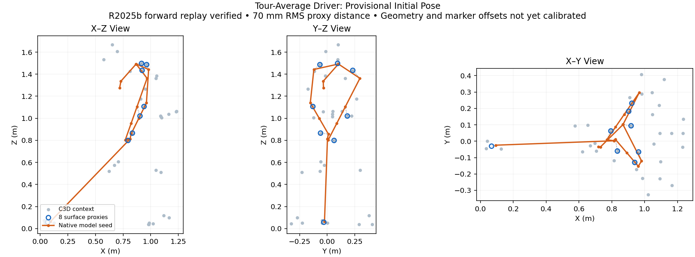

# DeskComputer Native Evidence

R2025b qualification: all 22 native tests pass on DeskComputer in MATLAB 25.2.0.3177638 (R2025b) Update 5. The actual 20 ms forward simulation succeeds with finite joint states and club/grip positions (95.89 s). Source revision: `4191ca3aca126216ea02e26e485ff72908f3ad2b`. Evidence: `native_evidence/native_r2025b_suite.json` and `native_evidence/baseline_r2025b.json`. Actuator-torque extraction and full-swing fitting remain unqualified.

Current acceptance requires MATLAB R2025b. Reports naming R2026a retain their
original provenance and do not qualify the R2025b target.

Captured using MATLAB 26.1.0.3203278 (R2026a) over the existing Tailscale/SSH
connection on 2026-09-09 local time (2026-09-10 UTC). These reports qualify the
execution boundary only, not a tour swing fit. The remote model source is
`e4336293492b5a4ad6948c8a9949c1531ace4c81` with the MATLAB source fixes in this
commit copied into its isolated worktree. The SLX hash matches the task source
as recorded in the parent remote-execution document.

- `workspace_tests_red3.json`: two intended failures before the workspace/raw
  fix; one default-retention test passed. A coefficient requested as 5 produced 1.
- `workspace_clock_tests.json`: all five workspace, geometry, retention and cache
  tests passed after the final timestamp integration.
- `resample_tests_red.json`: eight failures before the helper existed.
- `resample_tests_green.json`: eight passing physical-time, shape and missing-
  coverage tests, including uneven clocks with the same sample counts.
- `native_tests_published.json`: on a fresh checkout of `d1c0ab391`, the five
  workspace tests exposed unnecessary MAT discovery even with explicit joint
  ordering. Eight clock tests passed. Only the shared matching path was added.
- `native_tests_isolated.json`: all thirteen tests pass after the SELF repair
  makes parameter discovery conditional on omitted joint order. This is the
  reproduction command below, with no golf parameter MAT dependency.
- `baseline_corrected.json`: 20 ms real-model run after workspace repair.
- `baseline_clock.json`: repeated real-model run after timestamp repair.
  A solver success and finite club/grip positions do not qualify missing q/qd/tau
  or the remaining body-marker mapping. Requested zeros are not themselves proof
  of actual actuator torque; qualify the logged actuation path separately.
- `sensor_units.json`: live PS-Simulink converter unit settings, with internal
  implementation blocks excluded. Joint angular converters use degrees. Inherited
  units still need source-port qualification before treating them as SI.

Full scripts, logs and raw MAT outputs remain in
`C:/Users/diete/SimscapeTour9921` on DeskComputer. Raw MAT files retain both opts
and theta. They are intentionally not embedded in source control.

The next slice adds `joint_sensor_red.json` (four expected mapping failures and
one passing invalid-coordinate contract) and `joint_sensor_green.json` (all five
pass). `native_joint_suite.json` records all 18 native tests passing together.
`initial_motion_audit.json` records actual initial q/qd and body positions
from the existing raw run; all 27 q/qd/qdd channels are finite using direct buses.
`baseline_joint.json` verifies integration in the real forward wrapper. Its stale
template revision literal is retained separately and explicitly corrected from
the verified runtime checkout; subsequent scripts must compute revision identity.
`shoulder_parameter_audit.json` records mask settings that the referenced gimbal
primitive currently ignores; issue #9927 tracks this actual model defect.

Initialization repair evidence supersedes that defect record:

- `gimbal_targets_red.json` records the six incorrect left-shoulder bindings.
- `gimbal_r2025b_tests.json` records the native save and repeatable value repair.
- `priority_red.json` records Low/None controls failing to reach the primitive.
- `priority_all_selectors.json` verifies independent instances, all 36 selector
  settings and idempotent migrations for gimbal, universal and revolute files.
- `native_initialization_suite.json` records all 22 tests passing in R2026a.
- `baseline_priorities.json` records a successful actual 20 ms forward run with
  the complete repair. Low-priority targets can differ from assembled positions
  to satisfy the closed-chain constraints; they are not prescribed motion.
- `initialization_model_manifest.json` records before/after hashes and verifies
  unchanged block names and physical connections. Native library versions move
  from R2025a to R2025b. No backward-exported Simscape file is delivered.

The checked-in SLX files are already repaired. To reproduce the migrations on
an older archived copy, use MATLAB R2025b, add the shared directory, and run
`repair_gimbal_initial_targets(fullfile(model_directory, 'Kinetically_Driven_Gimbal_Joint.slx'))`
followed by `repair_joint_priority_masks(model_directory)`. Close the referenced
subsystems first. Both functions reject unexpected or unavailable source state;
the priority callback is embedded in each model, without an external runtime
function dependency. Save readable MDL snapshots natively after editing SLX.

To reproduce the tests from a MATLAB repository working directory:

```matlab
shared = fullfile(pwd, 'src', 'engines', 'Simscape_Multibody_Models', ...
    '3D_Golf_Model', 'matlab', 'motion_matching', 'shared');
addpath(shared);
results = runtests({fullfile(shared, 'tests', 'test_simulation_input_workspace.m'), ...
    fullfile(shared, 'tests', 'test_resample_logged_signal.m'), ...
    fullfile(shared, 'tests', 'test_extract_golf_joint_kinematics.m'), ...
    fullfile(shared, 'tests', 'test_gimbal_initial_targets.m'), ...
    fullfile(shared, 'tests', 'test_joint_target_priorities.m')});
assertSuccess(results);
```

Each workspace test creates and closes its own disposable Simulink model; it
does not alter the golf SLX. The helper tests run against native timeseries.
Keep fresh output names for new evidence rather than replacing these reports.

## Actuation Qualification

R2025b actuation audit (SELF): the loaded GolfSwing3D_Kinetic model contains 13 physical joint blocks exposing 27 coordinates, all InputTorque/ComputedMotion. The stale readable main-model snapshot contains a kinematic RE definition absent from the loaded SLX; use the loaded model as authority. Sixteen scalar ActuatorTorque logs exist (scapula, shoulders, wrists and spine); the remaining 11 efforts need qualification. Default KillswitchStepTime is 1 s, shorter than the 1.814 s driver capture, so the fitting configuration must keep actuation enabled through the complete target. Evidence: native_evidence/actuation_audit_r2025b.json. The 2 Nm LSInputX probe succeeded in R2025b: all 21 actuator samples equal 2 Nm over 20 ms, with an explicit 2 s killswitch override (49.67 s wall time). Evidence: native_evidence/torque_probe_r2025b.json; raw replay remains in remote scratch torque_probe_sim_out.mat. This verifies one polynomial-to-actuator path, not all 27 efforts or a fitted swing. Next: qualify the remaining efforts, preserve actuation for the full horizon, and register native body markers and initial pose against the capture.

## Full-Horizon Torque Gate

`capture_gate_red.json` records the failing tests before the configuration
existed. `capture_gate_green.json` records three passing R2025b tests, including
an actual wrapper replay beyond one second and unchanged source workspace
defaults. Reproduce with `runtests(fullfile(shared, "tests", "test_capture_fit_sim_options.m"))`.

## Native Kinematics Solver

`kinematics_solver_probe_r2025b.json` records successful construction against
the exact loaded model and the available joint variables. Add both `src/model`
and `genpath(src/functions)` to the MATLAB path; omitting runtime helper functions
caused the initial MATLAB Function block compilation failure. This establishes
solver availability, not a marker fit or forward-dynamics match.

## Native Frame Parity

`native_frame_parity_r2025b.json` compares 15 frames at three saved forward-run
timestamps. The maximum coordinate error is 2.054e-13 m.
`kinematic_frames_red.json` and `kinematic_frames_green.json` record TDD of the
reusable factory against a newly simulated baseline. Reproduce with
`runtests(fullfile(shared, "tests", "test_golf_kinematic_frames.m"))` in R2025b.

## First Capture Pose Seed

`native_pose_seed_r2025b.json` retains the first-frame C3D hash, source-axis
rotation, eight provisional surface-proxy targets, native coordinates,
optimizer exit and per-target errors. RMS Euclidean proxy distance is
69.635 mm; coordinate RMS is 40.204 mm. KinematicsSolver flag -1 indicates
physical constraints satisfied but some requested target variables missed,
as defined by [MathWorks solve status](https://www.mathworks.com/help/sm/ref/simscape.multibody.kinematicssolver.solve.html).
Use the returned q, not the optimizer request x.

`native_pose_replay_r2025b.json` independently verifies the returned q in a
20 ms torque-driven simulation, with all initial frame positions matching
within 9.722e-13 m. It contains the exact workspace overrides for reproduction:
start with `capture_fit_sim_options(0.02)`, assign the recorded `overrides`
struct to `opts.input_overrides`, and run the existing wrapper with 189 zero
coefficients. This only validates the initial pose; it does not track the swing.

The exploratory optimizer and replay scripts remain in DeskComputer scratch
`SimscapeTour9921/native_pose_seed.m` and `native_pose_replay.m`, alongside their
MAT outputs. The search uses 21 coordinate targets, six right-arm guesses,
100 maximum least-squares iterations, 2400 evaluations, a 0.005 coordinate
prior and a 10-weight requested/achieved-coordinate residual. These are
exploratory seed settings, not qualified full-motion fitting defaults.


