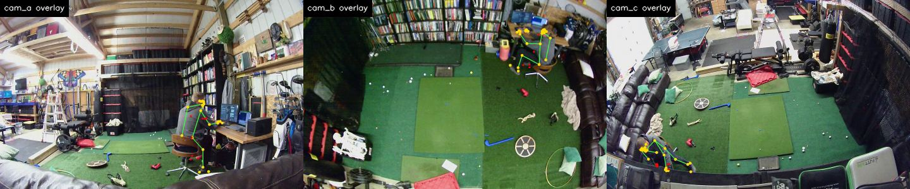

# Capture Rig Multiview: Hardware Evidence

Epic #9818. Recorded and exported on the lab's three-camera rig
(3x ELP AR0234 at 1920x1200@60, plan
`docs/motion_capture/plans/lab_three_view_sonnet.json`) on 2026-09-08, on the
merged main of PRs #9809, #9819, #9820, #9821 and #9823. Every number below
comes from a run on that hardware, not from a synthetic fixture.

## Recording With the Live View Up

A camera cannot be opened twice, so the recorder tees its own preview:
`rig record --live-preview DIR` gives each ffmpeg a second output that decodes
the stream and rewrites `DIR/<view>.jpg` eight times a second, and the tile
shows those snapshots while the take is written.

The decode has to stay cheap or it starves the stream copy. Two takes on the
same rig, one with a full-resolution tee and one with `-lowres:v 2` plus a
256 MB real-time buffer:

| tee                       | cam_a frames | cam_b frames | cam_c frames | take length | outcome   |
| ------------------------- | ------------ | ------------ | ------------ | ----------- | --------- |
| full resolution           | 95           | 393          | 74           | ~7 s        | degraded  |
| quarter resolution (used) | 493          | 494          | 462          | 8 s         | supported |

The quarter-resolution tee holds every camera at its full 60 fps. Snapshots
appear 4.8 s after launch. `--stop-file PATH` ended a 30 s take 6.4 s in,
stopping all three cameras together and removing the file.

Binding a plan to devices costs about 30 s (USB topology plus the DirectShow
listing). `rig record --camera VIEW=INSTANCE_ID` skips it using the ids the
preview already bound, so a second take starts in seconds.

## Composite Export

`rig multipicture` writes one video through a `LayoutSpec`. Both exports below
come from the same 10 s take (596/591/593 frames, outcome `supported`).

Recorded tiles, `three_across`, frames 200-320, 1440x300 at 60 fps:


Overlay tiles, a 1x3 layout of `kind: overlay`, same session, frames 20-140.
MediaPipe found the subject in 448 of 450 ingested frames (150/150, 149/150,
149/150):



Each export writes a `mosaic-clip/1.0.0` sidecar beside the video holding the
layout, the resolved sources, the frame range, fps, speed and canvas size,
stamped with the tool version, git SHA and hashed inputs, so a composite can be
traced back to its recordings the way every other pipeline artifact can.

## Reproducing

```bash
python3 -m src.motion_capture.rig record --plan docs/motion_capture/plans/lab_three_view_sonnet.json \
    --duration 10 --out sessions/<take> \
    --live-preview sessions/<take>/.live --stop-file sessions/<take>/.stop
python3 -m src.motion_capture.rig ingest --session sessions/<take> --max-frames 150
python3 -m src.motion_capture.rig multipicture --session sessions/<take> \
    --layout three_across --from 200 --to 320 --size 1440x300 --out multiview.mp4
```

The overlay figure uses a layout file whose tiles are `kind: overlay`; build one
in the tile's layout editor and save it, then pass its name to `--layout`.
