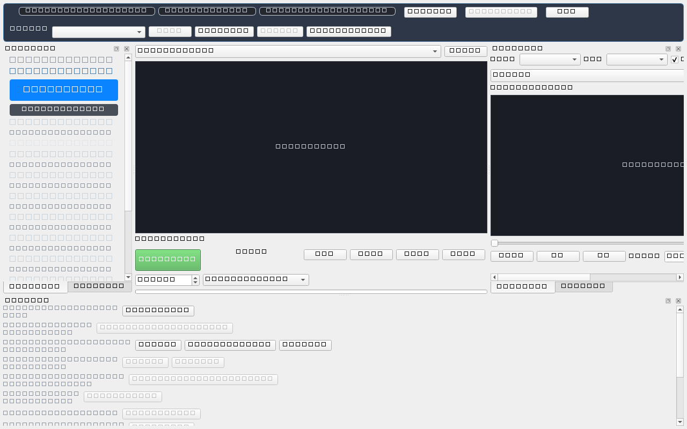

# Capture Rig GUI: Responsive Layout and Sizing Evidence

Epic #9843 / Issue #9848. Evidence recorded on UpstreamDrift's Capture Rig GUI
following the layout inversion (#9846) and responsive compaction adaptation (#9847).

## Summary of Changes

Historically, `CaptureRigWidget` placed controls in the central widget, causing
Qt layout negotiation to expand the widget's `minimumSizeHint().width()` to **3276 px**
— significantly wider than a standard 1920x1080 display and impossible to fit on
laptop panels without severe horizontal clipping and horizontal scrollbars.

The layout overhaul inverted the hierarchy:

1. **Central Live Preview**: The multi-camera preview canvas and recording transport
   occupy the central widget, retaining the dominant share of window width.
2. **Peripheral Docks with Scrolling**: Controls (Workflow Rail, Settings/Inputs,
   Playback, Results, and Actions) are placed in docks wrapped in `QScrollArea`.
3. **Log Drawer**: The command log is a drawer tabbed behind Actions, preventing
   vertical space starvation of the preview.
4. **Responsive Compaction (< 1400 px)**: At window widths below 1400 px, `resolve_layout_mode`
   selects `LayoutMode.COMPACT`, automatically tabifying the control docks into a single
   240 px left column. This leaves the central live preview dominant (> 50% of window width)
   without requiring a horizontal scrollbar.

## Before / After Metric Comparison

| Metric                                   | Before Overhaul (Historical) | After Reflow Grid (#9844) | With Responsive Inversion (#9847)   |
| ---------------------------------------- | ---------------------------- | ------------------------- | ----------------------------------- |
| **`minimumSizeHint().width()`**          | **3276 px**                  | 1737 px                   | **478 px** (guard cap $\le$ 900 px) |
| **Window fit at 1280x800 (laptop)**      | Broken (horizontal overflow) | Clipped                   | **Fully fits (no scrollbar)**       |
| **Preview width at 1280x800**            | 68 px (starved)              | ~300 px                   | **656 px (51.3% of window)**        |
| **Controls width at 1280x800**           | > 2000 px                    | ~980 px                   | **240 px (single tabified column)** |
| **Preview vs Controls Ratio (1280x800)** | 0.03 : 1                     | 0.31 : 1                  | **2.73 : 1**                        |

## Visual Evidence

The screenshot below captures the Capture Rig widget mounted inside a `QMainWindow`
at **1280x800** offscreen resolution:

At 1280x800:

- Left docked column: `Workflow` tabified with `Inputs` / `Settings` (width: 240 px).
- Central live preview canvas: 656 px wide, dominating the viewport.
- Bottom actions: cleanly docked and scrollable without stretching widget minimum width.

## Verification

- Automated regression guard `test_minimum_width_standing_regression_guard` passes in `tests/tools/capture_rig/test_responsive.py`, enforcing `minimumSizeHint().width() <= 900`.
- Multi-resolution layout tests `test_responsive_modes_and_preview_width_at_1280_1600_1920` verify preview dominance across 1280, 1600, and 1920 px widths.
