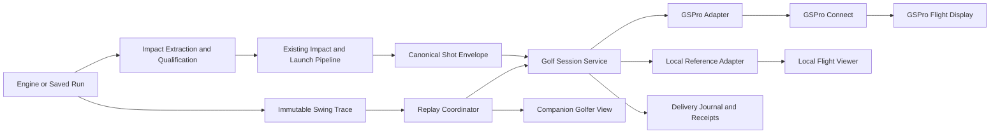
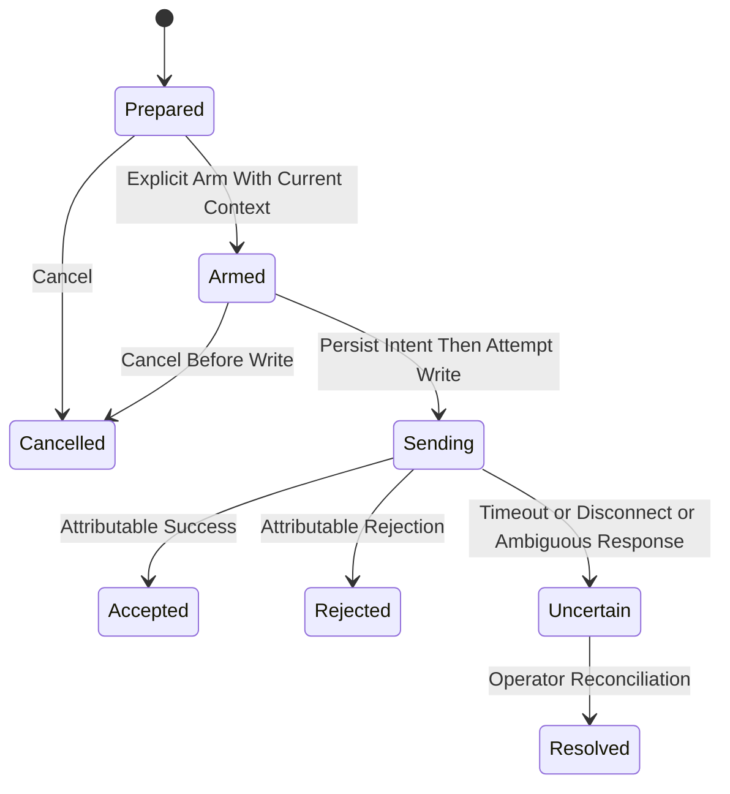

# Architecture and Contracts

## Status and Ownership

Proposed implementation baseline for [epic #10188](https://github.com/D-sorganization/UpstreamDrift/issues/10188).
The lead owns this design, protocol characterization, impact qualification and
delivery semantics. It is ready to guide implementation; vendor-sensitive wire
conventions remain gated until M0 evidence is reviewed. Names below identify
**proposed** interfaces and files, not existing callable APIs.

## Boundaries



The simulator port represents **shot acceptance**, not numerical flight
integration. Do not force GSPro into existing `FlightSimulatorProtocol`, whose
callers expect a trajectory. The local adapter wraps that numerical interface;
the GSPro adapter returns delivery evidence and only documented telemetry.
GSPro owns its displayed flight; UpstreamDrift owns model/impact provenance.
No unverified conversion of local carry into a supposed GSPro landing result.

## Proposed File Ownership

| Area                      | Path                                                              | Responsibility                                                 |
| ------------------------- | ----------------------------------------------------------------- | -------------------------------------------------------------- |
| Public Integration Facade | `src/shared/python/golf_simulator/__init__.py`                    | Curated contracts, factory, session service                    |
| Domain                    | `src/shared/python/golf_simulator/contracts.py`                   | Immutable shot, session, capabilities and receipts             |
| Application               | `src/shared/python/golf_simulator/session.py`                     | State machine, one-shot policy and destination lifecycle       |
| Conversion                | `src/shared/python/golf_simulator/launch_bridge.py`               | Existing public results to canonical values and provenance     |
| Persistence               | `src/shared/python/golf_simulator/journal.py`                     | Durable local shot intent and delivery outcome                 |
| GSPro                     | `src/shared/python/golf_simulator/adapters/gspro/`                | Versioned profile, codec, bounded stream reader and client     |
| Reference                 | `src/shared/python/golf_simulator/adapters/local.py`              | Wrap existing local flight implementation                      |
| Presentation              | `src/shared/python/golf_simulator/replay.py`                      | Clock, impact-trigger coordination and viewer events           |
| API                       | `src/api/{routes,services}/`                                      | Follow existing auth/lifecycle patterns; thin service calls    |
| Desktop Tool              | `src/tools/golf_simulator/`                                       | Lazy GUI wrapper and launcher embedding                        |
| Tests                     | `tests/unit/golf_simulator/`, `tests/integration/golf_simulator/` | Reusable contracts, numerical fixtures and TCP fault injection |

Split modules before the 1,200-line limit. Do not modify vendored Tools code.
If reuse requires a new Tools API, prepare the provider change in Tools and
pin it through the existing dependency process. Do not promote golf-specific
socket orchestration into generic Tools simply because it is shared by engines.

## Canonical Shot Contract

Prefer a versioned immutable `ShotEnvelope` with tuple-backed three-vectors.
Reuse existing launch/impact types at ingress; the envelope adds identity,
reference-frame and delivery provenance rather than duplicating physics.

| Field                          | Contract                                                                                              |
| ------------------------------ | ----------------------------------------------------------------------------------------------------- |
| `schema_version`               | Major-versioned identifier; unknown major rejected                                                    |
| `shot_id`                      | Application-generated UUID, stable for this logical submission                                        |
| `session_id`                   | UUID identifying the application session                                                              |
| `model_run_id`, `trace_digest` | Immutable run identity and SHA-256 of replay artifact; required for model sources                     |
| `impact_id`, `impact_time_s`   | Event identity and simulation time inside trace interval; manual source explicitly marks unavailable  |
| `source_kind`                  | `manual`, `demo_peak_speed`, `model_contact`, `imported`; never inferred from filename                |
| `qualification`                | Separate contact/numerical/scientific statuses with evidence references; no single misleading boolean |
| `ball_velocity_m_s`            | Finite 3-vector in named launch frame                                                                 |
| `ball_angular_velocity_rad_s`  | Finite 3-vector in that same frame; includes spin direction                                           |
| `frame`                        | Right-handed target-local axes: +x forward, +y left, +z up                                            |
| `aim_context`                  | Explicit source-to-target rotation, revision and provenance; not an assumed GSPro global heading      |
| `club_data`                    | Optional typed values with units and presence; missing is not zero                                    |
| `created_at_utc`               | Audit time; never the replay timing clock                                                             |

Post-impact vectors are the preferred canonical input, since they preserve
spin information. When accepting `LaunchConditions`, validate then convert
once: reconstruct velocity from speed/radian angles; reconstruct angular
velocity as normalized axis × RPM × 2π/60. Do not treat the field name
`spin_rate` as sufficient evidence that it is backspin: the pipeline computes
the magnitude of the complete angular-velocity vector.

### Reference Frames and Loss

- Transform both velocity and axial angular velocity with a validated proper
  rotation (`RᵀR = I`, determinant +1). Reflections require a deliberate axial
  vector rule, not blindly applying the same handedness swap to every vector.
- Canonical azimuth is `atan2(v_y, v_x)`; positive points left. It is independent
  of player handedness. Do not flip shot direction merely because the player
  is left-handed.
- Vertical launch is `atan2(v_z, hypot(v_x, v_y))`. Reject vertical/retrograde
  shots for a GSPro profile unless that exact case is qualified; do not silently
  assign a useful horizontal bearing to an undefined direction.
- Keep the full angular vector in the journal. A vendor's two-dimensional
  spin representation may lose spin parallel to ball velocity. Define a reviewed
  projection policy and record the discarded component; reject above the
  profile's loss tolerance. No arbitrary total-spin/axis decomposition.
- Zero spin is valid; use the profile's canonical zero-axis convention on wire.
  A zero-speed event is no strike and must not increment a transmitted shot.
- SI and radian values remain canonical. GSPro speed/spin/angle conversions
  belong only in its profile/codec. Mathematical conversion constants can be
  tested now; GSPro field semantics and signs cannot be declared verified yet.

### Design by Contract

Every public constructor/service entry validates finite numbers, exact shapes,
nonempty identities, immutable ownership and allowed state transitions. Reject
booleans as numeric payloads where Python would otherwise accept them. Apply
schema limits before allocating large arrays or reading replay files.

Boundary validation must execute with `python -O` and with optional diagnostic
DbC enforcement disabled. Use descriptive `ValueError`/`TypeError` and existing
state/domain exception hierarchies; do not rely exclusively on assertions or
configurable `require()` calls for wire safety. Internal invariants can reuse
the existing contract package. Never silently clamp physically invalid data.
Vendor operating ranges are versioned profile settings, not fabricated universal
physics limits. Tolerances must have units, rationale and independent tests.

## Simulator Port

Proposed async facade:

```text
SimulatorAdapter
  capabilities() -> SimulatorCapabilities
  connect(config) -> ConnectionStatus
  submit(shot) -> SubmissionReceipt
  events() -> async iterator[SimulatorEvent]
  disconnect() -> None

GolfSessionService
  select_destination(adapter_id, config)
  prepare(shot) -> PreparedShot
  arm(prepared_shot_id, context_revision)
  submit_at_impact(prepared_shot_id)
  cancel(prepared_shot_id)
  delivery_status(shot_id)
  resolve_uncertain(shot_id, operator_evidence)
```

Service code sees only adapter capabilities and typed results. No engine needs
a socket, no widget creates GSPro JSON, and no controller reaches through
`service.adapter.client.writer`. Inject the clock, journal and adapter factory
so tests can deterministically exercise failure states.

Capabilities include shot input, club data, player updates, local trajectory,
course state, shot result, aim control and native avatar animation. Use
`supported`, `unsupported`, or `unverified` with version/evidence, not hopeful
booleans. GSPro course/result/avatar/aim capabilities remain unavailable until
qualified. Connecting a socket is not proof the course is ready to receive shots.

## GSPro Profile and Stream Handling

M0 produces a profile identified by installed GSPro release, connector version,
API revision and convention-evidence digest. Schema, framing, range and
heartbeat rules are read through that profile. Do not automatically mark a new
GSPro release compatible; rerun a scoped qualification suite after updates.

Use a long-lived async connection with one reader and serialized writes.
TCP reads are arbitrary chunks. Handle split/coalesced JSON, escaped braces,
UTF-8 split boundaries, leading whitespace, partial EOF and bounded nesting.
Use an incremental UTF-8 decoder and an actual JSON parser with retained tail;
do not count braces in strings or assume one `recv` equals one message. If
observations establish a delimiter, record it and test it. Outbound framing
must match the qualified profile; do not prepend a homegrown length header.

Apply configurable byte limits, message deadlines, bounded queues and clean
cancellation. Proposed starting local-test budgets: 64 KiB buffered message,
5 s connect/response deadline and one in-flight shot. These are engineering
defaults for tests, **not vendor guarantees**; M0 must confirm usable values.
Use monotonic time, narrow network/decoding exceptions and structured logging.
Always close and await the writer within a bounded cleanup deadline.

### Acknowledgment Ambiguity

One in-flight shot is necessary but may be insufficient: public responses do
not establish a unique echoed transaction ID, and status/heartbeat responses
could be confused with shot success. A generic successful response is not a
flight-complete event. A completed `drain()` is not remote acceptance.

M0 must characterize response classes, ordering, late/duplicate responses and
heartbeat interaction. Qualify an acknowledgment only if its attribution to
the pending shot is supported by evidence. If no safe attribution exists,
record `sent_unconfirmed`; require visual/operator reconciliation and report
that reduced capability. Do not turn an arbitrary 200 into `accepted` merely
because there is one pending shot. Suspend unrelated outbound status exchanges
only if the verified heartbeat contract permits doing so.

`sent_unconfirmed` is a reason/substatus of the durable `Uncertain` outcome,
not a competing state. UI may show that more specific wording. The stored
terminal outcome set is `accepted`, `rejected`, `cancelled`, `uncertain`;
operator reconciliation adds evidence and a resolution without rewriting the
historical transport outcome. Local-reference acceptance is explicitly tagged
as local and never represented as a GSPro response.

## Delivery State Machine and Journal

Connection lifecycle: `disconnected → connecting → connected → disconnected`.
Faults carry structured reasons. Arming is a separate operator/application
state, not a synonym for connected or a launch-monitor-ready flag.



- The journal records durable intent **before** the first write, including
  shot/session/connection-generation identity, payload digest, profile and
  sequence. Store accepted/rejected/uncertain outcomes transactionally.
- A crash between durable intent and final result means uncertain on restart,
  even if no write may actually have occurred. Favor avoiding duplicate shots.
- Reusing an application shot ID with the same digest returns the recorded
  state; a different digest is a conflict. Local idempotency does not establish
  GSPro deduplication or exactly-once delivery.
- Once any write was attempted, timeout, cancellation, 5XX or disconnect can
  indicate partial/ambiguous delivery. Treat vendor errors as definitive
  rejection only when the qualified response contract warrants it.
- Never automatically replay uncertain or rejected submissions. Connection
  establishment can retry with bounded backoff, but shots require a new
  deliberate decision. Distinguish reconnect from resend.
- Increment wire shot sequence according to the qualified session rules;
  never use the sequence as a proven server idempotency key. Persist its mapping
  to application identity and handle rollover before it happens.
- Unknown/stale responses and events from previous connection generations
  cannot resolve a new shot. An uncertain shot inhibits subsequent submission
  until reconciliation prevents a late response from being misattributed.
- Journal storage failure before send means do not send. Failure after send
  produces a visible uncertainty/recovery condition. Apply retention limits
  without deleting unresolved records or needed audit evidence.

## Replay and Display

Precompute expensive model trajectories, then replay against a monotonic
presentation clock. A trace has one immutable impact event and associated shot.
Pause/seek/slow motion are presentation controls and do not resubmit the shot.
During an armed normal-speed playback, submit once when the clock crosses the
impact time. Seeking across that instant disarms submission; playing again
requires an explicit new shot operation. Context/club/destination changes
invalidate the prepared arm token.

Use existing viewport/skeleton/realtime components for pose updates. Best-effort
presentation events can drop frames; authoritative impact triggering and the
delivery journal live in the session service. A dropped UI frame must neither
lose a submission decision nor create an extra shot.

Record impact-clock time, send-attempt time, response time and visually observed
flight onset separately. Suggested performance target: p95 impact-to-write
under 50 ms on the qualified host over at least 100 local/fake samples, and a
documented observed GSPro onset distribution over 20 deliberate range shots.
The 50 ms target excludes model computation and remote rendering. Do not promise
frame-accurate GSPro synchronization without a vendor timing API.

Initial layout: existing model viewer plus GSPro window/second screen. A later
optional compositor may combine them where supported; it owns neither GSPro's
depth buffer nor camera. Native avatar work needs a supported extension surface
for mesh loading, skeleton mapping, animation clocks, materials and camera/depth
alignment. Unity-based course authoring alone does not satisfy this requirement.

## API, Remote Hosts and Operations

Keep the GSPro adapter on the licensed Windows host and bind the vendor socket
locally. A Python model may run on another host and use an authenticated,
encrypted UpstreamDrift control connection. Reuse existing API authentication,
configuration, process lifecycle and event facilities after verifying their
actual contracts. Browser JavaScript calls the application service, not raw TCP.

Proposed endpoints under the existing API: destination capabilities; session
create/status/close; prepare/arm/cancel shot; submit; receipt/status; replay
events. Specify bounded request schemas and distinguish validation, conflict,
unavailable destination and uncertain delivery. An HTTP timeout must return a
queryable shot identity, not encourage clients to create a duplicate operation.
State-changing requests require existing authentication and origin protections.

Do not expose unauthenticated GSPro TCP port 921 to the public internet or
automatically add broad firewall exceptions. Remote deployment is opt-in with
an explicit trusted endpoint and application authentication; keep credentials
in existing configuration/secret handling and out of receipts. Support one
active shot producer per GSPro session to prevent collisions with a real launch
monitor. Display the active model/demo source and simulator destination.

Launch GSPro through its supported user flow. Do not automatically accept
licenses, install updates, alter third-party settings or modify binaries. Store
nonsecret app/connector versions and capability evidence in a support receipt.
Optional GUI dependencies must remain lazy; offline tests require no GSPro.

## Autonomous Golf and Physics Ownership

An open-loop model shot can be displayed without knowing the whole course.
Closed-loop golf needs current ball position/lie, target, wind, green state,
shot outcome, penalties and legal action control. The reviewed GSPro shot API
does not establish those inputs. Provide operator-entered, revisioned context
first; never substitute a local predicted landing point for observed GSPro state.

A future `CourseContextProvider` and `ShotPolicy` should remain independent of
the simulator adapter. The local reference environment can provide deterministic
state for controller development; GSPro autonomous rounds stay gated on a
supported telemetry/control contract. Do not use leaderboard play for model
testing. Preserve both local prediction and simulator observations with provenance
when comparing flight; differences are research data, not automatically bugs.

## Test Checkpoints

| Layer            | Tests Written First                                                                                           | Acceptance                                               |
| ---------------- | ------------------------------------------------------------------------------------------------------------- | -------------------------------------------------------- |
| Canonical Domain | Nonfinite, shapes, frame rotations, immutable snapshots, source provenance, optimized-Python validation       | Invalid input never reaches adapter                      |
| Unit Conversion  | Independent vector/angle/RPM goldens; ± directions; zero spin; lossy spin detection                           | Sign and unit errors cannot hide behind round-trip tests |
| Codec            | Exact required/present fields, missing club data, version handling, output determinism                        | Independent expected payloads from qualified profile     |
| Stream           | Every byte split, multiple messages/read, UTF-8 split, escapes, malformed/oversized input, EOF                | Bounded memory and deterministic errors                  |
| Lifecycle        | Heartbeat interleave, stale success, duplicate click, disconnect after write, crash recovery, journal failure | No silent duplicate; uncertainty visible                 |
| Source Bridge    | Full impact field sensitivity, contact vs peak speed, repeated contact suppression, unavailable engines       | Accurate source classification and one event             |
| Replay           | Pause, seek across impact, speed change, dropped frames, cancel and context change                            | Replay cannot accidentally submit                        |
| Substitution     | Identical service suite for fake, GSPro test peer and local reference                                         | No vendor branching in domain/UI                         |
| Live             | Versioned range shots, direction calibration, putting, visual synchronization, restart/reconnect              | Actual licensed evidence, independently reviewed         |

Require red→green evidence for behavior changes, narrow regression tests and
the existing repository quality gates. Mutation checks should demonstrate that
a flipped direction, ×60 spin error, discarded impact field or automatic resend
causes a test failure. Avoid tests that calculate expected wire values with the
same production converter. Physics changes additionally follow the canonical
manual/calculation governance; this planning document grants no scientific approval.
