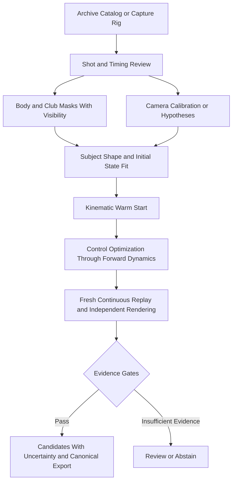

# Architecture and Optimization Plan

## Pipeline



## Ownership and Proposed Structure

New implementation belongs in `src/shared/python/shadow_tracker/`, with a small
public façade and injected providers. The source README reserves the space;
modules below are planned, not shipped. Mirror their names in
`tests/unit/shadow_tracker/` and place real boundary tests under
`tests/integration/shadow_tracker/`.

| Planned Module      | Responsibility                                 | Must Delegate                             |
| ------------------- | ---------------------------------------------- | ----------------------------------------- |
| `contracts.py`      | Immutable image-evidence and run records       | Existing camera/state primitives          |
| `ingestion.py`      | Shot, timestamp, and asset normalization       | Existing video decode/capture services    |
| `segmentation.py`   | Provider protocol, correction provenance       | Optional segmentation model               |
| `projection.py`     | Image-plane mask and contour residuals         | Existing camera math and shape geometry   |
| `initialization.py` | Subject, camera, and initial-state hypotheses  | Shared FK, pose, anthropometrics          |
| `fitting.py`        | Bounded staged optimization                    | Engine adapter and existing control basis |
| `evaluation.py`     | Replay and evidence gates                      | Shared contact/trajectory metrics         |
| `artifacts.py`      | Versioned result bundle and atomic persistence | Existing result/export services           |
| `service.py`        | Jobs, cancellation, progress, resume           | Existing application job infrastructure   |

Engine-specific adapters remain in their engine packages. UI presenters extend
Video Analyzer/Capture Rig or their shared session views after an interaction
review. Keep a single headless application service used by both UI surfaces.

## Forward Model

Let `x=(q,v)`, subject inertial parameters be `p`, control coefficients be `a`,
camera parameters be `c`, and visual envelope parameters be `b`.
The simulator obeys, in its declared coordinates:

```text
q_dot = N(q) v
M(q,p) v_dot + h(q,v,p) = B(q) u(t;a) + J(q)^T lambda
S_hat[k,t] = Rasterize(VisualGeometry(q(t), b), Camera[k,t](c))
```

Contact and grip constraints determine admissible `lambda`. Do not optimize
unconstrained per-frame root forces as a hidden means of fitting images. A
declared feedback controller may be explored, but the initial baseline exports
time-based controls and replays them without observations or target feedback.
Ball impact requires a declared event/impulse model or an explicitly excluded
interval; pre-impact success does not qualify follow-through.

## Objective and Constraints

Minimize robust, visibility-weighted residuals over observed camera/time pairs:

```text
L = w_mask L_mask + w_contour L_contour + w_club L_club
  + w_keypoint L_keypoint + w_temporal L_temporal
  + w_control L_control + w_prior L_prior
```

- `L_mask`: soft overlap or occupancy residual on valid pixels; never score
  unknown pixels as background. Empty/empty masks have no positive evidence.
- `L_contour`: symmetric signed-distance/boundary residual, normalized by image
  diagonal; ensure offscreen predictions and missing visible limbs are penalized.
- `L_club`: separately normalized shaft/head outline or endpoint reprojection;
  body pixels must not drown out the thin club.
- `L_keypoint`: optional confidence-weighted measured 2D evidence, retained as
  such. Keypoints are aids, not a replacement for silhouette fitting.
- `L_temporal`: smooth controls/appearance/camera tracks, respecting actual
  timestamps, cuts and impacts. Do not smooth through discontinuities blindly.
- `L_control`: bounded effort and variation, with units and reference scales.
- `L_prior`: disclosed shape, pose, camera and timing priors; report their
  contribution independently from data fit.

Hard acceptance constraints cover dynamics replay, actuation, joint limits,
contacts, grip closure, and finite states. Penalties may guide optimization but
cannot buy permission to violate final constraints. Freeze loss scales and
weights on development data; store them in each result.

## Staged Solver

1. Validate evidence, camera classes, physical-time hypotheses, and model
   capabilities. Construct one fixed subject morphology per swing.
2. Fit address/first usable frame jointly with camera and visual envelope under
   bounds. Do not force an address pose if the archive starts mid-swing. Estimate
   initial velocity from a short window or retain velocity hypotheses; zero
   velocity is not a general assumption.
3. Fit a kinematic sequence for initialization and diagnostics. This intermediate
   output is labeled kinematic and cannot pass forward-dynamics acceptance.
4. Use inverse dynamics only as a control seed. Search bounded control
   coefficients and the initial state through actual forward rollouts. Reuse
   existing degree-six polynomial torque evaluation initially, preserving its
   time basis explicitly. Escalate basis changes if it cannot represent the swing.
5. Progress from short windows to the full interval; maintain fixed morphology
   and camera constraints. Multiple shooting or collocation may initialize the
   optimization, but final acceptance uses one uninterrupted rollout from `x0`.
6. Render a fresh replay in observed and held-out views. Recompute all evidence
   metrics. Audit state resets, contacts, controls, and time coverage.
7. Repeat plausible initializations and perturb camera, timing, masks, scale,
   masses, and contact assumptions. Retain distinct acceptable candidates. A
   multistart envelope is a sensitivity range, not a calibrated posterior.

## Runtime and Reproducibility

Use coarse-to-fine masks and cached distance transforms. Cache identity includes
source/mask/camera/model hashes, renderer configuration and loss version. Do not
reuse caches after manual correction without invalidation. Bound evaluation
count, memory, wall time and checkpoint size; record the best physically valid
candidate separately from the best objective. Cancellation returns a labeled
partial result. Resume only with compatible hashes and configuration.

Record cold/warm timing, hardware, thread count, precision, seed, engine build,
integrator and tolerances. No real-time promise precedes measured qualification.
Rendering used for final scoring must be tested against the optimization
renderer; soft rasterization artifacts must not masquerade as fit accuracy.

## Decision Record

- **ST-D1:** Silhouettes are image evidence, never synthetic measured markers.
- **ST-D2:** Reuse canonical dynamic state; do not create another joint ordering.
- **ST-D3:** Visual appearance and inertial parameters are separate but bound to
  the same skeleton; silhouette fitting alone cannot estimate inertia reliably.
- **ST-D4:** Continuous fresh replay is mandatory even after segmented fitting.
- **ST-D5:** Unknown historical camera/time/scale remains explicit uncertainty.
- **ST-D6:** No advertised engine or UI capability before a real integration test.

Change a decision through a focused ADR with affected contracts, regression
tests, migration, and scientific reviewer rationale. Do not silently override it.
