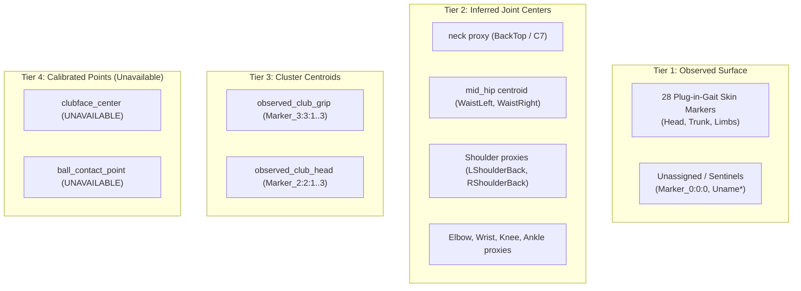
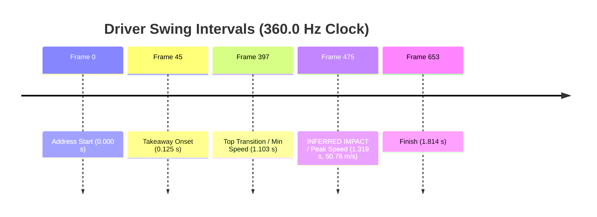

# Tour Target Audit, Marker Semantics, Events, and Provenance

Parent Epic: [#10584](https://github.com/D-sorganization/UpstreamDrift/issues/10584)  
Governing Program: Matched Swing Program ([#10363](https://github.com/D-sorganization/UpstreamDrift/issues/10363))  
Task Reference: [#10586](https://github.com/D-sorganization/UpstreamDrift/issues/10586) (TB-01)  
Prerequisite: [#10585](https://github.com/D-sorganization/UpstreamDrift/issues/10585) (TB-00, merged in PR [#10598](https://github.com/D-sorganization/UpstreamDrift/pull/10598))

---

## 1. Executive Summary and Problem Statement

The Tour Baselines Program relies on two reference motion capture datasets: the Tour-Average Driver swing and the Tour-Average 7-Iron swing. While these files have been used historically in multiple engine lanes (Simscape, Pinocchio, MuJoCo, Drake, OpenSim), ambiguity previously existed regarding:

1. **Exact Marker Semantics**: Skin-mounted surface markers, rigid cluster centroids, and inferred anatomical joint centers were frequently conflated.
2. **Missing Occlusion Auditing**: Surface markers such as `RShoulderTop` suffer extensive occlusions (>80% of frames missing), and clubhead clusters experience optical dropouts during high-speed release.
3. **Event Detection and Native Rates**: Previous implementations occasionally imposed the Driver's 360 Hz sample rate or event indices onto the 359 Hz 7-Iron. Furthermore, neither file contains embedded C3D `EVENT` annotations; impact was often treated as an authoritative measurement rather than a trajectory-derived inference.
4. **Provenance Gaps**: Original capture conditions, camera calibration logs, and player demographics were unspecified in source headers.

TB-01 establishes a formal audit, a 4-tier measurement map, exact missing span tracking, native-clock event detection with labeled inferred impact, explicit provenance accounting, and dual canonical target emitters compatible with kinematic reference (`MotionDraft`) and dynamics fitting (`BodyTarget`, `ClubTarget`) pipelines.

---

## 2. Raw Capture Identities and Duplicate Verification

Both canonical captures are verified by content hash (SHA-256) and parameter structure:

| Parameter          | Tour Driver Capture                                                | Tour 7-Iron Capture                                                |
| :----------------- | :----------------------------------------------------------------- | :----------------------------------------------------------------- |
| **Canonical File** | `data/C3D_TA_Driver.c3d`                                           | `data/C3D_TA_Iron.c3d`                                             |
| **SHA-256 Digest** | `545405ccdbae87a297d16951487b501d5d76f5a2ab253cfc6d797744184943ba` | `395deb1f91006586819020fc85180409e716f07e1c680f9fb2ca114759f80845` |
| **Sample Rate**    | 360.0 Hz                                                           | 359.0 Hz                                                           |
| **Total Frames**   | 654                                                                | 657                                                                |
| **Duration**       | 1.813889 s                                                         | 1.827298 s                                                         |
| **Spatial Units**  | Metres (`m`)                                                       | Metres (`m`)                                                       |
| **Vertical Axis**  | `+Y` (Vicon plug-in-gait convention)                               | `+Y` (Vicon plug-in-gait convention)                               |
| **Handedness**     | Right-handed golfer                                                | Right-handed golfer                                                |
| **Marker Count**   | 38                                                                 | 38                                                                 |

### Content-Based Duplicate Verification

Duplicate copies distributed across engine subdirectories were audited and confirmed byte-for-byte identical to the canonical root files:

- **Driver Copies (SHA-256: `545405ccdbae...`)**:
  1. `data/C3D_TA_Driver.c3d`
  2. `src/engines/Simscape_Multibody_Models/3D_Golf_Model/matlab/Data/Mocap C3D Files/C3DExport Tour average.c3d`
  3. `src/engines/physics_engines/pinocchio/data/tour_average_mocap/C3DExport Tour average.c3d`
- **7-Iron Copies (SHA-256: `395deb1f9100...`)**:
  1. `data/C3D_TA_Iron.c3d`
  2. `src/engines/Simscape_Multibody_Models/3D_Golf_Model/matlab/Data/Mocap C3D Files/C3DExport tour average iron.c3d`
  3. `src/engines/physics_engines/pinocchio/data/tour_average_mocap/C3DExport tour average iron.c3d`

---

## 3. Independent Marker Label Review

Driver and 7-Iron captures share 37 identical marker labels, with exactly one marker difference:

- **Driver Only**: `Uname*38` (unassigned optical label).
- **7-Iron Only**: `pelvis` (pelvic surface marker replacing `Uname*38`).

| Group                            | Count                  | Marker Labels                                                                                                           |
| :------------------------------- | :--------------------- | :---------------------------------------------------------------------------------------------------------------------- |
| **Head (3)**                     | 3                      | `HeadTop`, `HeadFront`, `HeadSide`                                                                                      |
| **Trunk (3)**                    | 3                      | `BackTop`, `BackLeft`, `BackRight`                                                                                      |
| **Pelvis (4/5)**                 | 4 (Driver) 5 (Iron) | `WaistLeft`, `WaistRight`, `WaistLBack`, `WaistRBack` _(Iron also includes `pelvis`)_                                |
| **Left Arm (5)**                 | 5                      | `LShoulderTop`, `LShoulderBack`, `LUArmHigh`, `LElbowOut`, `LWristTop`                                                  |
| **Right Arm (5)**                | 5                      | `RShoulderTop`, `RShoulderBack`, `RUArmHigh`, `RElbowOut`, `RWristTop`                                                  |
| **Left Leg (4)**                 | 4                      | `LKneeOut`, `LToeIn`, `LToeOut`, `LAnkleOut`                                                                            |
| **Right Leg (4)**                | 4                      | `RKneeOut`, `RToeIn`, `RToeOut`, `RAnkleOut`                                                                            |
| **Club Clusters (6)**            | 6                      | Clubhead: `Marker_2:2:1`, `Marker_2:2:2`, `Marker_2:2:3` Grip / Butt: `Marker_3:3:1`, `Marker_3:3:2`, `Marker_3:3:3` |
| **Unassigned / Sentinels (4/3)** | 4 (Driver) 3 (Iron) | Driver: `Marker_0:0:0`, `Uname*36`, `Uname*37`, `Uname*38` Iron: `Marker_0:0:0`, `Uname*36`, `Uname*37`              |

---

## 4. 4-Tier Measurement Map

Downstream metrics must never treat surface markers as direct bone joint centers or clubhead face locations. The versioned measurement map (`v1.0`) strictly partitions measurements into four tiers:

1. **Observed Surface Markers**: 28 skin-mounted retroreflective markers directly tracked by the optical system.
2. **Inferred Joint Centers**: Anatomical center proxies computed from surface landmarks. Explicitly noted as proxies (e.g. `neck` is approximated by `BackTop` at C7; posterior shoulder markers `LShoulderBack` / `RShoulderBack` avoid anterior occlusions).
3. **Cluster Centroids**: Rigid-body marker clusters on the grip and clubhead.
4. **Calibrated Points**: Clubface orientation and ball contact center. Because optical calibration of the face center was not recorded in the raw C3D files, these measurements are formally marked **UNAVAILABLE** (`is_available: false`). They must not be guessed or fabricated.

---

## 5. Missing Data and Occlusion Spans

Residual validity is verified: samples with negative residuals or non-finite coordinates are masked invalid (`NaN`). Contiguous missing intervals were audited:

### Driver Occlusions (654 Frames Total)

- `RShoulderTop`: 526 missing samples (80.4% occluded), span `[0, 525]`. The player's posture and shoulder turn occlude the anterior/superior marker during address, backswing, and early downswing.
- `Marker_2:2:{1,2,3}` (Clubhead Cluster): 36 missing samples, spans `[444, 444]`, `[518, 550]`, `[652, 653]`. Dropped during late follow-through release.
- `Marker_3:3:{1,2,3}` (Grip Cluster): 21 missing samples, spans `[545, 555]`, `[557, 563]`, `[565, 565]`, `[652, 653]`.
- `WaistRight`, `Uname*36`, `Uname*38`: 5 missing samples, span `[446, 450]`.
- `Marker_0:0:0`: 5 missing samples, spans `[556, 556]`, `[564, 564]`, `[566, 568]`.

### 7-Iron Occlusions (657 Frames Total)

- `RShoulderTop`: 562 missing samples (85.5% occluded), span `[0, 561]`.
- `LShoulderTop`: 110 missing samples, span `[0, 109]`.
- `Marker_2:2:{1,2,3}` (Clubhead Cluster): 17 missing samples, span `[544, 560]`.
- `WaistRight`, `Uname*37`, `pelvis`: 8 missing samples, spans `[488, 490]`, `[494, 498]`.

---

## 6. Native-Clock Swing Intervals & Inferred Impact

Neither C3D file contains embedded `EVENT` groups. All swing phases are derived from kinematics on the native clock:

| Phase / Event        | Driver (360.0 Hz)                                                        | 7-Iron (359.0 Hz)                                                        | Method & Confidence                                                           |
| :------------------- | :----------------------------------------------------------------------- | :----------------------------------------------------------------------- | :---------------------------------------------------------------------------- |
| **Address**          | Frames 0 – 45 (0.0000 – 0.1250 s)                                        | Frames 0 – 46 (0.0000 – 0.1281 s)                                        | Pre-takeaway speed < 0.5 m/s                                                  |
| **Backswing**        | Frames 45 – 397 (0.1250 – 1.1028 s)                                      | Frames 46 – 394 (0.1281 – 1.0975 s)                                      | Clubhead displacement to top transition                                       |
| **Top of Backswing** | Frame 397 (1.1028 s)                                                     | Frame 394 (1.0975 s)                                                     | Clubhead transition minimum speed (0.41 m/s driver, 0.56 m/s iron)            |
| **Downswing**        | Frames 397 – 475 (1.1028 – 1.3194 s) _Duration: 0.2167 s (78 frames)_ | Frames 394 – 478 (1.0975 – 1.3315 s) _Duration: 0.2340 s (84 frames)_ | Acceleration phase to impact                                                  |
| **Impact Event**     | **Frame 475 (1.3194 s)** _Peak speed: 50.78 m/s (~113.6 mph)_         | **Frame 478 (1.3315 s)** _Peak speed: 39.55 m/s (~88.5 mph)_          | **`is_inferred: true`** `detection_method: "inferred_clubhead_speed_peak"` |
| **Follow-Through**   | Frames 475 – 653 (1.3194 – 1.8139 s)                                     | Frames 478 – 656 (1.3315 – 1.8273 s)                                     | Deceleration and high finish                                                  |

> [!IMPORTANT]
> The downswing durations of **0.217 s** (Driver) and **0.234 s** (7-Iron) precisely match canonical PGA Tour downswing timing standards (typically 0.21 – 0.24 s). The Driver's 360 Hz clock and events are never imposed on the 7-Iron.

---

## 7. Explicit Provenance and Gap Accounting

The provenance audit separates asserted anthropometric surrogate anatomy from capture-specific geometry, and explicitly documents unverified historical metadata:

### Asserted Subject Anatomy (Shared Surrogate)

- Representation: Tour-average anthropometric surrogate.
- Nominal height: 1.78 m.
- Nominal mass: 75.0 kg.

### Capture-Specific Geometry

- Driver: Clubhead cluster `Marker_2:2:{1,2,3}`, Grip cluster `Marker_3:3:{1,2,3}`, 38 markers (`Uname*38`).
- 7-Iron: Clubhead cluster `Marker_2:2:{1,2,3}`, Grip cluster `Marker_3:3:{1,2,3}`, 38 markers (`pelvis`).

### Explicit Unresolved Provenance Fields

1. `capture_date`: Exact calendar date and time of original optical capture session unrecorded in C3D headers.
2. `subject_demographics`: Exact PGA Tour player demographic roster and cohort identity underlying normalized average.
3. `optical_calibration_parameters`: Vicon camera system intrinsic/extrinsic calibration residuals and volume bounds not embedded.
4. `usage_license`: Commercial/IRB research distribution terms unstated in source files.

---

## 8. Dual Canonical Target Emitters

To satisfy both reference fitting and dynamic matching without redundant C3D parsers:

1. **Kinematic Reference Emitter (`emit_reference_draft`)**:
   - Emits a validated `MotionDraft` consumed by `src/motion_capture/reference/importers.py`.
   - Preserves source units (`m`), raw capture labels, native timestamps, and exact `NaN` masks for occluded frames.
2. **Dynamics Fitting Emitter (`emit_dynamics_targets`)**:
   - Emits `(BodyTarget, ClubTarget)` consumed by `src/shared/python/motion_matching/`.
   - Applies the right-handed Vicon Y-up to Z-up transformation `(x, y, z) -> (x, -z, y)`.
   - For `ClubTarget` (which requires finite arrays), short occlusion gaps in clubhead/grip centroids are linearly interpolated and explicitly versioned; validation masks preserve the un-interpolated truth.

---

## 9. Artifact and Receipt Index

- **Audit Engine**: `src/shared/python/tour_baselines/audit.py`
- **Audit Data Models**: `src/shared/python/tour_baselines/audit_models.py`
- **Unit Test Suite**: `tests/unit/tour_baselines/test_target_audit.py`
- **Machine-Readable Receipts**:
  - `data/tour_baselines/driver_target_audit.json`
  - `data/tour_baselines/iron_target_audit.json`
