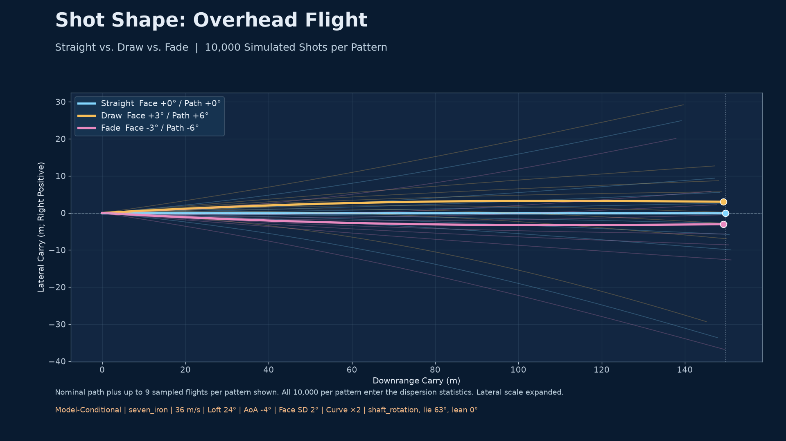
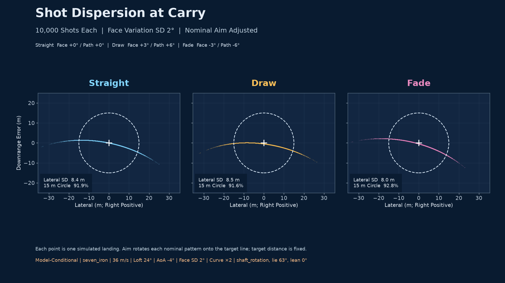

# Straight, Draw, and Fade: Shot Pattern Analysis

**Status:** All 24 corrected driver, 7-iron, and wedge experiments are complete,
with 720,000 synthetic shots and independent internal-consistency review.
The four original driver bundles are [superseded historical controls](historical_control_report.md).
Corrected V2 scoring and final graphics support the conditional results below;
empirical model qualification remains outside this study.

This experiment compares 10,000 shots per pattern with independent normally
distributed face errors at both 1° and 2° standard deviation and fixed path. It is a
conditional simulation study, not a measured golfer study or physics qualification.

## Expanded Goal and Acceptance

The active goal now includes driver, 7-iron, and wedge cases with
club-appropriate tee/approach scoring, an independent Astra review, and
correction of the inconsistent impact impulse. It also includes face–loft coupling, rotation about the shaft,
shaft-lean sensitivity, and the observed long-left/short-right pattern. The
fixed-delivered-loft experiments below are retained as controls; their results
must not be generalized to players whose face error covaries with delivered
loft, attack angle, speed, or strike. The analysis is complete only after:

- The 3D rotation geometry, frames, and shaft-lean effects are derived and tested.
- Coupled delivery trials preserve matched random errors and report actual delivered loft.
- Carry–lateral covariance and long-left/short-right behavior are quantified rather than assumed.
- Carry-versus-loft sensitivity is checked for both low- and higher-loft cases.
- Dispersion, equal-range controls, approach scoring, graphics, and tile controls reflect the expanded model.
- Implementation errors are corrected with failing tests first; unresolved physical validation remains explicit.
- Every finding is tracked in the [Analysis Issue Register](issues/README.md), with GitHub publication and closure reported truthfully.

## Corrected Deterministic Carry Sensitivity

The [deterministic sensitivity receipt](corrected_sensitivity.json) uses the
corrected central-contact physics and assumed shaft rotation. At zero nominal
lean, closing by 2° lowers delivered loft in all three presets, but carry responds
differently:

| Illustrative Club | Closed-Face Loft | Closed-Face Carry Change | Open-Face Loft | Open-Face Carry Change |
| --- | ---: | ---: | ---: | ---: |
| Driver | 11.572° | −6.746 m | 14.022° | +2.423 m |
| 7-Iron | 22.977° | +1.468 m | 25.015° | −1.961 m |
| Pitching Wedge | 35.719° | +2.223 m | 37.669° | −2.456 m |

These are deterministic face-error ±2° sensitivities around straight delivery,
not averages over the 10,000-shot populations. The iron and PW examples show
long-left/short-right behavior. The low-loft driver example shows short-left/
long-right behavior: de-lofting lowers launch enough to reduce carry. Roll is
excluded, so these results do not describe total distance. Exact artifact values
and source hashes govern the rounded values displayed here.

Face closure does not uniquely determine loft. The effect depends on the axis
of rotation. The primary coupled mode assumes rotation about a rigid shaft;
vertical-axis yaw instead preserves loft. Shaft lean changes the shaft-axis
coupling, while pitching an otherwise fixed club also changes nominal loft.
Those are separate controls in the receipt. No measured player covariance is
available, and manufacturer static lie is only an assumed delivered shaft
orientation.

## Experiment Definition

| Pattern | Nominal Face Relative to Target | Fixed Path Relative to Target |
| --- | ---: | ---: |
| Straight | 0° | 0° |
| Draw | +1.5° | +3° |
| Fade | −1.5° | −3° |

Doubled curves use draw +3° face / +6° path and the mirrored fade. Positive
angles point right for a right-handed golfer. Each shape receives the same
10,000 normally distributed face errors, seed 20261008. Trials use face SD 1°
and 2°, with path fixed. The 24-cell matrix combines three clubs, both face
variabilities, both curve magnitudes, and fixed-loft versus assumed shaft-rotation
geometry. Each cell contains 30,000 shots; the complete matrix contains 720,000.

| Illustrative Club | Speed | Nominal Delivered Loft | Attack | Assumed Shaft Elevation | Head Mass |
| --- | ---: | ---: | ---: | ---: | ---: |
| Driver | 45 m/s | 12.8° | −0.9° | 58.5° | 0.200 kg |
| 7-Iron | 36 m/s | 24.0° | −4.0° | 63° | 0.272 kg |
| Pitching Wedge | 32 m/s | 36.7° | −5.0° | 64° | 0.300 kg |

These hybrid presets are assumptions, not measured player data or a reproduced
complete club specification. Driver loft is a cited Tour average; PW loft is a
Trackman optimizer example; 7-iron delivered loft is chosen. Static manufacturer
lie is assumed to equal shaft elevation at impact. Speeds, attack angles, and
masses are illustrative. Nominal lean is zero. All shots use central strike,
stationary spinless ball, still air, and unchanged aerodynamic coefficients.

For each shape, one aiming rotation aligns its zero-error landing bearing with
the target line. All shapes then use the straight nominal carry as target
distance. This is neither per-shot aiming nor sample-mean recentering. Raw and
aimed endpoints are retained. The common-range diagnostic maps each aimed
endpoint radially to the straight target distance, preserving its bearing. It
is geometric normalization, not a reflight or proof of a causal mechanism.

## Corrected Monte Carlo Results

All 24 corrected cells are complete: 720,000 simulated shots. V2 scoring replaces the erroneous zero-distance putting anchor with the unholed tap-in limit of one. Flight CSV hashes are unchanged; the original scoring is archived. Full statistics and paired 95% sampling intervals are available in each bundle and the validated overview.

Each triple below is Straight / Draw / Fade; lateral SD and carry are in metres. SG columns are the mean difference from Straight, in strokes per shot. Positive means a modeled benefit.

| Club | Delivery | Face SD | Curve Scale | Lateral SD S/D/F | Mean Carry S/D/F | Draw ΔSG | Fade ΔSG |
| --- | --- | --- | --- | --- | --- | --- | --- |
| Driver | Fixed Loft | 1° | 1× | 8.60 / 8.53 / 8.53 | 198.39 / 198.05 / 198.05 | -0.0018 | -0.0018 |
| Driver | Fixed Loft | 1° | 2× | 8.60 / 8.33 / 8.33 | 198.39 / 197.03 / 197.02 | -0.0077 | -0.0074 |
| Driver | Fixed Loft | 2° | 1× | 16.89 / 16.77 / 16.76 | 197.93 / 197.60 / 197.59 | -0.0014 | -0.0013 |
| Driver | Fixed Loft | 2° | 2× | 16.89 / 16.38 / 16.37 | 197.93 / 196.57 / 196.56 | -0.0050 | -0.0053 |
| Driver | Shaft Rotation | 1° | 1× | 8.51 / 8.41 / 8.47 | 197.99 / 197.64 / 197.67 | -0.0016 | -0.0021 |
| Driver | Shaft Rotation | 1° | 2× | 8.51 / 8.18 / 8.31 | 197.99 / 196.62 / 196.68 | -0.0070 | -0.0078 |
| Driver | Shaft Rotation | 2° | 1× | 16.29 / 16.08 / 16.25 | 196.50 / 196.07 / 196.26 | -0.0009 | -0.0014 |
| Driver | Shaft Rotation | 2° | 2× | 16.29 / 15.63 / 15.98 | 196.50 / 194.99 / 195.35 | -0.0046 | -0.0053 |
| PW | Fixed Loft | 1° | 1× | 1.97 / 1.97 / 1.97 | 101.13 / 101.07 / 101.07 | -0.0001 | -0.0001 |
| PW | Fixed Loft | 1° | 2× | 1.97 / 1.96 / 1.96 | 101.13 / 100.89 / 100.89 | -0.0034 | -0.0034 |
| PW | Fixed Loft | 2° | 1× | 3.93 / 3.92 / 3.92 | 101.05 / 100.99 / 100.99 | -0.0000 | -0.0000 |
| PW | Fixed Loft | 2° | 2× | 3.93 / 3.90 / 3.89 | 101.05 / 100.81 / 100.80 | -0.0021 | -0.0020 |
| PW | Shaft Rotation | 1° | 1× | 1.97 / 2.00 / 1.94 | 101.13 / 101.06 / 101.07 | +0.0023 | -0.0024 |
| PW | Shaft Rotation | 1° | 2× | 1.97 / 2.02 / 1.90 | 101.13 / 100.88 / 100.88 | +0.0020 | -0.0071 |
| PW | Shaft Rotation | 2° | 1× | 3.94 / 3.99 / 3.87 | 101.04 / 100.97 / 100.98 | +0.0025 | -0.0025 |
| PW | Shaft Rotation | 2° | 2× | 3.94 / 4.02 / 3.80 | 101.04 / 100.78 / 100.80 | +0.0037 | -0.0061 |
| 7-Iron | Fixed Loft | 1° | 1× | 4.22 / 4.20 / 4.20 | 149.70 / 149.59 / 149.59 | +0.0004 | +0.0005 |
| 7-Iron | Fixed Loft | 1° | 2× | 4.22 / 4.15 / 4.15 | 149.70 / 149.27 / 149.27 | -0.0042 | -0.0042 |
| 7-Iron | Fixed Loft | 2° | 1× | 8.36 / 8.33 / 8.33 | 149.56 / 149.45 / 149.45 | +0.0006 | +0.0008 |
| 7-Iron | Fixed Loft | 2° | 2× | 8.36 / 8.24 / 8.24 | 149.56 / 149.12 / 149.12 | -0.0003 | +0.0002 |
| 7-Iron | Shaft Rotation | 1° | 1× | 4.22 / 4.28 / 4.13 | 149.68 / 149.57 / 149.58 | -0.0032 | +0.0041 |
| 7-Iron | Shaft Rotation | 1° | 2× | 4.22 / 4.30 / 4.01 | 149.68 / 149.24 / 149.26 | -0.0111 | +0.0033 |
| 7-Iron | Shaft Rotation | 2° | 1× | 8.38 / 8.48 / 8.21 | 149.49 / 149.37 / 149.40 | -0.0035 | +0.0054 |
| 7-Iron | Shaft Rotation | 2° | 2× | 8.38 / 8.51 / 7.99 | 149.49 / 149.02 / 149.10 | -0.0084 | +0.0096 |

The shots do **not** carry the same distance. Curved driver patterns generally lose carry; narrower lateral spread can coexist with worse tee scoring. The equal-range bearing control separates geometric distance scaling from the remaining change in angular spread; it does not establish causation. In the assumed shaft-rotation iron/PW cases, the fade is often narrower than the draw, and that distinction persists at common range. This follows from the specified right-handed face–loft geometry, rather than a universal advantage of curving shots. Increasing face SD broadens every pattern and can increase these conditional differences. Bigger curves do not give a universal accuracy or scoring improvement.

Narrower lateral spread alone does not determine approach scoring either. For PW shaft rotation, SD 1° and nominal curves, Draw has lateral SD 1.999 m versus Fade 1.941 m, but lower total target RMSE (2.279 versus 2.312 m) and modeled ΔSG +0.0023 versus −0.0024. The longitudinal spread explains this difference; downrange biases are nearly equal.

Effects are small, conditional predictions under illustrative inputs, not measured strokes gained. Model and delivery uncertainty are excluded from the bootstrap intervals. Use the baseline version and digest in the receipts when comparing results. The original driver bundles remain only in the [Superseded Historical Control Report](historical_control_report.md).

## Distance-Normalized Comparison

For face SD 2°, doubled curves, and assumed shaft rotation, percentages below compare lateral SD with the same-cell Straight pattern. Negative is narrower. The common-range column sets every landing to the Straight target range while retaining bearing; this diagnostic removes geometric range scaling but does not isolate a physical cause.

| Club | Shape | Actual Lateral SD Change | Common-Range Lateral SD Change | Mean Carry Change |
| --- | --- | --- | --- | --- |
| Driver | Draw | -4.05% | -3.76% | -1.51 m |
| Driver | Fade | -1.93% | -1.24% | -1.15 m |
| 7-Iron | Draw | +1.57% | +2.03% | -0.48 m |
| 7-Iron | Fade | -4.66% | -4.55% | -0.40 m |
| PW | Draw | +2.00% | +2.37% | -0.26 m |
| PW | Fade | -3.58% | -3.47% | -0.24 m |

The driver reduction is partly distance scaling: common-range normalization reduces the apparent narrowing. The residual bearing-based lateral-spread differences remain model-conditional. The iron/PW contrast also persists under this control; its smaller changes are consistent with the smaller carry shifts.

## Shareable Graphics and Complete Statistics

The 1920 × 1080 PNGs are ready for Facebook sharing. Each cell has an overhead flight comparison, a full dispersion comparison, and a distance-control graphic. Representative 7-iron, two-degree-SD, doubled-curve, assumed shaft-rotation views:





[All 72 Pattern Statistics](overview_v2/overview_statistics.csv), [Statistics and Provenance](overview_v2/overview_statistics.json), [Fixed-Loft SG Intervals](overview_v2/strokes_gained_fixed_loft.png), and [Shaft-Rotation SG Intervals](overview_v2/strokes_gained_shaft_rotation.png) cover all 24 cells. Each `corrected_results/` directory preserves all 30,000 rows and hash manifests.

## Scoring Contexts and Interpretation

Driver scoring assumes a flat 400 m hole with a 30 m fairway corridor. First
landing is treated as the final position; a fairway or rough benchmark scores
remaining distance to the hole. Sensitivities use 350/450 m holes and 20/40 m
fairway widths. The tee starting benchmark comes from the tee table.

7-iron and PW scoring assumes a fairway approach to a centered circular green
at the straight nominal carry, radius 15 m, with rough outside. Radii 10/20 m
provide sensitivity. No roll, hazards, slopes, obstructions, or realistic wedge
stopping model is included. Gains are per shot, not per round.

The historical benchmark uses Broadie's 2011 Table 9 tee/fairway/rough distances
through 600 yd, with an explicitly approximate reconciled putting curve. It is
neither a current Tour benchmark nor a player-specific estimate. The public
Tools API evaluates baseline knots; bounded interpolation reconstructs its
returned SG values. Independent checks cover every knot and midpoint plus
seeded random states (1,182 direct evaluations), and reproduce all 120,000
historical control shots' pattern means within 10⁻¹² strokes. Receipts distinguish
API states evaluated from shots scored. Unsupported distances are unavailable.

Paired bootstrap intervals describe Monte Carlo sampling uncertainty only.
They exclude physics error, delivery assumptions, course geometry, and benchmark
uncertainty. A small interval does not qualify a small predicted effect physically.

## Model Review and Limits

The corrected public rigid-body impact solver applies matching tangential
impulses to ball and club linear velocities and ball spin. It includes finite
club mass in the sticking cap, initial ball spin in contact slip, and rejects
separating contact. Independent arbitrary-3D tests verify momentum, restitution,
nonincreasing energy, sticking contact, and rigid-rotation covariance.

Flights use the existing native RK4 solver with Reynolds-dependent drag,
spin-induced lift/curvature, and spin decay. Landing is interpolated at first
ground contact. A fast landing accessor uses the same integration as full
trajectories, with tested parity to 10⁻¹² m. No aerodynamic coefficients were
changed. This pathway differs from the separate Waterloo/Penner approximation.

Off-center club rotation and gear effect remain unqualified. No launch-monitor
population validates these simulated shapes. Path/speed/strike covariance,
wind, ground behavior, dynamic lie, shaft bending, and a player's ability to
execute an intended shape remain outside the model. Face-only randomness forms
a narrow one-dimensional endpoint locus; covariance statistics are descriptive,
not a calibrated two-dimensional golfer precision or confidence ellipse.

| Mean Face-to-Path Offset | Opposite-Curve Probability at Face SD 1° | At Face SD 2° |
| --- | ---: | ---: |
| 1.5° | 6.68% | 22.66% |
| 3° | 0.135% | 6.68% |

These normal-distribution probabilities concern direction consistency, not
accuracy or strokes gained. Fixed-loft centered still-air delivery is mirror symmetric. The coupled mode
keeps the same right-handed shaft axis: reflecting face error changes delivered
loft, so it is not that mirror transformation. Coupled draw/fade differences can
therefore be structural consequences of the assumed face–loft covariance as
well as finite sampling. Neither case establishes a player-specific preference.

## Numerical and Software Evidence

[Corrected Numerical Validation](corrected_numerical_validation.json) covers
90 deliveries with three time steps (270 flights): three clubs, two delivery
modes, five nominal patterns, and face errors −3°/0°/+3°. Maximum landing changes
are 0.000573215 m for 0.02→0.01 s and 0.000153164 m for 0.01→0.005 s, both below
the unchanged 0.05 m gate. This establishes numerical consistency, not accuracy
against physical measurements.

TDD regression evidence and remaining publication/validation state are tracked
in the [Analysis Issue Register](issues/README.md). Source and native hashes are
captured before execution and verified before completion manifests. The tile
uses headless-tested controls and a cancellable subprocess; calculations and
statistics remain separate from GUI code.

## Sources

- [Trackman Dynamic Loft](https://www.trackman.com/blog/dynamic-loft): definitions and driver/PW loft context.
- [Titleist GT3](https://www.titleist.com/golf-clubs/drivers/gt3): static driver lie, used only as a geometry assumption.
- [Titleist T100 Specifications](https://www.titleist.com/golf-clubs/irons/t100-2023): static 7-iron/PW lie of 63°/64°, used only as assumed shaft geometry.
- [Broadie 2011 Primary Paper](https://www.columbia.edu/~mnb2/broadie/Assets/strokes_gained_pga_broadie_20110408.pdf): historical tee/fairway/rough table and putting discussion.
- [MacKenzie 2018 Shaft Torque Study](https://people.stfx.ca/smackenz/Publications/MacKenzie%202018%20The%20influence%20of%20golf%20shaft%20torque%20on%20clubhead%20kinematics%20and%20ball%20flight.pdf): setup-specific face/loft interaction; not a universal player covariance.

## Reproduction

Use Python 3.11+ and install the project's numerical dependencies and the native
Rust wheel from the same checkout:

```bash
git submodule update --init vendor/ud-tools
python3 -m pip install -e '.[gui-tools]' maturin
VIRTUAL_ENV=/path/to/venv maturin develop --release \
  --manifest-path rust_core/upstream-physics/Cargo.toml --features python
python3 -m src.tools.shot_pattern_analysis.matrix \
  docs/research/shot_pattern_analysis/corrected_results
python3 -m src.tools.shot_pattern_analysis.sensitivity \
  --output docs/research/shot_pattern_analysis/corrected_sensitivity.json
python3 -m src.tools.shot_pattern_analysis.numerics \
  --output docs/research/shot_pattern_analysis/corrected_numerical_validation.json
QT_QPA_PLATFORM=offscreen MPLBACKEND=Agg MUJOCO_GL=egl SDL_VIDEODRIVER=dummy \
  python3 -m pytest tests/tools/shot_pattern_analysis \
  tests/ui/tools/shot_pattern_analysis
```

The [Editable LaTeX Experiment Reference](shot_pattern_analysis.tex) records
equations and calculation assumptions. It is separate from the canonical
engineering design manual in `manuals/upstreamdrift`; that manual's calculation
inventory and scientific publication gates remain blocked. Built-in LaTeX
compilation was attempted but could not obtain its uncached Tectonic bundle;
compilation is unverified. The source remains editable in the native editor.

The local `python3 -m scripts.pre_pr` module is absent. The canonical
Repository_Management wrapper has been located and runs gates against the
current working directory; it will be invoked before publication. The full document title audit
reports 2,505 existing violations across 1,816 documents; this change's document
titles are checked separately. No unavailable gate is represented as passing. The user explicitly authorized
the personal GitHub identity for this task; Gemini 3.8 through `agy` is handling
issue publication, with returned URLs recorded as evidence.
