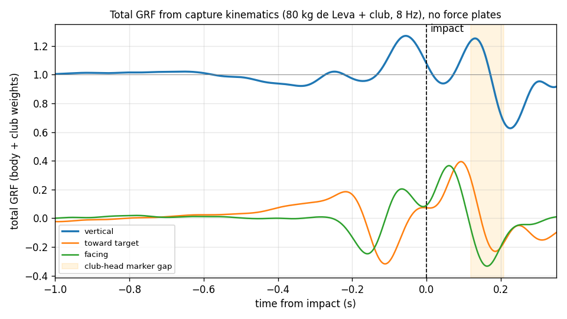

# Typical Segment Masses and a Swing Without Force Plates

Issue [#11011](https://github.com/D-sorganization/UpstreamDrift/issues/11011),
epic [#10950](https://github.com/D-sorganization/UpstreamDrift/issues/10950).
MATLAB R2025b.

**Owner decision (2026-09-26).** Use typical values for the trunk and every
other segment. No force-plate data will be captured. This closes the
mass-double-count decision in [DATA_AUDIT.md](DATA_AUDIT.md).

## `GS3DX_Golfer`

`gs3dx_build_golfer` copies `GS3DX_FullBodyContact` to `GS3DX_Golfer` and
changes only masses:

- Every body segment takes its mass from one table,
  `gs3dx_anthropometry(body_mass)`. The table holds the de Leva (1996) male
  fractions (J. Biomech. 29:1223, Table 4).
- The default body mass is 80 kg, the mass the legs were already scaled for.
- Each upper-body solid is now `Mass` in kg with an expression of a
  `Golfer*` model-workspace variable. It was a literal in kg, lbm or a density.
- The drive files never set the `Golfer*` variables. They do set the unused
  originals (`LowerTorsoMass`, …), so those names are not reused.
- Inertia stays `CalculateFromGeometry`. It scales with mass on the
  unchanged geometry.
- Joints, drive, stance, contacts and servo are unchanged.
- The nonvirtual block count is asserted unchanged: 773 blocks, 967
  compiled.

| Model solid(s)                             | Before                 | Variable                | After (80 kg) |
| ------------------------------------------ | ---------------------- | ----------------------- | ------------- |
| Head                                       | 11 lbm (4.99 kg)       | `GolferHeadMass`        | 4.72 kg       |
| Neck                                       | density 1000 (2.06 kg) | `GolferNeckMass`        | 0.83 kg       |
| LowerTorso                                 | 20 kg                  | `GolferLowerTrunkMass`  | 15.47 kg      |
| UpperTorsoBase + UpperTorsoTop (0.2 / 0.8) | 4 + 16 kg              | `GolferUpperTrunkMass`  | 15.44 kg      |
| HubtoLS, HubtoRS (shoulder girdle)         | 10 kg each             | `GolferShoulderMass`    | 1.93 kg each  |
| L/RUpperArm                                | 5 lbm (2.27 kg) each   | `GolferUpperArmMass`    | 2.17 kg each  |
| Forearm halves (2 per side)                | 2.5 lbm (1.13 kg) each | `0.5*GolferForearmMass` | 0.65 kg each  |
| Grip/LHand, Grip/RHand                     | density 1000 (0.55 kg) | `GolferHandMass`        | 0.49 kg each  |
| Thigh, shank, foot (per side)              | 11.33, 3.46, 1.10 kg   | `ThighMass` …           | unchanged     |
| **Body**                                   | **109.4 kg**           | `GolferBodyMass`        | **80.0 kg**   |

Two splits have no de Leva counterpart. They are modelling assumptions that
move mass inside a segment without changing its total:

- The neck takes 15% of head + neck.
- The shoulder hubs take 10% each of the upper trunk region.

The model trunk has no pelvis/abdomen/thorax split, so the regions are:

- LowerTorso = lower trunk + half the middle trunk.
- UpperTorso + hubs = upper trunk + the other half of the middle trunk.

The club (0.33 kg), grip parts (0.06 kg) and contact spheres (6 g) are
equipment and stay as they were.

**Verification** (`tests/test_gs3dx_golfer.m`, 6 tests):

- The table sums to the body mass exactly, for 60, 80 and 100 kg.
- The legs read the same table.
- Every massive upper-body solid (15 of them) uses a `Golfer*` variable.
- The block count is unchanged.
- The inertia sensors read **80.393 kg** = 80 kg + 0.393 kg of equipment.

| Run on `GS3DX_Golfer` | Newton residual | Foot slip L / R | Foot lift L / R | Support (× body weight) | COM drop |
| --------------------- | --------------- | --------------- | --------------- | ----------------------- | -------- |
| From rest             | 0.46 N·s ✓      | 1.3 / 1.4 mm    | 0 / 0 mm        | up to 1.14              | 6.6 cm   |
| Impact drive          | 0.48 N·s ✓      | 114 / 69 mm     | 186 / 1 mm      | up to 2.06              | 16 cm    |

The golfer stands from rest. The impact drive still tips it over, as in
[GROUND_CONTACT.md](GROUND_CONTACT.md): the cause is the start momentum. The
drive's torques were fitted to the 77.6 kg upper body, so they now also
over-drive the lighter segments. They must be refitted (#10979) before any
swing on this model means anything.

### Dimensions

The masses are typical for 80 kg and 1.80 m. The geometry was left alone:
the drive, the stance IK and every equivalence test are built on it.
Against de Leva lengths scaled to 1.80 m it is long in the arms and
shoulders.

| Segment                    | Model           | de Leva, 1.80 m | Difference |
| -------------------------- | --------------- | --------------- | ---------- |
| Upper arm                  | 12 in = 0.305 m | 0.291 m         | +5%        |
| Forearm (elbow to hand)    | 14 in = 0.356 m | 0.278 m         | +28%       |
| Trunk (Lower + UpperTorso) | 24 in = 0.610 m | 0.550 m         | +11%       |
| Shoulder hub (each side)   | 10 in = 0.254 m | ≈ 0.20 m        | ≈ +27%     |
| Thigh, shank, foot         | de Leva         | de Leva         | 0          |

The model's forearm runs to the hand centre, not the wrist, which explains
part of its excess. The half-biacromial value of 0.20 m is a typical adult
male figure, not a de Leva length.

Shortening the arms would change the club path the drive was fitted to, so
it belongs with the #10979 refit. The alternative is a golfer-specific
measurement.

## Total Ground Reaction Force Without Force Plates

The feet are the only contact with the ground. So Newton's second law gives
the **sum of both feet's GRF** from the motion of the system alone (the body
plus the club it holds):

GRF(t) = Σ mᵢ aᵢ(t) − (M + m_club) g.

`gs3dx_kinematic_grf` builds the system COM from the capture markers with
the same de Leva table:

- Segment COMs are placed at the de Leva fractions between marker proxies
  (for example C7 to the lowered waist centre for the trunk).
- The club is 0.25 kg at the head marker cluster and 0.137 kg at the grip
  cluster.
- The COM is low-pass filtered with a zero-lag 4th-order Butterworth.
- It is then differentiated twice.

**The club cannot be left out.** Carried at clubhead speed, its 0.39 kg
alone adds up to 0.57 BW. Without it, the estimate put the peak at 1.42 BW
instead of 1.27 BW, and showed a false unloading at impact.

The ball's impulse on the club (about 3 N·s) is the one external force that
is not ground. The filter spreads it to about 0.05 BW around impact.

Results (tour-average driver, 80 kg + club; frame [facing, toward target,
up]; peak searched up to impact):

| Cutoff | At address | Vertical peak | Peak time vs impact | Vertical at impact | Min vertical (whole trial) |
| ------ | ---------- | ------------- | ------------------- | ------------------ | -------------------------- |
| 6 Hz   | 1.001 BW   | 1.24 BW       | −58 ms              | 1.07 BW            | 0.70 BW                    |
| 8 Hz   | 1.001 BW   | 1.27 BW       | −56 ms              | 1.08 BW            | 0.63 BW                    |
| 10 Hz  | 1.001 BW   | 1.29 BW       | −58 ms              | 1.08 BW            | 0.61 BW                    |
| 15 Hz  | 0.999 BW   | 1.33 BW       | −69 ms              | 1.12 BW            | 0.44 BW                    |

- **The address check is the calibration.** Standing still, the estimate
  must equal the system's weight. It reads 1.001 BW, with under 0.05 BW
  sideways. That checks the segment table, the marker proxies and the axes
  together.
- **Downswing shape.**
  - The vertical force dips during the backswing (about 0.94 BW at
    −0.4 s).
  - It rises to a single peak of 1.24–1.33 BW about 60 ms before impact.
  - It is still about 1.1 BW at impact.
  - Along the target line (8 Hz), the force pushes toward the target in the
    transition (+0.17 BW at −0.2 s). It then brakes the shift toward the
    target (−0.30 BW at −0.1 s).
- **The follow-through is not reliable.** The club-head cluster is missing
  from 0.12 to 0.21 s after impact (33 frames, filled linearly). The large
  swings there (0.63–1.25 BW) are partly that gap.
- **The level carries a band.** The pre-impact peak varies by 0.09 BW
  between 6 and 15 Hz.
- **Not observable:** the split between the lead and trail foot, and the
  centre of pressure. The contact model has to predict those. A measured
  golfer's own mass narrows the level.

`tests/test_gs3dx_capture.m` pins two things:

- the address equilibrium, within 0.02 BW;
- the pre-impact peak: 1.15–1.7 BW, 0–150 ms before impact, at 6 and 10 Hz.

## Plan: A Validated Full-Body Swing Without Force Plates

Force plates would have given the per-foot GRF to fit and check against.
Without them, validation rests on two physical constraints:

- Newton on the whole body and club: the total GRF above.
- The feet and the capture must agree: the model's feet must move the way
  the markers do.

The order below adds one unknown at a time. It stays within the compiled
budget: 33 blocks free, 25 of them reserved for validation sensing.

1. **Typical masses: done** (`GS3DX_Golfer`).
2. **Pelvis path from the capture** (#10979). Take the pelvis 6-DOF pose per
   frame from the four waist markers. Map it into the model frame. The IK
   (`gs3dx_leg_ik`) then gives the leg angles that keep the feet on the
   captured foot markers. That supplies the time-varying leg references the
   servo needs.
   - Budget: 0 blocks. It replaces the constant `LegAngleReference` with a
     function of time in the existing Constant/workspace path.
3. **Refit the upper-body drive on `GS3DX_Golfer`.** The existing inputs were
   fitted to a 77.6 kg upper body with a pelvis that could push anything.
   Refit them with the pelvis following step 2's path, still actuated. Then
   read the pelvis actuator's force and torque as a **residual**.
4. **Validate, with no force data:**
   - The pelvis residual is small next to body weight. This is OpenSim's
     residual-reduction criterion: the more force the pelvis "hand of God"
     supplies, the less the model explains.
   - Contact GRF summed over both feet matches the kinematic GRF within its
     band through the downswing: address 1.0 BW, a backswing dip, and a
     1.24–1.33 BW peak about 60 ms before impact.
   - Newton's balance closes (`gs3dx_contact_check`).
   - The feet stay planted where the capture's feet do. Trail-heel motion
     near impact is compared against `RAnkleOut`/`RToe*`.
   - The centre of pressure stays inside each foot's contact polygon.
5. **Release the pelvis.** Turn the pelvis drive off (as in the contact model)
   and drive the legs with the joint torques step 4 implies, plus the servo
   as PD tracking. At that point the model supports and propels itself.
   The lead/trail weight shift is then a prediction. It is checked against
   the total GRF and the foot motion, not fitted to them.

What would sharpen this, cheaply:

- The golfer's own height and mass. This rescales every mass and the
  kinematic GRF level with one argument.
- Segment lengths (arm, forearm, shoulder width) measured with a tape. This
  replaces the geometry assumptions in the table above.
- Any pressure-insole or single-plate recording, even one swing. It would
  fix the lead/trail split that nothing above can observe.
