# GS3DX Full-Body Golfer: Design Report

Issue [#10979](https://github.com/D-sorganization/UpstreamDrift/issues/10979), epic
[#10950](https://github.com/D-sorganization/UpstreamDrift/issues/10950), draft PR
[#10963](https://github.com/D-sorganization/UpstreamDrift/pull/10963). MATLAB R2025b. Every number here
links to the document that measured it; the per-variant documents hold the method and the
evidence.

## Summary

The GS3DX full-body golfer model is a 3D kinetic multibody human simulation implemented in Simscape Multibody under MATLAB R2025b. It extends the hand-built `GolfSwing3D_Kinetic.slx` model through an agent-editable series of `GS3DX_` clones without modifying original source files ([README.md](../README.md#safety-rules)). The model incorporates quaternion-based spherical shoulder and 6-DOF hip joints ([QUATERNION_SHOULDERS.md](QUATERNION_SHOULDERS.md#what-changed)), a two-axis motion-driven neck ([NECK.md](NECK.md#the-joint)), a closed-loop dual-arm grip assembly with a flexible shaft and driver head ([FIT.md](FIT.md#4-hand-on-grip-geometry-gs3dx_fit_grip)), an 80.0 kg de Leva anthropometric mass distribution ([ANTHROPOMETRY.md](ANTHROPOMETRY.md#gs3dx_golfer)), custom segment inertia tensors with ellipsoid visuals ([SHAPE.md](SHAPE.md#what-changes), [HUMAN.md](HUMAN.md#changes)), sprung revolute midfoot joints ([HUMAN.md](HUMAN.md#changes)), five contact spheres per foot on an unactuated pelvis ([GROUND_CONTACT.md](GROUND_CONTACT.md#what-was-built), [HUMAN.md](HUMAN.md#changes)), and a driver head drawn from a parametric mesh ([HUMAN.md](HUMAN.md#changes)).

The model reproduces the downswing kinematics of a tour-average driver swing up to ball contact, matching motion capture marker trajectories from `data/C3D_TA_Driver.c3d` with a whole-trial inverse kinematics median residual of 7.0 mm RMS ([FIT.md](FIT.md#4-hand-on-grip-geometry-gs3dx_fit_grip)). Upper-body joints track captured kinematics using iterative feedforward torques and PD feedback to 0.25° RMS error ([FIT.md](FIT.md#6-upper-body-tracking-gs3dx_fittrack)). A damped inverse-Jacobian balance loop in the leg servo stabilizes the unactuated pelvis over the feet, achieving 22 mm RMS pelvis tracking error and 2.9 mm vertical COM RMS error against the capture ([SHAPE.md](SHAPE.md#balance)).

The model does not simulate ball flight, club-ball impact dynamics, or follow-through past impact ([ANTHROPOMETRY.md](ANTHROPOMETRY.md#total-ground-reaction-force-without-force-plates), [FIT.md](FIT.md#3-whole-body-ik-gs3dx_whole_body_ik)). No measured ground reaction force (GRF) data exists in the capture, so contact parameters are uncalibrated and the lead/trail force split is unobserved ([DATA_AUDIT.md](DATA_AUDIT.md#capture-inventory)). At ball contact the posed club face is 8.6° open with 8.7° of loft ([HUMAN.md](HUMAN.md#results)). `GS3DX_Human` balances to impact with pelvis drift 21.9 mm RMS and COM error 14.0 mm RMS (support 0.52–2.02 BW), on par with `GS3DX_Shape` (21.6 mm) and `GS3DX_Neck` (18.0 mm with the same head) ([HUMAN.md](HUMAN.md#why-the-human-drifted)).

## Scope and Constraints

- **Home-License Block Limit:** Simscape compilation is constrained by the MATLAB R2025b Home license to at most 1,000 nonvirtual blocks, counted after compilation (`find_system(..., 'Virtual', 'off')`) ([BLOCK_BUDGET_FINDINGS.md](BLOCK_BUDGET_FINDINGS.md#executive-summary)). Synthetically probed, 1,000 blocks simulate cleanly while 1,001 fails at compile time ([BLOCK_BUDGET_FINDINGS.md](BLOCK_BUDGET_FINDINGS.md#executive-summary)).
- **Validation Reserve:** All saved models must maintain a 25-block reserve (capped at 975 compiled blocks) to leave room for in-memory validation sensors added by diagnostic tools such as `gs3dx_contact_check` (+10 compiled blocks) ([BLOCK_BUDGET_FINDINGS.md](BLOCK_BUDGET_FINDINGS.md#executive-summary), [GROUND_CONTACT.md](GROUND_CONTACT.md#block-budget), [FIT.md](FIT.md#7-balance-gs3dx_fitbalance)).
- **Original Model Immutability:** Original files in `../src/model/` are read-only, never loaded or saved in MATLAB R2025b, and only copied via `copyfile` to preserve git provenance ([README.md](../README.md#safety-rules), [HANDOFF.md](../../../../../../../docs/development/HANDOFF.md#files-and-decisions)).
- **Runtime Environment:** Development is strictly pinned to MATLAB R2025b / Simscape Multibody, isolated outside `matlab/src/` to prevent unintended path shadowing ([README.md](../README.md#safety-rules), [HANDOFF.md](../../../../../../../docs/development/HANDOFF.md#files-and-decisions)).

## Model Lineage

| Variant Name            | Built By                  | What It Adds                                                                                                                                                                                                                                                     | Compiled Blocks      | Key Result                                                                                                              | Source Doc                                           |
| :---------------------- | :------------------------ | :--------------------------------------------------------------------------------------------------------------------------------------------------------------------------------------------------------------------------------------------------------------- | :------------------- | :---------------------------------------------------------------------------------------------------------------------- | :--------------------------------------------------- |
| `GS3DX_Baseline`        | `gs3dx_clone_baseline`    | Verbatim renamed clone, subsystem references re-pointed                                                                                                                                                                                                          | 941 (672 uncompiled) | Matches original on all 413 signals across 344 steps on impact drive                                                    | [BLOCK_BUDGET_FINDINGS.md](BLOCK_BUDGET_FINDINGS.md) |
| `GS3DX_Slim`            | `gs3dx_build_slim`        | Direct joint `InputTorque` drive (drops torque sources and interfaces)                                                                                                                                                                                           | 773 (609 uncompiled) | Saves 63 blocks; matches original impact drive to 6e-14 m clubhead diff                                                 | [SENSITIVITY_FINDINGS.md](SENSITIVITY_FINDINGS.md)   |
| `GS3DX_Quat`            | `gs3dx_build_quat`        | Quaternion Spherical shoulders and 6-DOF hip with Euler bus mapping                                                                                                                                                                                              | 740 (594 uncompiled) | Eliminates gimbal lock; converges to Slim within 0.039 mm clubhead gap at RelTol 1e-7; 7–9% fewer steps                 | [QUATERNION_SHOULDERS.md](QUATERNION_SHOULDERS.md)   |
| `GS3DX_FullBody`        | `gs3dx_build_lower_body`  | Lower body subsystem (Spherical hips, Revolute knees, Universal ankles), feet welded to World                                                                                                                                                                    | 945 (751 uncompiled) | Knees assemble at -28.14°; 0.3 s impact run completes in 348 steps; passive legs cause right knee hyperextension (+67°) | [FULL_BODY.md](FULL_BODY.md)                         |
| `GS3DX_FullBodyContact` | `gs3dx_build_contact`     | 3 sole contact spheres per foot on Infinite Plane, unactuated pelvis, stance-hold leg servo                                                                                                                                                                      | 967 (773 uncompiled) | Stands from rest (slip 1.8 / 2.1 mm, 0 lift, Newton residual 0.71 N·s); tips under impact drive start momentum          | [GROUND_CONTACT.md](GROUND_CONTACT.md)               |
| `GS3DX_Golfer`          | `gs3dx_build_golfer`      | de Leva 80.0 kg typical segment masses via `Golfer*` variables, 15 upper-body solids re-parameterized                                                                                                                                                            | 967 (773 uncompiled) | Sensed mass 80.393 kg (was 109.4 kg); stands from rest (slip 1.3 / 1.4 mm, Newton residual 0.46 N·s)                    | [ANTHROPOMETRY.md](ANTHROPOMETRY.md)                 |
| `GS3DX_Fit`             | `gs3dx_build_fit`         | Capture-derived segment lengths and fitted hand-on-grip geometry (`Fit*` variables, flipped lead wrist standoff)                                                                                                                                                 | 967                  | Out-of-sample IK RMS max dropped 32 -> 17 mm, wrists 88 / 52 -> 18 / 15 mm                                              | [FIT.md](FIT.md)                                     |
| `GS3DX_FitLegs`         | `gs3dx_build_fit_legs`    | Time-varying leg servo references from capture/IK via From Workspace, start state struct, World ground                                                                                                                                                           | 967                  | Standing from rest slip 1.4 / 0.9 mm, 0 lift; passive upper body                                                        | [FIT.md](FIT.md)                                     |
| `GS3DX_FitTrack`        | `gs3dx_build_fit_track`   | Upper-body feedforward + PD tracking (6 Hz critically damped gains), rewired chart inputs, learned feedforward                                                                                                                                                   | 967                  | Full swing joint angle RMS 0.25°; tips over feet without balance (pelvis 206 mm RMS off capture)                        | [FIT.md](FIT.md)                                     |
| `GS3DX_FitBalance`      | `gs3dx_build_fit_balance` | Inertia Sensor COM sensing + state-space filter, inverse Jacobian gain G(t), balance command in leg servo                                                                                                                                                        | 973                  | Pelvis error at impact reduced 503 -> 73 mm (Kp 3, Kd 0.4), COM error 17.9 mm RMS                                       | [FIT.md](FIT.md)                                     |
| `GS3DX_Shape`           | `gs3dx_build_shape`       | de Leva radii of gyration moments (limb audit 1.00), custom limb COM, ellipsoid thighs/shanks/hands/head                                                                                                                                                         | 973                  | Balanced on joint-centre capture COM: pelvis 22 mm RMS, COM vertical 2.9 mm RMS, 1.77 BW peak support                   | [SHAPE.md](SHAPE.md)                                 |
| `GS3DX_Neck`            | `gs3dx_build_neck`        | Two-axis Universal Joint neck driven by head markers (`NeckReference`); removed 4 massless spheres                                                                                                                                                               | 975                  | Head vertical travel cut 213.2 -> 112.8 mm (capture 54.8 mm), vertical error 52.2 -> 36.8 mm RMS                        | [NECK.md](NECK.md)                                   |
| `GS3DX_Human`           | `gs3dx_build_human`       | Massless ellipsoids on hidden cylinders, fixed "Neck Address" turn, neck pivot at C7 (neck 10 → 7.72 in), `FaceSquareRoll`, driver-head mesh, sprung midfoot joints, five contacts per foot, trapezius joining neck and shoulders, balance reference re-anchored | 965                  | Head address error 126 → 40 mm; square face at address; face 8.6° open at ball contact                                  | [HUMAN.md](HUMAN.md)                                 |

```mermaid
flowchart LR
    Baseline["GS3DX_Baseline<br/>Clone (941 compiled)"] --> Slim["GS3DX_Slim<br/>Direct Drive (773 compiled)"]
    Slim --> Quat["GS3DX_Quat<br/>Quat Joints (740 compiled)"]
    Quat --> FullBody["GS3DX_FullBody<br/>Legs Welded (945 compiled)"]
    FullBody --> FullBodyContact["GS3DX_FullBodyContact<br/>Contacts + Free Pelvis (967 compiled)"]
    FullBodyContact --> Golfer["GS3DX_Golfer<br/>80 kg de Leva (967 compiled)"]
    Golfer --> Fit["GS3DX_Fit<br/>Capture Lengths + Grip (967 compiled)"]
    Fit --> FitLegs["GS3DX_FitLegs<br/>Servo Trajectory (967 compiled)"]
    FitLegs --> FitTrack["GS3DX_FitTrack<br/>ILC Tracking (967 compiled)"]
    FitTrack --> FitBalance["GS3DX_FitBalance<br/>COM Balance Loop (973 compiled)"]
    FitBalance --> Shape["GS3DX_Shape<br/>de Leva Inertia (973 compiled)"]
    Shape --> Neck["GS3DX_Neck<br/>2-Axis Neck (975 compiled)"]
    Neck --> Human["GS3DX_Human<br/>Human Shape + Feet (965 compiled)"]
```



## Motion Capture Data

- **Source File:** `data/C3D_TA_Driver.c3d` (canonical tour-average driver swing, SHA-256 prefix `545405cc…`) ([DATA_AUDIT.md](DATA_AUDIT.md#capture-inventory)).
- **Sampling Rate and Frames:** Recorded at 360 Hz over 654 frames (1.817 s duration) ([DATA_AUDIT.md](DATA_AUDIT.md#capture-inventory)).
- **Axes Conversion:** Native capture is Y-up. It is converted to Simscape Z-up coordinates as $(x, -z, y)$, with the golfer facing along $-X$ ([DATA_AUDIT.md](DATA_AUDIT.md#capture-inventory), [tools/gs3dx_capture_markers.m](../tools/gs3dx_capture_markers.m#L14-L15)).
- **Missing Data:** The capture contains 0 analog channels and 0 used force plates; no measured GRF data exists ([DATA_AUDIT.md](DATA_AUDIT.md#capture-inventory)). `WaistRight` is missing 5 frames ([DATA_AUDIT.md](DATA_AUDIT.md#capture-inventory)). `RShoulderTop` is missing 80–85% of frames and is reconstructed from `RShoulderBack` ([DATA_AUDIT.md](DATA_AUDIT.md#capture-inventory), [FIT.md](FIT.md#1-joint-centres-from-the-markers)). Clubhead cluster markers are missing at frames 445, 519–551, and 653–654 ([FIT.md](FIT.md#3-whole-body-ik-gs3dx_whole_body_ik)).
- **Impact and Key Events:**
  - Top of backswing occurs at frame 378 (pelvis yaw extremum) ([DATA_AUDIT.md](DATA_AUDIT.md#capture-inventory)).
  - Peak clubhead speed occurs at `impact_frame` 476 ([tools/gs3dx_capture_markers.m](../tools/gs3dx_capture_markers.m#L63)). Peak speed occurs 16 cm before the ball ([tools/gs3dx_capture_markers.m](../tools/gs3dx_capture_markers.m), [HANDOFF.md](../../../../../../../docs/development/HANDOFF.md#next-steps)).
  - Ball contact occurs at `ball_frame` 477 (`ball_time` 477.3), when the clubhead returns to its address position along the target line ([tools/gs3dx_capture_markers.m](../tools/gs3dx_capture_markers.m#L65)). Clubhead speed drops from 50.7 m/s to 41.4 m/s across contact ([tools/gs3dx_capture_markers.m](../tools/gs3dx_capture_markers.m), [HANDOFF.md](../../../../../../../docs/development/HANDOFF.md#next-steps)).

## Body Model

- **Segments and Mass Distribution:** The body comprises 15 upper-body solids and 6 lower-body segments ([ANTHROPOMETRY.md](ANTHROPOMETRY.md#gs3dx_golfer), [SHAPE.md](SHAPE.md#where-the-joints-sit)). Masses follow de Leva (1996) male fractions scaled to an 80.0 kg body mass ([ANTHROPOMETRY.md](ANTHROPOMETRY.md#gs3dx_golfer)). Total sensed mechanism mass is 80.393 kg, including 0.393 kg of equipment (0.33 kg club, 0.06 kg grip parts, 6 g contact spheres) ([ANTHROPOMETRY.md](ANTHROPOMETRY.md#gs3dx_golfer)). Upper-body solids are parameterized via `Golfer*` workspace variables to prevent overwrite by drive files ([ANTHROPOMETRY.md](ANTHROPOMETRY.md#gs3dx_golfer)).
- **Segment Lengths:** Segment dimensions are derived from marker joint centres via `gs3dx_capture_joint_centres` and mapped to `Fit*` parameters ([FIT.md](FIT.md#1-joint-centres-from-the-markers), [FIT.md](FIT.md#2-gs3dx_fit-segment-lengths-from-the-data)): thigh length 0.460 m, shank length 0.424 m, forearm length 0.280 m, upper arm length 0.305 m, and pelvis-to-shoulder line 0.490 m ([FIT.md](FIT.md#2-gs3dx_fit-segment-lengths-from-the-data)).
- **Shape and Inertia:** Segments incorporate de Leva principal radii of gyration and longitudinal/transverse moments (audit ratio 1.00 against de Leva) ([SHAPE.md](SHAPE.md#what-changes), [INERTIA.md](INERTIA.md#tests)). Visual ellipsoids replace cylindrical solids on exposed reference frames for thighs, shanks, hands, head, and torso segments ([SHAPE.md](SHAPE.md#what-changes), [HUMAN.md](HUMAN.md#changes)).
- **Neck and Head:** A Universal Joint at the base of the neck provides two rotational degrees of freedom (lateral tilt and pitch; axial turn omitted) driven by `NeckReference` filtered with `NeckFilterTime` = 5 ms ([NECK.md](NECK.md#the-joint)). Head visual dimensions are 90 × 90 × 105 mm ([HUMAN.md](HUMAN.md#changes)). A fixed rotation between the joint and the neck, "Neck Address" (Rx(−24.2°) Ry(−7.0°), `NeckAddress`), aims the head at the capture's head-marker centroid at address, so the joint starts at its reference. The pivot sits at the level of C7, 58 mm up the neck's address axis, and `NeckLength` is 7.72 in ([HUMAN.md](HUMAN.md#changes)).
- **Hands and Grip Closed Loop:** Right arm kinematics close a loop onto the club grip ([FIT.md](FIT.md#3-whole-body-ik-gs3dx_whole_body_ik)). Grip geometry is fitted from marker data: `FitButtToLeadHand` = 3.08 in, `FitHandSpacing` = 3.03 in (77 mm), `FitGripToShaft` = 4.39 in, and equal wrist standoffs of 1.46 in with the lead standoff flipped ([FIT.md](FIT.md#4-hand-on-grip-geometry-gs3dx_fit_grip)). `FaceSquareRoll` (−20.73°) squares the clubface at address. The head is drawn from a 10.5° parametric driver mesh (124 × 115 × 61 mm, curved face) generated by the Tools repository and hung from its hosel point; it is massless, so the dynamics keep `GS3DX_Neck`'s head ([HUMAN.md](HUMAN.md#changes), [models/README_DRIVER_HEAD.md](../models/README_DRIVER_HEAD.md)).

## Joints and Actuation

- **Quaternion Joints:** Left and right shoulders use Spherical Joints with quaternion states; the hip joint uses a 6-DOF Joint with quaternion rotation ([QUATERNION_SHOULDERS.md](QUATERNION_SHOULDERS.md#what-changed), [QUATERNION_SHOULDERS.md](QUATERNION_SHOULDERS.md#hip-10956)). The existing 21-element shoulder bus and 30-element hip bus interfaces are preserved via `gs3dx_xyz_map` kinematic and torque mappings ([QUATERNION_SHOULDERS.md](QUATERNION_SHOULDERS.md#what-changed), [QUATERNION_SHOULDERS.md](QUATERNION_SHOULDERS.md#hip-10956)). Quaternion joints eliminate Euler gimbal lock ([QUATERNION_SHOULDERS.md](QUATERNION_SHOULDERS.md#isolated-joint-rig-gs3dx_joint_rig)).
- **Unactuated Pelvis:** The 6-DOF pelvis joint is unactuated (`NoTorque` on all axes; drive converters removed) ([GROUND_CONTACT.md](GROUND_CONTACT.md#what-was-built)). The body is fully supported by the legs and ground contacts ([GROUND_CONTACT.md](GROUND_CONTACT.md#what-was-built), [FIT.md](FIT.md#6-upper-body-tracking-gs3dx_fittrack)).
- **Leg Servo and Balance Loop:** 12 leg joint coordinates (`[L hip X Y Z, knee, ankle X Y, R ...]`) are tracked via PD control: $K_p$ = 100 N·m/deg (hip, knee) and 50 N·m/deg (ankle); $K_d$ = 2 and 1 N·m·s/deg ([GROUND_CONTACT.md](GROUND_CONTACT.md#what-was-built)). Trajectory references come from `gs3dx_leg_reference` on a 10 Hz Butterworth filter with ankle torsion offsets (+23.7° lead, -16.8° trail) ([FIT.md](FIT.md#5-leg-servo-references-gs3dx_leg_reference-gs3dx_fitlegs)). Balance feedback shifts the reference angle by $G(t) \cdot (-K_p e - K_d \dot{e})$ ($K_p = 3, K_d = 0.4$, COM error limit 0.1 m) plus foot position correction $G(t) \cdot k_f e_{\text{foot}}$, using the damped inverse leg Jacobian $G(t)$ ([FIT.md](FIT.md#7-balance-gs3dx_fitbalance)).
- **Upper-Body Tracking:** 12 upper-body joints track capture trajectories via feedforward plus PD control (`gs3dx_track_torque`) ([FIT.md](FIT.md#6-upper-body-tracking-gs3dx_fittrack)). Gains are critically damped at 6 Hz based on segment inertias ($K_p$ from 0.5 to 74 N·m/deg) ([FIT.md](FIT.md#6-upper-body-tracking-gs3dx_fittrack)). Feedforward torques are learned via iterative learning control (ILC, iteration 2 saved, angle RMS 0.25°, PD RMS 10.3 N·m) ([FIT.md](FIT.md#6-upper-body-tracking-gs3dx_fittrack)). Chart inputs are rewired to own-joint Goto tags ([FIT.md](FIT.md#6-upper-body-tracking-gs3dx_fittrack)).
- **Midfoot Joints:** Sprung revolute metatarsophalangeal (MTP) joints cross each foot at 73% of foot length from the heel and 25 mm above the sole ([HUMAN.md](HUMAN.md#changes)). Joint stiffness is `MidfootStiffness` = 2,000 N·m/rad (100 and 800 let the toes fold and the golfer drift; [HUMAN.md](HUMAN.md#why-the-human-drifted)) with damping `MidfootDamping` = 0.5 N·m·s/rad ([HUMAN.md](HUMAN.md#changes)). Forefoot mass is 0.25 kg. The big-toe and lesser-toe contacts ride on the forefoot; the ball of the foot carries the standing load on the rigid rearfoot ([HUMAN.md](HUMAN.md#changes)).

## Ground Contact

- **Contact Topology:** `GS3DX_FullBodyContact` through `GS3DX_Neck` carry three 1 cm spheres per foot (heel centre, toe inside, toe outside) on one Infinite Plane ([GROUND_CONTACT.md](GROUND_CONTACT.md#what-was-built)). `GS3DX_Human` carries five: the heel, the first and fifth metatarsal heads on the rearfoot, and the big toe and lesser toes on the forefoot, reaching as far forward as `GS3DX_Neck`'s toe corners ([HUMAN.md](HUMAN.md#changes)).

  | Contact     | Segment  | Along the foot (from the heel) | Across        |
  | ----------- | -------- | ------------------------------ | ------------- |
  | Heel        | rearfoot | heel edge                      | on the axis   |
  | Ball In     | rearfoot | 73% (first metatarsal head)    | inside edge   |
  | Ball Out    | rearfoot | 64% (fifth metatarsal head)    | outside edge  |
  | Big Toe     | forefoot | under the toe tip              | 50 mm inside  |
  | Lesser Toes | forefoot | 94.5% (third and fourth toes)  | 50 mm outside |

- **What the Topology Allows:** the outside ball and lesser toes let a foot roll onto its outside edge, the inside ball and big toe onto its inside edge; the ball spheres carry the load when the heel rises, and the sprung midfoot joint lets the trail foot come up onto its toe ([HUMAN.md](HUMAN.md#changes)). Run past impact, the trail foot does come up onto its toes and the lead foot onto its outside edge ([HUMAN.md](HUMAN.md#through-the-finish)).
- **Contact Parameters:** stiffness $1 \times 10^5$ N/m, damping $1 \times 10^3$ N·s/m, $\mu_s = 0.9$, $\mu_k = 0.7$ with a smooth stick-slip transition ([GROUND_CONTACT.md](GROUND_CONTACT.md#what-was-built)). The sphere masses sum to the three-sphere total, so the body mass is unchanged ([HUMAN.md](HUMAN.md#tests)).
- **Observable Forces:** every contact force is logged in `FootContactForces`, left foot first ([HUMAN.md](HUMAN.md#changes)). This resolves heel against forefoot and inside against outside loading per foot.
- **Limitation:** the capture has no force plates, so the contact parameters are modelling assumptions and the lead/trail split is not observed ([DATA_AUDIT.md](DATA_AUDIT.md#capture-inventory)).

## Fitting Pipeline

The fitting pipeline extracts kinematics, tunes geometry, and produces tracked dynamic simulations through an ordered sequence of stages:

1. **Stance Geometry (`gs3dx_capture_stance`):** Extracts address stance from markers: ankle stance width 0.650 m, ankle drop 0.931 m below waist centre, foot yaw -2.15° (lead) and +8.15° (trail) ([DATA_AUDIT.md](DATA_AUDIT.md#stance-at-address)).
2. **Kinematic GRF (`gs3dx_kinematic_grf`):** Estimates total GRF from capture COM accelerations using Newton's second law: address force 1.001 BW; pre-impact vertical peak 1.24–1.33 BW between -58 and -69 ms ([ANTHROPOMETRY.md](ANTHROPOMETRY.md#total-ground-reaction-force-without-force-plates)).
3. **Joint Centre Estimation (`gs3dx_capture_joint_centres`):** Reconstructs joint centres from skin markers (thigh 0.460 m, shank 0.424 m, forearm 0.280 m, upper arm 0.305 m) ([FIT.md](FIT.md#1-joint-centres-from-the-markers), [FIT.md](FIT.md#2-gs3dx_fit-segment-lengths-from-the-data)).
4. **Whole-Body IK (`gs3dx_whole_body_ik`):** Solves 33 independent coordinates using Levenberg–Marquardt optimization with `KinematicsSolver` FK ([FIT.md](FIT.md#3-whole-body-ik-gs3dx_whole_body_ik)). Unregularized tracking yields 7.1 mm median RMS (20.3 mm max) ([FIT.md](FIT.md#3-whole-body-ik-gs3dx_whole_body_ik)). Regularized IK (`posture_weight=0.01, smooth_weight=0.02, gap_weight=0.5`) yields 6.3 mm median RMS (25.2 mm p95), bounding frame-to-frame pelvis steps to $\le 1.3$ mm ([FIT.md](FIT.md#3-whole-body-ik-gs3dx_whole_body_ik)).
5. **Grip Geometry Fitting (`gs3dx_fit_grip`):** Fits functional wrist centers on club shaft: reduces out-of-sample max RMS per frame from 32 mm to 17 mm, wrist errors from 88 / 52 mm to 18 / 15 mm, and wrist marker offsets from 6–7 cm to 2.8 cm ([FIT.md](FIT.md#4-hand-on-grip-geometry-gs3dx_fit_grip)). Whole-trial fitted grip achieves 7.0 mm median RMS (16.1 mm p95, 19.1 mm max) ([FIT.md](FIT.md#4-hand-on-grip-geometry-gs3dx_fit_grip)).
6. **Leg Servo References (`gs3dx_leg_reference`):** Solves 12 servo references from IK pelvis and measured feet: knee tracking median 27 mm (lead) and 32 mm (trail); post-impact reach clamp $\le 1.6$ mm ([FIT.md](FIT.md#5-leg-servo-references-gs3dx_leg_reference-gs3dx_fitlegs)). Standing from rest achieves slip 1.4 / 0.9 mm and 0 mm lift ([FIT.md](FIT.md#5-leg-servo-references-gs3dx_leg_reference-gs3dx_fitlegs)).
7. **Upper-Body Tracking & ILC (`gs3dx_upper_body_reference`, `gs3dx_track_learn`):** Learns feedforward torques: converges in 2 iterations to 0.25° angle RMS and 10.3 N·m PD RMS ([FIT.md](FIT.md#6-upper-body-tracking-gs3dx_fittrack)).
8. **COM Balance Stabilization (`gs3dx_build_fit_balance`):** Integrates inverse Jacobian leg balance: reduces pelvis impact error from 503 mm to 73 mm (Kp 3, Kd 0.4), with whole-swing COM error 17.9 mm RMS ([FIT.md](FIT.md#7-balance-gs3dx_fitbalance)).
9. **Inertia & Shape Calibration (`gs3dx_build_shape`):** Balances on joint-centre trunk COM: reduces pelvis error to 22 mm RMS (44 mm at impact), vertical COM error to 2.9 mm RMS, and foot slip to 38 / 16 mm, with 1.77 BW peak support ([SHAPE.md](SHAPE.md#balance)).
10. **Neck Motion Drive (`gs3dx_build_neck`):** Universal neck tracking head markers halves vertical head travel from 213.2 mm to 112.8 mm (capture: 54.8 mm), cutting vertical error from 52.2 mm to 36.8 mm RMS ([NECK.md](NECK.md#result)).
11. **Human Shape, Club and Feet (`gs3dx_build_human`):** ellipsoid body, fixed neck address turn with the pivot at C7 (head address error 126 → 40 mm), square face at address, parametric driver-head mesh, sprung midfoot joints and five contacts per foot ([HUMAN.md](HUMAN.md#results)).

## Block Budget

The block budget is bounded by the 1,000 compiled nonvirtual block ceiling and the mandatory 25-block reserve (975 compiled block cap) ([BLOCK_BUDGET_FINDINGS.md](BLOCK_BUDGET_FINDINGS.md#executive-summary), [GROUND_CONTACT.md](GROUND_CONTACT.md#block-budget)).

| Modification Stage                       | Block Delta | Uncompiled | Compiled | Rationale and Mechanism                                                                                                                                                           | Source Doc                                                                                               |
| :--------------------------------------- | :---------- | :--------- | :------- | :-------------------------------------------------------------------------------------------------------------------------------------------------------------------------------- | :------------------------------------------------------------------------------------------------------- |
| `GS3DX_Baseline`                         | Baseline    | 672        | 941      | Verbatim copy of original model                                                                                                                                                   | [BLOCK_BUDGET_FINDINGS.md](BLOCK_BUDGET_FINDINGS.md)                                                     |
| Slimming (`GS3DX_Slim`)                  | -63         | 609        | 773      | Dropped Ideal Torque Sources and Rotational Interfaces for direct joint `InputTorque`                                                                                             | [HANDOFF.md](../../../../../../../docs/development/HANDOFF.md#objective-and-status)                      |
| Quaternion Joints (`GS3DX_Quat`)         | -15         | 594        | 740      | Swapped Gimbal and Bushing joints for Spherical and 6-DOF joints                                                                                                                  | [QUATERNION_SHOULDERS.md](QUATERNION_SHOULDERS.md), [BLOCK_BUDGET_FINDINGS.md](BLOCK_BUDGET_FINDINGS.md) |
| Lower Body (`GS3DX_FullBody`)            | +157        | 751        | 945      | Added 6 leg segments, 6 leg joint subsystems, and welded feet                                                                                                                     | [FULL_BODY.md](FULL_BODY.md), [BLOCK_BUDGET_FINDINGS.md](BLOCK_BUDGET_FINDINGS.md)                       |
| Ground Contact (`GS3DX_FullBodyContact`) | +22         | 773        | 967      | Replaced welds with 6 contact spheres, removed pelvis drive converters, added leg servo                                                                                           | [GROUND_CONTACT.md](GROUND_CONTACT.md)                                                                   |
| Golfer / Fit / FitLegs / FitTrack        | 0           | 773        | 967      | Workspace parameter, From Workspace, and chart internal rewiring only                                                                                                             | [FIT.md](FIT.md#6-upper-body-tracking-gs3dx_fittrack)                                                    |
| Balance Feedback (`GS3DX_FitBalance`)    | +6          | 779        | 973      | Added mechanism Inertia Sensor, Goto, State-Space rate filter, and balance command block                                                                                          | [FIT.md](FIT.md#7-balance-gs3dx_fitbalance)                                                              |
| Shape & Inertia (`GS3DX_Shape`)          | 0           | 779        | 973      | Custom inertia parameters and solid type replacement via existing net connectivity                                                                                                | [SHAPE.md](SHAPE.md#what-changes)                                                                        |
| Neck Joint (`GS3DX_Neck`)                | +2 net      | 777        | 975      | Added Universal Joint (+6 compiled); deleted 4 massless joint spheres (-4 compiled)                                                                                               | [NECK.md](NECK.md#the-joint)                                                                             |
| Human Overhaul (`GS3DX_Human`)           | -10 net     | 788        | 965      | Deleted the unused Inertia Sensor subsystem (-75 compiled); added visual solids (with the trapezius), the neck address transform, midfoot joints and four contacts (+65 compiled) | [HUMAN.md](HUMAN.md#changes)                                                                             |

## Validation and Tests

| Test Suite File                     | Tests Passed | Properties and Thresholds Pinned                                                                                                                                                                                                                                          | Source Doc                                                                            |
| :---------------------------------- | :----------- | :------------------------------------------------------------------------------------------------------------------------------------------------------------------------------------------------------------------------------------------------------------------------ | :------------------------------------------------------------------------------------ |
| `tests/test_gs3dx_safety.m`         | 5            | Originals match git HEAD; write guard refuses unsanctioned models; no name shadowing                                                                                                                                                                                      | [README.md](../README.md#safety-rules)                                                |
| `tests/test_gs3dx_harness.m`        | —            | `GS3DX_Baseline` matches original across all 413 signals with 344 steps on impact drive                                                                                                                                                                                   | [SENSITIVITY_FINDINGS.md](SENSITIVITY_FINDINGS.md)                                    |
| `tests/test_gs3dx_quat.m`           | —            | Rig signals match to $\le 2 \times 10^{-7}$; pinned drive clubhead gap converges to 0.039 mm at RelTol 1e-7                                                                                                                                                               | [QUATERNION_SHOULDERS.md](QUATERNION_SHOULDERS.md)                                    |
| `tests/test_gs3dx_capture.m`        | —            | C3D loading; address equilibrium within 0.02 BW; pre-impact peak 1.15–1.7 BW at 6 and 10 Hz                                                                                                                                                                               | [ANTHROPOMETRY.md](ANTHROPOMETRY.md#total-ground-reaction-force-without-force-plates) |
| `tests/test_gs3dx_leg_kinematics.m` | 4            | Leg FK matches Simscape to 1e-9; damped Gauss-Newton IK convergence                                                                                                                                                                                                       | [GROUND_CONTACT.md](GROUND_CONTACT.md#what-was-built)                                 |
| `tests/test_gs3dx_contact.m`        | 7            | Newton balance closure within 1% of $M \|g\| T$ (3.2 N·s); standing slip $\le 2.1$ mm; lift 0 mm                                                                                                                                                                          | [GROUND_CONTACT.md](GROUND_CONTACT.md#validation)                                     |
| `tests/test_gs3dx_golfer.m`         | 6            | de Leva table mass sums (60, 80, 100 kg); 15 solids use `Golfer*` variables; sensed mass 80.393 kg                                                                                                                                                                        | [ANTHROPOMETRY.md](ANTHROPOMETRY.md#gs3dx_golfer)                                     |
| `tests/test_gs3dx_fit.m`            | 7            | Segment lengths; out-of-sample wrists < 35 mm, clubhead < 40 mm, RMS < 25 mm; grip fixed point within 0.25 in                                                                                                                                                             | [FIT.md](FIT.md#4-hand-on-grip-geometry-gs3dx_fit_grip)                               |
| `tests/test_gs3dx_fit_legs.m`       | 4            | Leg reference matches foot path (1e-6); levelling, torsion, reach clamp $\le 1.6$ mm; standing slip 1.4 / 0.9 mm                                                                                                                                                          | [FIT.md](FIT.md#5-leg-servo-references-gs3dx_leg_reference-gs3dx_fitlegs)             |
| `tests/test_gs3dx_fit_track.m`      | 5            | `gs3dx_track_torque` hold; critically damped gains; chart input tags; 0.3 s replay 0.283° RMS (bound 0.35°)                                                                                                                                                               | [FIT.md](FIT.md#6-upper-body-tracking-gs3dx_fittrack)                                 |
| `tests/test_gs3dx_fit_balance.m`    | 6            | Servo reduction; shift against error up to limit; Jacobian gain holds feet ($\le 0.975$ shift); COM error 10.1 mm RMS                                                                                                                                                     | [FIT.md](FIT.md#7-balance-gs3dx_fitbalance)                                           |
| `tests/test_gs3dx_inertia.m`        | 7            | Gyration table; `gs3dx_segment_inertia` unit tests; thigh matches analytic cylinder to 1e-12; total mass 80.3929236 kg                                                                                                                                                    | [INERTIA.md](INERTIA.md#tests)                                                        |
| `tests/test_gs3dx_shape.m`          | 6            | COM offset/path exclusivity; limb audit 1.00 against de Leva; de Leva COM locations to 1e-12 m; ellipsoid dimensions                                                                                                                                                      | [SHAPE.md](SHAPE.md#tests)                                                            |
| `tests/test_gs3dx_neck.m`           | 5            | Universal neck joint with input motion; 4 spheres removed; compiles within reserve; straight pose matches Shape to 1e-12                                                                                                                                                  | [NECK.md](NECK.md#tests)                                                              |
| `tests/test_gs3dx_human.m`          | 7            | Visible solids are ellipsoids; mass unchanged, forefoot share; sensor subsystem removed within budget; midfoot sprung revolutes with the toe contact; five contacts per foot, logged left first; square face; neck address is geometry (head to 1 µm, neck 58 mm shorter) | [HUMAN.md](HUMAN.md#tests)                                                            |
| `tests/test_gs3dx_render.m`         | 5            | Camera orientations (+X face-on, -Y down-the-line); headless rendering; drawn cylinder and brick match the solver to 1e-9 m; the STL driver head is drawn in its FK pose and a close-up follows it                                                                        | [RENDERING.md](RENDERING.md#tests)                                                    |

### Test Execution

Execute full test suite headlessly via:

```matlab
matlab.exe -batch "addpath('src/engines/Simscape_Multibody_Models/3D_Golf_Model/matlab/exploratory_gs3dx'); info=gs3dx_setup(); runtests(fullfile(info.root,'tests'))"
```

Simulations must run in a single MATLAB process; concurrent executions corrupt the shared Simulink cache, resulting in zero logged samples ([HANDOFF.md](../../../../../../../docs/development/HANDOFF.md#validation)). Capture tests require MATLAB `pyenv` configured with Python `ezc3d` ([HANDOFF.md](../../../../../../../docs/development/HANDOFF.md#validation)).

## Rendering

Headless visualisation is `gs3dx_render`: offscreen MATLAB graphics in an invisible figure, so it runs under `matlab -batch` where Mechanics Explorer cannot ([RENDERING.md](RENDERING.md#how-it-works)).

- **Pipeline:** every drawn Solid block (brick, cylinder, sphere, ellipsoid, and File Solid meshes read from their STL) is posed by a `KinematicsSolver` on the model's joint positions, drawn as a patch and exported as PNG stills or MP4 video ([RENDERING.md](RENDERING.md#how-it-works)).
- **Views:** `"face-on"` (camera on +X, in front of the golfer), `"down-the-line"` (camera on −Y, behind the golfer looking at the target) and `"top"`. `focus` centres a close-up on a named solid, for example `focus="Driver Head"` ([RENDERING.md](RENDERING.md#how-it-works)).
- **Poses:** `gs3dx_reference_pose` combines the regularised IK with the leg-servo reference and the model's neck reference, which is what the simulation tracks ([HUMAN.md](HUMAN.md#rendering-in-the-simulated-pose)).
- **Events:** stills of "impact" use `.ball_frame` (477, the club head back at its address position), not peak speed (`.impact_frame`, 476, 16 cm short of the ball) ([HUMAN.md](HUMAN.md#ball-contact)).

## Known Limitations and Open Work

- **`GS3DX_Human` balance:** four causes were isolated and designed out: the midfoot spring carrying the toe load, the neck starting 24° from its reference, a balance reference anchored at `GS3DX_Neck`'s centre of mass (which kicked the feet off the ground at t = 0), and front contacts short of the toe tip (which let the golfer drift 43 mm RMS). It now drifts 21.9 mm RMS to impact, 3.9 mm more than `GS3DX_Neck` with the same head; the compliant midfoot accounts for 1.7 mm of that ([HUMAN.md](HUMAN.md#why-the-human-drifted)).
- **Finish:** run past impact to 1.81 s, `GS3DX_Human` brings the trail heel up onto the toes (ankle rise 142 mm; capture 129 mm) and rolls the lead foot onto its outside edge, but the trail foot runs up to 105 mm ahead of its reference as it pivots and takes the load (0.8 BW at 1.55-1.6 s), and the unloaded lead foot slides 0.2 m (capture: 36 mm, a 30° turn in place); pelvis 56.6 mm RMS after impact ([HUMAN.md](HUMAN.md#through-the-finish)).
- **Open face at contact:** the posed club face is 8.6° open at ball contact; the grip roll squares only the address ([HUMAN.md](HUMAN.md#results)).
- **Club head at address:** the mesh sole sits 13.5 mm below the ground plane at address (the model's club reaches that far); it is drawn only.
- **Ankle axial freedom:** the Universal ankle has no shank-axial turn, so the knees drift from the capture (median 27 / 32 mm) ([FIT.md](FIT.md#5-leg-servo-references-gs3dx_leg_reference-gs3dx_fitlegs)).
- **Learning drift:** learned feedforward drifts past iteration 2 (PD RMS 10.3 → 20.7 N·m at iteration 4) ([FIT.md](FIT.md#6-upper-body-tracking-gs3dx_fittrack)).
- **No measured GRF:** no force plates, so contact compliance is uncalibrated ([DATA_AUDIT.md](DATA_AUDIT.md#capture-inventory)).
- **Reproducibility gaps:** three inputs live only in model workspaces (see below).

## Reproducing the Model

Every builder takes `info = gs3dx_setup()`, copies its source variant with `gs3dx_copy_models` and refuses to replace a saved model unless `overwrite=true`. Run MATLAB in one process at a time: parallel simulations share the Simulink cache and log zero samples ([HANDOFF.md](../../../../../../../docs/development/HANDOFF.md#validation)).

| #   | Variant                 | Builder (source)                                                | Inputs                                                            | Test                                                                 |
| --- | ----------------------- | --------------------------------------------------------------- | ----------------------------------------------------------------- | -------------------------------------------------------------------- |
| 1   | `GS3DX_Baseline`        | `gs3dx_clone_baseline(info)` (original model)                   | none                                                              | `test_gs3dx_safety`, `test_gs3dx_harness`, `test_gs3dx_block_budget` |
| 2   | `GS3DX_Slim`            | `gs3dx_build_slim(info)` (Baseline)                             | none                                                              | `test_gs3dx_slim`                                                    |
| 3   | `GS3DX_Quat`            | `gs3dx_build_quat(info)` (Slim)                                 | none                                                              | `test_gs3dx_quat`                                                    |
| 4   | `GS3DX_FullBody`        | `gs3dx_build_lower_body(info)` (Quat)                           | `gs3dx_leg_table`                                                 | `test_gs3dx_fullbody`, `test_gs3dx_leg_kinematics`                   |
| 5   | `GS3DX_FullBodyContact` | `gs3dx_build_contact(info)` (FullBody)                          | none                                                              | `test_gs3dx_contact`                                                 |
| 6   | `GS3DX_Golfer`          | `gs3dx_build_golfer(info, body_mass=80)` (FullBodyContact)      | none                                                              | `test_gs3dx_golfer`                                                  |
| 7   | `GS3DX_Fit`             | `gs3dx_build_fit(info, jc=jc)` (Golfer)                         | joint centres; grip estimate                                      | `test_gs3dx_fit`                                                     |
| 8   | `GS3DX_FitLegs`         | `gs3dx_build_fit_legs(info, ref)` (Fit)                         | leg reference from the regularised IK (~1 h)                      | `test_gs3dx_fit_legs`                                                |
| 9   | `GS3DX_FitTrack`        | `gs3dx_build_fit_track(info, uref, feedforward=ff)` (FitLegs)   | upper-body reference; learned feedforward (~17 min per iteration) | `test_gs3dx_fit_track`                                               |
| 10  | `GS3DX_FitBalance`      | `gs3dx_build_fit_balance(info, ref, com_offset=off)` (FitTrack) | COM offset from a balance-off run                                 | `test_gs3dx_fit_balance`                                             |
| 11  | `GS3DX_Shape`           | `gs3dx_build_shape(info, ref, com_ref=com_ref)` (FitBalance)    | joint-centre capture COM reference                                | `test_gs3dx_shape`                                                   |
| 12  | `GS3DX_Neck`            | `gs3dx_build_neck(info, reference=neck)` (Shape)                | head-marker neck angles                                           | `test_gs3dx_neck`                                                    |
| 13  | `GS3DX_Human`           | `gs3dx_build_human(info)` (Neck)                                | `models/gs3dx_driver_head.stl`                                    | `test_gs3dx_human`                                                   |

```matlab
info = gs3dx_setup();
gs3dx_clone_baseline(info, overwrite=true);
gs3dx_build_slim(info, overwrite=true);
gs3dx_build_quat(info, overwrite=true);
gs3dx_build_lower_body(info, overwrite=true);
gs3dx_build_contact(info, overwrite=true);
gs3dx_build_golfer(info, overwrite=true);

cap = gs3dx_capture_markers();
jc = gs3dx_capture_joint_centres(cap);
gs3dx_build_fit(info, overwrite=true, jc=jc);

ik = gs3dx_whole_body_ik(jc, posture_weight=0.01, smooth_weight=0.02, backward=false, gap_weight=0.5);
ref = gs3dx_leg_reference(ik, jc, cap);
gs3dx_build_fit_legs(info, ref, overwrite=true);

uref = gs3dx_upper_body_reference(ik);
gs3dx_build_fit_track(info, uref, overwrite=true);
learned = gs3dx_track_learn(info);
gs3dx_build_fit_track(info, uref, overwrite=true, feedforward=learned.feedforward);
```

Steps 10 to 12 need inputs that were derived interactively and live only in the saved models' workspaces; no single tool recomputes them yet:

- **`GS3DX_FitBalance` `com_offset`:** from a balance-off `gs3dx_contact_check` run and `gs3dx_balance_com_offset` ([FIT.md](FIT.md#7-balance-gs3dx_fitbalance)).
- **`GS3DX_Shape` `com0`:** the model's centre of mass at address from a balance-off run, fed to `gs3dx_capture_com_reference(gs3dx_kinematic_grf(trunk="joint_centres"), ref.t - ref.t(1), com0)` ([SHAPE.md](SHAPE.md#balance)).
- **`GS3DX_Neck` `reference`:** the x-y angles of the capture head frame relative to the model's upper trunk ([NECK.md](NECK.md#the-reference)).

Step 13 has no such inputs:

```matlab
gs3dx_build_human(info, overwrite=true);
runtests(fullfile(info.root, 'tests'));
```

Closing the three gaps (a tool per input, with the values saved beside the models) is open work in the handoff.

## How the Model Was Developed

The work ran as a chain of small, tested variants, each built by a script from the one before, so any stage can be rebuilt and compared ([README.md](../README.md#model-lineage)):

1. **Safe starting point.** The hand-built `GolfSwing3D_Kinetic.slx` is cloned, never edited; the clone matches it on all 413 logged signals ([SENSITIVITY_FINDINGS.md](SENSITIVITY_FINDINGS.md)).
2. **Room to grow.** The Home licence caps a model at 1,000 compiled blocks. Slimming the drive and swapping gimbal joints for quaternion joints freed room and removed gimbal lock ([BLOCK_BUDGET_FINDINGS.md](BLOCK_BUDGET_FINDINGS.md), [QUATERNION_SHOULDERS.md](QUATERNION_SHOULDERS.md)).
3. **Legs and ground.** Legs, then contact spheres and a free pelvis, so the golfer stands on the ground instead of being bolted to it ([FULL_BODY.md](FULL_BODY.md), [GROUND_CONTACT.md](GROUND_CONTACT.md)).
4. **A real body.** de Leva masses for an 80 kg golfer, then segment lengths and grip geometry fitted to the motion capture ([ANTHROPOMETRY.md](ANTHROPOMETRY.md), [FIT.md](FIT.md)).
5. **Following the swing.** Whole-body inverse kinematics of the capture, leg servos tracking it, upper-body tracking with learned feedforward, and a balance loop that keeps the centre of mass over the feet ([FIT.md](FIT.md)).
6. **Human inertia and shape.** de Leva radii of gyration, a two-axis neck driven by the head markers, then the ellipsoid body, square club face, jointed feet and the driver-head mesh ([SHAPE.md](SHAPE.md), [NECK.md](NECK.md), [HUMAN.md](HUMAN.md)).

Every stage was checked against the capture and against its predecessor. Each owner review of the renders (neck length, hip line, face angle, impact frame, the neck joining the shoulders) became a measured cause and a tested fix, recorded in [HUMAN.md](HUMAN.md#what-looked-wrong-and-why).

## Glossary

- **C3D:** Coordinate 3D binary file format standard for biomechanical motion capture data.
- **COM:** Centre of mass.
- **COP:** Centre of pressure on the support surface.
- **de Leva:** Anthropometric data standard (de Leva 1996) defining segment mass percentages, COM positions, and radii of gyration.
- **DOF:** Degree of freedom.
- **FK:** Forward kinematics.
- **GRF:** Ground reaction force.
- **IK:** Inverse kinematics.
- **ILC:** Iterative learning control.
- **KDS:** Kinetically Driven Subsystem (Simscape joint subsystem with coordinate transformation and torque actuation).
- **MTP:** Metatarsophalangeal joint (ball-of-foot joint).
- **Nonvirtual Block:** Simulink block participating in numerical integration and state execution (subject to license limits).
- **PS Converter:** Physical-Simulink / Simulink-Physical signal interface block.
