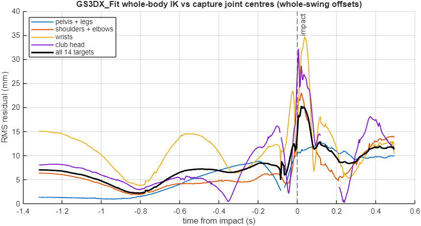

# Fitting the Model to the Golfer's Capture

Issue [#10979](https://github.com/D-sorganization/UpstreamDrift/issues/10979),
epic [#10950](https://github.com/D-sorganization/UpstreamDrift/issues/10950).
MATLAB R2025b.

**Owner direction (2026-09-27).** The golfer's anthropometry is unknown, so
it must be matched to the capture data while the swing is fitted.

Two things can be identified from marker kinematics alone:

- segment lengths;
- where the markers sit on each segment.

Body mass cannot be identified: it scales every force equally. It stays the
assumed 80 kg of [ANTHROPOMETRY.md](ANTHROPOMETRY.md), and forces are
reported in body weights.

## 1. Joint Centres From the Markers

`gs3dx_capture_joint_centres` turns the skin and shoe markers into per-frame
joint-centre estimates. They are expressed in the address target frame
[facing, toward target, up], with the origin at the address waist centre.

| Point                  | From                                                                                        |
| ---------------------- | ------------------------------------------------------------------------------------------- |
| Pelvis origin and axes | the four waist markers                                                                      |
| Hips                   | pelvis + [0, ±0.09, −0.10] m in the pelvis axes (the GS3DX leg-mount convention)            |
| Knees, ankles          | `KneeOut` / `AnkleOut`, moved 5 cm / 3.5 cm toward the midline                              |
| Shoulders              | acromion markers lowered 4 cm; `RShoulderTop` rebuilt from `RShoulderBack` in 80% of frames |
| Elbows, wrists         | `ElbowOut`, `WristTop`                                                                      |
| Club head, grip        | the two club-marker cluster centroids                                                       |

The offsets are typical anatomy, not measured on this golfer. Rigid segments
must keep their length, so the spread over the 654 frames measures how well
each proxy tracks:

| Segment                 | Median (m)    | SD (m)        |
| ----------------------- | ------------- | ------------- |
| Thigh L / R             | 0.461 / 0.459 | 0.013 / 0.027 |
| Shank L / R             | 0.425 / 0.423 | 0.003 / 0.003 |
| Upper arm L / R         | 0.305 / 0.364 | 0.009 / 0.018 |
| Forearm L / R           | 0.278 / 0.282 | 0.006 / 0.006 |
| Shoulder width (GH–GH)  | 0.321         | 0.029         |
| Pelvis to shoulder line | 0.488         | 0.015         |

The trail upper arm is not used. Its shoulder point is rebuilt in most
frames, and it reads 6 cm longer than the lead arm.

## 2. `GS3DX_Fit`: Segment Lengths From the Data

`gs3dx_fit_lengths` maps those lengths onto the model variables.
`gs3dx_build_fit` copies `GS3DX_Golfer` to `GS3DX_Fit` and applies them.

| Variable                                     | Before     | After (from the capture)                 |
| -------------------------------------------- | ---------- | ---------------------------------------- |
| `FitHubtoSLength` (each shoulder hub)        | 10 in      | 6.31 in (half GH–GH)                     |
| `FitUpperArmLength`                          | 12 in      | 11.99 in (lead arm)                      |
| `FitLowerArmLength`                          | 14 in      | 11.02 in (mean forearm)                  |
| `FitLowerTorsoLength`, `FitUpperTorsoLength` | 12 + 12 in | 9.60 + 9.60 in (pelvis to shoulder line) |
| `ThighLength`                                | 0.4365 m   | 0.460 m                                  |
| `ShankLength`                                | 0.4437 m   | 0.424 m                                  |

The regression drive file sets `LowerTorsoLength` and `UpperTorsoLength`.
So the eleven upper-body cylinders are re-pointed at new `Fit*` variables,
which no drive file sets.

- The frames follow the solids' geometry, so the joints move with the
  lengths.
- The masses stay the `GS3DX_Golfer` table.
- The edit is parameter-only: the block count is unchanged, and the model
  still compiles to 967 blocks.

The model's own forward kinematics (KinematicsSolver) confirms the result:

| Distance              | GS3DX_Golfer | GS3DX_Fit | Data  |
| --------------------- | ------------ | --------- | ----- |
| Lead GH to elbow      | 0.305        | 0.305     | 0.305 |
| Lead elbow to wrist   | 0.356        | 0.280     | 0.278 |
| Pelvis to scapula hub | 0.612        | 0.490     | 0.488 |

## 3. Whole-Body IK: `gs3dx_whole_body_ik`

The IK fits the model's joint positions, frame by frame, to 14 points:

- pelvis, hips, knees and ankles;
- shoulders, elbows and wrists;
- club head.

**How it works.**

- **Forward kinematics.** It comes from Simscape's `KinematicsSolver` on the
  model itself (5 ms per evaluation), so the fit sees the real geometry.
- **Least squares outside the solver.** The solver refuses more targets than
  degrees of freedom (status −3), so the least squares is done outside it:
  `lsqnonlin`, Levenberg–Marquardt, over the 33 independent coordinates.
- **The grip loop.** Both hands are welded to the club. The right shoulder,
  elbow and wrist are therefore left to the solver, which closes that loop
  in every evaluation.
- **Rotation conventions.** Spherical joints use rotation vectors. The
  solver's frame `Rotation` outputs are intrinsic X-Y-Z angles, a convention
  verified against `axang2rotm` to 3e-16.
- **Marker offsets.** Each marker is modelled as a constant offset in the
  frame of the body that carries it. The offsets are calibrated by
  alternating tracking with the closed-form update, which is OpenSim's
  marker-registration step.
- **Tracking.** Frames are tracked forward, then backward, keeping the lower
  cost per frame. The backward pass repairs cold-start local minima: the
  first frame of a window went from 193 mm to 27 mm.

**Frame and ground.** The capture frame is used as the model World (both
Z-up, gravity −Z); the free pelvis joint absorbs the placement.

### Results

A short window calibrated on itself fits to 1 mm RMS. That is overfitting:
the 42 offset parameters absorb the error. The real test is out of sample:
calibrate the offsets on the **backswing only**, then fit the last 0.25 s
before impact with them held fixed.

| Target (downswing, out of sample) | Median | Max   |
| --------------------------------- | ------ | ----- |
| Pelvis, hips                      | 5–7 mm | 22 mm |
| Knees, ankles                     | 2–9 mm | 28 mm |
| Shoulders                         | 2–8 mm | 15 mm |
| Lead elbow                        | 6 mm   | 26 mm |
| Trail elbow                       | 30 mm  | 33 mm |
| Club head                         | 40 mm  | 47 mm |
| Trail wrist                       | 52 mm  | 56 mm |
| Lead wrist                        | 88 mm  | 92 mm |
| **All 14 (RMS per frame)**        | 31 mm  | 32 mm |

The **whole trial** (654 frames) takes 63 minutes: the offsets are
calibrated on every third frame, then every frame is tracked. It fits within
**7.1 mm RMS median, 12.7 mm p95 and 20.3 mm max per frame**. No frame
exceeds 30 mm.

| Window         | Frames  | RMS median | RMS max |
| -------------- | ------- | ---------- | ------- |
| Address        | 1–150   | 4–7 mm     | 7 mm    |
| Backswing      | 151–400 | 2–7 mm     | 8 mm    |
| Downswing      | 386–476 | 8 mm       | 15 mm   |
| Impact         | 451–500 | 14 mm      | 20 mm   |
| Follow-through | 501–654 | 9–12 mm    | 14 mm   |

The calibrated offsets are anatomical:

- joint markers within 1–2 cm, except the trail acromion (5 cm; its marker
  is rebuilt) and the trail epicondyle (4 cm);
- wrist markers 6–7 cm from the wrist joints;
- club-head cluster 3 cm from the model club-head frame.

**Gap-filled samples are not fitted** (`jc.gap`). The club-head cluster is
missing at frames 445, 519–551 and 653–654. The first full run fitted the
linearly filled points and was pulled off track: 0.5 m errors through the
whole follow-through. With the gaps dropped from the residual, it tracks.

In sample, the whole-swing offsets absorb the grip mismatch (wrists 11 mm
median, 34 mm max). Out of sample they do not, which is the table above.

The whole-trial run above used the original grip. Section 4 re-runs it with
the fitted grip.

**Regularized IK for joint references.** Fitting 14 points does not pin
every joint. The spine (2), torso (1) and scapulae (2 + 2) give 7 degrees
of freedom to place two shoulders, and a universal joint places its distal
point the same at (a, b) and (a + 180°, 180° − b). The unregularized whole
trial jumped between those branches: a 464° torso range and 90–260° steps
between frames. That is harmless for marker fitting but unusable as a
joint reference. Four options (all off by default) fix it:

- `posture_weight` (m/rad) pulls the trunk coordinates toward zero; the
  target-free seed solve also holds them there, so the grip loop still
  closes (zeroing them directly left it open: status −1);
- `smooth_weight` (m/rad) pulls every angle toward the previous frame;
- `backward=false` tracks forward only (the min-cost-per-frame merge of
  the two passes mixed branches);
- `gap_weight` keeps gap-filled samples at that weight instead of dropping
  them. Without them the pelvis wandered 15–36 cm over the gap at frames
  447–451.

With `posture_weight=0.01, smooth_weight=0.02, backward=false,
gap_weight=0.5` the whole trial fits to 6.3 mm RMS median (25.2 mm p95,
26.3 mm max), the trunk angles are continuous, and the pelvis moves at most
1.3 mm per frame up to impact. The references of sections 5 and 6 come
from this run.

## 4. Hand-on-Grip Geometry: `gs3dx_fit_grip`

With the original grip, the pelvis, legs and shoulders generalized to 1–3 cm,
but the hands and club did not. What was wrong is **where the model's hands
sit on the grip**. `GS3DX_Golfer` puts both wrist joint centres 1 in to the
same side of the grip axis, 3 in apart along it. Those are literal lengths
in the original model.

`gs3dx_fit_grip(cap, ik)` measures the golfer's grip from the capture:

1. **Club pose.** The two three-marker club clusters are rigid (pairwise
   distances within 4 mm). Each frame's club pose is the least-squares
   rigid fit of the six markers.
2. **Wrist centres.** Both hands are welded to the club in the model, so
   each wrist joint centre is a fixed point in the club frame. The
   `WristTop` marker (forearm side of the joint) moves on a sphere about it.
   A sphere fit of each `WristTop` trajectory in the club frame gives the
   functional wrist centre (radius 34 / 50 mm, fit RMS 11 / 6 mm).
3. **Shaft axis.** The model's two hand-sphere centres lie on the grip axis.
   From the IK, they are carried into the club-marker frame and averaged
   (spread 0.5–2°). Only the axis is used, not the model's roll of the club
   about it.
4. **Mapping.** The wrist centres' positions along the axis give the lead
   hand position and the hand spacing.

**Only the separation across the shaft is identifiable.** Moving the shaft
sideways relative to both wrists moves the club head in the club frame, and
the IK's club-head marker offset absorbs that. No marker sits on the shaft
axis. Two estimates, from two model grips, agreed on the separation (72 and
74 mm) but not on its split between the hands (53/19 mm on opposite sides,
then 87/21 mm on the same side).

The separation is therefore split equally: one standoff on each side, as
the palms face each other across the grip.

| Variable (in)           | GS3DX_Golfer   | GS3DX_Fit (from the capture) |
| ----------------------- | -------------- | ---------------------------- |
| `FitButtToLeadHand`     | 2.5            | 3.08                         |
| `FitHandSpacing`        | 3.0            | 3.03 (77 mm)                 |
| `FitGripToShaft`        | 5.0            | 4.39 (butt to shaft 10.5 in) |
| `FitLeftWristStandoff`  | 1.0, same side | 1.46, **flipped**            |
| `FitRightWristStandoff` | 1.0            | 1.46                         |

`gs3dx_build_fit` re-points the six grip solids at these variables. It also
swaps the end features of the lead standoff's two frames: the wrist frame
moves to the bottom curve and the grip frame to the top. That reverses the
standoff direction without changing either frame's axes. The edit is
parameter-only: the block count is unchanged and the model still compiles
to 967 blocks.

**Out of sample** (the same backswing calibration and downswing tracking as
section 3; the fitted grip tracked every 6th frame):

| Target                | Original grip | Fitted grip |
| --------------------- | ------------- | ----------- |
| Lead wrist (median)   | 88 mm         | 18 mm       |
| Trail wrist (median)  | 52 mm         | 15 mm       |
| Trail elbow (median)  | 30 mm         | 16 mm       |
| Club head (median)    | 40 mm         | 29 mm       |
| RMS per frame (max)   | 32 mm         | 17 mm       |
| Largest marker offset | 68 mm         | 46 mm       |

The per-target medians come from the first-pass trial (a 53/19 mm
opposite-sides split). The equal split gives the same fit, as the
identifiability argument predicts: RMS max 17.1 mm, wrists 26.7 mm max,
club head 33.2 mm max.

**Whole trial, fitted grip** (654 frames, 43 min): 7.0 mm RMS median,
16.1 mm p95, 19.1 mm max per frame; no frame exceeds 30 mm.

| In sample, whole trial | Original grip | Fitted grip |
| ---------------------- | ------------- | ----------- |
| Wrists (max)           | 34 / 37 mm    | 25 / 32 mm  |
| Club head (median)     | 7 mm          | 12 mm       |
| Follow-through RMS     | 11.4 mm       | 14.1 mm     |
| Largest marker offset  | 70 mm         | 47 mm       |

In sample, the original grip's oversized offsets absorbed part of the club
error. With anatomical offsets that error shows, so the club head and
follow-through read slightly worse. Out of sample, the fitted grip is
better everywhere.

- The wrist marker offsets fell from 6–7 cm to 2.8 cm, the expected depth of
  a dorsal wrist marker.
- **Fixed point.** Re-estimating the grip from the rebuilt model's IK
  returns its own values within 0.07 in.

`test_gs3dx_fit` pins all of this:

- wrists under 35 mm and the club head under 40 mm out of sample;
- RMS under 25 mm (tightened from 35 mm);
- marker offsets under 6 cm (tightened from 12 cm);
- the grip fixed point within 0.25 in.

## 5. Leg Servo References: `gs3dx_leg_reference`, `GS3DX_FitLegs`

`gs3dx_leg_reference(ik, jc, cap)` turns the whole-trial IK on the fitted
grip into the 12 angles the leg servo tracks
(`[L hip X Y Z, knee, ankle X Y, then R]`, in degrees) and their rates, on
the capture's time base.

- **Pelvis path.** The model's own pelvis frame (the follower of the pelvis
  joint, `Lower Torso`) at every IK frame. It is also returned in
  pelvis-joint coordinates for the start state.
- **Foot path.** The feet are not planted. The trail heel is already 36 mm
  up at impact, and a planted trail foot went out of reach 8 frames later.
  Each foot follows the ankle joint centre. Its orientation is the address
  foot frame, carried by the rotation of the (ankle, ToeIn, ToeOut) triad
  since address.
- **Floor.** The right ankle-centre proxy sat 18.5 mm above the left at
  address, which left the right foot hanging above the ground. Each foot
  path is shifted by a constant (±9.3 mm) so both address soles sit on
  their mean height.
- **Filtering.** Positions and quaternions are filtered with a 4th-order
  zero-phase Butterworth at 10 Hz.
- **Torsion.** The model ankle is a universal joint, with no rotation about
  the shank. A foot pose therefore fixes the knee's swivel about the
  hip-ankle line. Two alternatives were tried and rejected:

  - prescribing the measured foot yaw put the knees 4–5 cm from the capture
    (p95 8–9 cm);
  - a free yaw matched the knees but spun the lead foot by up to 99° once
    the knee straightened.

  So one constant yaw offset per foot is fitted over the still address
  frames, weighing the knee centre, ankle position and sole normal. The
  offsets are +23.7° (lead) and −16.8° (trail).

- **Leg angles.** `gs3dx_leg_ik` solves exactly (six angles for six
  foot-pose numbers) for every filtered pelvis pose.
- **Reach.** Where the hip-to-ankle distance exceeds 0.999 of the leg
  length, the ankle target moves toward the hip onto it. This is at most
  1.6 mm, only after impact (from frame 504).

On the regularized whole-trial IK (section 3):

| Whole trial (654 frames)         | Lead         | Trail        |
| -------------------------------- | ------------ | ------------ |
| Knee vs capture, to impact       | 27 mm median | 32 mm median |
| Knee vs capture, to impact (p95) | 54 mm        | 58 mm        |
| Knee vs capture at impact        | 48 mm        | 63 mm        |

The unregularized IK put the knees 19/20 mm (median) from the capture; the
trunk regularization moves the pelvis slightly, and the legs follow it.

The knees drift from the capture through the downswing because the real
shank rotates over the foot, which the model's ankle cannot do. A
three-axis ankle would remove this. It is a model change, left for a later
variant. The pelvis path and the foot path are met exactly.

`gs3dx_build_fit_legs(info, ref)` builds `GS3DX_FitLegs` from `GS3DX_Fit`:

- **Servo.** The `Lower Body/Leg Torque Commands` Constant becomes a
  From Workspace block of the same name. It plays
  `LegTorqueCommand + Kp .* LegReferenceAngle + Kd .* LegReferenceRate` on
  `LegReferenceTime`, so the servo torque is
  `LegTorqueCommand + Kp (q_ref − q) + Kd (qd_ref − qd)`. It is one block for
  one (773 nonvirtual, 967 compiled).
- **Start state.** The legs and the pelvis start on the reference. The
  start variables are also saved as the struct `LegReferenceStart`. The
  drive file overrides two of them, so the caller passes the struct after
  the drive:
  - the pelvis start;
  - `PlaneTilt`, the tilt of the pelvis joint base about World X. The drive
    file sets 22.5°; the saved model, the IK and the reference use 30°.
    This mismatch first tilted the start pelvis by 7.5° and drove the feet
    13 BW into the ground.
- **Ground.** The capture frame is the model World, so `GroundRotation` is
  the identity and `GroundOffset` lies under the start feet.

Standing from rest at address (the `GS3DX_Golfer` standing test, same
bounds):

| Model                  | Slip L / R   | Lift L / R   | Support (BW) | Pelvis travel |
| ---------------------- | ------------ | ------------ | ------------ | ------------- |
| `GS3DX_Golfer`         | 1.3 / 1.4 mm | 0 / 0 mm     | 0 – 1.14     | 29 mm         |
| `GS3DX_Fit` (stale q0) | 1.5 / 1.5 mm | 2.8 / 3.0 mm | 0.44 – 3.07  | 33 mm         |
| `GS3DX_FitLegs`        | 1.4 / 0.9 mm | 0 / 0 mm     | 0.24 – 0.98  | 28 mm         |

`GS3DX_Fit` still holds the stance angles computed for the old leg lengths,
and it lifts its feet. The pelvis travel in every row comes from the
upper-body drive. The impact drive is passive (`ModelingMode` 0: every
upper-body joint torque is zero), and it starts mid-downswing, so it is not
synchronized with the capture.

`test_gs3dx_fit_legs` checks the following on an IK of every 18th frame to
impact:

- the reference against the foot path (1e-6);
- the clamp, levelling, torsion and knee bounds;
- the servo block and the start variables;
- the standing test.

## 6. Upper-Body Tracking: `GS3DX_FitTrack`

The impact drive leaves the upper body passive. `GS3DX_FitTrack` drives its
twelve upper-body joints toward the capture instead:

- **Reference.** `gs3dx_upper_body_reference(ik)` reads the chart angles
  from the regularized whole-trial IK: revolute and universal angles
  unwrapped to one branch, shoulders as intrinsic X-Y-Z angles
  (`gs3dx_xyz_map`), all filtered at 12 Hz and differentiated.
- **Charts.** `gs3dx_build_fit_track(info, ref)` copies `GS3DX_FitLegs` and
  edits each `<J> Input Function` chart: when `UpperBodyTracking` is set,
  the joint torque is `gs3dx_track_torque`, a feedforward plus PD,
  `F(t) + Kp (A(t) − q) + Kd (R(t) − qd)`. `ModelingMode` stays 0, so the
  pelvis joint is free and the legs and the ground carry the body. No block
  is added (967 compiled).
- **Wiring.** The original model feeds the LW chart the **left scapula's**
  angles, and the LE, LF, RF and RW charts read tags no Goto writes. With
  tracking on, the wrists ran away by 14,800° and the solver stopped at
  0.24 s. The builder points every chart input at its own joint's Goto
  (`<J>AngularPosition/Velocity[axis]`), changing only From tags.
- **Gains.** `gs3dx_track_gains`: each joint is a critically damped 6 Hz
  servo on the inertia it carries (estimates for an 80 kg body with the
  club, 0.02–3 kg·m²). Kp runs from 0.5 N·m/deg (forearm) to 74 (spine).
- **Feedforward.** `gs3dx_track_learn` learns F by iterative learning
  control, reading the joint states from the Simscape log (signal logging
  would pass the block limit): `F ← lowpass(F + (Kp e + Kd ė))`. It
  returns the iteration with the least PD torque.

Learning over the full swing to impact (1.319 s, 17 minutes per
iteration):

| Iteration | Angle RMS | PD RMS   |
| --------- | --------- | -------- |
| 1 (F = 0) | 0.96°     | 22.1 N·m |
| 2         | 0.25°     | 10.3 N·m |
| 3         | 0.25°     | 14.7 N·m |
| 4         | 0.27°     | 20.7 N·m |

The angles converge in one update, but the PD torque grows from the third
iteration on. Filtering the whole of F instead of only the update did not
change it. The torso keeps 34 N·m of PD torque at 0.19° of error, so the
drift is likely torque the angle error cannot see, such as torso and spine,
or the arms closed through the club, working against each other. The model
saves the iteration-2 feedforward.

**Whole body to impact** (`gs3dx_contact_check` from the reference start,
with the iteration-2 feedforward):

| Quantity                   | Result                                     |
| -------------------------- | ------------------------------------------ |
| Newton balance             | closed                                     |
| Pelvis vs the capture      | 206 mm RMS, 502 mm at impact               |
| Feet                       | slip 76 / 85 mm, lift 91 / 198 mm (L / R)  |
| Vertical GRF               | 0.28–1.43 BW; 0.20 BW RMS from the capture |
| Horizontal GRF (magnitude) | peak 0.82 BW vs 0.32; 0.12 BW RMS          |

The pelvis leaves the capture steadily along X: 26 mm at 0.2 s, 247 mm at
1.0 s and 501 mm at impact. The feet slide only 8 cm, so the body tips
over its feet. The joints follow the capture, but nothing holds the centre
of mass over the support: open-loop joint tracking of a free-standing body
does not balance. **The pelvis cannot be released on joint tracking
alone.** The vertical GRF peak (1.43 BW at 0.05 s) is the landing from
rest, not the downswing peak the capture shows (1.27 BW at 1.264 s).

`test_gs3dx_fit_track` checks the following on the saved model:

- `gs3dx_track_torque` interpolation and hold;
- the gains' damping ratio;
- that every chart input reads its own joint;
- the tracking data and learned feedforward, with no block added;
- a 0.3 s replay: 0.283° RMS (worst joint 0.491°), 16.7 N·m PD, bounded
  at 0.35°, 0.6° and 20 N·m.

## 7. Balance: `GS3DX_FitBalance`

`GS3DX_FitBalance` is `GS3DX_FitTrack` with a balance loop through the leg
servo (`gs3dx_build_fit_balance`):

- **Sensing.** A whole-mechanism Inertia Sensor gives the centre of mass in
  World. A global Goto carries it into `Lower Body`, where a first-order
  State-Space filter differentiates it (`BalanceCOMTau`, 0.01 s). Bus
  Selectors take each ankle's `GlobalPosition` from its `
AnkleLogs` bus.
- **Reference.** The centre-of-mass reference is the reference pelvis pose
  carrying the centre of mass in the pelvis frame
  (`gs3dx_balance_com_offset`) from a balance-off run whose joints track.
  The foot reference is the leg reference's measured foot path
  (`ref.feet`), which matches the logged ankle positions at t0.
- **Gain.** `gs3dx_balance_gain` is the damped least-squares, foot-fixed
  inverse Jacobian of each leg: the leg angle change (12 × 3 per frame,
  deg/m) that moves the pelvis by a unit shift over fixed feet.
- **Command.** `Leg Torque Commands` becomes a MATLAB Function calling
  `gs3dx_balance_command`. The servo reference angle gains
  `G(t) · shift` with `shift = −Kp e − Kd ė`, where e is the centre-of-mass
  error along World x, y and z, limited to 0.1 m. Each leg also gains
  `G(t) · kf e_foot`, since a foot moved by −x relative to the pelvis is
  the pelvis moved by x. With `BalanceOn = 0` it plays exactly the
  `GS3DX_FitLegs` command.

The model compiles to 973 blocks. `gs3dx_contact_check` adds sensors that
compile to 10 more (983), inside the 25-block reserve.

Whole body to impact (same start and feedforward as section 6):

| Run                          | Pelvis RMS / at impact | COM error RMS / max | Support (BW) |
| ---------------------------- | ---------------------- | ------------------- | ------------ |
| Balance off                  | 206 / 503 mm           | —                   | peak 1.39    |
| Horizontal, Kp 1, Kd 0.2     | 38 / 62 mm             | 35 / 45 mm          | peak 2.65    |
| Horizontal, Kd 0.05          | 65 / 103 mm            | 66 / 94 mm          | peak 2.13    |
| Three axes, Kp 1, Kd 0.2     | 39 / 70 mm             | 37 / 48 mm          | 0.103–2.56   |
| Three axes + foot feedback 1 | 44 / 81 mm             | 38.5 / 52.0 mm      | 0.104–2.37   |

Centre-of-mass feedback holds the body over its feet: the pelvis stays
within 81 mm of the capture at impact instead of 503 mm. In the last row,
the vertical centre-of-mass error is 6.3 mm RMS; the feet slip 51 / 74 mm
and lift 40 / 50 mm (L / R).

**Gain.** With Kp 1 the centre-of-mass error grew through the backswing
(7 mm at 0.1 s to 47 mm at 0.8 s) and stayed there: a pelvis shift moves
the whole-body centre of mass by only part of the shift, so a proportional
loop of gain 1 leaves a standing error. Kp 3, Kd 0.4 (now the default)
halves it:

| Run (three axes, foot feedback 1) | Pelvis RMS / at impact | COM error RMS / max | Support (BW) |
| --------------------------------- | ---------------------- | ------------------- | ------------ |
| Kp 1, Kd 0.2                      | 44 / 81 mm             | 38.5 / 52.0 mm      | 0.104–2.37   |
| Kp 2, Kd 0.3                      | 30 / 72 mm             | 23.6 / 30.9 mm      | 0.079–2.62   |
| Kp 3, Kd 0.4                      | 27 / 73 mm             | 17.9 / 25.7 mm      | 0.056–2.63   |

**Impact spike.** Every balanced run shows a support peak of 2.4–2.7 BW
just before impact, where the capture's kinematic GRF (`gs3dx_kinematic_grf`)
peaks at 1.27 BW. It is not a foot landing: the per-contact forces
(`gs3dx_contact_check` `.contacts`) show a broad rise from 0.6 BW at 1.23 s
to 2.3–2.6 BW at 1.31 s, with the trail foot on its inner toe sphere and
the heel up throughout, while the model's centre of mass stays within 6 mm
of its reference vertically. The brief trail-foot unloading before it
(1.22–1.25 s, total support 0.6 BW) is the same reference dipping at
−0.3 g. The reference asks for both. Aligned at address, the
centre-of-mass reference (reference pelvis carrying the balance-off
offset) differs from the capture's own centre of mass by up to 34 / 31 /
24 mm (x / y / z) before impact; it moves 40 mm vertically where the
capture's moves 19 mm, and its vertical acceleration alone (8 Hz) implies
a 2.31 BW peak. It is not the segment inertia: `GS3DX_Shape`, with de Leva
moments and centres of mass on the limbs and head, gives a reference within
1 mm RMS of this one and the same 2.64 BW peak (docs/SHAPE.md). What remains
is the tracked pose itself: segment lengths, the trunk's mass split and the
IK.

Tracking the capture's own centre of mass instead confirms it. Here
`com_ref` of `gs3dx_build_fit_balance` is set from
`gs3dx_capture_com_reference`: `gs3dx_kinematic_grf`'s centre of mass,
translated to the model's at address. Kp 3 / Kd 0.4, to impact:

| Reference                      | Late support peak  | Support (BW) | Pelvis RMS / at impact | COM error RMS / max | Slip L / R |
| ------------------------------ | ------------------ | ------------ | ---------------------- | ------------------- | ---------- |
| Model offset (balance-off run) | 2.63 BW at 1.312 s | 0.056–2.63   | 27 / 73 mm             | 17.9 / 25.7 mm      | 58 / 88 mm |
| Capture centre of mass         | 1.44 BW at 1.319 s | 0.36–1.81    | 42 / 72 mm             | 14.1 / 36.1 mm      | 44 / 53 mm |

The capture's kinematic GRF peaks at 1.27 BW. The support is now close to
it and the feet slip less. The pelvis pays: the model's mass
distribution puts its centre of mass elsewhere for the same pose, so the
pelvis moves to put it on the capture's. Both references disagree with the
capture through the model's centres of mass. The ellipsoid model with de
Leva centres of mass (`GS3DX_Shape`, docs/SHAPE.md) should close that gap
from the model side.

Tried and not kept (whole body to impact, Kp 1):

- Softer ankles (servo 10 N·m/deg instead of 50, near a human ankle's
  quasi-stiffness): the balance loop needs the stiff ankle; the pelvis ends
  906 mm from the capture at impact.
- Levelling the feet: an ankle offset against each foot's measured tilt
  from its reference orientation (the ankle log's `Rotation Transform`;
  zero at t0 to 1e-12 deg) kept the feet within 7.6° but moved the centre
  of pressure the ankles balance with: COM error 49.2 / 75.1 mm, pelvis
  53 / 103 mm.

`test_gs3dx_fit_balance` checks:

- that `gs3dx_balance_command` reduces to the leg servo with balance off,
  shifts against the error up to the limit (horizontal and three-axis
  gains), and moves each foot back on its own leg only;
- that the gain holds the feet: a pelvis shift moves a foot by at most
  0.975 of the shift (median 0.303), bounded at 0.98 and 0.31. The worst
  case is vertical, on the lead leg at frame 545, where the knee is nearly
  straight;
- the wiring and data of the saved model, and that the builder takes a
  centre-of-mass offset or a reference path, not both;
- the saved gains (Kp 3, Kd 0.4) and a 0.3 s run: centre-of-mass error
  10.1 mm RMS, 16.5 mm max, bounded at 17.5 mm (Kp 1: 14.6 / 24.9 mm).

## Next

1. Impact spike: resolved in `GS3DX_Shape` (docs/SHAPE.md, "Where the
   Remaining 12 mm Comes From"). The 12 mm RMS was the capture's C7 trunk
   proxy; with a joint-centre trunk the capture agrees with the model to
   4 mm and, as the balance reference, gives a 1.77 BW peak and the best
   pelvis, centre-of-mass and slip tracking yet. What remains of the
   model's side is the head, rigid with the upper trunk.
2. Learning drift: record the PD torque per joint over more iterations and
   add a forgetting factor, or leave the loop joints to the PD alone.
