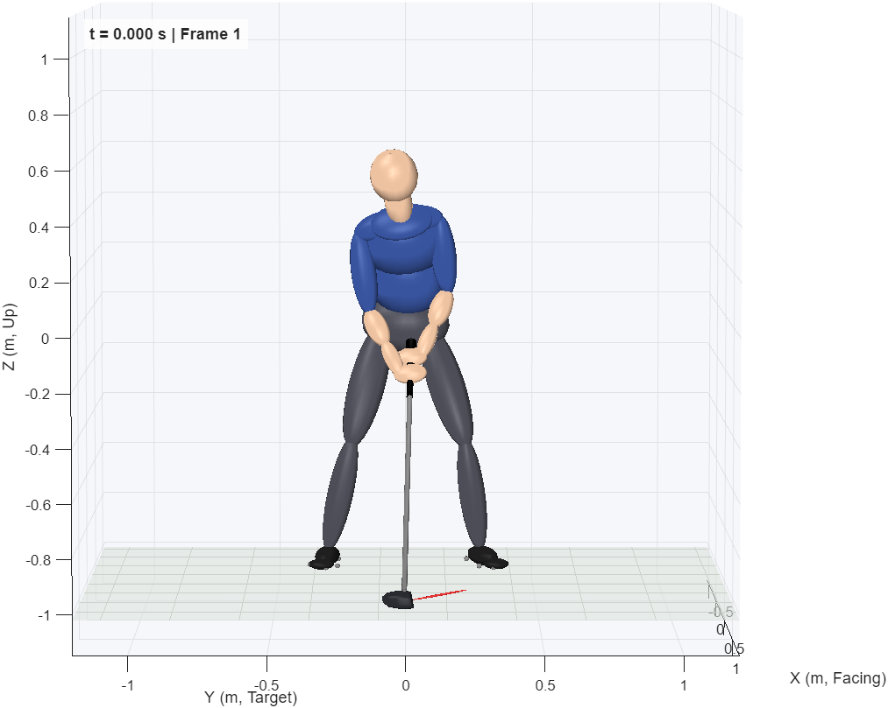
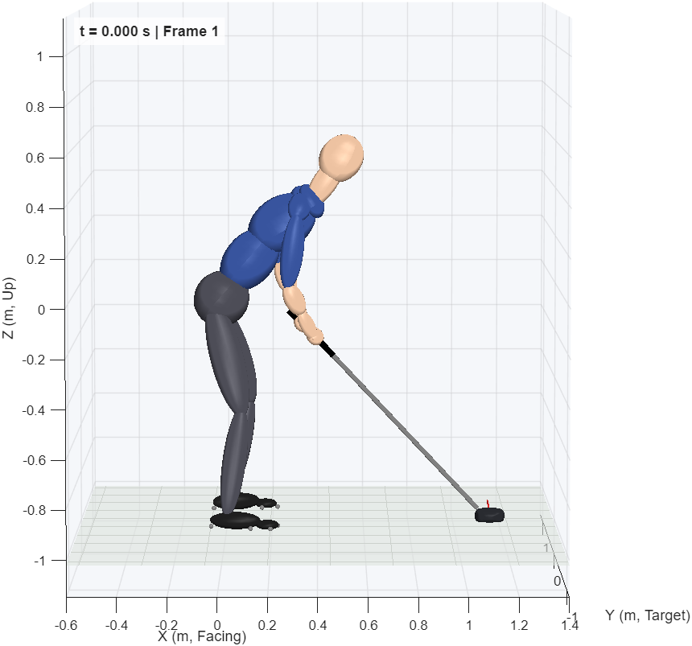
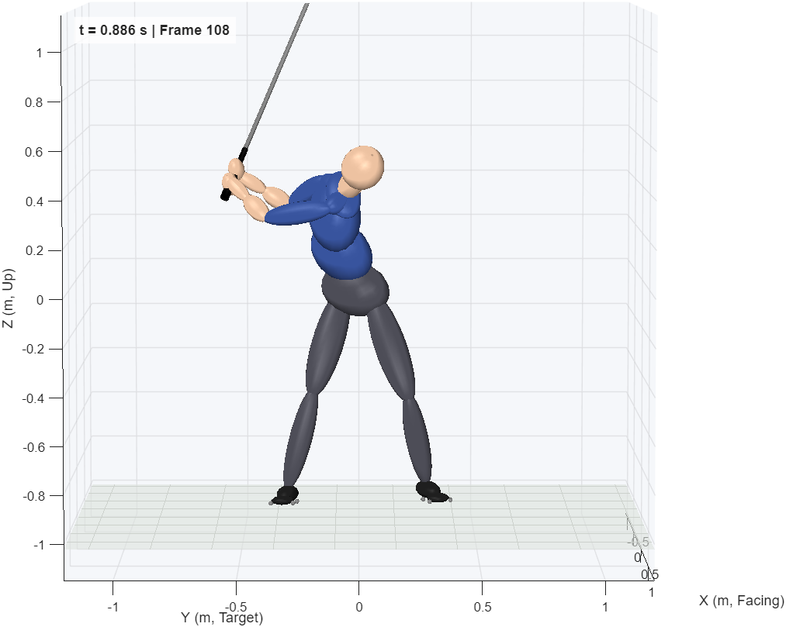
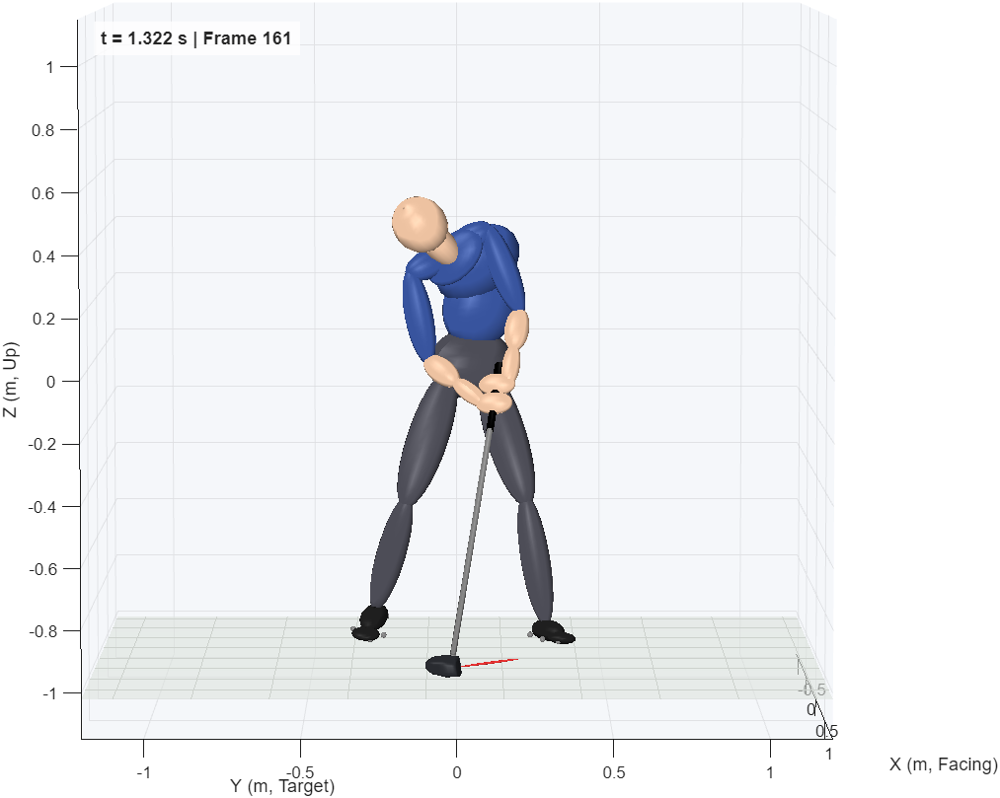
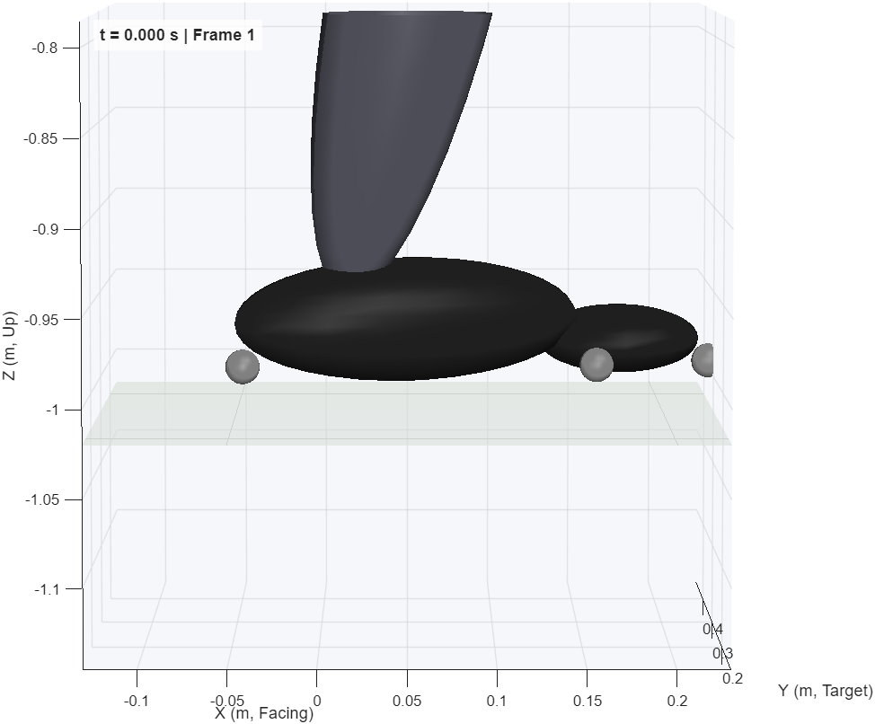
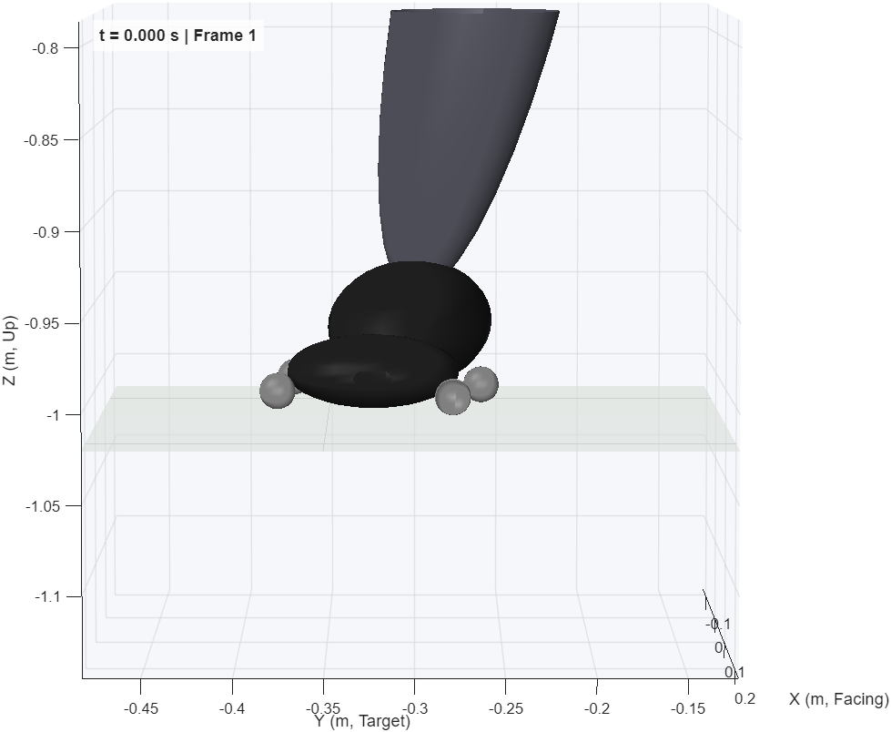
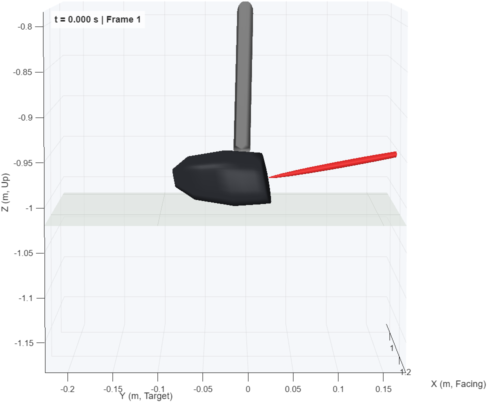
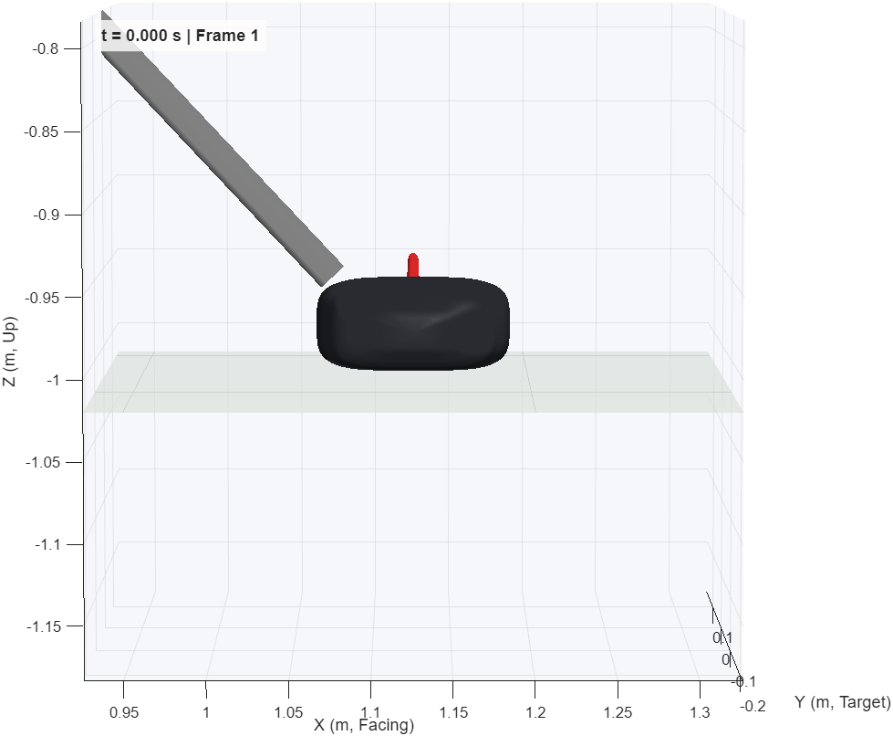

# GS3DX_Human: A Human Body Shape, a Square Face and Jointed Feet

Issue [#10979](https://github.com/D-sorganization/UpstreamDrift/issues/10979),
epic [#10950](https://github.com/D-sorganization/UpstreamDrift/issues/10950).
MATLAB R2025b, measured 2026-09-28.

`GS3DX_Human` is `GS3DX_Neck` changed where the address pose looked wrong. It
is built by `gs3dx_build_human(info)`. It compiles to 965 blocks (cap 975),
and its total mass is `GS3DX_Neck`'s.

## What Looked Wrong, and Why

| Complaint                           | Cause found                                                                                                                                                                                    |
| ----------------------------------- | ---------------------------------------------------------------------------------------------------------------------------------------------------------------------------------------------- |
| Torso too large                     | The trunk was three 6 in radius cylinders: 30 cm deep and round. A torso is about 22 cm deep and wider than deep.                                                                              |
| Hips about 30° open                 | `ZeroMassHipReference`, a massless 12 in bar, sits 33° off the hip line and off the hips. The hip joint centres are 4.3° open, the capture 3.7°, and the widths match (0.180 m).               |
| Hip attachments look asymmetric     | The hip joints are placed from the capture; their midpoint is 3.8 cm forward of the lower-trunk cylinder's axis. Nothing centred on them was drawn.                                            |
| Clubface right of target at address | The grip roll: the face normal was 20.7° right of target (the purple rod drawn in the face plane, not along its normal).                                                                       |
| Feet backwards in renders           | Renders used the whole-body IK, which has no toe target, so each foot could spin about its shank. The simulation's leg reference sets the feet from the toe markers.                           |
| Head too far forward, long neck     | The neck is zero at address, so it continues the upper trunk's axis (59° from vertical at address): the head centre sat 126 mm from the capture's head markers.                                |
| Neck too long (second review)       | The head centre is where the capture puts it, but the neck pivot sat 58 mm below the level of C7 along the neck axis, inside the chest, so the 10 in neck showed as a stalk.                   |
| "Impact" still before impact        | The impact frame was peak club-head speed (476). The head is then 16 cm short of the ball; it returns to its address position at frame 477.3.                                                  |
| Human falls in the balance run      | Two causes: the toe contacts sat 7 cm past the midfoot joint, so the 100 N·m/rad spring folded under the load; and the neck started 24° from its filtered reference.                           |
| Human hops at the start (rebuild)   | Placing the head moved the address centre of mass 7 mm; the balance reference was anchored to `GS3DX_Neck`'s, so the balance loop kicked both feet off the ground at t = 0.                    |
| Human drifts through the swing      | The toe contacts sat 15 mm behind the toe tip and at 64% of the foot length, short of `GS3DX_Neck`'s toe corners. The golfer stands on its front contacts, so the pelvis drifted 31-43 mm RMS. |
| Neck not joined to the shoulders    | The pivot (C7) is 25 mm above the chest ellipsoid's top, and the drawn neck stopped 16 mm short of the pivot: a 40 mm gap along the neck in every frame.                                       |

## Changes

- **Body.** The trunk, neck, shoulder bars, upper arms, forearms and hand
  standoffs are hidden (`GraphicType 'None'`); their mass and inertia are
  unchanged. A massless ellipsoid is drawn on each one's reference frame.
  The pelvis ellipsoid is centred 4 cm above the hip joint midpoint and lies
  along the hip line. The abdomen lies along the same line, and the chest along
  the shoulder line at address. Ellipsoidal Solid rejects every frame on its
  surface, so the cylinders that carry the joint frames remain as the mass
  carriers.
- **Reference frames.** A cylinder with custom frames shows only those
  (end-centre frames, the arms' and shoulder bars' with turned axes). The
  builder exposes each parent's reference frame (`DoExposeReferenceFrame`)
  and attaches the visual there.
- **Head.** The radii go from 88.9 × 88.9 × 114.3 mm to 90 × 90 × 105 mm
  (graphics only: its inertia is Custom). A fixed rotation, "Neck Address"
  (Rx(−24.2°) Ry(−7.0°), `NeckAddress`), sits between the neck joint and the
  neck and aims the head at the capture's head-marker centroid at address.
  The joint and `NeckReference` are `GS3DX_Neck`'s, so the joint starts at its
  reference.
- **Neck pivot.** The neck joint moves 58 mm up the neck's address axis, to the
  level of the capture's C7 marker projected on that axis, and `NeckLength`
  shrinks by the same length (10 in to 7.72 in). The head centre does not move.
  The head now turns about the base of the neck, and the visible neck is short.
- **Neck and trapezius.** The drawn neck runs from the head centre to 50 mm
  past C7, into the trunk. A trapezius ellipsoid (240 × 150 × 90 mm, along
  the shoulder line) sits on the upper trunk under C7 and joins the neck to
  the shoulders. Both are graphics only.
- **Balance anchor.** The balance loop tracks the capture's centre-of-mass
  path, translated so that it starts at the model's own address centre of mass
  (`gs3dx_capture_com_reference`). Placing the head moved that centre of mass
  by (−4.7, −0.9, +5.2) mm. After saving, the builder measures the new
  address centre of mass in a 1 ms balance-off start and translates
  `BalanceCOMRef` onto it (`report.com_shift`), as `gs3dx_build_shape`
  anchored it for `GS3DX_Shape`.
- **Club.** `FaceSquareRoll` (−20.73°, model workspace) is added to
  GripStrength's roll about the shaft. The head is a sphere centred on the
  shaft, so no mass moves. The sphere and the face-plane rod are hidden.
- **Club head.** A massless File Solid draws a driver head mesh
  (`models/gs3dx_driver_head.stl`: 124 mm heel to toe, 115 mm front to back,
  61 mm tall, 10.5° loft, curved face). It comes from the Tools repository's
  parametric head generator; [models/README_DRIVER_HEAD.md](../models/README_DRIVER_HEAD.md)
  records its provenance and how to regenerate it. The mesh hangs from its
  hosel point at the end of the shaft, with its sole level at address. A red
  pointer shows the face normal at the face centre. `gs3dx_render` draws File
  Solids from the STL.
- **Feet.** A revolute joint crosses each foot at the ball of the foot, 73% of
  the foot length from the heel and 25 mm above the sole. Its axis runs along
  the foot's left axis. It has a spring (`MidfootStiffness`, 2,000 N·m/rad)
  and a damper (`MidfootDamping`, 0.5 N·m·s/rad). A positive angle bends the
  toes down; the heel rises over a negative angle. `ForefootMass`
  (0.25 kg) moves to the forefoot. The rearfoot keeps the rest, with its
  centre of mass moved back so the foot's is unchanged at zero angle. Both
  parts are drawn as ellipsoids.
- **Foot contacts.** Five 1 cm spheres per foot instead of three (see the
  table below). The ball of the foot carries the standing load on the rigid
  rearfoot, so the midfoot spring carries only what the toes push. As the
  heel rises the rearfoot turns about the ball and the toes stay on the
  ground, which is how a golfer comes up onto the trail toe. The outside
  ball and the lesser toes let the foot roll onto its outside edge; the
  inside ball and the big toe let it roll onto its inside edge. The toes
  reach as far forward as `GS3DX_Neck`'s toe corners; a shorter reach let
  the golfer drift (see "Why the Human Drifted").
  `FootContactForces` logs all ten, left foot first.
- **Blocks.** The "Inertia Sensor" subsystem is removed. It held twelve
  sensors on physical ports that nothing reads, and cost 75 compiled blocks
  (975 → 900). The visuals, the feet and the neck bring the total to 965.

| Contact     | Segment  | Along the foot (from the heel)                             | Across                                |
| ----------- | -------- | ---------------------------------------------------------- | ------------------------------------- |
| Heel        | rearfoot | heel edge                                                  | on the foot's axis                    |
| Ball In     | rearfoot | 73% of the foot length (first metatarsal head)             | inside edge (`FootContactWidth`)      |
| Ball Out    | rearfoot | 64% (fifth metatarsal head, `FootBallOutFraction`)         | outside edge                          |
| Big Toe     | forefoot | under the toe tip (`FootToeInset`, 0)                      | 50 mm inside (`FootToeOffset`)        |
| Lesser Toes | forefoot | 94.5% (third and fourth toe pads, `FootLesserToeFraction`) | 50 mm outside (`FootLesserToeOffset`) |

## Why the First Human Build Fell

`GS3DX_Human`'s first balance run to impact failed where `GS3DX_Neck`'s holds:

| Run (to impact)     | Pelvis RMS | COM horizontal RMS | Support (BW)  |
| ------------------- | ---------- | ------------------ | ------------- |
| `GS3DX_Neck`        | 21 mm      | 13 mm              | stays above 0 |
| First `GS3DX_Human` | 213 mm     | 193 mm             | 0 to 4.11     |

Two causes, each isolated in a short run:

- **The midfoot spring.** The toe spheres sat about 7 cm past the midfoot
  axis, so under body weight the spring bent about 14°. In 0.5 s runs a
  stiffer spring brought the pelvis error from 36.9 mm RMS (100 N·m/rad) to
  18.7 (2,000) and 16.1 (20,000), and the vertical COM error from 13.7 to
  1.2 and 1.1 mm. The fix is not a stiffer spring: the ball of the foot now
  carries the load on the rearfoot.
- **The neck reference.** Composing the address turn into `NeckReference`
  started the neck joint 24° from its reference. The joint is motion-driven
  through a 5 ms input filter, so it swung the 5 kg head in the first
  10 ms. Every foot contact then read zero, and the golfer landed at 4.1 BW.
  With `GS3DX_Neck`'s reference in the same model, support stayed between
  0.14 and 1.92 BW. The turn is now fixed geometry (above).

## Why the Rebuilt Human Hopped

The five-contact rebuild failed its balance run worse than the first build
(pelvis 364 mm RMS, support 0 to 10.3 BW). A 1 ms-resolution start probe
showed both ankles rising 12 mm in the first 12 ms, and every contact
reading zero from 4 to 24 ms. Then the golfer landed at up to 9 BW. The
cause was isolated one step at a time (`GS3DX_Neck` start, 0 to 30 ms):

| Variant                                          | All contacts at zero, 4-20 ms  | Lead ankle rise   |
| ------------------------------------------------ | ------------------------------ | ----------------- |
| `GS3DX_Neck`                                     | no (0.73-1.8 BW)               | none (sinks 3 mm) |
| Human, midfoot locked (10⁵ N·m/rad)              | yes                            | 12 mm             |
| Human, rearfoot inertia 1 kg·m² (`GS3DX_Neck`'s) | yes                            | 11 mm             |
| `GS3DX_Neck` + sensor removal                    | no (identical to `GS3DX_Neck`) | none              |
| `GS3DX_Neck` + sensor removal + neck address     | yes                            | 12 mm             |
| Human, balance loop off                          | no (0.59-0.75 BW)              | none              |

The feet, the contacts and the midfoot were not the cause; the neck address
was, through the balance loop. With the head where the capture has it, the
address centre of mass is 7 mm from where `BalanceCOMRef` starts, so the
loop drove the legs at t = 0. Anchoring the reference at the model's own
centre of mass (above) removes the error.

## Why the Human Drifted

With the start fixed, the golfer stood through the swing but its pelvis
drifted from the reference: 42.9 mm RMS to impact with the midfoot locked,
against 18.0 mm for `GS3DX_Neck` with the same head and anchor. A variant
with `GS3DX_Neck`'s feet and contacts (the bisect in the previous section)
drifted 18.0 mm, so the cause was the foot layout.

The centre of pressure showed why. Both models stand on their front contacts
for most of the swing, and the lead foot presses its inside front corner.
`GS3DX_Neck`'s front corners sit under the toe tip, 55 mm either side of the
foot's axis. The Human's front support was the balls of the foot (73% and
64% of the foot length) and a big toe 15 mm short of the tip, so the base of
support was shorter and the balance loop ran out of room. Layouts tried, all
run to impact on the same model (`GS3DX_Human` plus in-memory contact moves):

| Front contacts                                                     | Midfoot (N·m/rad) | Pelvis RMS / end (mm) | COM horizontal RMS (mm) |
| ------------------------------------------------------------------ | ----------------- | --------------------- | ----------------------- |
| Two heels, balls, big toe 15 mm short, 20 mm inside (first layout) | 100               | 159 / -               | -                       |
| Same                                                               | 800               | 64.8 / 151            | 52.9                    |
| Same                                                               | locked (10⁵)      | 42.9 / 90             | 31.4                    |
| One heel; lesser toes at 165 mm, big toe 30 mm inside              | locked            | 31.0 / 49             | 19.6                    |
| Lesser toes at 175 mm, 45 mm out; big toe 15 mm short, 45 mm in    | locked            | 26.0 / 46             | 15.6                    |
| Same                                                               | 2,000             | 28.2 / 49             | 17.4                    |
| Lesser toes at 190 mm, 50 mm out; big toe at the tip, 50 mm in     | locked            | 20.2 / 43             | 12.3                    |
| `GS3DX_Neck`'s three contacts (toe corners at the tip, ±55 mm)     | none              | 18.0 / 42             | 10.3                    |

(Distances along the foot are from the ankle; the toe tip is at 205 mm.)
The last Human row is the built layout (see the contact table above). Built
from `gs3dx_build_human`, with both toes on the forefoot, it drifts 20.2 mm
RMS with the midfoot locked and 21.9 mm at 2,000 N·m/rad (COM 14.0 mm RMS,
support 0.52-2.02 BW). `GS3DX_Shape` drifts 21.6 mm. The spring is
2,000 N·m/rad: stiff enough that the toes carry their share of the front
support, soft enough that they still bend as the heel rises.

## Through the Finish

Every reference in the model workspace (leg servo, upper-body tracking, neck,
balance) spans the whole capture, 654 frames to 1.814 s, so the balance run
can carry on past impact (1.319 s). Run to 1.81 s with the built model
(scratch `human/fin1.m`, `fin2.m`), against the capture's own ankle joint
centres:

| After impact                | Capture                 | `GS3DX_Human`                          |
| --------------------------- | ----------------------- | -------------------------------------- |
| Trail ankle rise (max)      | 129 mm                  | 142 mm                                 |
| Trail ankle travel (end)    | 275 mm; foot turns 128° | 355 mm                                 |
| Trail foot contacts         | -                       | Big Toe, then Lesser Toes (heel off)   |
| Lead ankle travel (end)     | 36 mm; foot turns 30°   | 234 mm                                 |
| Lead foot contacts          | -                       | Ball Out and Lesser Toes: outside edge |
| Total vertical GRF, 1.55 s  | 0.63 BW (kinematic)     | 0.73 BW                                |
| Pelvis RMS (before / after) | -                       | 21.9 / 56.6 mm                         |

What works: the trail heel comes up and the trail foot pivots on its toes,
as the capture's does, and the lead foot rolls onto its outside edge. What
does not: at 1.55-1.6 s the trail toe carries 0.73-0.83 BW while the lead
foot carries nothing, and the unloaded lead foot then slides 0.2 m (the
capture's turns 30° in place). The run to impact is unaffected.

It is not the centre of mass. Measured along the line from the trail ankle
(0) to the lead ankle (1), the model's centre of mass ends at 0.60 and its
balance reference at 0.58; the capture's (`gs3dx_kinematic_grf`, moved to
the joint centres' address-waist origin) ends at 0.54. `GS3DX_Neck` and
`GS3DX_Shape`, with three contacts per foot, do the same and worse: support
falls to zero near 1.4 s and the trail foot slides 0.55 m (pelvis 84 mm RMS
after impact against the Human's 57). What differs from the capture is the
trail foot: from 1.45 s it runs 60-105 mm ahead of its reference as it
pivots, so it sits under the centre of mass and takes the load.

## Ball Contact

`gs3dx_capture_markers` gives two events:

| Field           | Frame | What it is                                                           |
| --------------- | ----- | -------------------------------------------------------------------- |
| `.impact_frame` | 476   | peak club-head speed (50.7 m/s); the head is still 16 cm short       |
| `.ball_time`    | 477.3 | the head returns to its address position along the target line       |
| `.ball_frame`   | 477   | nearest frame; head speed drops to 41.4 m/s across it (ball contact) |

The impact stills use `.ball_frame`. The balance runs still stop at
`.impact_frame` (2.8 ms earlier).

## Results

Face normal from the face-normal pointer:

| Frame              | Right of target | Loft  |
| ------------------ | --------------- | ----- |
| Address            | 0.0°            | 10.5° |
| Ball contact (477) | 8.6°            | 8.7°  |

Before the roll, the face was 20.7° open at address. The remaining open face at
ball contact comes from the posed hands, not from the grip.

Head centre against the capture's head-marker centroid, to impact, every
third frame plus the top and ball contact (`gs3dx_render` on `gs3dx_reference_pose`, neck
angles from each model's `NeckReference`):

| Model         | At address (mm) | 3D RMS / max (mm) | Vertical RMS (mm) | Vertical travel error RMS / max (mm) |
| ------------- | --------------- | ----------------- | ----------------- | ------------------------------------ |
| `GS3DX_Neck`  | 126             | 99.8 / 165.2      | 90.5              | 37.0 / 62.2                          |
| `GS3DX_Human` | 40              | 88.7 / 134.5      | 40.8              | 21.0 / 42.0                          |

The mesh's lowest point sits 13.5 mm below the ground plane at address: the
model's club reaches that far. The head is drawn only, so nothing touches.

## Rendering in the Simulated Pose

`gs3dx_reference_pose(ik, ref, neck=NeckReference)` returns the IK with the
pelvis, hips, knees and ankles taken from the leg reference the servos track,
and the neck from the model's reference. At address both feet then point at
the ball, 22° flared on the lead side and 9° on the trail. Use it for renders
of any variant: rows are named by `gs3dx_joint_keys`, and joints it lacks,
such as the midfoot joints, are drawn at zero.

## Tests

`tests/test_gs3dx_human.m` (9 tests):

- every visible solid off the club is an ellipsoid, except the 1 cm contact
  spheres;
- the total mass is unchanged, and each forefoot takes `ForefootMass` from its foot;
- the sensor subsystem is gone and the model compiles within the reserve;
- the midfoot joints are sprung revolutes, and only the big-toe and
  lesser-toe contacts ride on the forefoot;
- each foot has five contacts, and `FootContactForces` logs them left foot
  first in the documented order;
- at the same joint angles, every solid both models draw (bar the head and
  neck) has its `GS3DX_Neck` position, and the face is square with loft
  showing;
- at zero neck angles the head centre is where `GS3DX_Neck` puts it at the
  `NeckAddress` angles (to 1 µm), `NeckLength` is 58 mm shorter, and
  `NeckReference` is unchanged;
- `BalanceCOMRef` is `GS3DX_Neck`'s translated, and starts at this model's
  own address centre of mass (a 1 ms balance-off start, to 1 µm);
- at address the drawn neck runs from inside the head to inside the trunk,
  and the pivot (C7) lies inside the trapezius.

`tests/test_gs3dx_capture.m` pins the ball-contact frame
(`ball_contact_follows_peak_speed`).
