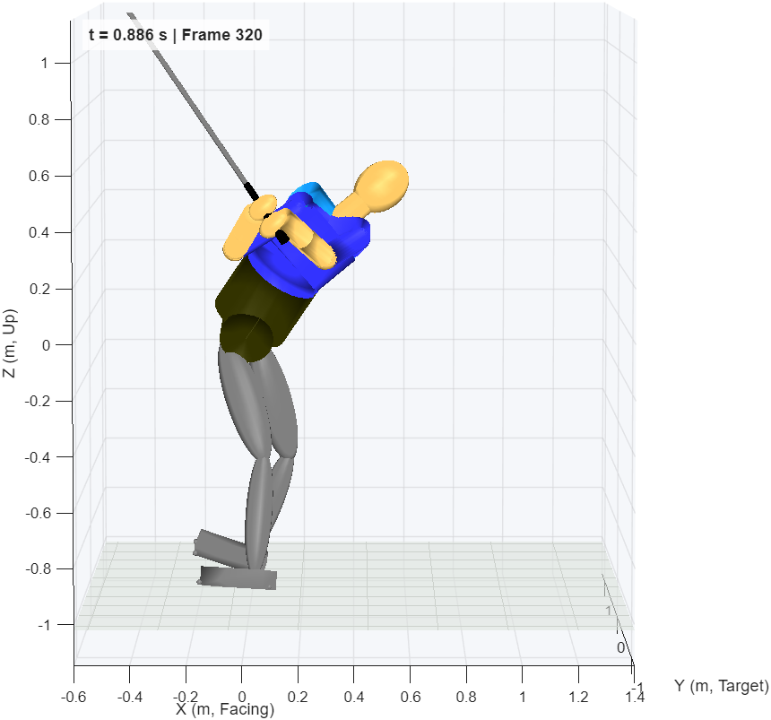

# GS3DX_Shape: De Leva Segment Inertia and Ellipsoid Limbs

Issue [#10979](https://github.com/D-sorganization/UpstreamDrift/issues/10979),
epic [#10950](https://github.com/D-sorganization/UpstreamDrift/issues/10950).
MATLAB R2025b, measured 2026-09-28.

`GS3DX_Shape` is `GS3DX_FitBalance` with the segment inertia of de Leva
(1996) on the limbs and head, and the thighs, shanks, hands and head drawn as
ellipsoids. It is built by `gs3dx_build_shape(info, ref)`, and
`docs/INERTIA.md` gives the cylinder model it replaces.

## Where the Joints Sit

A geometry probe of `GS3DX_FitBalance` measured every joint frame in the
reference frame of the solids beside it, at address, the top and impact
(`KinematicsSolver` translations from World, rotated into the solid frame).
Every value was constant to 7e-16 m (the right hand to 2e-11 m):

| Solid                  | Proximal joint (z, m)   | Distal joint (z, m) |
| ---------------------- | ----------------------- | ------------------- |
| thigh                  | hip +0.2301             | knee −0.2301        |
| shank                  | knee +0.2121            | ankle −0.2121       |
| upper arm              | shoulder +0.1523        | elbow −0.1523       |
| upper forearm half     | elbow +0.0700           | wrist −0.2099       |
| lower forearm half     | elbow +0.2099           | wrist −0.0700       |
| left hand / right hand | wrist −0.0372 / +0.0372 |                     |

Each limb solid is centred on its segment, with both joints on its z axis
and the proximal one at +z. A centre of mass at de Leva's fraction `c` of
length `L` from the proximal joint is therefore at `z = L/2 − c L`, and the
thighs, shanks and hands carry no frame but R, so a different solid shape
leaves the kinematics unchanged.

## What Changes

| Solid             | Mass   | Centre of mass (z, m) | Moments (kg·m²)            | Drawn as  |
| ----------------- | ------ | --------------------- | -------------------------- | --------- |
| thigh             | 11.328 | +0.0416               | 0.2596 0.2596 0.0532       | ellipsoid |
| shank             | 3.464  | +0.0230               | 0.0396 0.0396 0.00661      | ellipsoid |
| upper arm         | 2.168  | −0.0235               | 0.0155 0.0155 0.00502      | cylinder  |
| forearm half (×2) | 0.648  | +0.0119               | 0.000543 0.000543 0.000743 | cylinder  |
| hand              | 0.488  | 0 (kept)              | 0.00119 0.00119 0.000583   | ellipsoid |
| head              | 4.719  | 0 (kept)              | 0.0266 0.0266 0.0190       | ellipsoid |

- **Moments.** De Leva's radii of gyration at the model's segment lengths,
  with the sagittal and transverse moments averaged so each segment is
  axisymmetric about z. The two forearm halves each carry half the forearm,
  with centres of mass a half forearm apart; they lump to de Leva's forearm.
  `gs3dx_inertia_audit` gives 1.00 for every limb and the head, transverse
  and longitudinal (the cylinders were 0.42 to 1.60).
- **Kept.** Masses (80.3929236 kg in total), all frames, the feet and the
  trunk. A hand's de Leva centre of mass lies about 3 cm further from the
  wrist, which moves the whole-body centre of mass by 0.2 mm, so the hands
  and head keep theirs.
- **Ellipsoids.** A thigh or shank ellipsoid has the cylinder's radius and
  reaches 5 % past each joint. A hand is 0.8 × 0.65 × 1.25 of its 2 in
  sphere, and the head 0.7 × 0.7 × 0.9 of its 5 in sphere, long along the
  neck. The swap keeps the block's name, position, colour and every port on
  its net: `Grip/RHand` has eight, which only `PortConnectivity` lists.
- **Blocks.** 973 compiled, as `GS3DX_FitBalance`. An extra visual-only solid
  compiles to 7 blocks (973 → 980), and `GS3DX_CONTACT_CHECK` needs 10 of
  the 27 left, so frame-bearing solids (upper arms, forearm halves, trunk)
  keep their cylinders.



Stills at address, the top and impact, face-on and down the line, are in
`docs/screenshots/GS3DX_Shape_*.png` and, for comparison,
`GS3DX_FitBalance_*.png` (`docs/RENDERING.md`).

## Balance

The centre of mass moves with the de Leva inertia, so `GS3DX_Shape` needs its
own centre-of-mass offset. It was measured the same way as for
`GS3DX_FitBalance`: a balance-off run to impact, then
`gs3dx_balance_com_offset`. Runs of `gs3dx_contact_check` to impact
(1.319 s), about 18 min each:

| Reference                                | Support (BW) | Peak (BW) at | Pelvis RMS / end (mm) | COM horizontal RMS / max (mm) | Slip L/R (mm) |
| ---------------------------------------- | ------------ | ------------ | --------------------- | ----------------------------- | ------------- |
| balance off                              | 0.28 – 1.47  | 1.47, 1.319  | 182 / 430             | —                             | 67 / 98       |
| Shape offset                             | 0.008 – 2.64 | 2.64, 1.315  | 25 / 66               | 16.8 / 23.4                   | 54 / 78       |
| capture centre of mass                   | 0.36 – 1.83  | 1.44, 1.319  | 42 / 69               | 13.2 / 34.5                   | 44 / 53       |
| capture, joint-centre trunk (saved)      | 0.36 – 1.83  | 1.77, 1.319  | 22 / 44               | 14.4 / 19.7                   | 38 / 16       |
| `GS3DX_FitBalance` offset (FIT.md, §7)   | 0.056 – 2.63 | 2.63, 1.312  | 27 / 73               | 17.9 / 25.7                   | 58 / 88       |
| `GS3DX_FitBalance`, capture (FIT.md, §7) | 0.36 – 1.81  | 1.44, 1.319  | 42 / 72               | 14.1 / 36.1                   | 44 / 53       |

The references themselves, before impact:

| Reference          | Vertical range (mm) | Against the capture: RMS / max (mm) |
| ------------------ | ------------------- | ----------------------------------- |
| `GS3DX_FitBalance` | 53.4                | 12.9 / 23.7                         |
| `GS3DX_Shape`      | 51.8                | 12.4 / 23.6                         |
| capture            | 49.3                | —                                   |

To impact, the Shape offset reference is 13.0 mm RMS (23.6 max) from the
capture with its C7 trunk and 4.0 mm RMS (8.3 max) from the capture with
the joint-centre trunk (next section).

**Segment inertia does not explain the impact spike.** De Leva's centres of
mass move the model's reference by less than 1 mm RMS against the capture, and
both balance runs repeat `GS3DX_FitBalance` to within 0.01 BW.

## Where the Remaining 12 mm Comes From

Each segment's share of the whole-body vertical centre of mass,
`m_i Δz_i / M` from address to impact, was compared between `GS3DX_Shape`
posed by the regularised whole-body IK (every third frame, solid poses from
`gs3dx_render`, centres of mass from `gs3dx_inertia_audit`) and the capture's
de Leva segments as `gs3dx_kinematic_grf` builds them. Both total
80.39 kg:

| Segment        | Model range (mm) | Capture range (mm) | Difference RMS / max (mm) |
| -------------- | ---------------- | ------------------ | ------------------------- |
| head           | 14.0             | 3.7                | 3.5 / 6.7                 |
| trunk          | 14.8             | 28.6               | 10.3 / 20.6               |
| upper arms     | 11.2             | 10.2               | 0.4 / 0.9                 |
| forearms       | 17.6             | 17.6               | 0.2 / 0.4                 |
| hands          | 9.9              | 9.8                | 0.1 / 0.3                 |
| thighs         | 8.8              | 9.4                | 1.0 / 4.7                 |
| shanks, feet   | 1.0, 0.5         | 1.0, 0.2           | 0.1, 0.1                  |
| club           | 8.4              | 8.8                | 0.3 / 0.5                 |
| **whole body** | 43.7             | 19.1               | **12.9 / 23.4**           |

Legs, arms and club agree to 1 mm; the trunk and the head carry the
difference.

- **The trunk is the capture's proxy.** The capture puts the trunk centre of
  mass on the line from the C7 skin marker, on the back, to the waist. In the
  downswing the inclined trunk turns, and a point on the back surface rises
  and falls with the turn where the trunk's real centre of mass, near its
  axis, does not. Taken on the line from the shoulder centres to the hip
  centres (the joint centres the model's trunk is built between), the
  capture's trunk agrees with the model to 3.4 mm RMS and the whole body to
  4.0 mm RMS. Moving C7 forward into the body closes the gap part way (0.08
  m: 8.1 mm RMS).
- **The head is the model's.** The head is rigid with the upper trunk (no
  neck joint and no head target in the IK), so it rises about 50 mm in the
  downswing while the golfer's head drops slightly: 3.5 mm RMS of the
  remainder.
- **The capture reference is not ground truth.** Its vertical ground
  reaction force (`M (a_com − g)`, 8 Hz) peaks at 1.27 BW 56 ms before impact
  with the C7 trunk and at 1.85 BW with the joint-centre trunk
  (`gs3dx_kinematic_grf(trunk="joint_centres")`).

**The saved model follows the capture with the joint-centre trunk.** It is
the best balance run on every measure (table above): pelvis 22 mm RMS,
vertical centre of mass 2.9 mm RMS, foot slip 38 / 16 mm, no loss of
support, and a 1.77 BW peak at impact, close to the 1.85 BW the reference
itself implies. The 2.64 BW of the model's own offset reference comes from
the remaining 4 mm (8 mm at most) of its difference, twice differentiated.
It is built with

```matlab
k = gs3dx_kinematic_grf(trunk="joint_centres");
com_ref = gs3dx_capture_com_reference(k, ref.t - ref.t(1), com0);
gs3dx_build_shape(info, ref, overwrite=true, com_ref=com_ref);
```

where `com0` is the model's centre of mass at address (the Shape offset,
from a balance-off run, carried by the reference pelvis pose).

## Tests

`tests/test_gs3dx_shape.m` (6 tests):

- a centre-of-mass offset and path are not both accepted;
- masses are unchanged, 80.3929236 kg in total;
- every limb and the head audit at 1.00 against de Leva to 1e-9, and the
  feet and trunk are unchanged;
- the thigh and shank centres of mass sit at de Leva's fractions, and the
  forearm halves lump to de Leva's forearm centre, to 1e-12 m;
- the thighs, shanks, hands and head are connected Ellipsoidal Solids with
  custom inertia;
- every solid has the pose it has in `GS3DX_FitBalance` at address and
  impact to 1e-12, each drawn ellipsoid is its radii to 1e-9 m, and the head's
  long axis (z, shared with the upper trunk) runs along the neck to the head.
